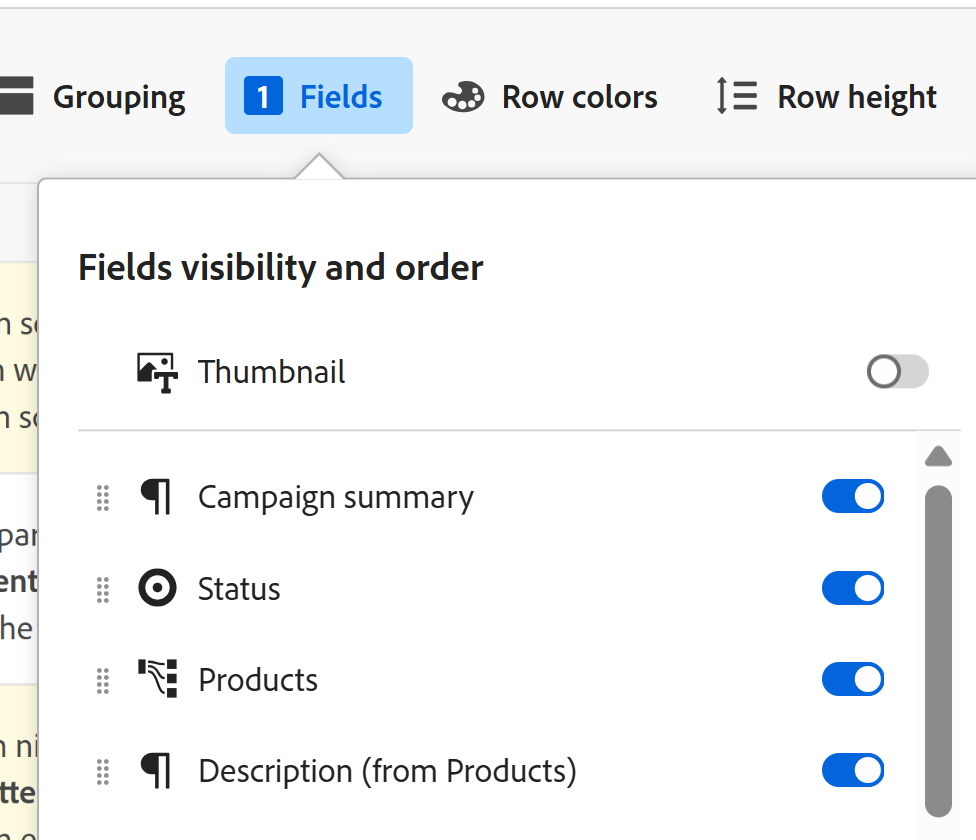

<!--update the metadata with real information-->

# レコードにサムネールを追加する

{{planning-important-intro}}

レコードを Adobe Workfront Planning 内の一意のサムネールに関連付けて、容易に認識できるようにします。

レコードの作成と編集を開始する前に、レコードタイプを作成する必要があります。
詳しくは、[リクエストタイプの作成](/help/quicksilver/planning/architecture/create-record-types.md)を参照してください。

## アクセス要件

<!--************double-check permissions here - asking Isk and Lilit what permissions users need for adding thumbnails-->

この記事の手順を実行するには、次のアクセス権が必要です。

<table style="table-layout:auto">
 <col>
 </col>
 <col>
 </col>
 <tbody>
    <tr>
<tr>
<td>
   
 製品
 </td>
   <td>
   
 Adobe Workfront
 </td>
  </tr>  
 <td role="rowheader">
Adobe Workfront 契約
</td>
   <td>

Workfront Planning の早期アクセス段階に登録されている必要があります 

   </td>
  </tr>
  <tr>
   <td role="rowheader">
Adobe Workfront プラン
</td>
   <td>

任意

   </td>
  </tr>
  <tr>
   <td role="rowheader">
Adobe Workfront プラン
</td>
   <td>
   
任意
 
  </td>
  </tr>

<tr>
   <td role="rowheader">
アクセスレベル設定
</td>
   <td> 
Workfront Planning に対するアクセス制御はありません 
  
</td>
  </tr>
<tr>
   <td role="rowheader">
権限
</td>
   <td> 
ワークスペースに対する参加以上の権限 
  
   
システム管理者は、作成しなかったワークスペースも含め、すべてのワークスペースに対する権限を持っています。

</td>
  </tr>
<tr>
   <td role="rowheader">
レイアウトテンプレート
</td>
   <td>  
Workfront の管理者を含むすべてのユーザーには、メインメニューの Planning エリアを含むレイアウトテンプレートを割り当てる必要があります。 
 
詳しくは、<a href="/help/quicksilver/planning/access/access-overview.md">アクセス権の概要</a>を参照してください。 
  
</td>
  </tr>

</tbody>
</table>

## レコードのサムネールに関する考慮事項

テーブルビュー内のレコードを視覚的に区別するために、各レコードに一意のサムネール画像を関連付けることができます。

次の点に注意してください。

* サムネールとして追加できるのは、画像ファイルのみです。
  <!--above: when you know exactly what type of files are allowed, add the exact extensions above-->
* テーブルビューで個々のレコードにサムネール画像を追加できます。
* サムネールはレコード情報に属し、レコードが表示されるビューに表示されます。例えば、次のエリアでは、レコード情報と共にサムネールが表示されます。

   * テーブルビューのレコードのプライマリフィールド
   * タイムライン表示上のレコードバー。
* レコードのページまたは別のタイプのビューからは、レコードのサムネールを追加できません。
* レコードのページにサムネールは表示されません。

## レコードにサムネールを追加

{{step1-to-planning}}

1. レコードにサムネールを追加するワークスペースを選択し、レコードタイプカードをクリックします。

   レコードタイプページが開きます。
1. **表示**&#x200B;ドロップダウンメニューからテーブルビューを選択します。選択したタイプのすべてのレコードがテーブルに表示されます。
1. プライマリフィールドの情報にポインタを合わせて、**その他**&#x200B;メニュー、**サムネール**&#x200B;の順にクリックします。

   

   >[!TIP]
   >
   >   プライマリフィールドは、テーブルビューの最初の列に表示されるフィールドです。プライマリフィールドは常に固定され、隠したり再配置することはできません。

   「**レコードのサムネール**」ボックスが開きます。

   

   <!--update screen shot with correct casing-->

1. 「**アップロード**」タブで、ファイルをドラッグ＆ドロップしてサムネールとして追加する、
または
「**アップロードを選択**」をクリックして追加する画像ファイルを参照します。ファイルはお使いのコンピューターに保存しておく必要があります。
1. （オプション）サイズ調整ツールを使用して、画像を切り抜いたり、サイズを変更したりします。
1. 「**画像を使用**」をクリックして、画像をサムネールとして追加します。
これにより、「**レコードのサムネール**」ボックスが閉じます。
1. （条件付き）テーブルビューに対する参加以上の権限がある場合は、テーブルビューの右上隅にある「**フィールド**」をクリックします。
1. **サムネール**&#x200B;切替スイッチを選択して、サムネールを表示します。デフォルトでは、このオプションは選択されていません。

   

   サムネールは、プライマリフィールド値の左側に表示されます。
1. （オプションおよび条件付き）ビューに対する参加以上の権限を持っていない場合は、**ビュー**&#x200B;ドロップダウンメニューから新規ビューを選択するか、ビューを作成します。
1. （オプション）サムネールを削除するには、プライマリィールドにポインタを合わせ、**その他**&#x200B;メニュー ／**サムネール**／「**削除**」アイコン 、「**変更を保存**」の順にクリックします。

<!--
Replace the section above with the following when we release generate thumbnails:

## Add a thumbnail to a record

You can add a thumbnail to a record in the following ways:

* Upload a file from your computer
* Generate an image with a prompt

### Upload a thumbnail to a record

{{step1-to-planning}}

1. Select the workspace for whose records you want to add thumbnails, then click the record type card. 

   This opens the record type page. 
1. Select a table view from the **View** drop-down menu. All records of the type you selected display in a table. 
1. Hover over the primary field information, click the **More** menu , then click **Thumbnail**. 

   

      >[!TIP]
      >
      >   The primary field is the field that displays in the first column of a table view. The primary field is always frozen and cannot be hidden or relocated. 

   The **Record thumbnail** box opens.

    

1. Click the **Upload** tab, and drag and drop a file to add as a thumbnail
   Or
   Click **Select to upload**, then browse for an image file to add. The file must be saved on your computer. 
1. (Optional) Use the sizing tool to crop and resize the image.
1. Click **Use image** to add the image as a thumbnail. 
   This closes the **Record thumbnail** box.
1. (Conditional) If you have at least Contribute permissions to the table view, click **Fields** in the upper-right corner of the table view. 
1. Select the **Thumbnail** toggle to display the thumbnail. This is deselected by default. 

   

   The thumbnail displays to the left of the primary field value. 
1. (Optional and conditional) If you do not have Contribute or higher permissions to the view, select a new view from the **View** drop-down menu, or create a view. 
1. (Optional) To remove the thumbnail, hover over the primary field and click the **More** menu > **Thumbnail** > the **Remove** icon , then click **Save changes**.

### Generate a thumbnail for a record

{{step1-to-planning}}

1. Select the workspace for whose records you want to add thumbnails, then click the record type card. 

   This opens the record type page. 
1. Select a table view from the **View** drop-down menu. All records of the type you selected display in a table. 
1. Hover over the primary field information, click the **More** menu , then click **Thumbnail**. 

   

      >[!TIP]
      >
      >   The primary field is the field that displays in the first column of a table view. The primary field is always frozen and cannot be hidden or relocated. 

   The **Record thumbnail** box opens.

(*************** update the screenshot below*************)
    

1. Click the **Generate** tab, and type a prompt describing the type of image you want to add in the space provided. 
1. Click **Generate**. 

   A set of four suggested images displays. 

1. Click an image to select it, then click **Use image**. 

   The Record thumbnail box closes and the thumbnail is attached to the record. All users who can view the records can now see the selected thumbnail. 
1. (Optional) Click the **More** menu  to the right of the record name in the table view, then click **Thumbnail**. 

   The generated image opens in the **Upload** tab where you can modify or remove it, as described in the section [Upload a thumbnail to a record](#upload-a-thumbnail-to-a-record) in this article. 
-->