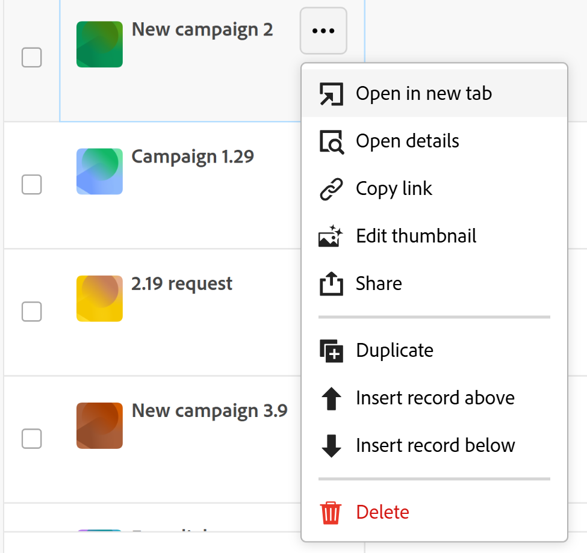
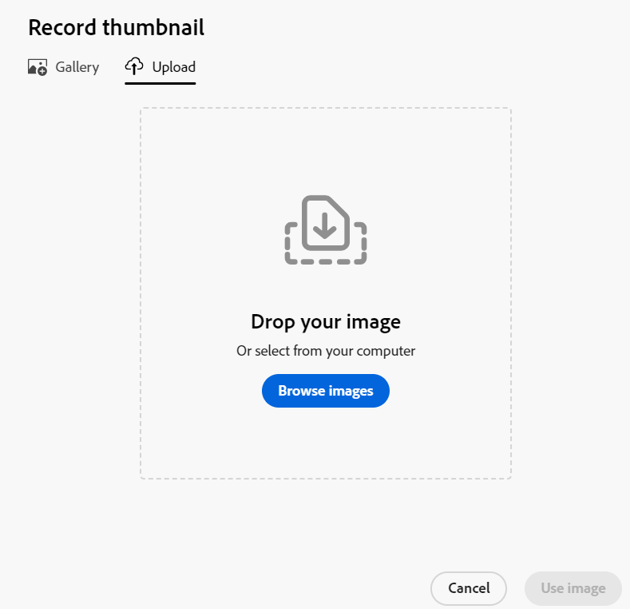
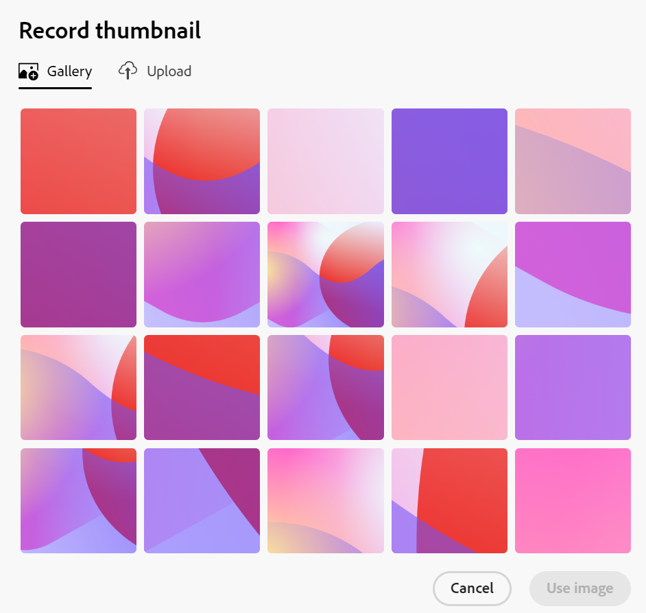

# レコードにサムネールを追加する

<!--
The highlighted information on this page refers to functionality not yet generally available. It is available only in the Preview environment for all customers. After the monthly releases to Production, the same features are also available in the Production environment for customers who enabled fast releases.    

For information about fast releases, see [Enable or disable fast releases for your organization](/help/quicksilver/administration-and-setup/set-up-workfront/configure-system-defaults/enable-fast-release-process.md). 
-->

{{planning-important-intro}}

レコードを Adobe Workfront Planning 内の一意のサムネールに関連付けて、容易に認識できるようにします。

レコードの作成と編集を開始する前に、レコードタイプを作成する必要があります。
詳しくは、[リクエストタイプの作成](/help/quicksilver/planning/architecture/create-record-types.md)を参照してください。

## アクセス要件

<!--************double-check permissions here - asking Isk and Lilit what permissions users need for adding thumbnails-->

+++ 展開して、この記事の機能のアクセス要件を表示します。 

<table style="table-layout:auto"> 
<col> 
</col> 
<col> 
</col> 
<tbody> 
    <tr> 
<tr> 
</tr>   
<tr> 
   <td role="rowheader">
Adobe Workfront パッケージ
</td> 
   <td> 

任意のWorkfrontおよびプランニングパッケージ
 
任意のワークフローとプランニングパッケージ

各Workfront計画パッケージに含まれる内容について詳しくは、Workfrontの担当者にお問い合わせください。 
 
   </td> 
  <tr> 
   <td role="rowheader">
Adobe Workfront プラン
</td> 
   <td>
標準

   </td> 
  </tr> 
  <tr> 
   <td role="rowheader">
オブジェクト権限
</td> 
   <td>   
ワークスペースおよびレコードタイプに対する権限の貢献度を上げます  
  
   
システム管理者は、作成しなかったワークスペースも含め、すべてのワークスペースに対する権限を持っています。
 </td> 
  </tr>   
</tbody> 
</table>

Workfrontのアクセス要件について詳しくは、[Workfront ドキュメント &#x200B;](/help/quicksilver/administration-and-setup/add-users/access-levels-and-object-permissions/access-level-requirements-in-documentation.md)のアクセス要件を参照してください。

+++   

<!--
Old:

<table style="table-layout:auto"> 
<col> 
</col> 
<col> 
</col> 
<tbody> 
    <tr> 
<tr> 
<td> 
   
 Products
 </td> 
   <td> 
   <ul><li>
 Adobe Workfront
</li> 
   <li>
 Adobe Workfront Planning
</li></ul></td> 
  </tr>   
<tr> 
   <td role="rowheader">
Adobe Workfront plan*
</td> 
   <td> 

Any of the following Workfront plans:
 
<ul><li>Select</li> 
<li>Prime</li> 
<li>Ultimate</li></ul> 

Workfront Planning is not available for legacy Workfront plans
 
   </td> 
<tr> 
   <td role="rowheader">
Adobe Workfront Planning package*
</td> 
   <td> 

Any 
 

For more information about what is included in each Workfront Planning plan, contact your Workfront account manager. 
 
   </td> 
 <tr> 
   <td role="rowheader">
Adobe Workfront platform
</td> 
   <td> 

Your organization's instance of Workfront must be onboarded to the Adobe Unified Experience to be able to access Workfront Planning.
 

For more information, see <a href="/help/quicksilver/workfront-basics/navigate-workfront/workfront-navigation/adobe-unified-experience.md">Adobe Unified Experience for Workfront</a>. 
 
   </td> 
   </tr> 
  </tr> 
  <tr> 
   <td role="rowheader">
Adobe Workfront license*
</td> 
   <td>
 Standard 

   
Workfront Planning is not available for legacy Workfront licenses
 
  </td> 
  </tr> 
  <tr> 
   <td role="rowheader">
Access level configuration
</td> 
   <td> 
There are no access level controls for Adobe Workfront Planning
   
</td> 
  </tr> 
<tr> 
   <td role="rowheader">
Object permissions
</td> 
   <td>   
Contribute or higher permissions to a workspace and record type  
  
   
System Administrators have permissions to all workspaces, including the ones they did not create
 </td> 
  </tr> 
</tbody> 
</table>
-->

## レコードのサムネールに関する考慮事項

テーブルビュー内のレコードを視覚的に区別するために、各レコードに一意のサムネール画像を関連付けることができます。

次の点に注意してください。

* サムネールは1つのレコードに固有であり、同じタイプのすべてのレコードには適用されません。
* サムネールとして追加できるのは、画像ファイルのみです。
  <!--above: when you know exactly what type of files are allowed, add the exact extensions above-->
* サムネール画像は、テーブルビュー内の個々のレコード、またはレコードのページまたはプレビューボックスから追加できます。
* Workfrontでは、レコードを作成するたびにサムネイル画像が自動的にアップロードされます。 この画像は後で変更できます。
* サムネールはレコード情報に属し、レコードが表示される領域に表示されます。 例えば、次のエリアでは、レコード情報と共にサムネールが表示されます。

   * テーブルビューのレコードのプライマリフィールド
   * タイムライン表示上のレコードバー。
   * レコードの詳細プレビューとページ。

## レコードにサムネールを追加する

サムネールは、次の方法で追加できます。

* [テーブルビューからレコードにサムネールを追加する](#add-a-thumbnail-to-a-record-from-the-table-view)
* [詳細ページからレコードにサムネールを追加する](#add-a-thumbnail-to-a-record-from-the-details-page)

### テーブルビューからレコードにサムネールを追加する

{{step1-to-planning}}

1. サムネールを追加するレコードのワークスペースをクリックし、レコードタイプカードをクリックします。

   レコードタイプページが開きます。
1. **表示**&#x200B;ドロップダウンメニューからテーブルビューを選択します。選択したタイプのすべてのレコードがテーブルに表示されます。
1. プライマリフィールド情報にカーソルを合わせ、**詳細** メニューをクリックし、**サムネール**&#x200B;をクリックします。

   

   >[!TIP]
   >
   >   プライマリフィールドは、テーブルビューの最初の列に表示されるフィールドです。プライマリフィールドは常にフリーズされ、非表示にしたり再配置したりすることはできません。 プライマリフィールドが数式フィールドの場合、「サムネール」オプションは「その他」メニューでは使用できません。

   「**アップロード**」タブは、デフォルトで&#x200B;**サムネールを記録** ボックスに開きます。

   サムネールのアップロードについて詳しくは、手順6から始めて、この記事の詳細ページ [からレコードにサムネールを](#add-a-thumbnail-to-a-record-from-the-details-page)追加するを参照してください。<!--see if this is accurate-->

<!--
    

  *****update screen shot with correct casing****

1. Drag and drop a file to add as a thumbnail
   
   Or
   
   Click **Browse images**, then browse for an image file to add. The file must be saved on your computer. 
1. (Optional) After the image uploads in the **Record thumbnail** box, use the sizing tool to crop and resize the image.
1. (Optional) Click the **Upload new image** icon  to upload another image. 
1. (Optional) To remove a thumbnail before it is saved, click  **Remove uploaded image** icon  to the right of the image. 
1. (Optional) Click the **Gallery** tab, then click an image. The gallery of images cannot be modified.

   
1. Click **Use image** to add the image as a thumbnail. 
   This closes the **Record thumbnail** box.
   The thumbnail displays in areas of Workfront Planning where the record displays. 

   >[!TIP]
   >
   >   You must enable the Thumbnail field in the table view to display thumbnails in this view. It is disabled by default.

1. (Optional) To remove the thumbnail after it is saved, hover over the primary field and click the **More** menu > **Thumbnail** > the **Remove** icon , then click **Save changes**.
-->

### 詳細ページからレコードにサムネールを追加する

{{step1-to-planning}}

1. サムネールを追加するレコードのワークスペースをクリックし、レコードタイプカードをクリックします。

   レコードタイプページが開きます。
1. 任意のビューから、レコードをクリックして開きます。

   詳細プレビューボックスが表示されます。
1. （オプション）右上隅の&#x200B;**新しいタブで開く** アイコン をクリックします。

   レコードの詳細ページが開きます。

1. （条件付き）レコードプレビューまたは詳細ページで、サムネール画像またはアイコン  サムネールを追加&#x200B;**または** サムネールを編集&#x200B;**をクリックします。**

   「**アップロード**」タブは、デフォルトで&#x200B;**サムネールを記録** ボックスに開きます。

   

1. サムネールとして追加するファイルをドラッグ&amp;ドロップします

   または

   「**画像を参照**」をクリックし、追加する画像ファイルを参照します。 ファイルはお使いのコンピューターに保存しておく必要があります。

1. （オプション）画像を&#x200B;**サムネールを記録** ボックスにアップロードした後、サイズツールを使用して画像を切り抜き、サイズを変更します。
1. （オプション）「**新しい画像をアップロード**」アイコン「」をクリックして、別の画像をアップロードします。
1. （オプション）「**ギャラリー**」タブをクリックし、画像をクリックします。 画像のギャラリーは変更できません。

   

1. （オプション）サムネールを保存する前に削除するには、画像の右側にある&#x200B;**削除** アイコン をクリックします。

1. 「**画像を使用**」をクリックして、画像をサムネールとして追加します。
これにより、**レコードサムネール** ボックスが閉じます。
サムネールは、レコードが表示されるWorkfront Planningの領域に表示されます。

   >[!TIP]
   >
   >   このビューにサムネールを表示するには、テーブルビューの「サムネール」フィールドを有効にする必要があります。 デフォルトでは無効になっています。

1. （オプション）保存後にサムネールを削除するには、任意のビューのレコードをクリックして詳細ページを開き、サムネール画像にカーソルを合わせて&#x200B;**詳細メニューアイコン**&#x200B;詳細メニューアイコン 削除&#x200B;**アイコン**&#x200B;削除アイコン サムネール画像が削除されます。

<!--
### Generate a thumbnail for a record

{{step1-to-planning}}

1. Click the workspace for whose records you want to add thumbnails, then click the record type card. 

   This opens the record type page. 
1. Select a table view from the **View** drop-down menu. All records of the type you selected display in a table. 
1. Hover over the primary field information, click the **More** menu , then click **Thumbnail**. 

   

      >[!TIP]
      >
      >   The primary field is the field that displays in the first column of a table view. The primary field is always frozen and cannot be hidden or relocated. 

   The **Record thumbnail** box opens.

(*************** update the screenshot below*************)
    

1. Click the **Generate** tab, and type a prompt describing the type of image you want to add in the space provided. 
1. Click **Generate**. 

   A set of four suggested images displays. 

1. Click an image to select it, then click **Use image**. 

   The Record thumbnail box closes and the thumbnail is attached to the record. All users who can view the records can now see the selected thumbnail. 
1. (Optional) Click the **More** menu  to the right of the record name in the table view, then click **Thumbnail**. 

   The generated image opens in the **Upload** tab where you can modify or remove it, as described in the section [Upload a thumbnail to a record](#upload-a-thumbnail-to-a-record) in this article. 
-->
