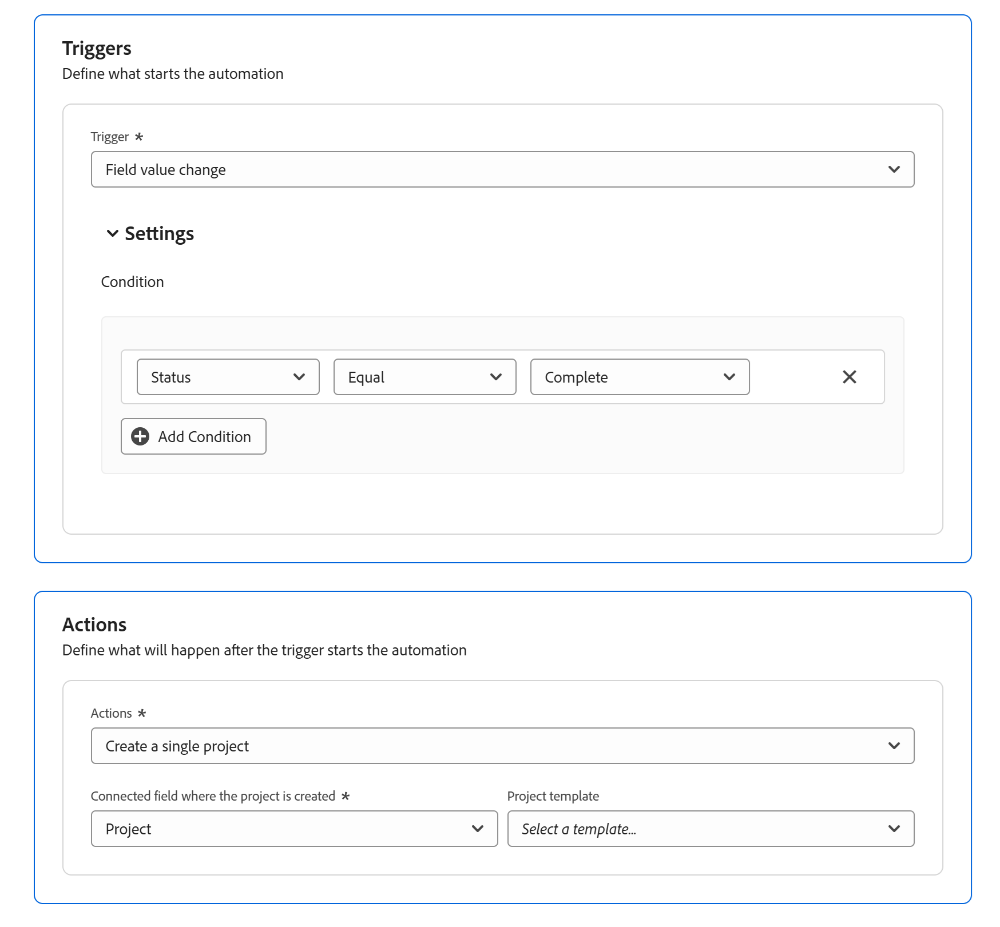
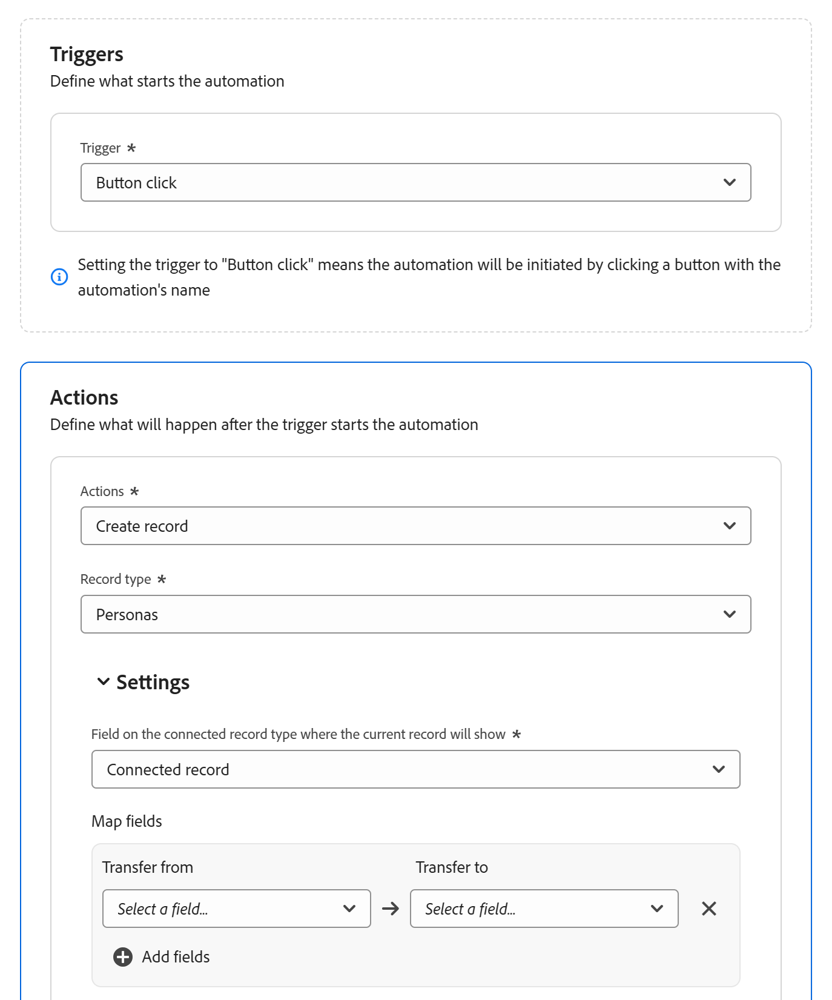
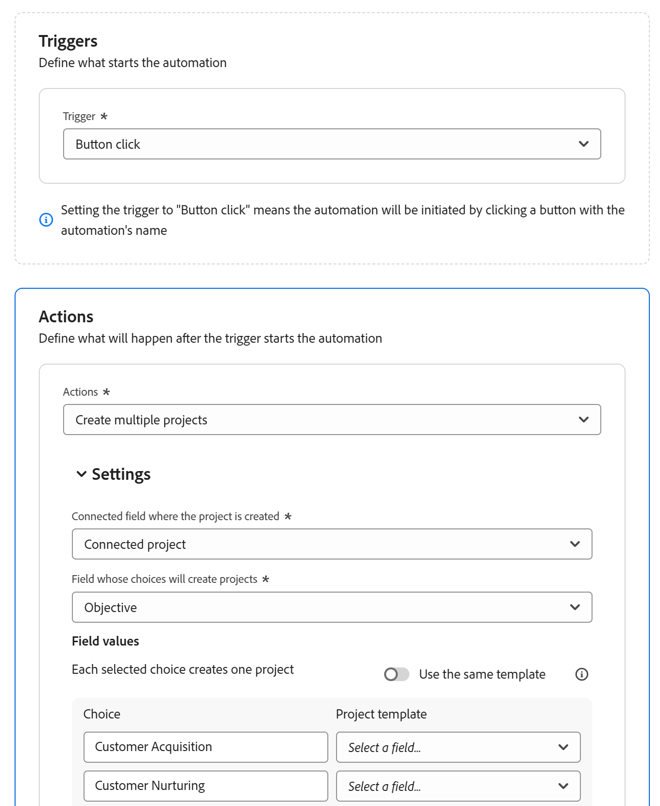

# Adobe Workfront Planning の自動処理の設定

このページでハイライト表示されている情報は、まだ一般に利用できない機能を示します。すべてのユーザーのプレビュー環境でのみ使用できます。 実稼動環境への毎月のリリース後、高速リリースを有効にしたお客様は、実稼動環境でも同じ機能を利用できます。

迅速リリースについて詳しくは、[組織での迅速リリースを有効または無効にする](/help/quicksilver/administration-and-setup/set-up-workfront/configure-system-defaults/enable-fast-release-process.md)を参照してください。

<!--add screen shots when UI is finalized AND redo all the steps - some things got changed and moved around-->

<!--you might need to add something about notifications and emails?!-->
<!--add a new section to this article to mention a new way to create objects: help/quicksilver/planning/records/create-records.md-->
<!-- add a new section to this article to mention a new way to create WF objects from Planning: help/quicksilver/planning/records/create-workfront-objects-from-workfront-planning.md-->

<!-- if they give access to use the automation to people with LESS than Manage permissions to a workspace, split this article in two: the Configure section should be for admins and the "Use a Workfront Planning automation to create an object" should be for all other users-->

Adobe Workfront Planningで自動処理を設定して、アクティブ化すると、Workfrontでオブジェクトを作成したり、プランニングレコードからトリガーされたときにWorkfront Planningでレコードを作成したりできます。 作成されたオブジェクトまたはレコードは、オートメーションのトリガー元のレコードに自動的に接続されます。

Workfront Planningのレコードタイプのページで、自動処理を設定してアクティブ化できます。

たとえば、Workfront計画キャンペーンを自動処理し、そのキャンペーンの進捗状況を追跡するプロジェクトをWorkfrontで作成します。

ここでは、自動処理を管理する方法について説明します。自動処理を編集、無効化、削除およびトリガーして、オブジェクトとレコードを作成する方法を含みます。

既存の自動処理を使用してレコードまたはオブジェクトを作成する方法について詳しくは、[Adobe Workfront Planning レコード自動処理を使用したオブジェクトの作成](/help/quicksilver/planning/records/create-wf-objects-using-planning-automations.md)を参照してください。

## アクセス要件

+++ 展開して、この記事の機能のアクセス要件を表示します。 

<table style="table-layout:auto"> 
<col> 
</col> 
<col> 
</col> 
<tbody> 
    <tr> 
<tr> 
</tr>   
<tr> 
   <td role="rowheader">
Adobe Workfront パッケージ
</td> 
   <td> 

任意のWorkfrontおよびプランニングパッケージ
 
任意のワークフローとプランニングパッケージ

各Workfront計画パッケージに含まれる内容について詳しくは、Workfrontの担当者にお問い合わせください。 
 
   </td> 
  <tr> 
   <td role="rowheader">
Adobe Workfront プラン
</td> 
   <td>
標準

   
フィールド値の変更に基づいて自動化を設定するためのアクセス権を持つシステム管理者

   </td> 
  </tr> 
  <tr> 
   <td role="rowheader">
オブジェクト権限
</td> 
   <td> 
ワークスペースと、自動処理を作成するレコードタイプに対する権限を管理します。 

   
システム管理者は、作成しなかったワークスペースを含め、すべてのワークスペースに対して管理権限を持っています

   </td> 
  </tr>  
</tbody> 
</table>

Workfrontのアクセス要件について詳しくは、[Workfront ドキュメント &#x200B;](/help/quicksilver/administration-and-setup/add-users/access-levels-and-object-permissions/access-level-requirements-in-documentation.md)のアクセス要件を参照してください。

+++   

<!--
Old:
<table style="table-layout:auto"> 
<col> 
</col> 
<col> 
</col> 
<tbody> 
    <tr> 
<tr> 
<td> 
   
 Products
 </td> 
   <td> 
   <ul><li>
 Adobe Workfront
</li> 
   <li>
 Adobe Workfront Planning
</li></ul></td> 
  </tr>   
<tr> 
   <td role="rowheader">
Adobe Workfront plan*
</td> 
   <td> 

Any of the following Workfront plans:
 
<ul><li>Select</li> 
<li>Prime</li> 
<li>Ultimate</li></ul> 

Workfront Planning is not available for legacy Workfront plans
 
   </td> 
<tr> 
   <td role="rowheader">
Adobe Workfront Planning package*
</td> 
   <td> 

Any 
 

For more information about what is included in each Workfront Planning plan, contact your Workfront account manager. 
 
   </td> 
 <tr> 
   <td role="rowheader">
Adobe Workfront platform
</td> 
   <td> 

Your organization's instance of Workfront must be onboarded to the Adobe Unified Experience to be able to access Workfront Planning.
 

For more information, see <a href="/help/quicksilver/workfront-basics/navigate-workfront/workfront-navigation/adobe-unified-experience.md">Adobe Unified Experience for Workfront</a>. 
 
   </td> 
   </tr> 
  </tr> 
  <tr> 
   <td role="rowheader">
Adobe Workfront license*
</td> 
   <td> Standard
   
Workfront Planning is not available for legacy Workfront licenses
 
  </td> 
  </tr> 
  <tr> 
   <td role="rowheader">
Access level configuration
</td> 
   <td> 
There are no access level controls for Adobe Workfront Planning
 
   
Edit access with access to Create objects in Workfront for the object types that you want to create (projects, portfolios, programs). 
  
</td> 
  </tr> 
<tr> 
   <td role="rowheader">
Object permissions
</td> 
   <td> 
Manage permissions to the workspace and to the record type where you want to create automations. 

   
System Administrators have Manage permissions to all workspaces, including the ones they did not create

   </td> 
  </tr> 
</tbody> 
</table>
-->

## Workfront Planningでの自動化の設定

オブジェクトの作成に使用する前に、Workfront Planningでレコードタイプの自動処理を設定する必要があります。

{{step1-to-planning}}

1. レコードタイプカードをクリックしてから、レコードの名前をクリックします。

   レコードタイプのページが開きます。
1. レコードタイプ名の右側にある&#x200B;**詳細** メニューをクリックし、**自動処理の管理**&#x200B;をクリックします。

   選択したレコードタイプで使用可能な自動処理のリストが開きます。

1. 画面の右上隅にある「**新規自動化**」をクリックします。 **新しいオートメーション** ボックスが開きます。
1. 次のフィールドを更新します。

   * 「**名称未設定の自動処理**」を、自動処理ボタンに表示するテキストに置き換えます。 自動処理を使用してWorkfront オブジェクトまたはPlanning レコードを作成する場合、このボタンをクリックします。
   * **説明**：自動化の目的を特定するための説明を追加します。
1. 「**保存**」をクリックします。
自動化詳細ページが開きます。

1. オートメーションの詳細ページで、**トリガー** セクションの次のオプションから選択します。

   * **トリガー**：自動処理をトリガーするアクションを選択します：

      * ボタンクリック
      *  フィールド値の変更

   1. （条件付き）ボタンを&#x200B;**クリック**&#x200B;を選択した場合は、下の手順9に進み、**アクション**&#x200B;領域について説明します。<!--ensure this number stays accurate-->

   1.  （条件付き） **フィールド値の変更**&#x200B;を選択した場合、**設定** セクションで次の操作を行います：

      1.  ドロップダウンメニューからフィールドを選択します。 これらは、選択したレコードタイプに関連付けられているフィールドです。
      1. 選択したフィールドの条件の定義を続行します。
      1.  「**条件を追加**」をクリックして、最大5つのフィールドを追加し、その条件を定義します。

         次のいずれかの種類のフィールドを追加できます：

         

         * 単一選択
         * 複数選択
         * 1 行テキスト
         * 段落
         * 数値
         * チェックボックス
         * 日付

         

         Workfront計画では、条件が満たされると、オブジェクトが自動的に作成されます。

         

         >[!TIP]
         >
         >各条件の修飾子は、選択したフィールドの種類で変更されます。

1. **アクション** セクションの次のフィールドを更新します：<!--submitted bugs for these fields - see if they need changing here-->
   * **アクション**：自動処理をトリガーする際にWorkfrontで実行するアクションを選択します。 これは必須フィールドです。
次のいずれかのアクションを選択します。

      * 複数のプロジェクトの作成
      * 単一のプロジェクトを作成
      * プロジェクトを作成
      * レコードを作成
      * プログラムを作成
      * ポートフォリオを作成
      * グループを作成

     >[!TIP]
     >
     >自動処理を保存した後、このフィールドで選択したアクションを変更できなくなります。

1. （条件付き）選択したアクションに応じて、次のフィールドを更新します。

   * **単一のプロジェクトを作成**: <!--replace to the left: Create a single project-->
      * **プロジェクトが作成される接続フィールド**：これは、新しいプロジェクトが表示される接続フィールドです。 必須フィールドです。
      * **プロジェクトテンプレート**: Workfrontがプロジェクトの作成に使用するプロジェクトテンプレートを選択します。

   * 複数のプロジェクトを作成：
      * **プロジェクトが作成される接続フィールド**：これは、新しいプロジェクトが表示される接続フィールドです。 必須フィールドです。
      * **選択によってレコードが作成されるフィールド**：選択したレコードタイプから複数選択または単一選択フィールドを選択します。 Workfrontは、自動処理のトリガー元のレコードで現在選択されている各フィールド選択に対してプロジェクトを作成します。

     >[!TIP]
     >
     >プロジェクトは、自動処理を実行しているレコードの複数選択または単一選択フィールドで現在選択されているオプションに対してのみ作成され、そのフィールドで可能なすべての選択肢に対して作成されるわけではありません。
     >

      * **同じテンプレートを使用**：新しいプロジェクトごとに同じテンプレートを使用するには、このオプションを選択します。 オプションの選択を解除した場合は、フィールドの選択ごとに&#x200B;**プロジェクトテンプレート**&#x200B;を選択します。
      * **プロジェクトテンプレート**:「**同じテンプレートを使用**」オプションを選択した場合は、Workfrontがプロジェクトの作成に使用するプロジェクトテンプレートを選択します。

   * **ポートフォリオを作成**:
      * **ポートフォリオが作成される接続フィールド**：これは、新しいポートフォリオが表示される接続フィールドです。 必須フィールドです。
      * **新しいポートフォリオに添付するカスタムフォーム**：新しいポートフォリオに添付するカスタムフォームを選択します。 ポートフォリオカスタムフォームを選択する前に、作成する必要があります。
   * **プログラムを作成**:
      * **プログラムが作成される接続フィールド**：これは、新しいプログラムが表示される接続フィールドです。 必須フィールドです。
      * **プログラム ポートフォリオ**：新しいプログラムが追加されるポートフォリオを選択します。 必須フィールドです。
      * **新しいプログラムに添付するカスタムフォーム**：新しいプログラムに添付するカスタムフォームを選択します。 プログラムカスタムフォームを選択する前に、作成する必要があります。
   * **グループを作成**:
      * **グループが作成される接続フィールド**：これは、新しいグループが表示される接続フィールドです。 必須フィールドです。
      * **新しいグループに添付するカスタムフォーム**：新しいプログラムに添付するカスタムフォームを選択します。 プログラムカスタムフォームを選択する前に、作成する必要があります。
   * **レコードを作成**:
      * **レコードタイプ**：作成するレコードタイプを選択します。

        **設定** サブセクションが表示されます。 **設定** サブセクションの次のフィールドを更新します。

         * 現在のレコードが表示される接続レコードタイプの&#x200B;**フィールド**：これは、現在のレコードが表示されるアクションに選択されたレコードタイプの接続フィールドです。

        例えば、製品レコードを接続するキャンペーンのオートメーションを作成する場合、オートメーションを使用して製品を作成した後、キャンペーンが表示される製品レコードタイプの「接続」フィールドです。

        必須フィールドです。

        <!--submitted a change in functionality and UI text for this - revise??-->
**マップフィールド**&#x200B;領域で、次の情報を更新します。

         * **移動元**：自動処理が作成されるレコードタイプからフィールドを選択して、接続されたレコードタイプのフィールドにマッピングします。
         * **移動先**：新しく作成したレコードから、自動処理を実行しているレコードの情報を入力するフィールドを選択します。

        >[!TIP]
        >
        >* 元のレコードタイプのフィールドタイプは、新しく作成されたレコードタイプのフィールドタイプと一致する必要があります。
        >* フィールドを選択しない場合、新しいレコードの名前は&#x200B;**名称未設定レコード**&#x200B;になります。

1. （オプションおよび条件付き）レコードを作成することを選択した場合は、**フィールドを追加**&#x200B;をクリックして、あるレコードから別のレコードに追加のルックアップフィールドをマッピングします。
1. （条件付き）元のレコードタイプと、**レコードタイプ** フィールドで選択されたレコードタイプの間に接続フィールドがない場合は、**接続フィールドを追加**&#x200B;をクリックします。

   

   次の2つのフィールドが作成されます。

   * **レコードタイプ** フィールドに指定したレコードタイプに対して、**接続レコード**&#x200B;という名前の新しい接続フィールドが作成されます。
   * 自動処理を設定しているレコードタイプに対して、**レコードタイプ** フィールドに示されているものと同じ名前の新しい接続フィールドが作成されます。

     例えば、Campaignsのオートメーションを設定してBrandsという別のレコードタイプを自動的に作成し、**接続フィールドを追加**&#x200B;をクリックすると、次のフィールドが作成されます。

      * **接続レコード**&#x200B;接続フィールドが、**ブランド** レコードタイプ用に作成されます。
      * **ブランド**&#x200B;接続フィールドは、**キャンペーン** レコードタイプ用に作成されます。

1. （オプション）元のレコードタイプとWorkfront オブジェクトの間に接続フィールドがない場合は、「**接続フィールドを追加**」をクリックします。

   

   次のものが作成されます。

   * 自動処理を構築するレコードタイプに対して、**Connected &lt; name of Workfront object >**&#x200B;という名前の新しい接続フィールドが作成されます。 例えば、自動的にプロジェクトを作成することを選択した場合、自動化対象のレコードタイプに対して&#x200B;**Connected project** フィールドが作成されます。
   * 新しいレコードタイプカードがWorkfront プロジェクトの計画セクションに追加され、Workfrontで自動処理を設定するレコードタイプの名前が付けられます。

1. オートメーションの詳細ページの右上隅にある「**保存**」をクリックします。

   自動処理は自動処理のリストに表示され、レコードで使用できます。

## 既存の自動化を管理

{{step1-to-planning}}

1. レコードタイプカードをクリックしてから、レコードの名前をクリックします。

   レコードタイプのページが開きます。
1. レコードタイプ名の右側にある&#x200B;**詳細** メニューをクリックし、**自動処理の管理**&#x200B;をクリックします。

   選択したレコードタイプで使用可能な自動処理のリストが開きます。

1. （オプション）オートメーションを編集、無効、または削除するには、次のいずれかの操作を行います。

   1. 自動処理のリストから、保存された自動処理の名前にカーソルを合わせ、**詳細** メニューをクリックします。

   1. 「**編集**」をクリックして、次の情報を更新します。

      * 自動化名の右側にある&#x200B;**詳細** メニューをクリックし、**編集**&#x200B;をクリックして自動化名を変更します。
      * オートメーション内のフィールド（**アクション** フィールドを除く）。

        >[!TIP]
        >
        >最初に自動化用に選択したアクションは変更できません。

   1. 「**無効化**」をクリックして、自動化をレコードのテーブルビューから削除し、ユーザーがレコードまたはオブジェクトの作成に使用できないようにします。

      無効なオートメーションを使用して作成されたレコードは、最初に選択したレコードに接続されたままになります。

      再度利用できるようにするには、**詳細** メニューをもう一度クリックし、**アクティブ化**&#x200B;をクリックします。
   1. 「**削除**」をクリックして、自動処理を削除します。 削除されたオートメーションは復元できません。

      削除されたオートメーションを使用して作成されたレコードは、最初に選択したレコードに接続されたままになります。
