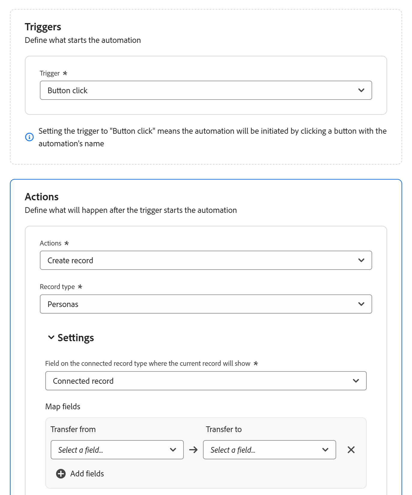

# Adobe Workfront Planning の自動構成

<!--add screen shots when UI is finalized AND redo all the steps - some things got changed and moved around-->

<!--you might need to add something about notifications and emails?!-->
<!--add a new section to this article to mention a new way to create objects: help/quicksilver/planning/records/create-records.md-->
<!-- add a new section to this article to mention a new way to create WF objects from Planning: help/quicksilver/planning/records/create-workfront-objects-from-workfront-planning.md-->

<!-- if they give access to use the automation to people with LESS than Manage permissions to a workspace, split this article in two: the Configure section should be for admins and the "Use a Workfront Planning automation to create an object" should be for all other users-->

<!--The highlighted information on this page refers to functionality not yet generally available. It is available only in the Preview environment for all customers. After the monthly releases to Production, the same features are also available in the Production environment for customers who enabled fast releases.    

For information about fast releases, see [Enable or disable fast releases for your organization](/help/quicksilver/administration-and-setup/set-up-workfront/configure-system-defaults/enable-fast-release-process.md). -->

Adobe Workfront Planning で自動化を構成して、アクティブ化すると、Workfront内にオブジェクトを作成したり、計画レコードからトリガーされたときにWorkfront Planning 内にレコードを作成できます。 作成したオブジェクトまたはレコードは、自動処理をトリガーするレコードに自動的に接続されます。

Workfront Planning のレコードタイプのページで自動処理を設定してアクティブ化できます。

例えば、Workfront Planning キャンペーンを受け取り、Workfrontでプロジェクトを作成して、そのキャンペーンの進行状況を追跡する自動処理を作成できます。

ここでは、自動化を管理する方法（オブジェクトとレコードを作成するために自動化を編集、無効化、削除、トリガーする方法など）について説明します。

既存の自動化を使用してレコードまたはオブジェクトを作成する方法については、[Adobe Workfront Planning のレコード自動化を使用したオブジェクトの作成 &#x200B;](/help/quicksilver/planning/records/create-wf-objects-using-planning-automations.md) を参照してください。

## アクセス要件

+++ 展開して、この記事の機能のアクセス要件を表示します。 

<table style="table-layout:auto"> 
<col> 
</col> 
<col> 
</col> 
<tbody> 
    <tr> 
<tr> 
</tr>   
<tr> 
   <td role="rowheader">
Adobe Workfront パッケージ
</td> 
   <td> 
<ul> 
<li>
任意のWorkfrontと任意の Planning パッケージ
</li>
または
<li>
任意のワークフローおよび任意の計画パッケージ
</li></ul>

各Workfront Planning パッケージに含まれる内容について詳しくは、Workfront アカウント担当者にお問い合わせください。 
 
   </td> 
  <tr> 
   <td role="rowheader">
Adobe Workfront プラン
</td> 
   <td>
標準

   </td> 
  </tr> 
  <tr> 
   <td role="rowheader">
オブジェクト権限
</td> 
   <td> 
ワークスペースに対する権限と、自動化を作成するレコードタイプに対する権限を管理します。 

   
システム管理者には、未作成のワークスペースを含むすべてのワークスペースに対する管理権限があります

   </td> 
  </tr>  
</tbody> 
</table>

Workfrontのアクセス要件について詳しくは、[Workfront ドキュメントのアクセス要件 &#x200B;](/help/quicksilver/administration-and-setup/add-users/access-levels-and-object-permissions/access-level-requirements-in-documentation.md) を参照してください。

+++   

<!--Old:
<table style="table-layout:auto"> 
<col> 
</col> 
<col> 
</col> 
<tbody> 
    <tr> 
<tr> 
<td> 
   
 Products
 </td> 
   <td> 
   <ul><li>
 Adobe Workfront
</li> 
   <li>
 Adobe Workfront Planning
</li></ul></td> 
  </tr>   
<tr> 
   <td role="rowheader">
Adobe Workfront plan*
</td> 
   <td> 

Any of the following Workfront plans:
 
<ul><li>Select</li> 
<li>Prime</li> 
<li>Ultimate</li></ul> 

Workfront Planning is not available for legacy Workfront plans
 
   </td> 
<tr> 
   <td role="rowheader">
Adobe Workfront Planning package*
</td> 
   <td> 

Any 
 

For more information about what is included in each Workfront Planning plan, contact your Workfront account manager. 
 
   </td> 
 <tr> 
   <td role="rowheader">
Adobe Workfront platform
</td> 
   <td> 

Your organization's instance of Workfront must be onboarded to the Adobe Unified Experience to be able to access Workfront Planning.
 

For more information, see <a href="/help/quicksilver/workfront-basics/navigate-workfront/workfront-navigation/adobe-unified-experience.md">Adobe Unified Experience for Workfront</a>. 
 
   </td> 
   </tr> 
  </tr> 
  <tr> 
   <td role="rowheader">
Adobe Workfront license*
</td> 
   <td> Standard
   
Workfront Planning is not available for legacy Workfront licenses
 
  </td> 
  </tr> 
  <tr> 
   <td role="rowheader">
Access level configuration
</td> 
   <td> 
There are no access level controls for Adobe Workfront Planning
 
   
Edit access with access to Create objects in Workfront for the object types that you want to create (projects, portfolios, programs). 
  
</td> 
  </tr> 
<tr> 
   <td role="rowheader">
Object permissions
</td> 
   <td> 
Manage permissions to the workspace and to the record type where you want to create automations. 

   
System Administrators have Manage permissions to all workspaces, including the ones they did not create

   </td> 
  </tr> 
</tbody> 
</table> -->

## Workfront Planning での自動処理の設定

Workfront Planning を使用してオブジェクトを作成する前に、レコードタイプの自動処理を設定する必要があります。

{{step1-to-planning}}

1. レコードの種類カードをクリックし、レコードの名前をクリックします。

   レコードタイプのページが開きます。
1. レコードタイプ名の右側にある **その他** メニュー  をクリックし、**自動化の管理** をクリックします。

   選択したレコードタイプで使用可能な自動化のリストが開きます。

1. 画面の右上隅にある「**新しいオートメーション**」をクリックします。 **新しい自動化** ボックスが開きます。
1. 次のフィールドを更新します。

   * **名称未設定のオートメーション** を、オートメーションボタンに表示するテキストに置き換えます。 自動処理を使用してWorkfront オブジェクトまたは計画レコードを作成する際に、このボタンをクリックします。
   * **説明**：説明を追加して、自動化の目的を特定します。
1. 「**保存**」をクリックします。
自動処理の詳細ページが開きます。

1. 自動処理の詳細ページの「**トリガー**」セクションで、次のフィールドを更新します。

   * **トリガー**：自動処理をトリガーにするアクションを選択します。 例えば、「**ボタンをクリック**」を選択します。<!--update this step with a list of all possible triggers; right now only Button click is available-->

1. 「**アクション**」セクションの次のフィールドを更新します。<!--submitted bugs for these fields - see if they need changing here-->
   * **アクション**：自動処理をトリガーするときにWorkfrontで実行するアクションを選択します。 必須フィールドです。
次のいずれかのアクションを選択します。

      * 複数プロジェクトの作成
      * 単一のプロジェクトを作成
      * プロジェクトを作成
      * レコードを作成
      * プログラムを作成
      * ポートフォリオを作成
      * グループを作成

     >[!TIP]
     >
     >自動処理を保存すると、このフィールドで選択したアクションを変更できなくなります。

1. （条件付き）選択したアクションに応じて、次のフィールドを更新します。

   * **1 つのプロジェクトの作成**: <!--replace to the left: Create a single project-->
      * **プロジェクトが作成される「接続」フィールド**：新しいプロジェクトが表示される「接続」フィールドです。 必須フィールドです。
      * **プロジェクトテンプレート**:Workfrontでプロジェクトの作成に使用するプロジェクトテンプレートを選択します。

   * 複数のプロジェクトを作成します。
      * **プロジェクトが作成される「接続」フィールド**：新しいプロジェクトが表示される「接続」フィールドです。 必須フィールドです。
      * **選択肢がレコードを作成するフィールド**：選択したレコードタイプから複数選択または単一選択のフィールドを選択します。 Workfrontは、オートメーションのトリガーとなるレコードで現在選択されているフィールド選択ごとにプロジェクトを作成します。

     >[!TIP]
     >
     >プロジェクトは、オートメーションを実行するレコードの複数選択または単一選択フィールドで現在選択されているオプションに対してのみ作成され、そのフィールドで可能なすべての選択に対しては作成されません。
     >

      * **同じテンプレートを使用**：新規プロジェクトごとに同じテンプレートを使用する場合は、このオプションを選択します。 このオプションの選択を解除した場合は、フィールドの選択ごとに **プロジェクトテンプレート** を選択します。
      * **プロジェクトテンプレート**:「**同じテンプレートを使用**」オプションを選択した場合は、Workfrontがプロジェクトの作成に使用するプロジェクトテンプレートを選択します。

   * **ポートフォリオを作成**:
      * **ポートフォリオが作成される接続されたフィールド**：新しいポートフォリオが表示される接続されたフィールドです。 必須フィールドです。
      * **新しいポートフォリオに添付するカスタムフォーム**：新しいポートフォリオに添付するカスタムフォームを選択します。 ポートフォリオのカスタム フォームを作成してから選択する必要があります。
   * **プログラムを作成**:
      * **プログラムが作成される接続フィールド**：新しいプログラムが表示される接続フィールドです。 必須フィールドです。
      * **プログラムポートフォリオ**：新しいプログラムが追加されるポートフォリオを選択します。 必須フィールドです。
      * **新しいプログラムに添付するカスタムフォーム**：新しいプログラムに添付するカスタムフォームを選択します。 選択する前に、プログラムカスタムフォームを作成する必要があります。
   * **グループを作成**:
      * **グループが作成される接続フィールド**：新しいグループが表示される接続フィールドです。 必須フィールドです。
      * **新規グループに添付するカスタムフォーム**：新しいプログラムに添付するカスタムフォームを選択します。 選択する前に、プログラムカスタムフォームを作成する必要があります。
   * **レコードを作成**:
      * **レコードタイプ**：作成するレコードタイプを選択します。

        **設定** サブセクションが表示されます。 **設定** サブセクションの次のフィールドを更新します。

         * **接続されたレコードタイプのフィールドで、現在のレコードが表示されます**：これは、現在のレコードが表示されるアクション用に選択されたレコードタイプの接続されたフィールドです。

        例えば、製品レコードを接続するキャンペーンの自動化を作成している場合、これは、自動化を使用して製品を作成した後にキャンペーンが表示される、製品レコードタイプの接続されたフィールドです。

        必須フィールドです。

        <!--submitted a change in functionality and UI text for this - revise??-->
**フィールドをマッピング** 領域で、次の情報を更新します。

         * **転送元**：オートメーションが作成されるレコードタイプからフィールドを選択して、接続されたレコードタイプのフィールドにマッピングします。
         * **転送先**：新しく作成したレコードから、自動処理を実行しているレコードの情報を取り込むフィールドを選択します。

        >[!TIP]
        >
        >* 元のレコードタイプのフィールドタイプは、新規作成したレコードタイプのフィールドタイプと一致する必要があります。
        >* どのフィールドも選択しない場合、新しいレコードの名前は **名称未設定のレコード** になります。

1. （オプションおよび条件付き）レコードの作成を選択した場合は、「**フィールドの追加** をクリックして、追加の参照フィールドをレコード間でマッピングします。
1. （条件付き）元のレコードタイプと、「**レコードタイプ**」フィールドで選択されたレコードタイプの間に接続フィールドがない場合は、「**接続されたフィールドを追加**」をクリックします。

   

   次の 2 つのフィールドが作成されます。

   * 「**レコードタイプ**」フィールドで指定したレコードタイプに対して、「**接続されたレコード**」という名前の新しい接続フィールドが作成されます。
   * **レコードタイプ** フィールドに示された名前と同じ名前を持つ新しい接続フィールドが、オートメーションを設定するレコードタイプに対して作成されます。

     例えば、ブランドと呼ばれる別のレコードタイプを自動的に作成するようにキャンペーンの自動処理を設定しており、「**接続フィールドを追加**」をクリックすると、次のフィールドが作成されます。

      * **Brands** レコードタイプの **接続レコード** 接続フィールドが作成されます。
      * **Brands** 接続フィールドは **Campaigns** レコードタイプ用に作成されます。

1. （オプション）元のレコードタイプと「アクション」領域で選択したWorkfront オブジェクトとの間に接続フィールドがない場合は、「**接続フィールドを追加**」をクリックします。

   

   以下が作成されます。

   * 自動処理を作成するレコードタイプに対して、**Connected &lt; Workfront オブジェクト名 >** という名前の新しい接続フィールドが作成されます。 例えば、プロジェクトを自動的に作成することを選択した場合、自動化を作成するレコードタイプに対して「**接続されたプロジェクト**」フィールドが作成されます。
   * 新しいレコードタイプカードが、自動処理を設定しているレコードタイプの名前で、WorkfrontのWorkfront プロジェクトの「計画」セクションに追加されます。

1. 自動処理の詳細ページの右上隅にある「**保存**」をクリックします。

   自動処理は自動処理のリストに表示され、レコードで使用できます。

## 既存の自動化の管理

{{step1-to-planning}}

1. レコードの種類カードをクリックし、レコードの名前をクリックします。

   レコードタイプのページが開きます。
1. レコードタイプ名の右側にある **その他** メニュー  をクリックし、**自動化の管理** をクリックします。

   選択したレコードタイプで使用可能な自動化のリストが開きます。

1. （オプション）オートメーションを編集、無効化、または削除するには、次のいずれかの操作を行います。

   1. オートメーションのリストで、保存されているオートメーションの名前にポインタを合わせ、**詳細** メニュー  をクリックします。

   1. **編集** をクリックして、次の情報を更新します。

      * オートメーション名の右側にある **その他** メニュー  をクリックしてから、**編集** をクリックしてオートメーションの名前を変更します。
      * **アクション** フィールドを除く、自動処理のすべてのフィールド。

        >[!TIP]
        >
        >自動処理に対して最初に選択したアクションを変更することはできません。

   1. レコードのテーブルビューからオートメーションを削除し、ユーザーがレコードやオブジェクトの作成にオートメーションを使用できないようにするには、「**無効**」をクリックします。

      無効な自動処理を使用して作成されたレコードは、最初に選択されたレコードに接続されたままになります。

      再び使用できるようにするには、**その他** メニュー  を再度クリックし、**アクティブ化** をクリックします。
   1. **削除** をクリックして、自動処理を削除します。 削除されたオートメーションは復元できません。

      削除された自動処理を使用して作成されたレコードは、最初に選択されたレコードに接続されたままになります。
