# レコードの接続

<!--
The highlighted information on this page refers to functionality not yet generally available. It is available only in the Preview environment for all customers. After the monthly releases to Production, the same features are also available in the Production environment for customers who enabled fast releases.    

For information about fast releases, see [Enable or disable fast releases for your organization](/help/quicksilver/administration-and-setup/set-up-workfront/configure-system-defaults/enable-fast-release-process.md). 
-->

{{planning-important-intro}}

Adobe Workfront計画レコードを相互に接続したり、他のアプリケーションのオブジェクトに接続したりできます。 1つのレコードの情報を別のレコードに接続すると、表示できます。

この記事では、レコードを接続する方法について説明します。 レコードの接続に関する一般的な情報については、[接続されたレコードの概要](/help/quicksilver/planning/records/connected-records-overview.md)を参照してください。

まず、2 つのレコードタイプを相互に接続するか、レコードタイプを別のアプリケーションのオブジェクトタイプに接続する必要があります。これにより、接続されたレコードフィールドが作成されます。 その後、レコードを相互に接続したり、接続されたレコードフィールド内の他のアプリケーションから他のオブジェクトにレコードを接続したりできます。

レコードの接続は、レコードを別のアプリケーションのオブジェクトに接続することと似ています。

レコードタイプの相互の接続や、レコードタイプの他のアプリケーションのオブジェクトタイプへの接続について詳しくは、[レコードタイプの接続](/help/quicksilver/planning/architecture/connect-record-types.md)を参照してください。

レコードタイプを連結する例については、[レコードタイプとレコードの連結例](/help/quicksilver/planning/architecture/example-connect-record-types-and-records.md)を参照してください。

以下を連結することができます。

* Adobe Workfront計画レコードを互いに共有します
* 他のアプリケーションからのオブジェクトを含む Adobe Workfront Planning レコード。

  次のアプリケーションから、次に示すタイプのオブジェクトにレコードを接続できます。

   * Adobe Workfront

      * プロジェクト
      * ポートフォリオ
      * プログラム
      * 会社
      * グループ

   * Adobe Experience Manager

      * アセット

        Workfront Planningでは、次のタイプのアセットを接続できます。

         * 画像ファイル
         * フォルダー
      * コンテンツフラグメント

* Adobe GenStudio for Performance Marketing

   * ブランド

  <!--when you add more objects, fix the Access Requirements below which right now refer only to projects-->

## アクセス要件

+++ 展開して、この記事の機能のアクセス要件を表示します。 

<table style="table-layout:auto"> 
<col> 
</col> 
<col> 
</col> 
<tbody> 
    <tr> 
<tr> 
</tr>   
<tr> 
   <td role="rowheader">
Adobe Workfront パッケージ
</td> 
   <td> 

任意のWorkfrontまたはWorkflow パッケージ

任意の計画パッケージ

各Workfront計画パッケージに含まれる内容について詳しくは、Workfrontの担当者にお問い合わせください。 
 
   </td> 
<tr> 
<td> 
   
 その他の製品
 </td> 
   <td> 
   
 次のアプリケーションのオブジェクトにレコードを接続する場合は、Adobe Workfrontに加えて、次のものが必要です。

   <ul><li>
Adobe Experience Managerライセンスと、Adobe Experience ManagerとWorkfrontの統合により、AEMのアセットまたはコンテンツフラグメントをプランニングレコードタイプに接続。

   
詳しくは、<a href="/help/quicksilver/documents/adobe-workfront-for-experience-manager-assets-essentials/workfront-for-aem-asset-essentials.md">Experience Manager AssetsおよびAssets Essentials向けAdobe Workfront：記事インデックス </a>を参照してください。 
</li>
   <li>
 レコードタイプとGenStudio Brandsを連携させるAdobe GenStudio for Performance Marketingライセンス

   
詳しくは、<a href="https://experienceleague.adobe.com/en/docs/genstudio-for-performance-marketing/user-guide/get-started">Adobe GenStudio for Performance Marketingの基本を学ぶ</a>を参照してください。
</li></ul>
   </td> 
  </tr>   
<tr> 
  <tr> 
   <td role="rowheader">
Adobe Workfront プラン
</td> 
   <td>
標準

   </td> 
  </tr> 
   <tr> 
   <td role="rowheader">
アクセスレベルの設定
</td> 
   <td> 
Adobe Workfront Planning に対するアクセスレベルのコントロールはありません。
 
   
WorkfrontおよびAEM Assetsで、オブジェクトを接続するオブジェクトタイプのアクセス権を表示または上に設定します。 
  
</td> 
  </tr>
  <tr> 
   <td role="rowheader">
オブジェクト権限
</td> 
   <td>   
レコードを接続するワークスペースおよびレコードタイプに対する権限を設定します。 
  
   
他のアプリケーションでのアクセスに関係なく、他のアプリケーションからのオブジェクトとフィールドへのすべての接続を表示するワークスペースとレコードタイプに対する表示以上の権限。 

   
WorkfrontまたはExperience Manager Assetsからリンクするオブジェクトに対する表示権限またはそれ以上の権限。 

   
システム管理者は、自分が作成したものでないものも含めて、すべてのワークスペースに対する権限を持っています。
 </td> 
  </tr>   
</tbody> 
</table>

Workfrontのアクセス要件について詳しくは、[Workfront ドキュメント &#x200B;](/help/quicksilver/administration-and-setup/add-users/access-levels-and-object-permissions/access-level-requirements-in-documentation.md)のアクセス要件を参照してください。

+++   

<!--
Old:

<table style="table-layout:auto"> 
<col> 
</col> 
<col> 
</col> 
<tbody> 
    <tr> 
<tr> 
<td> 
   
 Products
 </td> 
   <td> 
   <ul><li>
 Adobe Workfront
</li> 
   <li>
 Adobe Workfront Planning
</li>
   <li>
Adobe Experience Manager Assets, if you want to connect AEM assets with Planning records

   
You must have an Adobe Experience Manager Assets license and an integration between AEM Assets and Workfront.
    For information, see <a href="/help/quicksilver/documents/adobe-workfront-for-experience-manager-assets-essentials/workfront-for-aem-asset-essentials.md">Adobe Workfront for Experience Manager Assets and Assets Essentials: article index</a>. 

   </li>  
   </ul></td> 
  </tr>   
<tr> 
   <td role="rowheader">
Adobe Workfront plan*
</td> 
   <td> 

Any of the following Workfront plans:
 
<ul><li>Select</li> 
<li>Prime</li> 
<li>Ultimate</li></ul> 

Workfront Planning is not available for legacy Workfront plans
 
   </td> 
<tr> 
   <td role="rowheader">
Adobe Workfront Planning package*
</td> 
   <td> 

Any 
 

For more information about what is included in each Workfront Planning plan, contact your Workfront account manager. 
 
   </td> 
 <tr> 
   <td role="rowheader">
Adobe Workfront platform
</td> 
   <td> 

Your organization's instance of Workfront must be onboarded to the Adobe Unified Experience to be able to access Workfront Planning.
 

For more information, see <a href="/help/quicksilver/workfront-basics/navigate-workfront/workfront-navigation/adobe-unified-experience.md">Adobe Unified Experience for Workfront</a>. 
 
   </td> 
   </tr> 
  </tr> 
  <tr> 
   <td role="rowheader">
Adobe Workfront license*
</td> 
   <td> Standard
   
Workfront Planning is not available for legacy Workfront licenses
 
  </td> 
  </tr> 
  <tr> 
   <td role="rowheader">
Access level configuration
</td> 
   <td> 
There are no access level controls for Adobe Workfront Planning objects
 
   
View or higher permissions to the object types you want to link from Workfront.
   
</td> 
  </tr> 
<tr> 
   <td role="rowheader">
Object permissions
</td> 
   <td>   
Contribute or higher permissions to a workspace and record type to connect records 
  
   
View or higher permissions to a workspace and record type to view all connections to objects and fields from other applications, regardless of your access in the other application. 

   
View or higher permissions to the objects you want to link from Workfront or Experience Manager Assets. 

   
System Administrators have permissions to all workspaces, including the ones they did not create.
 </td> 
  </tr> 
</tbody> 
</table>
-->

## レコードを接続するための考慮事項

* レコードを他のレコードまたはオブジェクトに接続するには、次の情報が必要です。

   * 少なくとも 1 つのワークスペース、レコードタイプおよびレコード。

     詳しくは、次の記事を参照してください。

      * [ワークスペースの作成](/help/quicksilver/planning/architecture/create-workspaces.md)
      * [レコードタイプの作成](/help/quicksilver/planning/architecture/create-record-types.md)
      * [レコードの作成](/help/quicksilver/planning/records/create-records.md)

   * レコードタイプ間の接続や、レコードタイプと他のアプリケーションからのオブジェクト間の接続。詳しくは、[レコードタイプの接続](/help/quicksilver/planning/architecture/connect-record-types.md)を参照してください。

* 1つまたは複数のレコードまたはオブジェクトを相互に接続できます。 これは、レコードまたはオブジェクトタイプの接続時に選択した接続タイプによって異なります。 詳しくは、[接続レコードタイプの概要](/help/quicksilver/planning/architecture/connect-record-types-overview.md)を参照してください。

## Workfront Planningからのレコードの接続

Workfront計画のレコードは、計画レコードの次の領域で接続できます。

* テーブルビューの接続されたレコードフィールド。
* 「詳細」タブの接続されたレコードフィールドにあるレコードのプレビューボックスまたはページ。
* 接続タブのレコードのプレビューボックスまたはページ。
* 接続されたレコードページのタブにあるレコードのページ。

### レコードのテーブルビューまたは詳細領域からWorkfront計画レコードを接続します

{{step1-to-planning}}

1. レコードを接続するワークスペースをクリックします。

   ワークスペースが開き、レコードタイプがカードとして表示されます。
1. レコードタイプのカードをクリックして、レコードタイプのページを開きます。
1. テーブルビューの名前をクリックして開きます。
1. （オプション）テーブルに新しい行を追加して、選択したレコードタイプにレコードを追加します。詳しくは、[レコードの作成](/help/quicksilver/planning/records/create-records.md)を参照してください。
1. （条件付き）選択したレコードタイプを別のレコードタイプに接続した後、レコードの接続されたフィールドに移動し、フィールド内をクリックするか、**接続**&#x200B;をクリックしてレコードを追加します。

   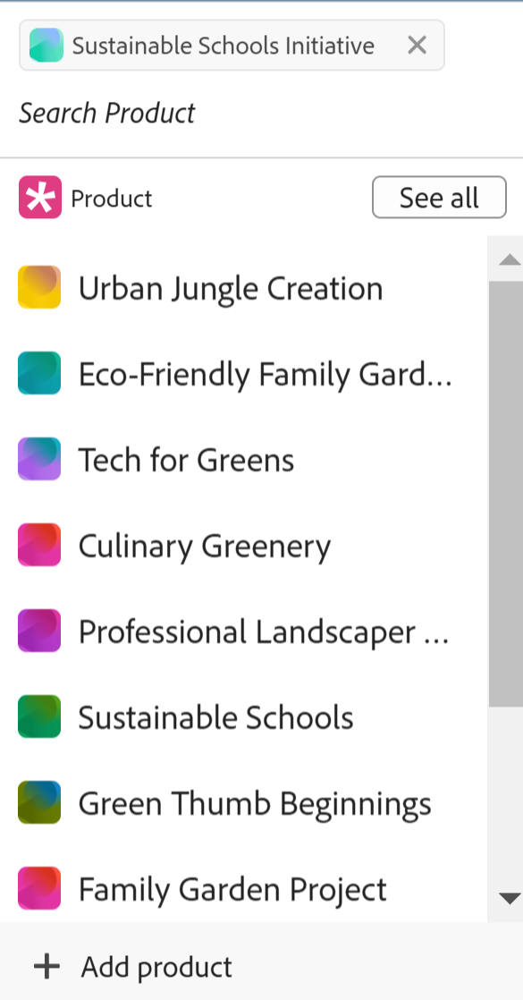

1. 次のいずれかの操作を行います。

   * リストから接続されているレコードの名前をクリックして、選択したレコードに追加します。レコードは自動的に追加されます。
   * レコードの名前の入力を開始し、リストに名前が表示されたら選択します。レコードは自動的に追加されます。

   >[!TIP]
   >
   >レコードタイプが接続されたときに表示するようにレコードの画像のみが選択されている場合、接続されたフィールドにはレコードのサムネールまたはアイコンのみが表示されます。 詳しくは、[レコードタイプの接続](/help/quicksilver/planning/architecture/connect-record-types.md)を参照してください。
   >

1. （条件付き）レコードタイプを接続するときに、接続タイプに「1対1または1対1を選択し、他の場所にすでに接続されているレコードまたはオブジェクトを接続しようとすると、もう一度接続すると元の接続から削除されるという警告が表示されます。 **Connect**&#x200B;をクリックして、削除を許可してレコードを接続するか、**キャンセル**&#x200B;をクリックしてフィールドに戻り、別のレコードを選択します。
1. （オプション）接続するオブジェクトが見つからず、追加する場合は、**+追加**&#x200B;をクリックします

   または

   オブジェクトの名前を入力し、**+ Add**&#x200B;をクリックして作成および追加します。

   詳しくは、[&#x200B; レコードを作成](/help/quicksilver/planning/records/create-records.md)の記事の「他のレコードからレコードを接続する際にレコードを作成する」の節を参照してください。

   >[!TIP]
   >
   >    レコードのページを開き、テーブルビューで次の操作を行うことで、他のレコードを接続できます。
   >1. ビューでレコードの名前をクリックします。
   >1. リンクされたレコードフィールドを見つけ、フィールドをダブルクリックします（すでに接続されているレコードがある場合）
   >または
   >**レコードを接続** （フィールドが空の場合）をクリックして、接続されたレコードまたはオブジェクトタイプからレコードを追加します。
   >
   >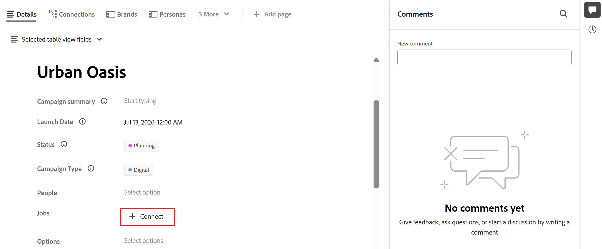

1. （オプション）すべてのレコードを表示するには、**すべてを表示**&#x200B;をクリックします。

1. （条件付き）前の手順で「**すべて表示**」をクリックした場合、「**オブジェクトを接続**」ボックスが表示されます。

   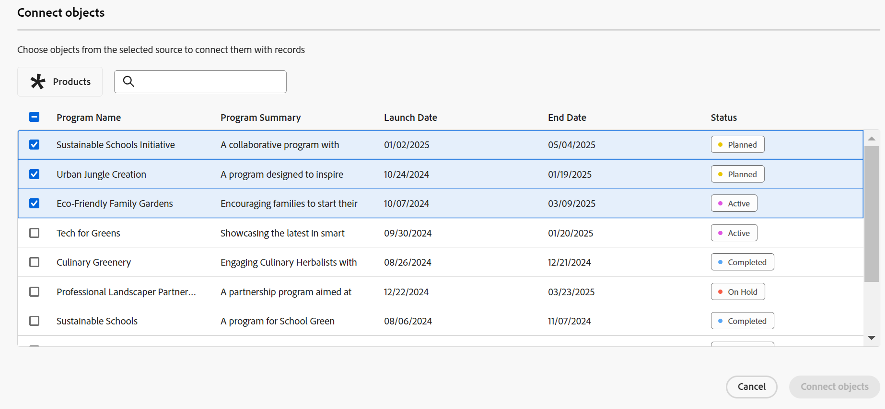

1. 検索ボックスにレコード名を入力していき、リストに表示されたら選択します

   または

   ボックス内で1つまたは複数のレコードの名前を選択し、**オブジェクトを接続**&#x200B;をクリックします。

   以下が追加されます。

   * リンクされたレコードは、前の手順で選択したレコードの「リンクされたレコード」フィールドに表示されます。
   * レコードタイプを接続したときにリンクされたルックアップフィールドを追加した場合、リンクされたフィールドには、リンクされたレコードからの情報が入力されます。

   リンクされたレコードを更新すると、リンク元のレコードのリンクされたフィールドも自動的に更新されます。リンクされたフィールドは手動で編集できません。

   >[!TIP]
   >
   >* 「リンクされたフィールド」と「ルックアップフィールド」は同じ意味で使用されます。
   >
   >* レコードタイプを接続するときに複数のレコードを接続することを選択した場合、複数のオブジェクトのフィールド値はコンマで区切って表示されるか、レコードタイプを接続するときに選択した集計器に従って集計されます。
   >
   >* Workfront オブジェクトの日付フィールド情報は、Workfrontでの表示方法に関係なく、Workfront Planningでは24時間形式で表示されます。
   >
   >   例えば、プロジェクトの予定開始日がWorkfrontで午後3:00と表示される場合、読み込まれたルックアップフィールドにWorkfront Planningで15:00と表示されます。

1. （オプション）レコードタイプページを閉じて、選択したワークスペースに移動します。
1. リンク先のレコードタイプのカードをクリックします。

   例えば、**キャンペーン**&#x200B;レコードを製品レコードに接続した場合は、**製品**&#x200B;カードをクリックします。

   レコードタイプのカードがテーブルビューで開きます。 そうでない場合は、テーブルビューを選択します。

   **キャンペーン**&#x200B;にリンクされたレコードフィールドには、製品レコードタイプのページで製品にリンクしたキャンペーンの名前が表示されます。キャンペーン情報を更新すると、製品レコードタイプのキャンペーンにリンクされたレコードフィールドが自動的に更新されます。

### Workfront計画レコードを、レコードのテーブルビューまたは詳細領域からWorkfront オブジェクトに接続します

<!--when we will have more applications to link to from Planning, change the title to something like: Connect Workfront Planning records to objects from other applications-->

レコードタイプとWorkfront オブジェクトタイプの間に接続を作成した後、個々のレコードをWorkfrontのオブジェクトに接続できます。 接続した Workfront フィールドは、オブジェクトのリンク元のレコードに自動的に入力されます。

>[!NOTE]
>
>Workfront オブジェクトタイプを、WorkfrontのWorkfront計画レコードタイプに接続することはできません。

{{step1-to-planning}}

1. レコードを接続するワークスペースをクリックします。

   ワークスペースが開き、レコードタイプがカードとして表示されます。
1. レコードタイプのカードをクリックして、レコードタイプページを開きます。
1. **ビュー**&#x200B;ドロップダウンメニューから&#x200B;**テーブル**&#x200B;ビューを選択します。

1. 「**新規レコード**」をクリックして、選択したレコードタイプに個別のレコードを追加します。詳しくは、[レコードの作成](/help/quicksilver/planning/records/create-records.md)を参照してください。

1. （条件付き）選択したレコードタイプをWorkfront オブジェクトタイプに接続した後、レコードの接続されたフィールドに移動して、フィールドをクリックするか、**Connect**&#x200B;をクリックしてWorkfront オブジェクトを追加します。

   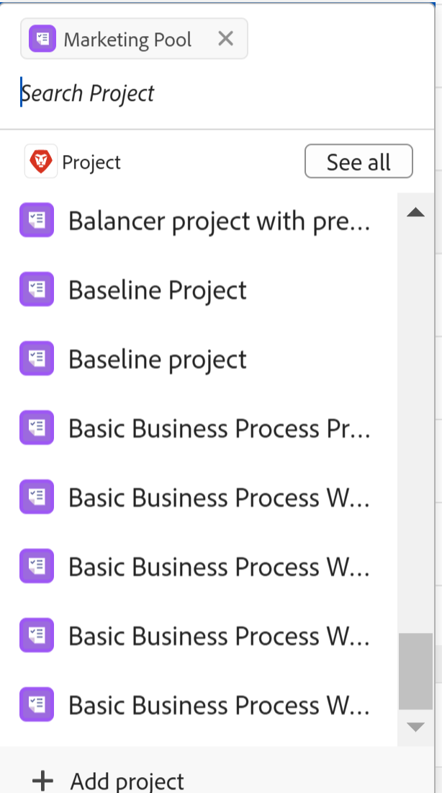

1. 次のいずれかの操作を行います。

   * リストからオブジェクトをクリックして、選択したレコードに追加します。オブジェクトはアルファベット順にリストされます。オブジェクトは自動的に追加されます。
   * オブジェクトの名前の入力を開始し、リストに名前が表示されたらクリックします。オブジェクトは自動的に追加されます。

   >[!TIP]
   >
   >ビューからレコードのページを開いたり、リンクされたレコードフィールドをダブルクリックしたり、フィールドの&#x200B;**Connect**&#x200B;をクリックして、接続されたオブジェクトタイプからオブジェクトを追加したりできます。

1. （オプション）接続するオブジェクトが見つからず、追加する場合は、**+追加**&#x200B;をクリックします

   または

   オブジェクトの名前を入力し、**+ Add**&#x200B;をクリックして、新しいプロジェクト、ポートフォリオ、またはプログラムを作成および追加します。

   詳しくは、[Workfront PlanningからのWorkfront オブジェクトの作成](/help/quicksilver/planning/records/create-workfront-objects-from-workfront-planning.md)を参照してください

1. （オプション）「**すべてを表示**」をクリックして、少なくとも表示権限を持つすべてのオブジェクトを表示します。

   前の手順で&#x200B;**すべてを表示**&#x200B;をクリックすると、**オブジェクトを接続** ボックスが表示されます。

   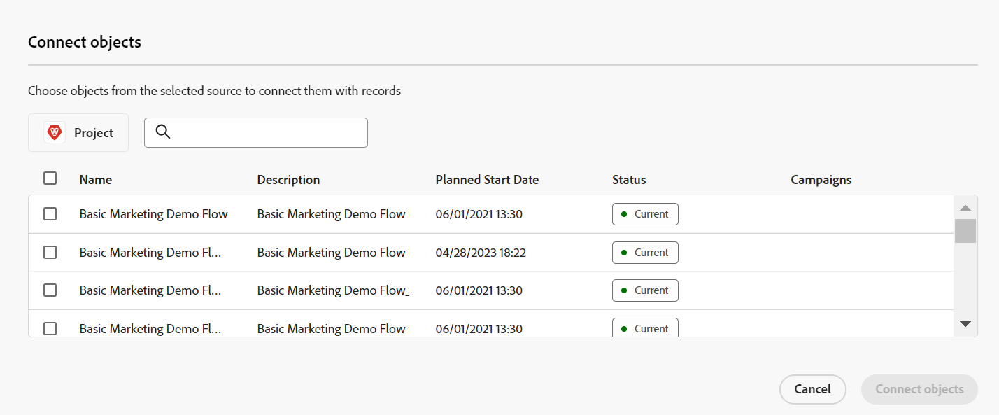

1. 検索ボックスに Workfront オブジェクト名を入力していき、リストに表示されたら選択します

   または

   ボックス内の1つまたは複数のオブジェクトの名前を選択し、**オブジェクトを接続**&#x200B;をクリックします。

   >[!IMPORTANT]
   >
   >* 表示のアクセス権限のある Workfront オブジェクトのみを追加できます。
   >
   >* Workfront オブジェクトを追加すると、ワークスペースに対する表示権限以上の権限を持つすべてのユーザーは、Workfront での権限やアクセス権に関係なく、Workfront オブジェクトとそのフィールド情報を表示できるようになります。

   次のものが追加されます。

   * 選択した Workfront オブジェクトが、リンクされたレコードフィールドに追加されます。
   * レコードタイプを Workfront に接続するときにこれらを追加した場合、Workfront オブジェクトのリンクされたフィールド（またはルックアップフィールド）には、Workfront からの情報が自動的に入力されます。

   レコードタイプと別のアプリケーションのオブジェクトの接続について詳しくは、[レコードタイプの接続](/help/quicksilver/planning/architecture/connect-record-types.md)を参照してください。

1. （オプション）テーブルビューのリンクされたフィールド、またはレコードページのリンクされたフィールドで、Workfront Planning レコードに接続されている Workfront オブジェクトの名前をクリックします。

   少なくともオブジェクトに対する表示権限がある場合は、WorkfrontでWorkfront オブジェクトが開きます。

   >[!TIP]
   >
   >* レコードタイプを接続する際に複数のレコードを接続することを選択した場合、ルックアップフィールドの値はコンマで区切って表示されるか、選択したアグリゲータに従って集計されます。
   >
   >* Workfront のリンクされた Workfront オブジェクトに対して、リンクされたレコードフィールドは作成されません。

1. （オプション）レコードタイプのテーブルビューで、リンクされた Workfront オブジェクトの列ヘッダーにポインタを合わせ、ドロップダウンメニューをクリックして、「**ルックアップフィールドを編集**」をクリックします。

1. **選択されていないフィールド**&#x200B;エリアから Workfront オブジェクトフィールドを追加します。

   または

   **選択されたフィールド**&#x200B;エリアから、Workfront オブジェクトフィールドを削除します。

   これにより、リンクされたフィールドが Workfront Planning レコードに追加または削除されます。削除されたフィールドに関連付けられた情報は Workfront に残ります。

### Workfront計画レコードを、レコードのテーブルビューまたは詳細領域からAdobe Experience Manager オブジェクトに接続します

<!--
when we will have more applications to link to from Planning, change the title to something like: Connect Workfront Planning records to objects from other applications
-->

<!--
No longer needed to specify: 
>[!IMPORTANT]
>
>You must have an Adobe Experience Manager license, and your organization's instance of Workfront must be onboarded to the Adobe Business Platform or the Adobe Admin Console to be able to connect Workfront Planning records to Adobe Experience Manager.
>
>If you have questions about onboarding to the Adobe Admin Console, see the [Adobe Unified Experience FAQ](/help/quicksilver/workfront-basics/navigate-workfront/workfront-navigation/unified-experience-faq.md).
-->

レコードタイプとAdobe Experience Manager オブジェクトの間に接続を作成した後、個々のレコードをExperience Manager オブジェクトに接続できます。 Experience Managerから接続したアセットフィールドは、リンク元のレコードタイプに自動的に入力されます。

>[!NOTE]
>
>プランニングレコードとそのフィールドには、Workfront管理者がWorkfrontとAdobe Experience Manager Assetsの統合を通じてメタデータマッピングを設定すると、Experience Manager Assetsからアクセスできます。 詳しくは、[Adobe WorkfrontとExperience Manager Assets間のアセットメタデータマッピングの設定](https://experienceleague.adobe.com/en/docs/experience-manager-cloud-service/content/assets/integrations/configure-asset-metadata-mapping)を参照してください。

<!--
metadata mapping is not available yet for content fragments - as of April 22, 2026. Syuzanna said the mapping is available just for GenS workspace, but checking again with her and Isk.
-->

レコードをExperience Manager オブジェクトに接続するには：

{{step1-to-planning}}

1. レコードを接続するワークスペースをクリックします。

   ワークスペースが開き、レコードタイプが表示されます。
1. レコードタイプのカードをクリックして、レコードタイプのページを開きます。
1. レコードタイプページの左上隅にある「**表示**」ドロップダウンメニューから「**テーブル**」ビューを選択します。

1. （オプション）「**新規レコード**」をクリックして、選択したレコードタイプに新規レコードを追加します。詳しくは、[レコードの作成](/help/quicksilver/planning/records/create-records.md)を参照してください。
1. （条件付き）選択したレコードタイプをExperience Manager オブジェクトに接続した後、レコードの接続されたフィールドに移動して、フィールドをクリックするか、**Connect**&#x200B;をクリックしてExperience Manager オブジェクトをレコードに追加し、**+** アイコンをクリックします。

   >[!TIP]
   >
   >  レコードの詳細ページのリンクされたオブジェクトフィールドの&#x200B;**+** アイコンをクリックして、アセットをレコードに接続できます。

   コンテンツアドバイザーボックスが表示されます。

   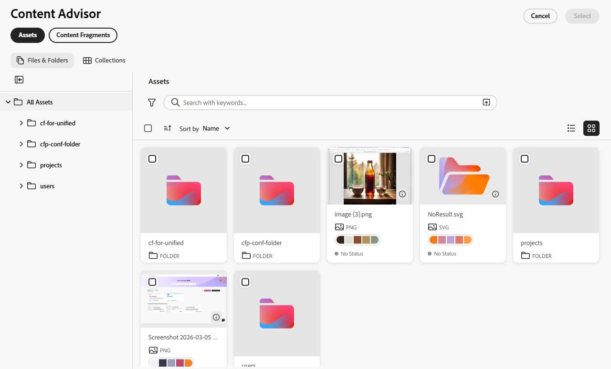

   <!--
    The **Select Assets** box displays. we might change this to Connect assets.
    -->

   <!--
    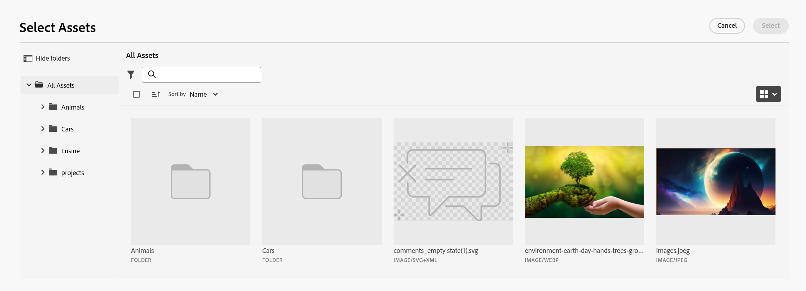
    -->

1. 「**Assets**」タブで、次の種類のアセットをクリックして選択します。

   * 画像
   * フォルダー

   複数のアセットを選択できます。

   >[!IMPORTANT]
   >
   > 接続できるのは、Experience Manager で表示するアクセス権のあるアセットのみです。接続すると、すべての Workfront Planning ユーザーは、Experience Manager Assets へのアクセス権に関係なく、Workfront Planning でアセットを表示できます。
   > Content Advisorについて詳しくは、[Content Advisorを使用してAdobe アプリケーションのAEM コンテンツにアクセスする](https://experienceleague.adobe.com/en/docs/experience-manager-cloud-service/content/assets/manage/content-advisor-adobe-applications){target="_blank"}を参照してください。

1. 「**コンテンツフラグメント**」タブから、「コンテンツフラグメント」を選択して、リンクされたレコードフィールドに追加します。

   コンテンツフラグメントについて詳しくは、[&#x200B; コンテンツアドバイザーを使用してAdobe アプリケーションのAEM コンテンツにアクセス &#x200B;](https://experienceleague.adobe.com/en/docs/experience-manager-cloud-service/content/assets/manage/content-advisor-adobe-applications){target="_blank"}を参照してください。

1. アセットまたはコンテンツフラグメントの選択が完了したら、**選択**&#x200B;をクリックします。<!-- we might change this to Connect-->

   次のものが追加されます。

   * 選択したExperience Manager アセットまたはコンテンツフラグメントが、リンクされたレコードフィールドに追加されます。
   * リンクされたフィールド（またはルックアップフィールド）には、Experience Managerに接続されたオブジェクトからの情報が入力されます。

     Experience Manager アセットまたはコンテンツフラグメントのフィールドに含まれている既存の情報は、リンクされたフィールドまたはルックアップフィールドに自動的に表示されます。<!--verifying of fragments also share lookup fields - not sure from the UI available-->

     >[!TIP]
     >
     >* レコードタイプを接続する際に複数のレコードを接続するように選択すると、複数のオブジェクトの値がカンマで区切られるか、選択した集計器に従って集計されて表示されます。
     >
     >* Workfront Planning にリンクされたレコードへのリンクされたレコードフィールドは、Experience Manager Assets アプリケーションのリンクされた Experience Manager アセットに対しては作成されません。

1. （オプションおよび条件付き）アセットの場合は、Experience Managerにリンクしたレコードタイプに移動し、リンクされたレコードフィールドでアセットの名前をクリックします。 アセットの Experience Manager の詳細がポップアップウィンドウに表示されます。<!--not sure if this is also possible for fragments??-->

   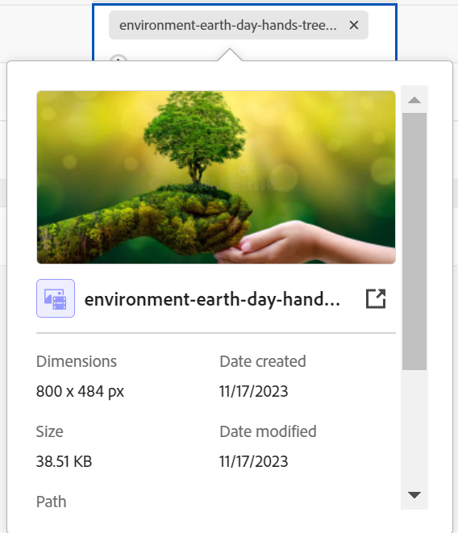

   画像ファイルには、次のフィールドが表示されます。

   * 画像のサムネール
   * 画像ファイル名
   * 寸法
   * サイズ
   * 説明
   * Experience Manager のファイルパス
   * アセットタイプ
   * 作成日
   * 変更日時

1. （オプションおよび条件付き）アセットの場合、Experience ManagerでExperience Manager アセットのレコードページを開くには、リンク元のレコードのレコードタイプページに移動し、リンクされたレコードフィールドのアセットの名前をクリックしてポップアップウィンドウを開き、**AEMで開く** アイコン をクリックしてアセットを開きます。<!--not sure if this is also possible for fragments??-->

   これにより、Adobe Experience Manager Assets で Experience Manager のアセットが開きます。

1. （オプションおよび条件付き）アセットの場合、レコードタイプのテーブルビューで、リンクされたExperience Manager アセットの列見出しにカーソルを合わせてドロップダウンメニューをクリックし、**ルックアップフィールドを編集**&#x200B;をクリックします。<!--not sure if this is also possible for fragments??-->

1. **未選択フィールド**&#x200B;領域<!--not sure if this is also possible for fragments??-->からExperience Manager Assets オブジェクトフィールドを追加します

   または

   **選択されたフィールド**&#x200B;エリアから、Workfront オブジェクトフィールドを削除します。

   これにより、リンクされたフィールドがレコードに追加または削除されます。削除されたフィールドに関連付けられた情報は、Adobe Experience Assets に残ります。

### Workfront計画レコードを、レコードページの「接続」タブから他のレコードまたはオブジェクトに接続します

1. 他のPlanning レコード・タイプまたは他のアプリケーションのオブジェクト・タイプに接続されているレコード・タイプの任意のビューに移動します。
1. 前のサブセクションで説明した手順に従って、他のレコードまたはオブジェクトと接続するビュー内のレコードを見つけます。
1. レコードの名前をクリックします。

   プレビューページが開きます。
1. （オプション）「**新しいタブで開く**」アイコン「」をクリックして、新しいブラウザータブでレコードのページを開きます。
1. （オプションおよび条件付き）レコードページヘッダーのパンくずリストにあるレコードタイプの名前をクリックして、同じ階層内の別のレコードタイプにアクセスします。 階層は、接続しているレコードのレコードタイプに存在する必要があります。その場合、階層をパンくずリストで表示できます。 詳しくは、[&#x200B; ワークスペース階層の作成](/help/quicksilver/planning/architecture/create-workspace-hierarchies.md)を参照してください。
1. レコードのプレビューまたはページの「**接続**」タブをクリックします。

   Workfront Planning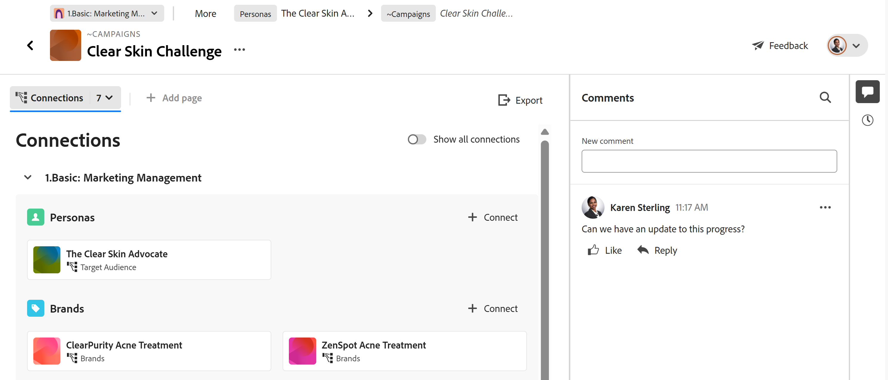接続」タブ

   選択したレコードタイプにリンクされているすべてのレコードタイプまたはオブジェクトタイプは、セクションとして表示されます。 接続されたレコードまたはオブジェクトは、カード上のレコードまたはオブジェクトタイプ名の下に表示されます。

   >[!TIP]
   >
   >    個々のレコードが接続された接続レコードのみが、デフォルトで表示されます。

1. （オプション）「**すべての接続を表示**」をクリックして、接続されたすべてのレコードタイプを表示します。これには、接続されたレコードがないレコードタイプも含まれます。

1. （オプション）セクションの左側にある下向き矢印をクリックして、セクションを折りたたみます。

1. （条件付き） **Connect**&#x200B;をクリックして、同じタイプのレコードまたはオブジェクトをさらに追加します。
1. （オプション）接続するレコードまたはオブジェクトが見つからない場合は、「**+ Add**」をクリックします

   または

   オブジェクトの名前を入力し、**+ Add**&#x200B;をクリックして作成し、レコードに追加します。

   詳しくは、[&#x200B; レコードを作成](/help/quicksilver/planning/records/create-records.md)の記事の「他のレコードからレコードを接続する際にレコードを作成する」の節を参照してください。
1. 前の節で説明した手順に従って、Workfront PlanningのレコードまたはWorkfrontまたはExperience Manager Assetsのオブジェクトを接続します。
レコードとオブジェクトがすぐに追加されます。
1. （オプション）レコードまたはオブジェクトの接続されたカードにカーソルを合わせ、**レコードの切断** アイコン 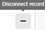をクリックして、選択したレコードから接続を解除します。

   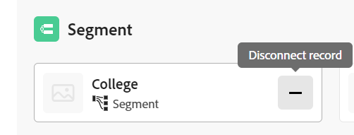

   レコードは、Workfront Planningのすべての領域から、または接続されているとして表示される可能性がある他のアプリケーションから、すぐに切断されます。 ルックアップフィールドの値も削除されます。

### レコードの接続レコードページからレコードを接続します

1. 他のPlanning レコード・タイプまたは他のアプリケーションのオブジェクト・タイプに接続されているレコード・タイプの任意のビューに移動します。
1. 前のサブセクションで説明した手順に従って、他のレコードまたはオブジェクトと接続するビュー内のレコードを見つけます。
1. レコードの名前をクリックします。

   プレビューページが開きます。
1. （オプション）「**新しいタブで開く**」アイコン「」をクリックして、レコードのページを開きます。
1. レコードのページで、既存の&#x200B;**接続されたレコードのページ** タブをクリックします。 最初に&#x200B;**接続レコードページ**&#x200B;を作成する必要があります。

   接続されたレコードタイプページがテーブルビューに表示されます。

   1つのタイプのすべての接続されたレコードがテーブルに表示されます。

   >[!TIP]
   >
   >接続されたレコード ページで表示するには、接続されたレコードを現在のレコードに追加する必要があります。

1. レコードのリストで&#x200B;**Connect**&#x200B;をクリックするか、プロジェクトのリストで&#x200B;**Connect レコード**&#x200B;をクリックして、既存のレコードまたはプロジェクトを追加または削除します。

   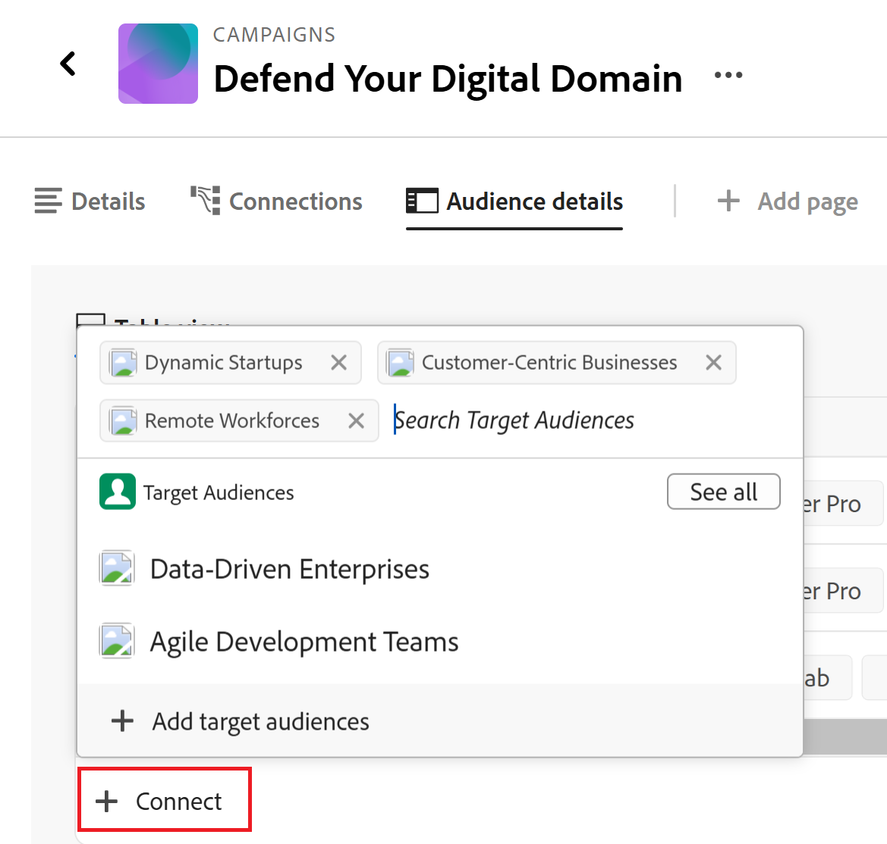

   詳しくは、[接続されたレコードの追加ページをレコード &#x200B;](/help/quicksilver/planning/records/add-a-connected-records-page-to-a-record.md)に参照してください。
1. プロジェクトのリストの&#x200B;**新しい行**&#x200B;をクリックして、テンプレートなしでプロジェクトを作成します。 新しいプロジェクトは、現在のレコードに自動的に接続されます。
1. （オプション）接続されたレコードが見つからない場合は、**+追加**&#x200B;をクリックして作成し、接続します。

## Workfront オブジェクトからのレコードの接続

Workfront オブジェクトからWorkfront計画レコードを接続するには、次のものが必要です。

* Workfront Planningで確立されたレコードタイプとWorkfront オブジェクトタイプの間の接続。
* Workfrontまたはグループ管理者は、次のいずれかをWorkfront オブジェクトタイプに追加する必要があります。

   * レイアウトテンプレート内のWorkfront プロジェクト、ポートフォリオ、およびプログラムの計画セクション。

   * Planningは、次のいずれかのオブジェクトのカスタムフォームにカスタムフィールドを接続します。

      * プロジェクト
      * ポートフォリオ
      * プログラム
      * グループ
      * 会社

  詳しくは、[Workfront オブジェクトからのレコード接続の管理](/help/quicksilver/planning/records/manage-records-in-planning-section.md)を参照してください。
