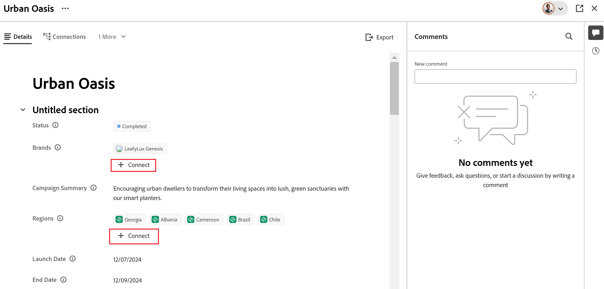

<!--when you make this live, update the metadata above to this: 
---
title: Connect records and objects
description: In addition to connecting records to one another, you can also connect records to objects from other applications.  
topic: Architecture
role: User
hidefromtoc: yes
hide: yes
---
-->
<!--update the metadata with real information when making this available in TOC and in the left nav-->

<!--if you change steps here, also update steps in the "Connect records" article-->

# レコードの接続

{{planning-important-intro}}

Adobe Workfront Planning レコードを相互に接続したり、他のアプリケーションのオブジェクトに接続したりできます。

この記事では、レコードを接続する方法について説明します。 レコードの接続に関する一般的な情報については、[ 接続されたレコードの概要 ](/help/quicksilver/planning/records/connected-records-overview.md) を参照してください。

まず、2 つのレコードタイプを相互に接続するか、レコードタイプを別のアプリケーションのオブジェクトタイプに接続する必要があります。これにより、リンクされたレコードフィールドが作成されます。その後、リンクされたレコードフィールドを使用して、レコードを相互に接続したり、他のアプリケーションの他のオブジェクトに接続したりできます。

レコードの接続は、レコードを別のアプリケーションのオブジェクトに接続することと似ています。

レコードタイプの相互の接続や、レコードタイプの他のアプリケーションのオブジェクトタイプへの接続について詳しくは、[レコードタイプの接続](/help/quicksilver/planning/architecture/connect-record-types.md)を参照してください。

レコードタイプを連結する例については、[レコードタイプとレコードの連結例](/help/quicksilver/planning/architecture/example-connect-record-types-and-records.md)を参照してください。

以下を連結することができます。

* Adobe Workfront Planning レコード
* 他のアプリケーションからのオブジェクトを含む Adobe Workfront Planning レコード。

  次のアプリケーションから、レコードを以下にリストされているタイプのオブジェクトに接続できます。

   * Adobe Workfront

      * プロジェクト
      * ポートフォリオ
      * プログラム
      * 会社
      * グループ

   * Adobe Experience Manager Assets

      * 画像ファイル
      * フォルダー

  <!--when you add more objects, fix the Access Requirements below which right now refer only to projects-->

## アクセス要件

+++ 展開すると、Workfront Planning のアクセス要件が表示されます。

<table style="table-layout:auto">
 <col>
 </col>
 <col>
 </col>
 <tbody>
    <tr>
<tr>
<td>製品
 </td>
   <td>
   
 Adobe Workfront
 
   
Adobe Workfront Planning レコードをExperience Manager Assetsに接続するには、Adobe Experience Manager Assets ライセンスが必要で、組織のWorkfront インスタンスがAdobeの Unified Experience にオンボーディングされている必要があります。 詳しくは、<a href="/help/quicksilver/workfront-basics/navigate-workfront/workfront-navigation/adobe-unified-experience.md">WorkfrontのAdobe統合エクスペリエンス </a> を参照してください。

   </td>
  </tr>  
 <td role="rowheader">
Adobe Workfront 契約
</td>
   <td>

Workfront Planning の早期アクセス段階に登録されている必要があります 

   </td>
  </tr>
  <tr>
   <td role="rowheader">
Adobe Workfront プラン
</td>
   <td>

任意

   </td>
  </tr>
  <tr>
   <td role="rowheader">
Adobe Workfront プラン*
</td>
   <td>
   
新規：標準

   
現在：プラン
 
  </td>
  </tr>

<tr>
   <td role="rowheader">
アクセスレベルの設定
</td>
   <td> 
Workfront Planning に対するアクセスレベルのコントロールはありません
  
</td>
  </tr>
<tr>
   <td role="rowheader">
権限
</td>
   <td> 
レコードを接続するワークスペースへの権限を管理 
  
   
ワークスペースに対する表示以上の権限。他のアプリケーションでのアクセス権に関係なく、他のアプリケーションからのオブジェクトおよびフィールドに対するすべての接続を表示します。 

   
WorkfrontまたはExperience Manager Assetsからリンクするオブジェクトに対する表示以上の権限。 

   
システム管理者は、自分が作成したものでないものも含めて、すべてのワークスペースに対する権限を持っています。

</td>
  </tr>

<tr>
   <td role="rowheader">
レイアウトテンプレート
</td>
   <td> 
Workfront 管理者やグループ管理者は、レイアウトテンプレートに Planning エリアを追加する必要があります。詳しくは、<a href="/help/quicksilver/planning/access/access-overview.md">アクセス権の概要</a>を参照してください。 
  
</td>
  </tr>

</tbody>
</table>

*詳しくは、[Workfront ドキュメントのアクセス要件](/help/quicksilver/administration-and-setup/add-users/access-levels-and-object-permissions/access-level-requirements-in-documentation.md)を参照してください。

+++

<!--Maybe enable this at GA - but Planning is not supposed to have Access controls in the Workfront Access Level: 
>[!NOTE]
>
>If you don't have access, ask your Workfront administrator if they set additional restrictions in your access level. For information on how a Workfront administrator can change your access level, see [Create or modify custom access levels](/help/quicksilver/administration-and-setup/add-users/configure-and-grant-access/create-modify-access-levels.md). -->

## レコードを接続するための前提条件

レコードを他のレコードまたはオブジェクトと接続するには、次の条件を満たす必要があります。

* 少なくとも 1 つのワークスペース、レコードタイプおよびレコード。

  詳しくは、次の記事を参照してください。

   * [ワークスペースの作成](/help/quicksilver/planning/architecture/create-workspaces.md)
   * [レコードタイプの作成](/help/quicksilver/planning/architecture/create-record-types.md)
   * [レコードの作成](/help/quicksilver/planning/records/create-records.md)

* レコードタイプ間の接続や、レコードタイプと他のアプリケーションからのオブジェクト間の接続。詳しくは、[レコードタイプの接続](/help/quicksilver/planning/architecture/connect-record-types.md)を参照してください。

## Workfront Planning からレコードを接続

次の領域で、Workfront Planning のレコードを関連付けることができます。

* テーブルビューの接続されたフィールドのWorkfront Planning の Planning レコードから。
* レコードのプレビューまたは接続されたレコードフィールドのページで、Workfront Planning の計画レコードから。
  <!--
  * From a Planning record in Workfront Planning in the record preview or page in the connected record fields on the Details tab.
  * From a Planning record in the record's preview or page on the Connections tab.  -->

### テーブル表示または <!--Details tab of the--> ールレコードページからAdobe Workfront Planning レコードを接続

{{step1-to-planning}}

1. レコードを接続するワークスペースをクリックします

   ワークスペースが開き、レコードタイプがカードとして表示されます。
1. レコードタイプのカードをクリックして、レコードタイプのページを開きます。
1. **テーブル** ビューの名前をクリックして開きます。
1. （オプション）テーブルに新しい行を追加して、選択したレコードタイプにレコードを追加します。詳しくは、[レコードの作成](/help/quicksilver/planning/records/create-records.md)を参照してください。
1. （条件付き）選択したレコードタイプを別のレコードタイプに接続した後、リンクされたレコード列に移動し、他のレコードとリンクするレコードに対応するセルをダブルクリックします。

   

1. 次のいずれかの操作を行います。

   * リストから接続されているレコードの名前をクリックして、選択したレコードに追加します。レコードは自動的に追加されます。
   * レコードの名前の入力を開始し、リストに名前が表示されたら選択します。レコードは自動的に追加されます。

   <!--1. (Optional) If you cannot find a record to connect, and you want to add it, click **+ Add** to add a new record. For more information, see the "Create records by connecting them" in the article [Create records](/help/quicksilver/planning/records/create-records.md). -->

   >[!TIP]
   >
   >    レコードのページを開くには、ビュー内のレコード名をクリックするか、リンクされたレコード フィールドを検索してフィールド （既に接続されているレコードがある場合）をダブルクリックするか、または **レコードの接続** （フィールドが空の場合）をクリックして、接続されたレコードまたはオブジェクト タイプからレコードを追加します。
   >
   >

1. （任意）すべてのレコードを表示するには、「**すべて表示**」をクリックします。

1. （条件付き）前の手順で「**すべて表示**」をクリックした場合、「**オブジェクトを接続**」ボックスが表示されます。

   

1. 検索ボックスにレコード名を入力していき、リストに表示されたら選択します

   または

   ボックス内の 1 つまたは複数のレコードの名前を選択し、[**オブジェクトを接続**] をクリックします。

   以下が追加されます。

   * リンクされたレコードは、前の手順で選択したレコードの「リンクされたレコード」フィールドに表示されます。
   * レコードタイプを接続したときにリンクされたルックアップフィールドを追加した場合、リンクされたフィールドには、リンクされたレコードからの情報が入力されます。

   リンクされたレコードを更新すると、リンク元のレコードのリンクされたフィールドも自動的に更新されます。リンクされたフィールドは手動で編集できません。

   >[!TIP]
   >
   >* 「リンクされたフィールド」と「ルックアップフィールド」は同じ意味で使用されます。
   >
   >* レコードタイプを接続する際に&#x200B;**複数のレコードを許可**&#x200B;設定を有効にした場合、選択した複数のオブジェクトのフィールドの値がコンマで区切られて表示されるか、選択したアグリゲータに従って集計されます。

1. （オプション）レコードタイプページを閉じて、選択したワークスペースに移動します。
1. リンク先のレコードタイプのカードをクリックします。

   例えば、**キャンペーン**&#x200B;レコードを製品レコードに接続した場合は、**製品**&#x200B;カードをクリックします。

   レコードタイプのカードがテーブルビューで開きます。そうでない場合は、テーブルビューを選択します。

   **キャンペーン**&#x200B;にリンクされたレコードフィールドには、製品レコードタイプのページで製品にリンクしたキャンペーンの名前が表示されます。キャンペーン情報を更新すると、製品レコードタイプのキャンペーンにリンクされたレコードフィールドが自動的に更新されます。

### テーブル表示または <!--Details tab of the--> ールレコードページからAdobe Workfront Planning レコードをWorkfront オブジェクトに接続する

<!--when we will have more applications to link to from Planning, change the title to something like: Connect Workfront Planning records to objects from other applications-->

レコードタイプと Workfront オブジェクトタイプの間の接続を作成した後、個別のレコードを Workfront オブジェクトに接続できます。接続した Workfront フィールドは、オブジェクトのリンク元のレコードに自動的に入力されます。

>[!NOTE]
>
>Workfront オブジェクトタイプをWorkfrontのWorkfront Planning レコードタイプに関連付けることはできません。

{{step1-to-planning}}

1. レコードを接続するワークスペースをクリックします。

   ワークスペースが開き、レコードタイプがカードとして表示されます。
1. レコードタイプのカードをクリックして、レコードタイプページを開きます。
1. **ビュー**&#x200B;ドロップダウンメニューから&#x200B;**テーブル**&#x200B;ビューを選択します。

1. 「**新規レコード**」をクリックして、選択したレコードタイプに個別のレコードを追加します。詳しくは、[レコードの作成](/help/quicksilver/planning/records/create-records.md)を参照してください。
1. （条件付き）選択したレコードタイプを Workfront オブジェクトタイプに接続した後、リンクされたオブジェクト列に移動し、Workfront のオブジェクトにリンクするレコードに対応するセルをダブルクリックします。

   

1. 次のいずれかの操作を行います。

   * リストからオブジェクトをクリックして、選択したレコードに追加します。オブジェクトはアルファベット順にリストされます。オブジェクトは自動的に追加されます。
   * オブジェクトの名前の入力を開始し、リストに名前が表示されたらクリックします。オブジェクトは自動的に追加されます。

   >[!TIP]
   >
   >ビューからレコードのページを開き、リンクされたレコードフィールドをダブルクリックするか、フィールドの **接続** をクリックして、接続されたオブジェクトタイプからオブジェクトを追加できます。

1. （オプション）「**すべて表示**」をクリックすると、少なくとも表示権限を持つすべてのオブジェクトが表示されます。

1. （条件付き）前の手順で「**すべて表示**」をクリックした場合、「**オブジェクトを接続**」ボックスが表示されます。

   

1. 検索ボックスに Workfront オブジェクトの名前の入力を開始し、リストに名前が表示されたら選択します。

   または

   ボックス内の 1 つまたは複数のオブジェクトの名前を選択し、**オブジェクトを接続** をクリックします。

   >[!IMPORTANT]
   >
   >* 表示のアクセス権限のある Workfront オブジェクトのみを追加できます。
   >
   >* Workfront オブジェクトを追加すると、ワークスペースに対する表示権限以上の権限を持つすべてのユーザーは、Workfront での権限やアクセス権に関係なく、Workfront オブジェクトとそのフィールド情報を表示できるようになります。

   次のものが追加されます。

   * 選択した Workfront オブジェクトが、リンクされたレコードフィールドに追加されます。
   * レコードタイプを Workfront に接続するときにこれらを追加した場合、Workfront オブジェクトのリンクされたフィールド（またはルックアップフィールド）には、Workfront からの情報が自動的に入力されます。

   レコードタイプと別のアプリケーションのオブジェクトの接続について詳しくは、[レコードタイプの接続](/help/quicksilver/planning/architecture/connect-record-types.md)を参照してください。

1. （オプション）テーブルビューのリンクされたフィールド、またはレコードページのリンクされたフィールドで、Workfront Planning レコードに接続されている Workfront オブジェクトの名前をクリックします。

   少なくともオブジェクトに対する表示権限がある場合、これによりWorkfrontにWorkfront オブジェクトが開きます。

   >[!TIP]
   >
   >* 「複数のレコードを許可」する設定を有効にすると、ルックアップフィールドの値がカンマで区切られて表示されるか、選択したアグリゲータに従って集計されます。
   >
   >* Workfront のリンクされた Workfront オブジェクトに対して、リンクされたレコードフィールドは作成されません。

1. （オプション）レコードタイプのテーブルビューで、リンクされた Workfront オブジェクトの列ヘッダーにポインタを合わせ、ドロップダウンメニューをクリックして、「**ルックアップフィールドを編集**」をクリックします。

1. **選択されていないフィールド**&#x200B;エリアから Workfront オブジェクトフィールドを追加します。

   または

   **選択されたフィールド**&#x200B;エリアから、Workfront オブジェクトフィールドを削除します。

   これにより、リンクされたフィールドが Workfront Planning レコードに追加または削除されます。削除されたフィールドに関連付けられた情報は Workfront に残ります。

### テーブル表示または <!--Details tab of the--> ールレコードページからWorkfront Planning レコードをAdobe Experience Manager オブジェクトに接続する

<!--when we will have more applications to link to from Planning, change the title to something like: Connect Workfront Planning records to objects from other applications-->

>[!IMPORTANT]
>
>Workfront Planning レコードを Adobe Experience Manager Assets に接続するには、Adobe Experience Manager Assets ライセンスが必要であり、組織の Workfront インスタンスが Adobe Business Platform または Adobe Admin Console にオンボーディングされている必要があります。
>
>Adobe Admin Console のオンボーディングについて質問がある場合は、[Adobe Unified Experience の FAQ](/help/quicksilver/workfront-basics/navigate-workfront/workfront-navigation/unified-experience-faq.md) を参照してください。

レコードタイプと Adobe Experience Manager Assets 間の接続を作成した後、個別のレコードを Experience Manager Assets に接続できます。接続の作成時に Experience Manager Assets から接続したアセットフィールドは、リンク元のレコードタイプで自動的に入力されます。

>[!NOTE]
>
>Planning レコードとそのフィールドには、Experience Manager AssetsとAdobe Experience Manager Assets間の統合を通じてWorkfront管理者がメタデータ・マッピングを構成する際に、Workfrontからアクセスできます。 詳しくは、[Adobe WorkfrontとExperience Manager Assets間のアセットメタデータのマッピングの設定 ](https://experienceleague.adobe.com/docs/experience-manager-cloud-service/content/assets/integrations/configure-asset-metadata-mapping.html?lang=ja) を参照してください。

レコードをAEM assets に接続するには：

{{step1-to-planning}}

1. レコードを接続するワークスペースをクリックします。

   ワークスペースが開き、レコードタイプが表示されます。
1. レコードタイプのカードをクリックして、レコードタイプのページを開きます。
1. レコードタイプページの右上隅にある&#x200B;**ビュー**&#x200B;ドロップダウンメニューから、**テーブル**&#x200B;ビューを選択します。

1. （オプション）「**新規レコード**」をクリックして、選択したレコードタイプに新規レコードを追加します。詳しくは、[レコードの作成](/help/quicksilver/planning/records/create-records.md)を参照してください。
1. （条件付き）選択したレコードタイプを Experience Manager Assets に接続した後、リンクされたオブジェクト列に移動し、Experience Manager の他のオブジェクトとリンクするレコードに対応するセルにポインタを合わせて、**+** アイコンをクリックします。

   >[!TIP]
   >
   >  レコードページのリンクされたオブジェクトフィールドにある **+** アイコンをクリックして、アセットをレコードに接続できます。

   「**アセットを選択**」ボックスが表示されます。<!--we might change this to Connect assets-->

   

1. 次のタイプのアセットのいくつかをクリックして選択します。

   * 画像
   * フォルダー

   複数のアセットを選択できます。

   >[!IMPORTANT]
   >
   > 接続できるのは、Experience Manager で表示するアクセス権のあるアセットのみです。接続すると、すべての Workfront Planning ユーザーは、Experience Manager Assets へのアクセス権に関係なく、Workfront Planning でアセットを表示できます。

1. 「**選択**」をクリックします。<!-- we might change this to Connect-->

   次のものが追加されます。

   * 選択した Experience Manager Assets が、リンクされたレコードフィールドに追加されます。
   * リンクされたフィールド（またはルックアップフィールド）には、Experience Manager に接続されたアセットからの情報が入力されます。

     Experience Manager Assets のフィールドからのすべての既存の情報は、リンクされたフィールドまたはルックアップフィールドに自動的に表示されます。

     >[!TIP]
     >
     >* 「複数のレコードを許可」する設定を有効にした場合、複数のオブジェクトの値がカンマで区切られて表示されるか、選択したアグリゲータに従って集計されて表示されます。
     >
     >* Workfront Planning にリンクされたレコードへのリンクされたレコードフィールドは、Experience Manager Assets アプリケーションのリンクされた Experience Manager アセットに対しては作成されません。

1. （オプション）Experience Manager Assets にリンクしたレコードタイプに移動し、リンクされたレコードフィールド内のアセットの名前をクリックします。アセットの Experience Manager の詳細がポップアップウィンドウに表示されます。<!--update screen shot with hi-rez picture-->

   

   画像ファイルには、次のフィールドが表示されます。

   * 画像のサムネール
   * 画像ファイル名
   * 寸法
   * サイズ
   * 説明
   * Experience Manager のファイルパス
   * アセットタイプ
   * 作成日
   * 変更日時

1. （オプション）Experience ManagerアセットのレコードページをExperience Managerで開くには、リンク元のレコードのレコードタイプページに移動し、「リンクされたレコード」フィールドでアセットの名前をクリックしてポップアップウィンドウを開き、「**AEMで開く**」アイコンをクリックしてアセットを開き  す。

   これにより、Adobe Experience Manager Assets で Experience Manager のアセットが開きます。

1. （オプション）レコードタイプのテーブルビューで、リンクされた Experience Manager のアセットの列ヘッダーにポインタを合わせ、ドロップダウンメニューをクリックし、「**ルックアップフィールドを編集**」を選択します。

1. **選択されていないフィールド**&#x200B;エリアから、Experience Manager Assets オブジェクトフィールドを追加します。

   または

   **選択されたフィールド**&#x200B;エリアから、Workfront オブジェクトフィールドを削除します。

   これにより、リンクされたフィールドがレコードに追加または削除されます。削除されたフィールドに関連付けられた情報は、Adobe Experience Assets に残ります。

<!--
### Connect Workfront Planning records from the Connections tab of the record page

1. Go to any view of a record type that has been connected to other record types or object types from other applications. 
1. Follow the steps described in the previous subsections to find a record in the view that you want to connect with other records or objects. 
1. Click the name of a record. 

    The preview page opens. 
1. (Optional) Click the **Open in new tab** icon  to open the record's page. 
1. Click the **Connections** tab in the record's preview or page. 

    

    All record or object types that are linked to the selected record type display as sections. Connected records or objects display under their record or object type names on cards. 

1. (Optional) Click the downward-pointing arrow to the left of a section to collapse it. 

1. (Conditional) If there are records or objects connected to the selected record, click **Connect** to add more records or objects of the same type. 
    The Connect button does not display if there are no records currently connected to the selected record. 
1. Follow the steps describes in the previous sections to connect records from Workfront Planning or objects from Workfront or AEM Assets. 
    The records and objects are added immediately.
1. (Optional) Hover over the connected card of a record or object, then click the **Disconnect record** icon to disconnect it from the selected record. 

    

    The record is immediately disconnected from all areas of Workfront Planning or from other applications where it might show as connected. Any lookup field values are also removed. 

-->

## Workfront オブジェクトからのレコードの接続

Workfront オブジェクトからWorkfront計画レコードを接続するには、次のものが必要です。

* Workfront Planning で確立されたレコード・タイプと Workfront オブジェクト・タイプ間の関連付け。
* レコードとWorkfront オブジェクト間の少なくとも 1 つの接続。
* Workfrontまたはグループ管理者は、レイアウトテンプレート内の Planning レコードタイプに接続できるWorkfront オブジェクトタイプに Planning セクションを追加する必要があります。

詳しくは、[Adobe Workfront オブジェクトの計画セクションでのレコードの管理 ](/help/quicksilver/planning/records/manage-records-in-planning-section.md) を参照してください。
