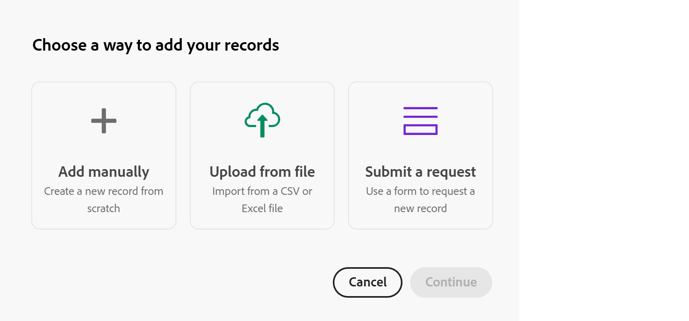
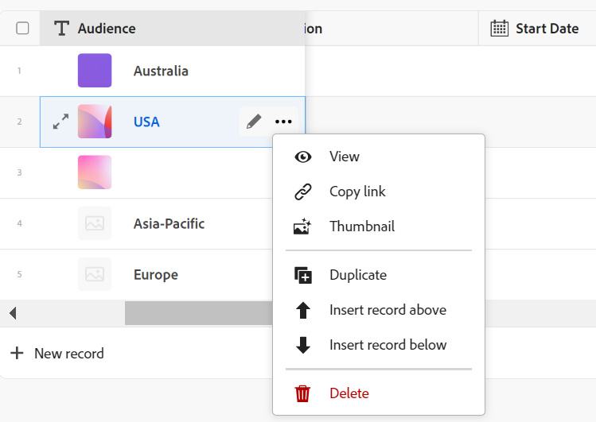
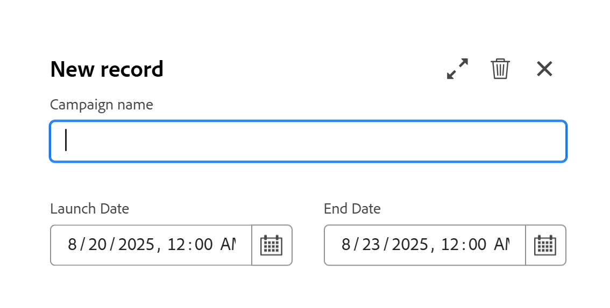
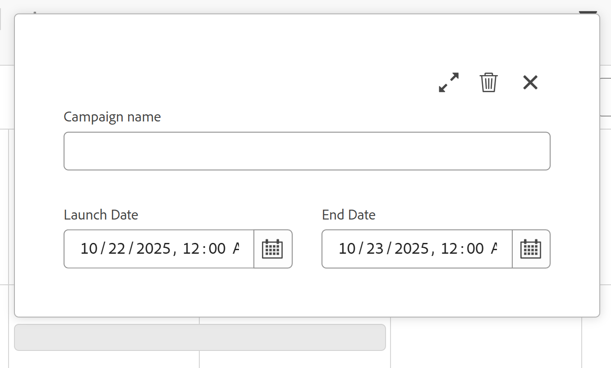
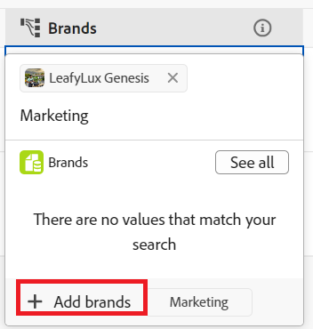

# レコードの作成

<!--
The highlighted information on this page refers to functionality not yet generally available. It is available only in the Preview environment for all customers. After the monthly releases to Production, the same features are also available in the Production environment for customers who enabled fast releases.    

For information about fast releases, see [Enable or disable fast releases for your organization](/help/quicksilver/administration-and-setup/set-up-workfront/configure-system-defaults/enable-fast-release-process.md). 

-->

{{planning-important-intro}}

Adobe Workfront Planning では、レコードはレコードタイプのインスタンスです。

次のいずれかを行うことで、レコードを作成できます。

* [任意のレコードタイプビューから「新規レコード」または「レコードを要求」ボタンを使用します](#create-records-using-the-new-record-or-request-record-button-from-any-record-type-view)
* [レコードタイプのテーブルビューからインラインで追加します](#create-records-by-adding-them-inline-from-the-record-type-table-view)
* [レコードタイプのタイムラインビューに追加します](#create-records-by-adding-them-in-the-record-type-timeline-view)
* [レコードタイプのカレンダービューに追加すると](#create-records-by-adding-them-in-the-record-type-calendar-view)
* [外部リストからレコードのリストをコピーして貼り付ける](#create-records-by-copying-and-pasting-them-from-an-external-list)
* [テーブルビューからのレコードの複製](#create-records-by-duplicating-them)
* [ほかのレコードから接続したり](#create-records-as-you-connect-them)
* [レコードタイプへのリクエストフォームの送信](#create-records-by-submitting-a-request-form-to-a-record-type)
* [CSVまたはExcel ファイルから情報をインポートする](#create-records-by-importing-records-from-a-csv-or-excel-file)
* [自動処理の利用](#create-records-by-using-automations)

テーブルビューまたはタイムラインビューでのレコードの管理については、次の記事を参照してください。

* [テーブルビューの管理](/help/quicksilver/planning/views/manage-the-table-view.md)
* [タイムラインビューの管理](/help/quicksilver/planning/views/manage-the-timeline-view.md)

## アクセス要件

+++ 展開して、この記事の機能のアクセス要件を表示します。 

<table style="table-layout:auto"> 
<col> 
</col> 
<col> 
</col> 
<tbody> 
    <tr> 
<tr> 
</tr>   
<tr> 
   <td role="rowheader">
Adobe Workfront パッケージ
</td> 
   <td> 

任意のWorkfrontおよびプランニングパッケージ
 
任意のワークフローとプランニングパッケージ

各Workfront計画パッケージに含まれる内容について詳しくは、Workfrontの担当者にお問い合わせください。 
 
   </td> 
  <tr> 
   <td role="rowheader">
Adobe Workfront プラン
</td> 
   <td>
標準

   </td> 
  </tr> 
  <tr> 
   <td role="rowheader">
オブジェクト権限
</td> 
   <td> 
レコードを追加するワークスペースおよびレコードタイプに対して、より大きい権限を付与します。 

   
レコードページの「レコードを要求」ボタンを使用して、レコードを作成するワークスペースおよびレコードタイプに対する表示権限または権限

   
システム管理者は、作成しなかったワークスペースも含め、すべてのワークスペースに対する権限を持っています。

   
Workfront オブジェクト（ポートフォリオ）に対する権限を管理して、子オブジェクト（プロジェクト）を追加します。

   </td> 
  </tr>  
</tbody> 
</table>

Workfrontのアクセス要件について詳しくは、[Workfront ドキュメント &#x200B;](/help/quicksilver/administration-and-setup/add-users/access-levels-and-object-permissions/access-level-requirements-in-documentation.md)のアクセス要件を参照してください。

+++   

<!--
Old:
<table style="table-layout:auto"> 
<col> 
</col> 
<col> 
</col> 
<tbody> 
    <tr> 
<tr> 
<td> 
   
 Products
 </td> 
   <td> 
   <ul><li>
 Adobe Workfront
</li> 
   <li>
 Adobe Workfront Planning
</li></ul></td> 
  </tr>   
<tr> 
   <td role="rowheader">
Adobe Workfront plan*
</td> 
   <td> 

Any of the following Workfront plans:
 
<ul><li>Select</li> 
<li>Prime</li> 
<li>Ultimate</li></ul> 

Workfront Planning is not available for legacy Workfront plans
 
   </td> 
<tr> 
   <td role="rowheader">
Adobe Workfront Planning package*
</td> 
   <td> 

Any 
 

For more information about what is included in each Workfront Planning plan, contact your Workfront account manager. 
 
   </td> 
 <tr> 
   <td role="rowheader">
Adobe Workfront platform
</td> 
   <td> 

Your organization's instance of Workfront must be onboarded to the Adobe Unified Experience to be able to access Workfront Planning.
 

For more information, see <a href="/help/quicksilver/workfront-basics/navigate-workfront/workfront-navigation/adobe-unified-experience.md">Adobe Unified Experience for Workfront</a>. 
 
   </td> 
   </tr> 
  </tr> 
  <tr> 
   <td role="rowheader">
Adobe Workfront license*
</td> 
   <td> Standard
   
Workfront Planning is not available for legacy Workfront licenses
 
  </td> 
  </tr> 
  <tr> 
   <td role="rowheader">
Access level configuration
</td> 
   <td> 
There are no access level controls for Adobe Workfront Planning
 
   
Edit access in Workfront for the object types that you want to create (projects, programs, and portfolios) as you connect the records to them. 
  
</td> 
  </tr> 
<tr> 
   <td role="rowheader">
Object permissions
</td> 
   <td> 
Contribute or higher permissions to the workspace and record type where you want to add records. 

   
View or higher permissions to the workspace and record type to create records using the Request record button on the record page

   
System Administrators have permissions to all workspaces, including the ones they did not create

   
Manage permissions to Workfront objects (portfolios) to add children objects (projects).

   </td> 
  </tr> 

</tbody> 
</table>
-->

## レコード作成時の考慮事項

* グローバルレコードタイプに追加されたレコードは、そのワークスペースがどのワークスペースから追加されているかに応じて、次のタイプのユーザーが表示します。

   * グローバルレコードタイプの元のワークスペースに追加されたレコードは、元のワークスペースから表示されます。
   * グローバルレコードタイプのセカンダリワークスペースに追加されたレコードは、作成されたワークスペースとグローバルレコードタイプの元のワークスペースからのみ表示されます。
詳しくは、[&#x200B; クロスワークスペースのレコードタイプの概要](/help/quicksilver/planning/architecture/cross-workspace-record-types-overview.md)を参照してください。

* ワークスペースとレコードタイプに対する権限に応じて、ユーザーは次の方法でレコードを作成できます。

   * ワークスペースとレコードタイプに対する表示権限を持つユーザーは、レコードタイプページの「レコードを要求」ボタンのみを使用してレコードを作成できます。
   * ワークスペースおよびレコードタイプに対するContributeおよびManage権限を持つユーザーは、レコードタイプページの「新規レコード」ボタンを使用してレコードを作成できます。

  >[!IMPORTANT]
  >
  >ワークスペースマネージャーは、表示権限を持つユーザーがリクエストフォームを使用してレコードを追加するために、レコードタイプのリクエストフォームを作成する必要があります。 それ以外の場合、View-permission ユーザーはレコードを作成できません。

## 任意のレコードタイプビューから、「新規レコード」ボタンまたは「レコードを要求」ボタンを使用してレコードを作成します

{{step1-to-planning}}

1. レコードを追加するワークスペースをクリックします。

   ワークスペースが開き、レコードタイプがカードとして表示されます。

1. レコードタイプのカードをクリックします。レコードタイプの作成については、[レコードタイプの作成](/help/quicksilver/planning/architecture/create-record-types.md)を参照してください。

   最後にアクセスしたビューで、レコードタイプのページが開きます。デフォルトで、レコードタイプのページがテーブルビューで開きます。
選択したタイプのすべてのレコードがビューに表示されます。

1. （条件付き）任意のビューで、ワークスペースとレコードタイプの権限に応じて、画面の右上隅にある次のいずれかをクリックします。

   * ワークスペースとレコードタイプに対してContribute以上の権限がある場合は、**新規レコード**&#x200B;をクリックします

     または

   * ワークスペースとレコードタイプに対する表示権限がある場合は、「**レコードをリクエスト**」をクリックします。

1. （条件付き）新しいレコード **をクリックした場合は、次の操作を行います。**

   1. 次のいずれかの方法をクリックしてレコードを作成し、**続行**&#x200B;をクリックします。

      * **手動で追加**。 レコードのプレビューボックスが開きます。\
        この記事の「[&#x200B; レコードを作成する」の説明に従って、レコードに関する情報を、手順6から始めて、レコードの種類のテーブルビュー](#create-records-by-adding-them-inline-from-the-record-type-table-view) セクションからインラインで追加します。<!--insure this stays accurate-->
      * **ファイルからアップロード**
記事[の説明に従って、レコードを追加します。手順6から始めて、CSVまたはExcel ファイル &#x200B;](/help/quicksilver/planning/records/import-file-to-create-records.md)から情報を読み込んでレコードを作成します。<!--ensure this stays accurate-->
      * **リクエストを送信**
レコードタイプのリクエストフォームが開きます。

        ワークスペースマネージャーは、リクエストフォームを使用してレコードを追加できるように、リクエストフォームを作成する必要があります。

        >[!TIP]
        >
        >レコードタイプによっては、複数のフォームを持っているものもあります。 1つをクリックして開きます。

        記事「[Adobe Workfront計画リクエストを送信してレコードを作成する](/help/quicksilver/planning/requests/submit-requests.md)」の説明に従って、手順6から開始してレコードを追加します。<!--ensure this stays accurate-->

      

1. （条件付き）次の操作を行います。**レコードをリクエスト**&#x200B;をクリックした場合：

   1. （条件付き）レコードタイプに複数のリクエストフォームがある場合は、1つをクリックして選択します。
   2. 「[Adobe Workfront計画リクエストを送信してレコードを作成する](/help/quicksilver/planning/requests/submit-requests.md)」の説明に従って、フォームに情報を追加し続けて、手順6から開始します。<!--ensure this stays accurate-->

1. （条件付き）新しいレコードを確認します。

   レコードの追加方法によっては、次のようなことが発生する場合があります。

   * 承認プロセスでリクエストフォームを使用して追加することを選択しない限り、新しいレコードがレコードタイプに追加されます。 レコードを作成する前に、すべての承認者が承認する必要があります。
   * CSVまたはExcel スプレッドシートを使用してレコードを追加した場合、複数のレコードがレコードタイプに追加されます。
   * リクエストフォームを送信してリクエストを追加した場合、Workfrontのリクエスト領域に新しいリクエストが追加されます。

<!--
 this is not possible anymore: 

## Create records by connecting them from another application

You can import records from other applications by linking them to existing records. This creates a linked record for the other application's connected object. 

1. Create a record type, as described in the [Create record types](/help/quicksilver/planning/architecture/create-record-types.md).

1. Create records for the record type you created in the previous step. For information, see the section [Create records by manually adding them to a record type](#create-records-by-manually-adding-them-to-a-record-type) in this article. 

1. Create a connection to an object type from another application for the record type you created. For information, see [Connect record types](/help/quicksilver/planning/architecture/connect-record-types.md).

1. Add objects from another application to the records you created above using the linked record field you created in the previous step. For information, see [Connect records](/help/quicksilver/planning/records/connect-records.md). 

    The following items are created in Workfront Planning:

    * A read-only record type that refers to the other application's record type you linked to in the connected record field. 

      For example, if you connect a Planning record type to Workfront project, a read-only record type named "Workfront project" is created in the same workspace. You can access the read-only Workfront record types from the table view of the Planning records you're linking from. 
   
-->

## レコードタイプのテーブルビューからインラインでレコードを追加してレコードを作成します

レコードをインラインで追加すると、レコードタイプページのテーブルビューでレコードを作成できます。

レコード情報の編集については、[レコードの編集](/help/quicksilver/planning/records/edit-records.md)を参照してください。

{{step1-to-planning}}

1. レコードを追加するワークスペースをクリックします。

   ワークスペースが開き、レコードタイプがカードとして表示されます。

1. レコードタイプのカードをクリックします。レコードタイプの作成については、[レコードタイプの作成](/help/quicksilver/planning/architecture/create-record-types.md)を参照してください。

   最後にアクセスしたビューで、レコードタイプのページが開きます。デフォルトで、レコードタイプのページがテーブルビューで開きます。
選択したタイプのレコードがビューに表示されます。

1. （条件付き）テーブルビューで、次のいずれかの操作を行います。

   * テーブルの最後の行、またはグループ化の最後のレコードの後にある&#x200B;**新しいレコード**&#x200B;をクリックします

     >[!TIP]
     >
     >グループ化またはサブグループ化の最後のレコードの後に新しいレコードを追加すると、Workfrontはグループ化に含まれるフィールドに自動的に入力します。 必要に応じて、これらのフィールドを手動で編集できます。レコードはグループ化から削除される場合があります。

   * テーブルの任意の列または行から、キーボードの **Shift + Enter** キーをクリックします。これにより、開始するレコードの下に空の行が追加されます。
   * レコードのプライマリフィールドにカーソルを合わせ、フィールドの右側にある&#x200B;**詳細** メニューをクリックし、次に&#x200B;**レコードを上に挿入**&#x200B;または&#x200B;**レコードを下に挿入**&#x200B;をクリックします。

   

   Workfrontは、新しいレコードごとにサムネールを自動的にアップロードします。 後でこれらの画像を変更できます。 詳しくは、[&#x200B; レコードへのカバー画像の追加](/help/quicksilver/planning/records/add-a-cover-image-to-a-record.md)を参照してください。

   新しいレコードがテーブルに追加されます。

1. 新規レコードのプライマリフィールドをクリックします

   または

   レコード名の左側にある「**詳細を開く**」アイコン「」をクリックします。

   プレビューボックスがテーブルで開きます。

1. プレビューボックスに表示されるフィールドに、新しいレコードに関する情報を入力します。

   >[!NOTE]
   >
   >  * レコードに必須のフィールドはありません。ただし、レコードを相互にリンクする際にレコードを識別すると便利なので、レコードのプライマリフィールドの情報を追加することをお勧めします。 プライマリフィールドについて詳しくは、[&#x200B; テーブルビューの管理](/help/quicksilver/planning/views/manage-the-table-view.md)および[プライマリフィールドの概要](/help/quicksilver/planning/fields/primary-field-overview.md)を参照してください。
   >
   >  * 他のレコードタイプまたは計算フィールドを参照するフィールドは、読み取り専用フィールドです。

1. （条件付き）テーブルにレコードを追加する場合、レコードのプレビューボックスを開く前に、各行に情報を追加し続け、キーボードの&#x200B;**Enter**&#x200B;をクリックして変更を保存します。

   または

   新しいレコードの名前または&#x200B;**詳細を開く** アイコン で詳細を開くアイコンをクリックして、プレビューボックスを開き、詳細領域でレコードの情報を編集します。

   >[!TIP]
   >
   >「**詳細を開く**」アイコンには、「名前」フィールドがプライマリフィールドの場合、レコードの「名前」フィールドからのみアクセスできます。

1. （オプション）レコードのプレビューボックスで、右上隅の&#x200B;**新しいタブで開く** アイコン をクリックして、レコードのページを新しいタブで開きます。 レコードページでレコードの編集を続行します。 詳しくは、[レコードの編集](/help/quicksilver/planning/records/edit-records.md)を参照してください。

   Workfront では、変更を自動的に保存します。

1. （オプション）レコードのページを開いた場合は、プレビューボックスを閉じるか、レコード名の左側にある戻る矢印をクリックします。

1. （オプション）テーブルビューで新しいレコードまたはその情報を追加する際に、次のキーボードショートカットを使用して新しいレコードまたはその情報を元に戻したり、やり直したりします。

   * CTRL + Z （⌘ + Z for Mac）で変更を元に戻す
   * CTRL + Shift + Z （⌘ + Shift + Z for Mac）を使用して変更をやり直す

## レコードタイプのタイムラインビューでレコードを追加してレコードを作成する

レコードの種類ページのタイムラインビューで、タイムラインをダブルクリックしてレコードを作成できます。

タイムラインビューの作成について詳しくは、[&#x200B; タイムラインビューの管理](/help/quicksilver/planning/views/manage-the-timeline-view.md)を参照してください。

{{step1-to-planning}}

1. レコードを追加するワークスペースをクリックします。

   ワークスペースが開き、レコードタイプがカードとして表示されます。

1. レコードタイプのカードをクリックします。

   最後にアクセスしたビューで、レコードタイプページが開きます。

1. 最初にタイムラインビューを開くか、タイムラインビューを作成します。

   >[!NOTE]
   >
   >タイムラインビューを作成できるのは、レコードタイプに関連付けられている日付フィールドが2つ以上ある場合のみです。
1. タイムラインの任意の場所をダブルクリックします。

   **新しいレコード** ボックスが開きます。<!--might need a new screen shot for Production - might add a title etc-->

   を含むタイムライン上の新しいレコードボックス

   >[!NOTE]
   >
   >名前の付いたグループ化でレコード バーが表示される場合、タイムラインビューでレコードを作成することはできません。
1. 次の情報を更新します。

   * **名前**: レコードの名前を入力します。 空のままにすると、Workfrontはデフォルトで&#x200B;**名称未設定**&#x200B;という名前を付けます。

     >[!TIP]
     >
     >タイムライン設定に従ってレコードバーにレコードの名前を表示すると、空白のままにすると、その名前はレコードバーに表示されません。

   * **レコード日付フィールド**: レコードの日付を更新します。

     日付フィールドの名前は、タイムラインビューの作成時に開始日と終了日に選択したフィールドに従ってカスタマイズされます。

     デフォルトでは、タイムラインビューの表示方法に応じて日付値が事前選択されています。 次のシナリオが存在します。

      * **年**&#x200B;まで：レコードの開始日と終了日は1か月に及びます。
      * **四半期**&#x200B;までに：レコードの開始日と終了日は1週間に及びます。
      * **月**&#x200B;までに：レコードの開始日と終了日は3日間です。

1. （オプション）次のいずれかのアイコンをクリックします。

   * **展開** を使用して、プレビューウィンドウでレコードの詳細を開きます。
   * **削除**  レコードを削除します。
   * **閉じる** で、新しいレコードボックスを閉じます。

   レコードは、**削除** アイコンをクリックしない限り、タイムラインとテーブルおよびカレンダービューにすぐに追加されます。

1. （オプション）タイムラインのレコードバーの余白の1つにカーソルを合わせ、バーの端を別の日付にドラッグ&amp;ドロップします。 これにより、レコードの開始日と終了日が自動的に変更されます。

   詳しくは、[レコードの編集](/help/quicksilver/planning/records/edit-records.md)を参照してください。

1. （オプション）タイムラインのレコードバーをクリックして、レコードの詳細ウィンドウを開き、その情報を更新したり、削除したり、コメントを追加したりします。

   >[!TIP]
   >
   >デフォルトでは、Workfrontはレコードをサムネールとカバー画像に関連付けます。
   >
   >サムネールは、ビューの設定で有効になっている場合にのみ、タイムラインビューに表示されます。

## レコードタイプのカレンダービューでレコードを追加してレコードを作成します

レコードの種類ページのカレンダービューで、カレンダーの任意の場所をダブルクリックしてレコードを作成できます。

カレンダービューの作成について詳しくは、[&#x200B; カレンダービューの管理](/help/quicksilver/planning/views/manage-the-calendar-view.md)を参照してください。

{{step1-to-planning}}

1. レコードを追加するワークスペースをクリックします。

   ワークスペースが開き、レコードタイプがカードとして表示されます。

1. レコードタイプのカードをクリックします。

   最後にアクセスしたビューで、レコードタイプページが開きます。

1. クリックしてカレンダービューを開くか、カレンダービューを作成します。

   >[!NOTE]
   >
   >カレンダービューを作成できるのは、レコードタイプに関連付けられている日付フィールドが2つ以上ある場合のみです。
1. カレンダーの任意の場所をダブルクリックします。

   **新しいレコード** ボックスが開きます。<!--(********might need a new screen shot for Production - might add a title etc*********ALSO CHECK IF THE SAME ONE NEEDS REPLACING FOR TIMELINE?????)-->

   

1. 次の情報を更新します。

   * **名前**: レコードの名前を入力します。 空のままにすると、Workfrontはデフォルトで&#x200B;**名称未設定**&#x200B;という名前を付けます。

     >[!TIP]
     >
     >カレンダーの設定に従ってレコードバーにレコードの名前を表示すると、空白のままにすると、その名前はレコードバーに表示されません。

   * **レコード日付フィールド**: レコードの日付を更新します。

     日付フィールドの名前は、カレンダービューの作成時に開始日と終了日に選択したフィールドに従ってカスタマイズされます。

     デフォルトでは、カレンダービューの表示方法に応じて日付値が事前選択されています。 次のシナリオが存在します。

      * **月**&#x200B;までに：レコードの開始日と終了日は1日に及びます。
      * **週**&#x200B;まで：レコードの開始日と終了日は2日間です。

1. （オプション）次のいずれかのアイコンをクリックします。

   * **展開** を使用して、プレビューウィンドウでレコードの詳細を開きます。
   * **削除**  レコードを削除します。
   * **閉じる** で、新しいレコードボックスを閉じます。

   **削除** アイコンをクリックしない限り、レコードはカレンダーだけでなく、テーブルおよびタイムラインビューにすぐに追加されます。
1. （オプションと条件付き）上隅のドロップダウンメニューから&#x200B;**月**&#x200B;を選択し、カレンダーのレコードバーの余白のいずれかにカーソルを合わせ、バーの端を別の日付にドラッグ&amp;ドロップします。 これにより、レコードの開始日と終了日が自動的に変更されます。

   詳しくは、[レコードの編集](/help/quicksilver/planning/records/edit-records.md)を参照してください。
1. （オプション）カレンダーのレコードバーをクリックして、レコードの詳細ウィンドウを開き、その情報を更新したり、削除したり、コメントを追加したりします。

   >[!TIP]
   >
   >デフォルトでは、Workfrontはレコードをサムネールとカバー画像に関連付けます。
   >
   >サムネールは、カレンダービューの設定で有効になっている場合にのみ、カレンダービューに表示されます。

   <!--(*********when this is available in both monthly and weekly, add more steps to show resizing the timeline and dragging and dropping the record in the calendar*******)-->

## 外部リストからレコードをコピー&amp;ペーストして作成する

1. この記事の[レコードタイプにレコードを手動で追加してレコードを作成](#create-records-by-manually-adding-them-to-a-record-type)の節の説明に従って、テーブルビューでレコードの作成を開始します。

   新しいレコード情報を入力する列（またはフィールド）がテーブルビューに含まれていることを確認します。

1. テーブルの最後の行の&#x200B;**新規 &lt; レコードタイプ名 >**&#x200B;をクリックして、新しいレコードを追加する数だけ新しい行をテーブルに追加します。

   例えば、別のアプリケーションから 10 件の新しいレコードの情報を貼り付ける場合は、10 行をテーブルビューに追加します。

1. 別のアプリケーションで、読み込むレコードのリストを作成します。

   例えば、Excel スプレッドシートを使用してリストを作成できます。

   リストには、情報が表形式で含まれている必要があります。

   >[!TIP]
   >
   > リストの列には、Workfront 内の既存のフィールドに関する情報を含める必要があります。
   >
   > 目的のフィールドが Workfront で既に作成され、シート内の情報が Workfront の各フィールドと一致する正しい形式で表示されていることを確認します。

1. 別のアプリケーションから、複数の行と列を選択し、最初の新しいレコードから始まるレコードタイプのテーブルビューに情報を貼り付けます。

   次の情報が Workfront Planning エリアに読み込まれます。

   * 行には新しいレコードが含まれています
   * 列には、レコードのフィールドに関する情報が入力されます。

## レコードを複製して作成

レコードの複製について詳しくは、[&#x200B; レコードの複製](/help/quicksilver/planning/records/copy-or-duplicate-records.md)を参照してください。

## レコードを作成しながら

次のオブジェクトタイプは、他のレコードから接続するときに作成できます。

* Adobe Workfront Planning のレコード
* Workfront オブジェクト

この節では、他のレコードからWorkfront Planning レコードを接続する際に、そのレコードを作成する方法について説明します。

>[!NOTE]
>
>Workfront プロジェクトとポートフォリオをWorkfront計画レコードに接続する場合の作成は、プランニングレコードを他のレコードから接続する場合と同様です。
>
>Workfront PlanningからWorkfront オブジェクトを作成する方法について詳しくは、[&#x200B; レコードに接続する際のWorkfront PlanningからのWorkfront オブジェクトの作成](/help/quicksilver/planning/records/create-workfront-objects-from-workfront-planning.md)を参照してください。

既存のレコードから新しいレコードを接続して追加するには、次の手順を実行する必要があります。

* 接続されたレコードタイプ： 詳しくは、[レコードタイプの接続](/help/quicksilver/planning/architecture/connect-record-types.md)を参照してください。
* レコード：
* この記事の「[&#x200B; アクセス要件](#access-requirements)」の節で説明されているように、Workfront PlanningおよびWorkfrontの正しいアクセスと権限。

他のレコードからレコードを接続するときにレコードを作成するには、次の手順を実行します。

1. 記事[&#x200B; レコードの接続](/help/quicksilver/planning/records/connect-records.md)の説明に従って、Workfront計画レコードの接続を開始します。 次の領域からレコードを接続できます。

   * Workfront Planningの次の領域の接続フィールド：

      * テーブルビュー
      * レコードの詳細ページまたはプレビューボックス

   * Workfrontのプロジェクト、ポートフォリオ、またはプログラムの「計画」セクションの「接続」フィールド。

     詳しくは、[Workfront オブジェクトからのレコード接続の管理](/help/quicksilver/planning/records/manage-records-in-planning-section.md)を参照してください。

1. （条件付き）接続しようとしたときにレコードが見つからない場合は、**+追加**&#x200B;をクリックします

   または
名前を入力し、**+追加**&#x200B;をクリックします。 **+追加** ボタンの後には、接続先のレコードタイプの名前が続きます。 例えば、ブランドを既存のキャンペーンに追加する際に「ブランドを追加」を使用します。 入力した名前は、「追加」ボタンの後にも表示されます。

   

   レコードが作成され、接続されたレコードフィールドに追加されます。

   >[!IMPORTANT]
   >
   >* レコードからプロジェクト、ポートフォリオ、プログラムを接続する場合は、Workfrontでのみ作成できます。
   >
   >* Workfront Planningのレコードからグループや会社を接続する場合、グループや会社を作成することはできません。
   > 

1. （オプション）作成したレコードの種類のテーブルビューに移動します。 ビューの最後の行に新しいレコードが表示されます。
1. （オプション）テーブルビューで新しいレコードの情報の追加を開始
または
名前をクリックして詳細ページを開き、そこに情報を追加します。

## レコードタイプにリクエストフォームを送信してレコードを作成する

誰かがレコードタイプのリクエストフォームを作成し、それをリクエスト領域に公開するか、リクエストフォームへのリンクを共有すると、そのレコードタイプのレコードを作成するリクエストを送信できます。

詳しくは、[Adobe Workfront Planning](/help/quicksilver/planning/requests/create-request-form.md)でのリクエストフォームの作成と管理を参照してください。

Workfrontのユーザーと組織の外部のユーザーの両方が、リクエストフォームへのリンクがある場合、Planning レコードタイプにリクエストを送信し、レコードを作成できます。

Workfrontのリクエスト領域からレコードを作成するリクエストを追加できるのは、Workfront ユーザーのみです。

詳しくは、[&#x200B; レコードを作成するためのAdobe Workfront計画リクエストの送信](/help/quicksilver/planning/requests/submit-requests.md)を参照してください。

## CSVまたはExcel ファイルからレコードタイプを読み込む際にレコードを作成する

レコードは、CSVまたはExcel ファイルを使用してレコードタイプを読み込むときに読み込むことができます。

詳しくは、[リクエストタイプの作成](/help/quicksilver/planning/architecture/create-record-types.md)を参照してください。

## CSVまたはExcel ファイルからレコードを読み込んでレコードを作成する

CSVまたはExcel ファイルから情報を読み込む際に、既存のレコードタイプのレコードを読み込むことができます。

詳しくは、[CSVまたはExcel ファイルから情報を読み込んでレコードを作成](/help/quicksilver/planning/records/import-file-to-create-records.md)を参照してください。

## 自動処理を使用したレコードの作成

Workfront Planningで自動処理を設定し、アクティブ化すると、Planning レコードからトリガーされたときにレコードが作成されます。 作成されたレコードは、オートメーションのトリガー元のレコードに自動的に接続されます。

Workfront Planningのレコードのページで、自動処理を設定してアクティブ化できます。 作成された接続レコードは、オートメーションを実行するレコードタイプの接続フィールドに配置されます。

詳しくは、[Adobe Workfront Planning レコードの自動処理を使用したオブジェクトの作成](/help/quicksilver/planning/records/create-wf-objects-using-planning-automations.md)を参照してください。

