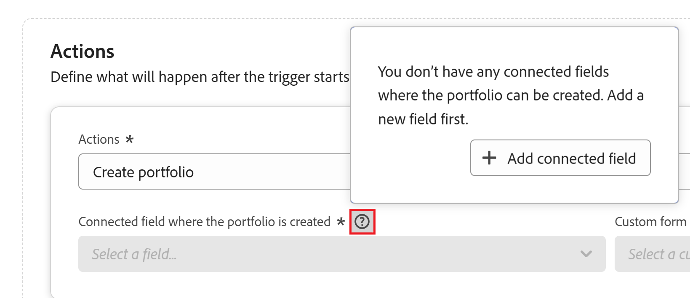

# Adobe Workfrontの計画レコードの自動作成を使用したオブジェクトの作成

<!--add screen shots when UI is finalized AND redo all the steps - some things got changed and moved around-->
<!--when you make this public, add this to the metadata above (and take the "hide" tags out):

feature: Workfront Planning
role: User, Admin
author: Alina, Becky
recommendations: noDisplay, noCatalog

-->

<!--add a new section to this article to mention a new way to create objects: help/quicksilver/planning/records/create-records.md-->
<!-- add a new section to this article to mention a new way to create WF objects from Planning: help/quicksilver/planning/records/create-workfront-objects-from-workfront-planning.md-->

<!-- if they give access to use the automation to people with LESS than Manage permissions to a workspace, split this article in two: the Configure section should be for admins and the "Use a Workfront Planning automation to create an object" should be for all other users-->

<!--The information on this page refers to functionality not yet generally available. It is available only in the Preview environment for all customers. After the monthly releases to Production, the same features are also available in the Production environment for customers who enabled fast releases.    

For information about fast releases, see [Enable or disable fast releases for your organization](/help/quicksilver/administration-and-setup/set-up-workfront/configure-system-defaults/enable-fast-release-process.md). -->

Adobe Workfront Planning で自動化を構成して、アクティブ化すると、Workfront内にオブジェクトを作成したり、計画レコードからトリガーされたときにWorkfront Planning 内にレコードを作成できます。 作成したオブジェクトまたはレコードは、自動処理をトリガーするレコードに自動的に接続されます。

Workfront Planning のレコードタイプのページで自動処理を設定してアクティブ化できます。 作成された接続オブジェクトは、オートメーションを実行するレコードタイプの接続フィールドに配置されます。

例えば、Workfront Planning キャンペーンを受け取り、Workfrontでプロジェクトを作成して、そのキャンペーンの進行状況を追跡する自動処理を作成できます。 プロジェクトが、キャンペーンの「接続されたプロジェクト」フィールドのWorkfront計画キャンペーンに接続されます。

接続されたレコードについて詳しくは、「[ 接続されたレコードの概要 ](/help/quicksilver/planning/records/connected-records-overview.md)」を参照してください。

## アクセス要件

+++ 展開すると、Workfront Planning のアクセス要件が表示されます。

この記事の手順を実行するには、次のアクセス権が必要です。

<table style="table-layout:auto"> 
<col> 
</col> 
<col> 
</col> 
<tbody> 
    <tr> 
<tr> 
<td> 
   
 製品
 </td> 
   <td> 
   <ul><li>
 Adobe Workfront
</li> 
   <li>
 Adobe Workfrontの計画
</li></ul></td> 
  </tr>   
<tr> 
   <td role="rowheader">
Adobe Workfront プラン*
</td> 
   <td> 

次のいずれかのWorkfront プラン：
 
<ul><li>選択</li> 
<li>Prime</li> 
<li>Ultimate</li></ul> 

Workfront Planning は、従来のWorkfront プランでは使用できません
 
   </td> 
<tr> 
   <td role="rowheader">
Adobe Workfront Planning パッケージ*
</td> 
   <td> 

任意 
 

各Workfront Planning プランに含まれる内容について詳しくは、Workfront担当営業または販売店にお問い合わせください。 
 
   </td> 
 <tr> 
   <td role="rowheader">
Adobe Workfront platform
</td> 
   <td> 

組織のWorkfront インスタンスは、Workfront Planning のすべての機能にアクセスできるように、Adobe Unified Experience にオンボーディングされる必要があります。
 

詳しくは、<a href="/help/quicksilver/workfront-basics/navigate-workfront/workfront-navigation/adobe-unified-experience.md">Workfront の Adobe Unified Experience</a> を参照してください。 
 
   </td> 
   </tr> 
  </tr> 
  <tr> 
   <td role="rowheader">
Adobe Workfront プラン*
</td> 
   <td> 標準
   
Workfront Planning は、従来のWorkfront ライセンスでは使用できません
 
  </td> 
  </tr> 
  <tr> 
   <td role="rowheader">
アクセスレベルの設定
</td> 
   <td> 
Adobe Workfront Planning に対するアクセスレベルのコントロールはありません。
 
   
作成するオブジェクトタイプ（プロジェクト、ポートフォリオ、プログラム）のWorkfrontでのアクセス権を編集します。 
  
</td> 
  </tr> 
<tr> 
   <td role="rowheader">
オブジェクト権限
</td> 
   <td> 
レコードの追加先となるワークスペースに対する権限を管理します。 
  
   
システム管理者は、作成しなかったワークスペースも含め、すべてのワークスペースに対する権限を持っています。

   
子オブジェクト（プロジェクト）を追加するためのWorkfront オブジェクト（ポートフォリオ）への権限を管理します。

   </td> 
  </tr> 
<tr> 
   <td role="rowheader">
レイアウトテンプレート
</td> 
   <td> 
Workfront管理者を含むすべてのユーザーには、メインメニューに計画エリアを含むレイアウトテンプレートを割り当てる必要があります 
 </td> 
  </tr> 
</tbody> 
</table>

*Workfront のアクセス要件について詳しくは、[Workfront ドキュメントのアクセス要件](/help/quicksilver/administration-and-setup/add-users/access-levels-and-object-permissions/access-level-requirements-in-documentation.md)を参照してください。

+++

## 自動処理を使用したオブジェクトとレコードの作成に関する考慮事項

* 新しいオブジェクトまたはレコード名は、作成元のレコード名と同じです。
* 新しいオブジェクトまたはレコードは、同じフィールド内の既存のオブジェクトまたはレコードを上書きしません。 同じレコードに対して同じ自動処理を複数回トリガーすると、以前に作成したオブジェクトに加えて、元のレコードの同じ接続されたフィールドに新しいオブジェクトまたはレコードが追加されます。
* 自動化では、[ 多対多 ] または [1 対多 ] 接続タイプ フィールドにのみオブジェクトが追加されます。 他のすべての場合、オートメーションはオブジェクトを作成しますが、オートメーションがトリガーされた元のレコードには接続しません。

## Workfront Planning での自動処理の設定

Workfront Planning を使用してオブジェクトを作成する前に、レコード・タイプの自動処理を構成する必要があります。

{{step1-to-planning}}

1. レコードの種類カードをクリックし、レコードの名前をクリックします。

   レコードタイプのページが開きます。
1. レコードタイプ名の右側にある **その他** メニュー  をクリックし、**自動化の管理** をクリックします。

   選択したレコードタイプで使用可能な自動化のリストが開きます。

1. 画面の右上隅にある「**新しいオートメーション**」をクリックします。 **新しい自動化** ボックスが開きます。
1. 次のフィールドを更新します。

   * **名称未設定のオートメーション** を、オートメーションボタンに表示するテキストに置き換えます。 自動処理を使用してWorkfront オブジェクトまたは計画レコードを作成する際に、このボタンをクリックします。
   * **説明**：説明を追加して、自動化の目的を特定します。
1. 「**保存**」をクリックします。
自動処理の詳細ページが開きます。

1. 自動処理の詳細ページの「**トリガー**」セクションで、次のフィールドを更新します。

   * **トリガー**：自動処理をトリガーにするアクションを選択します。 例えば、「**ボタンをクリック**」を選択します。<!--update this step with a list of all possible triggers; right not only Button click is available-->

1. 「**アクション**」セクションの次のフィールドを更新します。<!--submitted bugs for these fields - see if they need changing here-->
   * **オブジェクトタイプ**：オートメーションで作成するオブジェクトを選択します。 必須フィールドです。

     Workfront計画レコードから次のオブジェクトを作成できます。

      * プロジェクト
      * ポートフォリオ
      * プログラム
      * グループ
      * レコード

     >[!TIP]
     >
     >オートメーションを保存すると、このフィールドのオブジェクト タイプを変更できなくなります。

1. （条件付き）作成するオブジェクトのタイプに応じて、次のフィールドを更新します。

   * **プロジェクト**:
      * **オブジェクトが作成される「接続」フィールド**：新しいプロジェクトが表示される「接続」フィールドです。 必須フィールドです。
      * **プロジェクトを作成するテンプレート**:Workfrontでプロジェクトの作成に使用するプロジェクトテンプレートを選択します。
   * **Portfolio**:
      * **オブジェクトが作成される接続フィールド**：新しいポートフォリオが表示される接続フィールドです。 必須フィールドです。
      * **新しいポートフォリオに添付するカスタムフォーム**：新しいポートフォリオに添付するカスタムフォームを選択します。 ポートフォリオのカスタム フォームを作成してから選択する必要があります。
   * **プログラム**:
      * **オブジェクトが作成される接続フィールド**：新しいプログラムが表示される接続フィールドです。 必須フィールドです。
      * **プログラムポートフォリオ**：新しいプログラムが追加されるポートフォリオを選択します。 必須フィールドです。
      * **新しいプログラムに添付するカスタムフォーム**：新しいプログラムに添付するカスタムフォームを選択します。 選択する前に、プログラムカスタムフォームを作成する必要があります。
   * **グループ**:
      * **オブジェクトが作成される接続フィールド**：新しいグループが表示される接続フィールドです。 必須フィールドです。
      * **新規グループに添付するカスタムフォーム**：新しいプログラムに添付するカスタムフォームを選択します。 選択する前に、プログラムカスタムフォームを作成する必要があります。
   * **レコード**:
      * **接続されたレコードタイプ**：作成するレコードタイプを選択します。
      * **レコードが作成される接続されたフィールド**：これは、新しいレコードが表示される接続されたフィールドです。 必須フィールドです。<!--this might need revision as right now it shows the field on the connected record table where the current record will display; submitted a bug to correct this label-->
      * **フィールドのマッピング**
         * **転送元**：オートメーションが作成されるレコードタイプからフィールドを選択して、接続されたレコードタイプのフィールドにマッピングします。
      * **転送先**：新しく作成したレコードから、自動処理を実行しているレコードの情報を取り込むフィールドを選択します。
1. （オプションおよび条件付き）レコードの作成を選択した場合は、「**フィールドの追加** をクリックして、追加の参照フィールドをレコード間でマッピングします。
1. （オプションおよび条件付き）Workfront オブジェクトタイプの接続フィールドがない場合は、**接続フィールドを作成** アイコン  をクリックしてフィールドを追加します。

   新しいフィールドが自動的に作成され、「**接続 &lt; Workfront オブジェクト名 >**」という名前が付けられます。 例えば、レコードにポートフォリオ接続フィールドを作成した場合、その名前は「接続されたポートフォリオ」になります。

1. 自動処理の詳細ページの右上隅にある「**保存**」をクリックします。

   自動処理は自動処理のリストに表示され、レコードで使用できます。
1. （オプション）オートメーションを編集、無効化、または削除するには、以下の手順を実行します。

   1. オートメーションのリストで、保存されているオートメーションの名前にポインタを合わせ、**詳細** メニュー  をクリックします。

   1. **編集** をクリックして、自動処理に関する情報を更新し、フィールドを設定します。
   1. 「**無効**」をクリックすると、テーブル表示から自動処理が削除され、ユーザーがレコードやオブジェクトの作成に自動処理を使用できなくなります。 再び使用できるようにするには、**その他** メニュー  を再度クリックし、**アクティブ化** をクリックします。
   1. **削除** をクリックして、自動処理を削除します。 削除されたオートメーションは復元できません。 自動処理を使用して作成されたレコードは、最初に選択されたレコードに接続されたままになります。

## Workfront Planning 自動処理を使用したオブジェクトまたはレコードの作成

1. Workfront Planning で、Workfrontオブジェクトまたは Planning レコードの作成に使用するレコードを含む「レコード・タイプ」ページを開きます。
1. テーブル表示を開きます。
1. 1 つ以上のレコードを選択します。

   テーブルの下部に青いバーが表示され、オートメーションボタンなどの追加ボタンも表示されます。
1. 画面の右下隅付近にあるオートメーションボタンをクリックします。

   

   オートメーションでオブジェクトまたはレコードが正常に作成された場合、画面の下部に確認メッセージが表示されます。

   新しいオブジェクトは、オートメーションボタンの設定で指定した接続フィールドに表示されます。 場合によっては、新しいオブジェクトを表示する前にページを更新する必要があります。

   >[!NOTE]
   >
   >オブジェクトが作成され、期待どおりに接続されたことを確認することをお勧めします。

1. （オプション）接続フィールドで新しいオブジェクトをクリックします。 オブジェクトページが開き、新しいオブジェクトに追加の変更を加えることができます。

<!--you might need to add something about notifications and emails?!-->

<!--****************************************FUTURE ARTICLE AFTER THE RELEASE TO PREVIEW ON FEBRUARY 20:*****************************************************  

You can configure automations in Adobe Workfront Planning that, when activated, create objects in Workfront or records in Workfront Planning when triggered from a Planning record. The created objects or records are automatically connected to the records you are triggering the automation from. 

You can configure and activate the automation in the record type's page in Workfront Planning. The connected object that is created is placed in the connected field of the record type you run the automation from. 

For example, you could create an automation that takes a Workfront Planning campaign and creates a project in Workfront to track that campaign's progress. The project would be connected to the Workfront Planning campaign in the Connected Project field on the campaign.

For more information on connected records, see [Connected records overview](/help/quicksilver/planning/records/connected-records-overview.md).

## Access requirements

+++ Expand to view access requirements for Workfront Planning. 

You must have the following access to perform the steps in this article:  

 <table style="table-layout:auto"> 
<col> 
</col> 
<col> 
</col> 
<tbody> 
    <tr> 
<tr> 
<td> 
   
 Products
 </td> 
   <td> 
   <ul><li>
 Adobe Workfront
</li> 
   <li>
 Adobe Workfront Planning
</li></ul></td> 
  </tr>   
<tr> 
   <td role="rowheader">
Adobe Workfront plan*
</td> 
   <td> 

Any of the following Workfront plans:
 
<ul><li>Select</li> 
<li>Prime</li> 
<li>Ultimate</li></ul> 

Workfront Planning is not available for legacy Workfront plans
 
   </td> 
<tr> 
   <td role="rowheader">
Adobe Workfront Planning package*
</td> 
   <td> 

Any 
 

For more information about what is included in each Workfront Planning plan, contact your Workfront account manager. 
 
   </td> 
 <tr> 
   <td role="rowheader">
Adobe Workfront platform
</td> 
   <td> 

Your organization's instance of Workfront must be onboarded to the Adobe Unified Experience to be able to access all the capabilities of Workfront Planning.
 

For more information, see <a href="/help/quicksilver/workfront-basics/navigate-workfront/workfront-navigation/adobe-unified-experience.md">Adobe Unified Experience for Workfront</a>. 
 
   </td> 
   </tr> 
  </tr> 
  <tr> 
   <td role="rowheader">
Adobe Workfront license*
</td> 
   <td> Standard
   
Workfront Planning is not available for legacy Workfront licenses
 
  </td> 
  </tr> 
  <tr> 
   <td role="rowheader">
Access level configuration
</td> 
   <td> 
There are no access level controls for Adobe Workfront Planning
 
   
Edit access in Workfront for the object types that you want to create (projects, portfolios, programs). 
  
</td> 
  </tr> 
<tr> 
   <td role="rowheader">
Object permissions
</td> 
   <td> 
Manage permissions to the workspace you want to add records to. 
  
   
System Administrators have permissions to all workspaces, including the ones they did not create

   
Manage permissions to Workfront objects (portfolios) to add children objects (projects).

   </td> 
  </tr> 
<tr> 
   <td role="rowheader">
Layout template
</td> 
   <td> 
All users, including Workfront administrators,  must be assigned a layout template that includes the Planning area in the Main Menu 
 </td> 
  </tr> 
</tbody> 
</table> 

 *For more information about Workfront access requirements, see [Access requirements in Workfront documentation](/help/quicksilver/administration-and-setup/add-users/access-levels-and-object-permissions/access-level-requirements-in-documentation.md).   

+++

## Considerations about creating objects and records using an automation

* The new object or record name is the same as the record name from which you create it. 
* New objects or records don't override existing ones in the same field. Triggering the same automation multiple times for the same record adds the new objects or records in the same connected field of the original record, in addition to the ones created before. 

(************hide this for now: * The automation adds additional objects only in the Many to many or One to many connection type fields. In the all other cases, the automation creates the object, but it does not connect it to the original record from which the automation is triggered. ***************)

## Configure an automation in Workfront Planning

You must configure an automation for a record type in Workfront Planning before you can use it to create objects.

{{step1-to-planning}}

1. Click a record type card, then click the name of a record. 

   The record type page opens. 
1. Click the **More** menu  to the right of the record type name, then click **Manage automations**. 

   The list of available automations for the selected record type opens.

1. Click **New automation** in the upper-right corner of the screen. The **New automation** box opens.
1. Update the following fields:

   * Replace **Untitled automation** with the text that you want to appear on the automation button. Users will click this button when using the automation to create a Workfront object or a Planning record.
   * **Description**: Add a description to identify the purpose of the automation.
1. Click **Save**.
   The automation details page opens. 

1. On the automation's details page, update the following fields in the **Triggers** section: 

   * **Trigger**: Select the action that will trigger the automation. For example, select **Button click**. *************update this step with a list of all possible triggers; right now only Button click is available*********

1. Update the following fields in the **Actions** section: **********submitted bugs for these fields - see if they need changing here***********
   * **Actions**: Select the action that you want Workfront to perform when triggering the automation. This is a required field. 
   Select one of the following actions: 

      * Create group
      * Create program
      * Create portfolio
      * Create project
      * Create record

      >[!TIP]
      >
      >After you saved the automation, you can no longer change the action selected in this field.

1. (Conditional) Depending on what action you selected, update the following fields:

   * **Create project**: 
      * **Connected field where the object is created**: This is the connected field where the new project will display. This is a required field. 
      * **Project template**: Select a project template that Workfront will use to create the project.  
   * **Create portfolio**:
      * **Connected field where the object is created**: This is the connected field where the new portfolio will display. This is a required field.
      * **Custom form to attach to the new portfolio**: Select a custom form to attach to the new portfolio. You must create a portfolio custom form before you can select it. 
   * **Create program**: 
      * **Connected field where the object is created**: This is the connected field where the new program will display. This is a required field.
      * **Program portfolio**: Select a portfolio where the new program will be added. This is a required field.
      * **Custom form to attach to the new program**: Select a custom form to attach to the new program. You must create a program custom form before you can select it. 
   * **Create group**:
      * **Connected field where the object is created**: This is the connected field where the new group will display. This is a required field.
      * **Custom form to attach to the new group**: Select a custom form to attach to the new program. You must create a program custom form before you can select it. 
   * **Create record**: 
      * **Record type**: Select the record type you want to create. 

      The **Settings** sub-section displays. Update the following fields in the **Settings** sub-section: 

      * **Field on the connected record type where the current record will show**: This is the connected field on the record type selected for the action where the current record will display. 
      
      For example, if you are creating an automation for campaigns to connect Product records from, this is the connected field on the Product record type where the campaigns will display, after the products are created using the automation. 
      
      This is a required field. 
      
      ******submitted a change in functionality and UI text for this - revise?? *******
      * **Map fields**
         * **Transfer from**: Select fields from the record type the automation is created for to map them to the fields of the connected record type. 
      * **Transfer to**: Select fields from the newly created record that will populate with information from the record you are running the automation from. 

      >[!TIP]
      >
      >The field types from the original record type must match the field types from the newly created record type.

1. (Optional and conditional) If you selected to create a record, click **Add fields** to map additional lookup fields from one record to another.
1. (Conditional) If you selected to create a record and there are no connection fields between the original record type and the record type selected in the **Actions** area, click the question mark icon to the right of the **Field on the connected record type where the current record will show** field, then click the **Add** icon  to add a connection field. 

   The new field is automatically created for the record type you selected in the **Actions** area, and named **Connected Record**. 
   
   A connected field for the selected record type is also created on the original record type from where you are configuring the automation. 
1. (Optional and conditional) If you selected to create a Workfront object and don't have a connection field for the selected Workfront object type, click the question mark icon to the right of the **Connected field where the < Workfront object type name > is created** field, and click the **Add** icon  to add a connection field. 

   

   The new field is automatically created and named **Connected < Workfront object name >**. For example, when a portfolio connected field is created for the record, it is named "Connected portfolio." 

1. Click **Save** in the upper-right corner of the automation details page. 

   The automation displays on the list of automations, and is available to use in records.

## Manage existing automations

{{step1-to-planning}}

1. Click a record type card, then click the name of a record. 

   The record type page opens. 
1. Click the **More** menu  to the right of the record type name, then click **Manage automations**. 

   The list of available automations for the selected record type opens.

1. (Optional) To edit, disable, or delete an automation, do one of the following:

   1. From the list of automations, hover over the name of a saved automation, then click the **More** menu .

   1. Click **Edit** to update information about and configure fields on the automation.

      >[!TIP]
      >
      >   You cannot change the action you originally selected for an automation. 
   

   1. Click **Disable** to remove the automation from the record's table view and prevent users from using it to create records or objects. 

   Records that have been created using a disabled automation remain connected to the record originally selected.
   
   To make it available again, click the **More** menu  again, then click **Activate**.
   1. Click **Delete** to delete the automation. A deleted automation cannot be recovered. 
   
   Records that have been created using a deleted automation remain connected to the record originally selected.  

## Use a Workfront Planning automation to create an object or a record

1. In Workfront Planning, open the record type page that contains the automation you want to use to automatically create and connect records or objects. 
1. Open the table view. 
1. Select one or more records.
   
   A blue bar displays at the bottom of the table with additional buttons, including automation buttons. 
1. Click the automation button near the lower-right corner of the screen. 

   

   The following things occur: 

   * A confirmation message displays at the bottom of the screen, if the automation successfully created an object or a record. 

   * The new object displays in the connected field you indicated in the setup of the automation button. You might need to refresh your page before viewing the new object. 

   * The record you are triggering the automation from is added to the connected field of the new record.

   >[!NOTE]
   >
   >We recommend checking that the objects or records were created and the connected as expected.

1. (Optional) Click the new object in the connected field. The object page opens and you can make additional changes to the new object. 

***********you might need to add something about notifications and emails?!*************

-->