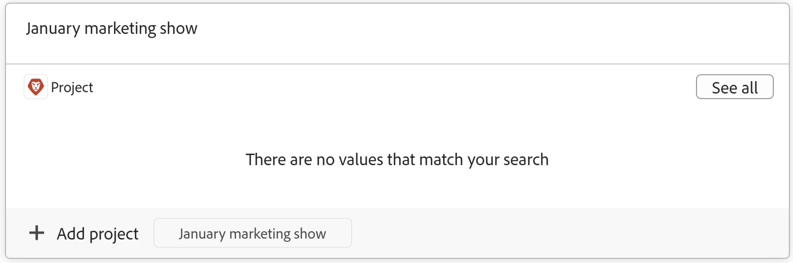
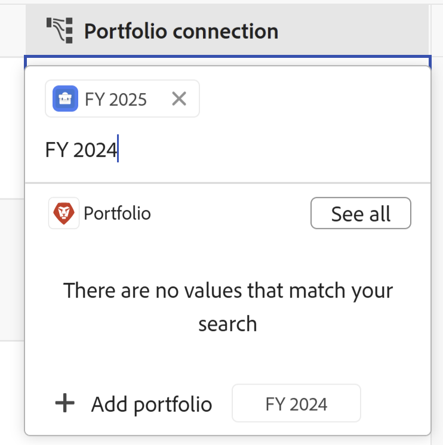
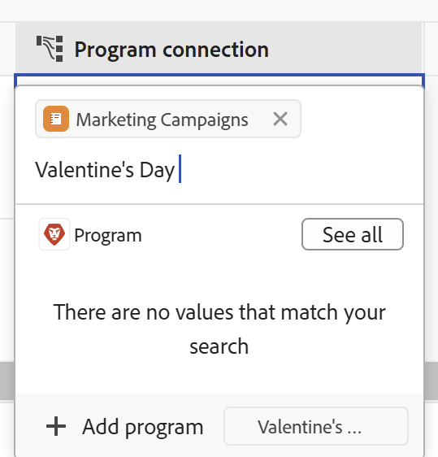

<!--update the metadata with real information when making this available in TOC and in the left nav-->

# Workfront オブジェクトをレコードに接続する際に、オブジェクトを Workfront Planning から作成

<!-- remove preview and production at release time-->

<!--
The information highlighted on this page refers to functionality not yet generally available. It is available only in the Preview environment for all customers. After the monthly releases to Production, the same features are also available in the Production environment for customers who enabled fast releases.    

For information about fast releases, see [Enable or disable fast releases for your organization](/help/quicksilver/administration-and-setup/set-up-workfront/configure-system-defaults/enable-fast-release-process.md). 
-->

{{planning-important-intro}}

Workfront PlanningからAdobe Workfront オブジェクトを作成するには、次の方法があります。

* Workfront オブジェクトをPlanning レコードから接続すると

  ここでは、Planning レコードからWorkfront オブジェクトを接続する際に、Workfront Planningからオブジェクトを作成する方法について説明します。
* レコードのページから自動処理を使用する場合。

  自動処理を使用したWorkfront オブジェクトの作成について詳しくは、[Adobe Workfront Planning レコード自動処理を使用したオブジェクトの作成](/help/quicksilver/planning/records/create-wf-objects-using-planning-automations.md)を参照してください。

>[!IMPORTANT]
>
>次のWorkfront オブジェクトは、Planning レコードと接続するときに、Workfront Planningから作成できます。
>
>* プロジェクト
>* ポートフォリオ
>* プログラム
>
>次のWorkfront オブジェクトをPlanning レコードに接続できますが、接続プロセスで作成することはできません。
>
>* グループ
>* 会社
>

Workfront オブジェクトをWorkfront Planning レコードに接続して作成する場合は、次の点を考慮してください。

* Workfrontのプロジェクト、ポートフォリオ、プログラム、グループ、および会社は、Workfront計画の次の領域から接続フィールドに接続できます。

   * レコードタイプのテーブルビュー
   * レコードの詳細ページまたはプレビューボックス
   * レコードの「接続」タブ

* Workfront Planningの次の領域からプロジェクトを作成できます。

   * レコードタイプのテーブルビュー
   * 接続フィールドのレコードの詳細領域
   * レコードの接続されたレコードページ

* Workfront Planningの次の領域からポートフォリオとプログラムを作成できます。

   * レコードタイプのテーブルビュー
   * 接続フィールドのレコードの詳細領域

Planning レコードとWorkfront オブジェクトの接続について詳しくは、[ レコードの接続](/help/quicksilver/planning/records/connect-records.md)を参照してください。

## アクセス要件

+++ 展開して、この記事の機能のアクセス要件を表示します。 

<table style="table-layout:auto"> 
<col> 
</col> 
<col> 
</col> 
<tbody> 
    <tr> 
<tr> 
</tr>   
<tr> 
   <td role="rowheader">
Adobe Workfront パッケージ
</td> 
   <td> 

任意のWorkfrontおよびプランニングパッケージ
 
任意のワークフローとプランニングパッケージ

各Workfront計画パッケージに含まれる内容について詳しくは、Workfrontの担当者にお問い合わせください。 
 
   </td>

<tr> 
  <tr> 
   <td role="rowheader">
Adobe Workfront プラン
</td> 
   <td>
標準

   </td> 
  </tr> 
  <tr> 
   <td role="rowheader">
アクセスレベルの設定
</td> 
   <td> 
Adobe Workfront Planning に対するアクセスレベルのコントロールはありません。
 
   
作成するオブジェクトタイプ（プロジェクト、ポートフォリオ、プログラム）に対するWorkfrontの「オブジェクトを作成」へのアクセス権を持つ編集アクセス。 
  
</td> 
  </tr> 
<tr> 
   <td role="rowheader">
オブジェクト権限
</td> 
   <td> 
レコードを追加するワークスペースおよびレコードタイプに対して、より大きい権限を付与します。 
  
   
システム管理者は、作成しなかったワークスペースも含め、すべてのワークスペースに対する権限を持っています。

   
Workfront オブジェクト（ポートフォリオ）に対する権限を管理して、子オブジェクト（プロジェクト）を追加します。

   </td> 
  </tr>   
</tbody> 
</table>

Workfrontのアクセス要件について詳しくは、[Workfront ドキュメント ](/help/quicksilver/administration-and-setup/add-users/access-levels-and-object-permissions/access-level-requirements-in-documentation.md)のアクセス要件を参照してください。

+++ 

<!--
Old:

<table style="table-layout:auto"> 
<col> 
</col> 
<col> 
</col> 
<tbody> 
    <tr> 
<tr> 
<td> 
   
 Products
 </td> 
   <td> 
   <ul><li>
 Adobe Workfront
</li> 
   <li>
 Adobe Workfront Planning
</li></ul></td> 
  </tr>   
<tr> 
   <td role="rowheader">
Adobe Workfront plan*
</td> 
   <td> 

Any of the following Workfront plans:
 
<ul><li>Select</li> 
<li>Prime</li> 
<li>Ultimate</li></ul> 

Workfront Planning is not available for legacy Workfront plans
 
   </td> 
<tr> 
   <td role="rowheader">
Adobe Workfront Planning package*
</td> 
   <td> 

Any 
 

For more information about what is included in each Workfront Planning plan, contact your Workfront account manager. 
 
   </td> 
 <tr> 
   <td role="rowheader">
Adobe Workfront platform
</td> 
   <td> 

Your organization's instance of Workfront must be onboarded to the Adobe Unified Experience to be able to access Workfront Planning.
 

For more information, see <a href="/help/quicksilver/workfront-basics/navigate-workfront/workfront-navigation/adobe-unified-experience.md">Adobe Unified Experience for Workfront</a>. 
 
   </td> 
   </tr> 
  </tr> 
  <tr> 
   <td role="rowheader">
Adobe Workfront license*
</td> 
   <td> Standard
   
Workfront Planning is not available for legacy Workfront licenses
 
  </td> 
  </tr> 
  <tr> 
   <td role="rowheader">
Access level configuration
</td> 
   <td> 
There are no access level controls for Adobe Workfront Planning
 
   
Edit access with access to Create objects in Workfront for the object types that you want to create (projects, portfolios, programs). 
  
</td> 
  </tr> 
<tr> 
   <td role="rowheader">
Object permissions
</td> 
   <td> 
Manage permissions to the workspace and record type where you want to add records. 
  
   
System Administrators have permissions to all workspaces, including the ones they did not create

   
Manage permissions to Workfront objects (portfolios) to add children objects (projects).

   </td> 
  </tr> 
</tbody> 
</table> 

 *For more information about Workfront access requirements, see [Access requirements in Workfront documentation](/help/quicksilver/administration-and-setup/add-users/access-levels-and-object-permissions/access-level-requirements-in-documentation.md).
 -->

## Workfront PlanningのレコードとWorkfront オブジェクトを接続する際の前提条件

既存のレコードから新しいプロジェクトまたはポートフォリオを接続するには、次の手順を実行する必要があります。

* Workfrontのプロジェクト、ポートフォリオ、プログラムに接続されたレコードタイプ。 詳しくは、[レコードタイプの接続](/help/quicksilver/planning/architecture/connect-record-types.md)を参照してください。
* Workfront オブジェクトに接続されたレコードタイプのレコード。 詳しくは、[レコードの作成](/help/quicksilver/planning/records/create-records.md)を参照してください。
* この記事の「[ アクセス要件](#access-requirements)」の節で説明されているように、Workfront PlanningおよびWorkfrontの正しいアクセスと権限。

## Workfront Planningのレコードを使用してプロジェクトを作成します

プロジェクトを作成するには、次のWorkfront計画の領域で、Workfront計画のレコードとプロジェクトを接続します。

* 接続フィールドのレコードのレコードタイプまたは詳細領域のテーブルビュー
* レコードの詳細領域にある、レコードの接続されたレコードページ

### レコードの詳細領域またはレコードタイプのテーブルビューからプロジェクトを作成します

他のレコードからプロジェクトを接続するときにプロジェクトを作成するには、次の手順を実行します。

1. レコードの詳細ページまたはレコードタイプのテーブルに移動し、記事[ レコードの接続](/help/quicksilver/planning/records/connect-records.md)で説明されているように、Workfront Planning レコードとWorkfront プロジェクトの接続を開始します。

1. （条件付き）「**プロジェクトを追加**」をクリック
または
プロジェクト名を入力し始め、見つからない場合は、**プロジェクトを追加**&#x200B;をクリックします。 「追加」ボタンの後に、入力したプロジェクト名が続きます。

   

   「**プロジェクトを作成**」ボックスが開きます。

1. （オプション） **プロジェクト名**&#x200B;を更新します。 デフォルトでは、プロジェクトは、レコードから接続する際に検索項目として追加したものにちなんで名前が付けられます。
1. （オプション） **プロジェクトテンプレート**&#x200B;を選択します。 テンプレートを選択しない場合、Workfrontはタスクのない空白のプロジェクトを作成します。
1. 「**作成**」をクリックします。
1. （条件付き）テンプレートからプロジェクトを作成することを選択した場合は、[ テンプレートを使用したプロジェクトの作成](/help/quicksilver/manage-work/projects/create-projects/create-project-from-template.md)記事の手順に従って、プロジェクトの追加を完了してください。

   新しいプロジェクトが作成され、選択したレコードの接続フィールドに追加されます。

1. （オプション）Workfront計画から新しいプロジェクトの名前をクリックして、プロジェクトのページをWorkfrontで開き、プロジェクトに追加の更新を加えます。

### レコードの接続されたレコードページからプロジェクトを作成する

1. プロジェクトオブジェクトタイプをテーブルビューのWorkfront計画レコードタイプに接続します。

   詳しくは、[レコードタイプの接続](/help/quicksilver/planning/architecture/connect-record-types.md)を参照してください。

1. 任意のビューでレコードの名前をクリックします。 詳細プレビューボックスが開きます。

1. プロジェクトの&#x200B;**接続レコードページ**&#x200B;を追加します。

   詳しくは、[接続されたレコードの追加ページをレコード ](/help/quicksilver/planning/records/add-a-connected-records-page-to-a-record.md)に参照してください。

   接続されたレコード ページがテーブルビューに表示されます。 接続されたプロジェクトがテーブルに表示されます。

   

1. プロジェクト テーブルの&#x200B;**新しい行**&#x200B;をクリックして、プロジェクトを追加します。

   空白のプロジェクトは、この領域にのみ追加できます。 テンプレートを使用してプロジェクトを追加することはできません。
1. （オプション）テーブルビューでプロジェクトの名前をクリックして、Workfrontでプロジェクトを開き、詳細を追加します。

## Workfront Planningのレコードを使用してポートフォリオを作成します

レコードタイプのテーブルビューまたはレコードの詳細ページからポートフォリオを作成できます。

Planning レコードから接続するポートフォリオを作成するには、次の手順を実行します。

1. レコードの詳細ページまたはレコードタイプのテーブルに移動し、Workfront Planning レコードとWorkfront ポートフォリオの接続を開始します（記事[ レコードの接続](/help/quicksilver/planning/records/connect-records.md)を参照）。

1. （条件付き）「**ポートフォリオを追加**」をクリック

   または

   ポートフォリオの名前を入力し始め、見つからない場合は、**ポートフォリオを追加**&#x200B;をクリックします。 「追加」ボタンの後に、入力したポートフォリオ名が続きます。

   

   ポートフォリオが作成され、選択したレコードの接続フィールドに追加されます。

1. （オプション）Workfront Planningから新しいポートフォリオの名前をクリックして、ポートフォリオのページをWorkfrontで開き、ポートフォリオをさらに更新します。

## Workfront Planningのレコードを使用してプログラムを作成します

プログラムは、レコードタイプのテーブルビューまたはレコードの詳細ページから作成できます。

プランニング レコードからプログラムを接続する際にプログラムを作成するには、次の手順を実行します。

1. レコードの詳細ページまたはレコードタイプのテーブルに移動し、Workfront Planning レコードとWorkfront ポートフォリオの接続を開始します（記事[ レコードの接続](/help/quicksilver/planning/records/connect-records.md)を参照）。

1. 「**プログラムを追加**」をクリックします

   または

   プログラムの名前を入力し始め、見つからない場合は、**プログラムを追加**&#x200B;をクリックします。 「追加」ボタンの後に、入力したプログラム名が続きます。

   

   「**プログラムを作成**」ボックスが開きます。

1. **プログラム名**&#x200B;を更新します。 必須フィールドです。
1. ドロップダウンから&#x200B;**Portfolio**&#x200B;を選択するか、ポートフォリオの名前を入力し、リストに表示されたら選択します。 必須フィールドです。
1. 「**作成**」をクリックします。

   プログラムが作成され、選択したレコードの接続フィールドに追加されます。

1. （オプション）Workfront計画から新しいプログラムの名前をクリックして、プログラムのページをWorkfrontで開き、さらに更新します。

