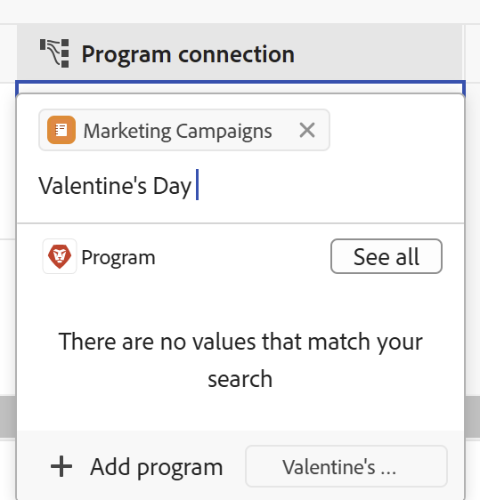

<!--update the metadata with real information when making this available in TOC and in the left nav-->

# Workfront Planning <!--as you connect them to records--> からのWorkfront オブジェクトの作成

<!-- update the title (and all the links to this article) at preview, to be this: Create Workfront objects from Workfront Planning as you connect them to records-->
<!-- remove preview and production at release time-->

 このページでハイライト表示されている情報は、まだ一般公開されていない機能を指しています。 すべてのお客様が、プレビュー環境でのみ使用できます。 実稼動環境への毎月のリリースの後、迅速なリリースを有効にしたお客様には、実稼動環境でも同じ機能を利用できます。

迅速リリースについて詳しくは、[組織での迅速リリースを有効または無効にする](/help/quicksilver/administration-and-setup/set-up-workfront/configure-system-defaults/enable-fast-release-process.md)を参照してください。

{{planning-important-intro}}

<!--
You can create Adobe Workfront objects from Workfront Planning in the following ways: 

* As you try to connect Workfront objects from Planning records

    This article describes how to create Workfront objects from Workfront Planning as you try to connect them from Planning records. 
* When you use automations from a record's page. 

    For information about creating Workfront objects using automations, see [Create objects using Adobe Workfront Planning record automations](/help/quicksilver/planning/records/create-wf-objects-using-planning-automations.md). 
-->

Workfront計画レコードを次のWorkfrontオブジェクト・タイプと関連付けると、Workfront計画から次のタイプのWorkfrontオブジェクトを作成できます。

* プロジェクト
* ポートフォリオ
  <!--* Programs-->

>[!IMPORTANT]
>
>* レコードから接続する場合、Workfrontで作成できるのはプロジェクトとポートフォリオのみです。
>
>* Workfront Planning のレコードからプログラム、グループまたは会社を関連付ける場合、それらのプログラム、グループまたは会社を作成することはできません。
>

<!--replace the IMPORTANT above with this when we release programs: 

>[!IMPORTANT]
>
>* You can create only projects, portfolios, and programs in Workfront when connecting them from a record. 
>
>* You cannot create groups or companies when connecting them from a record in Workfront Planning. 
>
-->

Workfront Planning の次の領域の接続フィールドからプロジェクトとポートフォリオを <!-- and programs --> に接続できます。

* レコードタイプのテーブル表示
* レコードの詳細ページまたはプレビューボックス

Planning レコードとWorkfrontオブジェクトの接続の詳細は、[ レコードの接続 ](/help/quicksilver/planning/records/connect-records.md) を参照してください。

## アクセス要件

+++ 展開すると、Workfront Planning のアクセス要件が表示されます。

この記事の手順を実行するには、次のアクセス権が必要です。

<table style="table-layout:auto"> 
<col> 
</col> 
<col> 
</col> 
<tbody> 
    <tr> 
<tr> 
<td> 
   
 製品
 </td> 
   <td> 
   <ul><li>
 Adobe Workfront
</li> 
   <li>
 Adobe Workfrontの計画
</li></ul></td> 
  </tr>   
<tr> 
   <td role="rowheader">
Adobe Workfront プラン*
</td> 
   <td> 

次のいずれかのWorkfront プラン：
 
<ul><li>選択</li> 
<li>Prime</li> 
<li>Ultimate</li></ul> 

Workfront Planning は、従来のWorkfront プランでは使用できません
 
   </td> 
<tr> 
   <td role="rowheader">
Adobe Workfront Planning パッケージ*
</td> 
   <td> 

任意 
 

各Workfront Planning プランに含まれる内容について詳しくは、Workfront担当営業または販売店にお問い合わせください。 
 
   </td> 
 <tr> 
   <td role="rowheader">
Adobe Workfront platform
</td> 
   <td> 

組織のWorkfront インスタンスは、Workfront Planning のすべての機能にアクセスできるように、Adobe Unified Experience にオンボーディングされる必要があります。
 

詳しくは、<a href="/help/quicksilver/workfront-basics/navigate-workfront/workfront-navigation/adobe-unified-experience.md">Workfront の Adobe Unified Experience</a> を参照してください。 
 
   </td> 
   </tr> 
  </tr> 
  <tr> 
   <td role="rowheader">
Adobe Workfront プラン*
</td> 
   <td> 標準
   
Workfront Planning は、従来のWorkfront ライセンスでは使用できません
 
  </td> 
  </tr> 
  <tr> 
   <td role="rowheader">
アクセスレベルの設定
</td> 
   <td> 
Adobe Workfront Planning に対するアクセスレベルのコントロールはありません。
 
   
レコードをレコードに関連付ける際に、作成するオブジェクトタイプ（プロジェクトとポートフォリオ）のWorkfrontでのアクセス権を編集します。 
  
</td> 
  </tr> 
<tr> 
   <td role="rowheader">
オブジェクト権限
</td> 
   <td> 
レコードの追加先となるワークスペースに対する権限を管理します。 
  
   
システム管理者は、作成しなかったワークスペースも含め、すべてのワークスペースに対する権限を持っています。

   
子オブジェクト（プロジェクト）を追加するためのWorkfront オブジェクト（ポートフォリオ）への権限を管理します。

   </td> 
  </tr> 
<tr> 
   <td role="rowheader">
レイアウトテンプレート
</td> 
   <td> 
Workfront管理者を含むすべてのユーザーには、メインメニューに計画エリアを含むレイアウトテンプレートを割り当てる必要があります 
 </td> 
  </tr> 
</tbody> 
</table>

*Workfront のアクセス要件について詳しくは、[Workfront ドキュメントのアクセス要件](/help/quicksilver/administration-and-setup/add-users/access-levels-and-object-permissions/access-level-requirements-in-documentation.md)を参照してください。

+++

## Workfront オブジェクトをWorkfront Planning のレコードに関連付ける際の、オブジェクト作成の前提条件

既存のレコードから接続して新しいプロジェクトまたはポートフォリオを追加するには、次のものが必要です。

* Workfront プロジェクトまたはポートフォリオ <!--or programs--> ータに接続されたレコードタイプ。 詳しくは、[レコードタイプの接続](/help/quicksilver/planning/architecture/connect-record-types.md)を参照してください。
* レコード。 詳しくは、[レコードの作成](/help/quicksilver/planning/records/create-records.md)を参照してください。
* この記事の [ アクセス要件 ](#access-requirements) の節で説明しているように、Workfront Planning およびWorkfrontでの正しいアクセス権と権限。

## Workfront Planning のレコードにプロジェクトを結び付けながらプロジェクトを作成します

他のレコードから接続する際にプロジェクトを作成するには：

1. [ レコードの接続 ](/help/quicksilver/planning/records/connect-records.md) の記事の説明に従って、レコードの詳細ページまたはレコードタイプのテーブルに移動し、Workfront Planning レコードとWorkfront プロジェクトの接続を開始します。

1. （条件付き） <!--Click **Add project** Or Start typing the name of a project, then click **Add project** if you cannot find it.--> 別のレコードの「接続されたレコード」フィールドから追加しようとするとプロジェクトが見つからない場合は、名前を追加してから **プロジェクトを追加** をクリックします。 「追加」ボタンの後に、入力したプロジェクト名が続きます。

   <!--at production or when the permanent Add button is released to preview, take the first part of the direction above out and say "Click Add to add a new project"; take this out too: "The Add button is followed by the project name you typed."-->

   

    「**プロジェクトを作成** ボックスが開きます。

1.  （任意） **プロジェクト名** を更新します。 デフォルトでは、プロジェクトの名前は、レコードから接続する際に検索項目として追加した名前に基づいて付けられます。
1.  （任意） **プロジェクトテンプレート** を選択します。 テンプレートを選択しない場合、Workfrontはタスクを含まない空のプロジェクトを作成します。
1. **作成** をクリックします。
1.  （条件付き）テンプレートからプロジェクトを作成することを選択した場合は、記事 [ テンプレートを使用したプロジェクトの作成 ](/help/quicksilver/manage-work/projects/create-projects/create-project-from-template.md) の記事の手順に従って、プロジェクトの追加を完了します。

   新しいプロジェクトが作成され、選択したレコードの接続されたフィールドに追加されます。

1. （任意） Workfront Planning から新しいプロジェクトの名前をクリックして、Workfrontでプロジェクトのページを開き、プロジェクトをさらに更新します。

## ポートフォリオをWorkfront Planning のレコードに接続する際のポートフォリオの作成

計画レコードから接続するポートフォリオを作成する手順は、次のとおりです。

1. [ レコードの接続 ](/help/quicksilver/planning/records/connect-records.md) の記事の説明に従って、レコードの詳細ページまたはレコードタイプのテーブルに移動し、Workfront Planning レコードとWorkfront ポートフォリオの接続を開始します。

   <!--at production or when the permanent Add button is released to preview, take the first part of the direction below out and say "Click Add to add a new portfolio"; take this out too: "The Add button is followed by the portfolio name you typed."-->

1. （条件付き） <!--Click **Add portfolio** Or Start typing the name of a portfolio, then click **Add portfolio** if you cannot find it.--> 別のレコードの接続済みレコードフィールドから追加しようとしたときにポートフォリオが見つからない場合は、名前を追加して、「**ポートフォリオを追加**」をクリックします。 「追加」ボタンの後には、入力したポートフォリオ名も続きます。

   

   ポートフォリオが作成され、選択したレコードの接続フィールドに追加されます。

1. （任意）Workfront プランニングから新しいポートフォリオの名前をクリックして、Workfrontでポートフォリオのページを開き、ポートフォリオをさらに更新します。

<!--

## Create programs as you connect them with records from Workfront Planning

To create programs as you are connecting them from Planning records: 

1. Go to a record's details page or to the record type's table and start connecting Workfront Planning records with Workfront portfolios, as described in the article [Connect records](/help/quicksilver/planning/records/connect-records.md). 

    ******** at production or when the permanent Add button is released to preview, take the first part of the direction below out and say "Click Add to add a new program"; take this out too: "The Add button is followed by the program name you typed." ***********
    
1. Click **Add program** 

    Or 
    
    Start typing the name of a program, then click **Add program** if you cannot find it. The Add button is followed by the program name you typed. 

    

    The **Create program** box opens.

1. Update the **Program name**. This is a required field.
1. Choose a **Portfolio** from the drop-down, or start typing the name of a portfolio, then select it when it displays in the list. This is a required field. 
1. Click **Create**.

    The program is created and added to the connection field of the record you selected. 

1. (Optional) Click the name of the new program from Workfront Planning to open the program's page in Workfront and make additional updates to it. 

-->