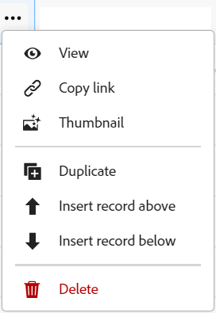

<!--update the metadata with real information when making this available in TOC and in the left nav-->

# レコードの削除

{{planning-important-intro}}

Adobe Workfront Planning で関係がなくなったレコードを削除できます。

## アクセス要件

この記事の手順を実行するには、次のアクセス権が必要です。

<table style="table-layout:auto">
 <col>
 </col>
 <col>
 </col>
 <tbody>
    <tr>
<tr>
<td>
   
 製品
 </td>
   <td>
   
 Adobe Workfront
 </td>
  </tr>  
 <td role="rowheader">
Adobe Workfront 契約
</td>
   <td>

Workfront Planning の早期アクセス段階に登録されている必要があります 

   </td>
  </tr>
  <tr>
   <td role="rowheader">
Adobe Workfront プラン
</td>
   <td>

任意

   </td>
  </tr>
  <tr>
   <td role="rowheader">
Adobe Workfront プラン*

   </td>
   <td>
   
新規：標準

   
現在：プラン
 
  </td>
  </tr>

<tr>
   <td role="rowheader">
アクセスレベル設定
</td>
   <td> 
Adobe Workfront Planning に対するアクセスレベルのコントロールはありません。 
  
</td>
  </tr>

<tr>
   <td role="rowheader">
権限
</td>
   <td> 
ワークスペースに対する参加以上の権限</a> 
  
   
システム管理者は、作成しなかったワークスペースも含め、すべてのワークスペースに対する権限を持っています。

</td>
  </tr>
<tr>
   <td role="rowheader">
レイアウトテンプレート
</td>
   <td> 
Workfront 管理者やグループ管理者は、レイアウトテンプレートに Planning エリアを追加する必要があります。詳しくは、<a href="/help/quicksilver/planning/access/access-overview.md">アクセス権の概要</a>を参照してください。 
  
</td>
  </tr>

</tbody>
</table>

<!--Maybe enable this at GA - but Planning is not supposed to have Access controls in the Workfront Access Level: 
>[!NOTE]
>
>If you don't have access, ask your Workfront administrator if they set additional restrictions in your access level. For information on how a Workfront administrator can change your access level, see [Create or modify custom access levels](/help/quicksilver/administration-and-setup/add-users/configure-and-grant-access/create-modify-access-levels.md). -->

## レコードの削除に関する考慮事項

* 自分または別のユーザーが作成したレコードを削除できます。
* 削除したレコードは復元できません。<!--the above statements (and in the metadata description) will change with access levels and recycle bin??-->
* 削除したレコードが別のレコードにリンクされている場合、リンクされているレコードは削除されませんが、削除したレコードの情報は削除されます。
* レコードを一括で削除することはできません。<!--this will probably change-->
* タイムラインビューからレコードを削除できません。

## レコードの削除

次のエリアからレコードを削除できます。

* [レコードのページから](#delete-a-record-from-the-records-page)
* [レコードタイプのテーブルビューから](#delete-a-record-from-the-record-type-table-view)

### レコードのページからのレコードの削除

{{step1-to-planning}}

1. レコードを削除するワークスペースをクリックします。

   ワークスペースが開き、レコードタイプがカードとして表示されます。

1. レコードタイプのカードをクリックします。

   レコードタイプのページが開きます。
1. 次のいずれかの操作を行います。

   * テーブルビューで、レコードの名前をクリックします。
   * テーブルビューで、レコードの名前の上にポインタを合わせ、**その他**&#x200B;メニュー  をクリックして「**表示**」をクリックします。

     
   * タイムラインビューで、レコードバーをクリックします。

   レコードページが開きます。

1. レコード名の右側にある「**詳細**」メニュー  をクリックし、「**削除**」をクリックします。再度「**削除**」をクリックして確認します。

    <!--ensure the options have not changed or been renamed-->
レコードは削除され、復元できません。

### レコードタイプのテーブルビューからレコードを削除する

{{step1-to-planning}}

1. レコードを削除するワークスペースをクリックします。

   ワークスペースが開き、レコードタイプがカードとして表示されます。

1. レコードタイプのカードをクリックします。

   レコードタイプのページが開きます。
1. （条件付き）テーブルの左上隅にある&#x200B;**ビュー**&#x200B;ドロップダウンメニューから、テーブルビューを選択します。最後にアクセスしたときにタイムラインビューでレコードタイプを表示した場合を除き、これがデフォルトのビューになります。

   選択したレコードタイプに関連付けられているレコードが、テーブルビューに表示されます。
1. 次のいずれかの操作を行います。

   * レコード行を右クリックし、「**削除**」をクリックします。
   * レコード名の右側にある&#x200B;**詳細**&#x200B;メニュー  をクリックし、「**削除**」をクリックします。

     

   * **詳細を開く**&#x200B;アイコン  をクリックしてレコードの詳細情報を含むボックスを開き、レコード名の右側にある「**詳細**」 をクリックして、「**削除**」をクリックします。

   レコードが削除されました。これは復元できません。

1. （オプション）次のキーボードショートカットを使用すると、レコードの削除の取り消しまたはやり直しを実行できます。

   * Ctrl + Z（Mac の場合は ⌘ + z）で、変更を取り消します
   * Ctrl + Shift + Z（Mac の場合は  ⌘ + Shift + Z）で、変更を元に戻します
