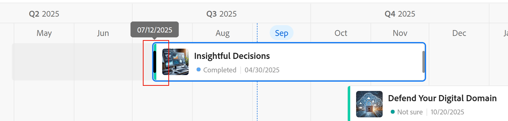

# レコードの編集

このページでハイライト表示されている情報は、まだ一般に利用できない機能を示します。すべてのお客様が、プレビュー環境でのみ使用できます。 実稼動環境への毎月のリリースの後、迅速なリリースを有効にしたお客様には、実稼動環境でも同じ機能を利用できます。

迅速リリースについて詳しくは、[組織での迅速リリースを有効または無効にする](/help/quicksilver/administration-and-setup/set-up-workfront/configure-system-defaults/enable-fast-release-process.md)を参照してください。

{{planning-important-intro}}

レコードに関連付けられたフィールドの値を編集することで、Adobe Workfront Planning 内のレコード情報を編集できます。

レコードの作成と編集を開始する前に、レコードタイプを作成する必要があります。

詳しくは、[リクエストタイプの作成](/help/quicksilver/planning/architecture/create-record-types.md)を参照してください。

レコードの作成について詳しくは、[レコードの作成](/help/quicksilver/planning/records/create-records.md)を参照してください。

&lt;!-- ここでは、詳細ビューのフィールドがテーブルビューのフィールドと同じであることに言及しています。この記事は、この情報を参照するためのレコードを管理ビューからリンクされています-->

## アクセス要件

+++ 展開すると、アクセス要件が表示されます。

<table style="table-layout:auto"> 
<col> 
</col> 
<col> 
</col> 
<tbody> 
    <tr> 
<tr> 
<td> 
   
 製品
 </td> 
   <td> 
   <ul><li>
 Adobe Workfront
</li> 
   <li>
 Adobe Workfrontの計画
</li></ul></td> 
  </tr>   
<tr> 
   <td role="rowheader">
Adobe Workfront プラン*
</td> 
   <td> 

次のいずれかのWorkfront プラン：
 
<ul><li>選択</li> 
<li>Prime</li> 
<li>Ultimate</li></ul> 

Workfront Planning は、従来のWorkfront プランでは使用できません
 
   </td> 
<tr> 
   <td role="rowheader">
Adobe Workfront Planning パッケージ*
</td> 
   <td> 

任意 
 

各Workfront Planning プランに含まれる内容について詳しくは、Workfront担当営業または販売店にお問い合わせください。 
 
   </td> 
 <tr> 
   <td role="rowheader">
Adobe Workfront platform
</td> 
   <td> 

Workfront Planning にアクセスするには、組織のWorkfront インスタンスをAdobe Unified Experience にオンボーディングする必要があります。
 

詳しくは、<a href="/help/quicksilver/workfront-basics/navigate-workfront/workfront-navigation/adobe-unified-experience.md">Workfront の Adobe Unified Experience</a> を参照してください。 
 
   </td> 
   </tr> 
  </tr> 
  <tr> 
   <td role="rowheader">
Adobe Workfront プラン*
</td> 
   <td> 
標準
 
   
Workfront Planning は、従来のWorkfront ライセンスでは使用できません
 
  </td> 
  </tr> 
  <tr> 
   <td role="rowheader">
アクセスレベルの設定
</td> 
   <td> 
Adobe Workfront Planning に対するアクセスレベルのコントロールはありません。
   
</td> 
  </tr> 
<tr> 
   <td role="rowheader">
オブジェクト権限
</td> 
   <td>  
ワークスペースおよびレコードタイプ </a> への投稿以上の権限 
  
   
システム管理者は、作成しなかったワークスペースも含め、すべてのワークスペースに対する権限を持っています。
  </td> 
  </tr>

</tbody> 
</table>

*Workfront のアクセス要件について詳しくは、[Workfront ドキュメントのアクセス要件](/help/quicksilver/administration-and-setup/add-users/access-levels-and-object-permissions/access-level-requirements-in-documentation.md)を参照してください。

+++   

## レコードの編集に関する考慮事項

* ワークスペースへの権限がある場合は、自分が作成したレコードや他のユーザーが作成したレコードを編集できます。
* 次のエリアからレコードフィールドを編集できます。

   * レコード ビューでのレコードのプレビュー
   * レコードの詳細ページ
   * テーブルビューでのインライン。
   *  レコードのサイズを変更する際の、カレンダーおよびタイムライン表示 <!--or dragging and dropping--> 表示します。 これにより、レコードの日付が更新されます。

* ユーザーがビューでレコードを編集すると、変更はすべてのビューで直ちに表示され、レコードページは他のすべてのユーザーに表示されます。

* 次のタイプのフィールドは自動的に更新され、手動で値を編集することはできません。
   * 他のレコードからリンクされたフィールド
   * 数式タイプのフィールド
   * システムフィールド（作成者、作成日、最終変更者、最終変更日）
* 表示しているレコードが他のレコードにリンクされている場合、編集中のレコードの新しい情報がリンクされたレコードに反映されます。
* レコードを一括で編集することはできません。<!--this will probably change-->
* URL は、http://、https://、ftp:// または www で始まる場合にのみ、1 行テキストフィールドタイプのリンクとして認識されます。
* 各レコードにカバー画像を追加できます。 画像はレコードごとに一意であり、同じ時間のすべてのレコードには適用されません。
* レコードページのフィールドの順序を編集し、レコードのカバー画像を追加できます。詳しくは、[&#x200B; レコードページレイアウトの管理 &#x200B;](/help/quicksilver/planning/records/manage-the-record-page.md) を参照してください。

## レコードの編集

次のエリアからレコードを編集できます。

* [テーブル表示](#edit-a-record-inline-in-the-table-view-of-a-record-type)
* [タイムライン表示](#edit-a-record-in-the-timeline-view-of-a-record-type)
* [カレンダー表示](#edit-a-record-in-the-calendar-view-of-a-record-type)
* [ビューでのレコードのプレビュー](#edit-a-record-from-the-records-preview-in-a-view)
* [レコードのページ](#edit-a-record-from-the-records-page)
* [計画セクションのWorkfrontオブジェクト](#edit-a-record-from-a-workfront-object-in-the-planning-section)

レコードの日付を編集するには、次の手順を実行します。

* [ タイムラインおよびカレンダー表示でのレコードのバーのサイズ変更 ]

### レコードタイプのテーブルビューでレコードをインラインで編集

テーブルビューからレコードを編集すると、レコードの表示時に他のユーザーによって編集されているフィールドが示されます。

詳しくは、[レコードビューの管理](/help/quicksilver/planning/views/manage-record-views.md)を参照してください。

グループ化またはサブグループ化の最後のレコードの後に新しいレコードを追加すると、Workfrontでは新しいレコードのグループ化に含まれるフィールドが自動的に更新されます。 必要に応じてこれらのフィールドを手動で編集でき、レコードがグループから削除される可能性があります。

詳しくは、[レコードの作成](/help/quicksilver/planning/records/create-records.md)を参照してください。

{{step1-to-planning}}

1. レコードを編集するワークスペースをクリックします

   ワークスペースが開き、レコードタイプがカードとして表示されます。
1. レコードタイプのカードをクリックします。

   レコードタイプのページが開きます。
1. （条件付き）テーブルビューのタブをクリックするか、「**+ 表示**」をクリックして、テーブルビューを作成します。最後にアクセスしたときに別のタイプのビューでレコードタイプを表示した場合を除き、テーブルビューがデフォルトのビューになります。

   選択したレコードタイプに関連付けられているレコードが、テーブルビューに表示されます。
1. レコードの行内をクリックして、レコードに関する情報の編集をインラインで開始します。

   

   >[!TIP]
   >
   >  次のフィールドは読み取り専用で、Workfront によって自動的に更新されるので、情報を編集できません。
   >  
   >  * レコードタイプを接続して作成されるリンクフィールド。詳しくは、[レコードタイプの接続](/help/quicksilver/planning/architecture/connect-record-types.md)を参照してください。
   >  * 次のタイプのフィールド：作成者、作成日、最終変更者、最終変更日、数式フィールド。

1. （オプションおよび条件付き）段落タイプのフィールドを編集する場合、次の&#x200B;**リッチテキスト**&#x200B;書式オプションを使用します：

   * 太字
   * 斜体
   * 下線
   * リンクを追加
   * 箇条書きリストを追加
   * 番号付きリストを追加

   

1. （オプション）接続されたレコードフィールドをダブルクリックして、接続済みレコードやオブジェクトを別のレコードに追加します。詳しくは、[レコーのを接続](/help/quicksilver/planning/records/connect-records.md)を参照してください。
1. キーボードの **Enter** キーを押すか、行の外側をクリックして変更を保存します。変更点は自動的に保存されます。テーブルビューの右上隅に&#x200B;**保存済み**&#x200B;インジケータが短時間表示され、変更が保存されたことを示します。

1. （オプション）あるフィールドから別のフィールドに情報をコピー＆ペーストするには、次のいずれかの操作を行います。

   * 1 つのフィールドの 1 つ以上の既存の値をコピーして、別のレコードの同じタイプのフィールドに貼り付けます
   * 列の列ヘッダーをクリックして選択、コピーし、別の列の列見出しをクリックして、コピーした列の内容をペーストします。列には、類似したフィールドタイプが含まれている必要があります。
   * Shift キーを押したまま、表内の複数の行をクリックして選択し、選択した行の情報をコピーしてから、別の行をクリックして、選択した情報を新しい行とその後の行にペーストします。
   * 1 つのセルから情報をコピーして、複数のセルを選択し、同じ情報を複数のセルに貼り付けます。 複数のセルを選択して、隣接する行と列の複数のセルに同じ情報を貼り付けることができます。
   * コピーする情報が含まれている既存のセルの右下隅を選択し、同じ情報を貼り付ける隣接するセル間でドラッグ アンド ドロップします。 すべてのセルに同じ種類の情報を含める必要があります。

     

   * 外部ソース （Excel ファイルなど）から 1 つまたは複数のセルをコピーし、次のいずれかのフィールド型に貼り付けます。

      * Workfront Planning 接続フィールド。
      * 人物フィールド。 1 つの値を持つフィールドのみがサポートされます。

     外部ソースから情報をコピーして、WorkfrontやAEM Assetsの接続フィールドなど、他のフィールドタイプに貼り付けることはできません。

   >[!NOTE]
   >
   >次の点に注意してください。
   >
   >* 次のキーボードショートカットを使用して、情報をコピー＆ペーストします。
   >   * コピー：Ctrl + C （Macの場合は ⌘ + C）
   >   * 貼り付け：Ctrl + V （Macの場合は ⌘ + V）
   >
   >* レコードページにフィールド値をコピー＆ペーストすることはできません。この機能は、レコードタイプのテーブルビューでのみサポートされます。
   >* 次のフィールドタイプのフィールド値をコピーして貼り付けることはできません。
   >
   >    * レコードタイプを接続する際に作成されるルックアップフィールド。 リンクされたレコードフィールドをコピー＆ペーストできます。詳しくは、[レコードタイプの接続](/help/quicksilver/planning/architecture/connect-record-types.md)を参照してください。
   >    * 次のタイプのフィールド：作成者、作成日、最終変更者、最終変更日

1. （オプション）次のキーボードショートカットを使用すると、レコードの情報の編集またはコピー＆ペーストの取り消しまたはやり直しを実行できます。

   * CTRL + Z （Macの場合は ⌘ + Z）
   * Ctrl + Shift + Z （Macの場合は ⌘ + Shift + Z）

   >[!TIP]
   >
   >    キーボードショートカットを複数回連続して使用して、複数の変更を元に戻すことができます。

1. （オプション）レコードにサムネールを追加します。詳しくは、[レコードへのサムネールの追加](/help/quicksilver/planning/records/add-thumbnails-to-records.md)を参照してください。

### レコードタイプのタイムライン表示でのレコードの編集

<!--add another step about drag and drop here when that is available-->

1. タイムラインビューでレコードタイプ ページを開きます。 詳しくは、[タイムラインビューの管理](/help/quicksilver/planning/views/manage-the-timeline-view.md)を参照してください。

1.  レコードのバーの端にポインタを合わせ、クリックして、余白を別の日付にドラッグ&amp;ドロップします。 これにより、レコードの開始日または終了日が自動的に更新されます。

   

1.  レコードバーをクリックして別の位置にドラッグ&amp;ドロップし、タイムラインと日付を更新します。 レコードの開始日と終了日は、自動的に更新されます。

1. レコードのバーをクリックして、その詳細領域を開き、すべてのフィールドを編集します。

   詳しくは、この記事の [&#x200B; レコードのプレビューからレコードを編集する &#x200B;](#edit-a-record-from-the-records-preview-in-a-view) の節を参照してください。

### レコードタイプのカレンダー表示でのレコードの編集

<!--add another step about drag and drop here when that is available-->

1. カレンダー表示でレコードタイプ ページを開きます。 詳しくは、[&#x200B; カレンダー表示の管理 &#x200B;](/help/quicksilver/planning/views/manage-the-calendar-view.md) を参照してください。
1.  （条件付き） カレンダー表示でレコードのバーの端にポインタを合わせ、クリックして余白を別の日付にドラッグ&amp;ドロップします。 これにより、レコードの開始日または終了日が自動的に更新されます。

   

1.  レコードバーをクリックして別の位置にドラッグ&amp;ドロップし、タイムラインと日付を更新します。 レコードの開始日と終了日は、自動的に更新されます。

1. レコードのバーをクリックして、その詳細領域を開き、すべてのフィールドを編集します。

   詳しくは、この記事の [&#x200B; レコードのプレビューからレコードを編集する &#x200B;](#edit-a-record-from-the-records-preview-in-a-view) の節を参照してください。

### ビューでのレコードのプレビューからのレコードの編集

{{step1-to-planning}}

1. レコードを編集するワークスペースをクリックします

   ワークスペースが開き、レコードタイプがカードとして表示されます。

1. レコードタイプのカードをクリックします。

   レコードタイプのページが開きます。

1. 任意のタイプのビューで、レコードをクリックします

   または

   テーブル表示で、最初の列の **詳細を開く** アイコン  をクリックします。 レコードのプレビューがビューで開きます。

   

1. （オプション）レコードのタイトルの右側にある **詳細** メニューをクリックし、「名前を変更 **をクリックし** す。 これにより、レコードのタイトルとして表示されるフィールドが更新されます。

   レコードのタイトルは、テーブル表示で表示された場合、レコードのプライマリフィールドになります。 詳しくは、[プライマリフィールドの概要 &#x200B;](/help/quicksilver/planning/fields/primary-field-overview.md) を参照してください。

1. レコードのプレビューのフィールド情報の編集を開始します。

   >[!TIP]
   >
   >  次のフィールドは読み取り専用で、Workfront によって自動的に更新されるので、情報を編集できません。
   >  
   >  * レコードタイプを接続して作成された他のレコードのルックアップフィールド。 詳しくは、[レコードタイプの接続](/help/quicksilver/planning/architecture/connect-record-types.md)を参照してください。
   >  * 次のタイプのフィールド：作成者、作成日、最終変更者、最終変更日、数式フィールド。

1. （任意） **カバーを追加** をクリックして、カバー画像をレコードに追加します。 詳細については、[&#x200B; レコードにカバー画像を追加する &#x200B;](/help/quicksilver/planning/records/add-a-cover-image-to-a-record.md) を参照してください。

1. （オプション）サムネールアイコンの上にマウスポインターを置き、**詳細** メニュー >**サムネールを編集** をクリックしてサムネール画像を追加します。 詳しくは、[レコードへのサムネールの追加](/help/quicksilver/planning/records/add-thumbnails-to-records.md)を参照してください。

   Workfront では、変更を自動的に保存します。

1. （任意）レコードのプレビューボックスの右上隅にある **リアルタイムインジケーター** をクリックし、「**共同作業者を表示**」設定を有効にして、他のユーザーがリアルタイムで編集しているフィールドをハイライト表示します。

   レコードに同時にアクセスするすべてのユーザーの名前とアバターがこの領域に表示されます。

   この設定を無効にすると、アバターと名前はリアルタイムインジケーター領域にリストされ、編集中のフィールドはハイライト表示されません。

   

1. （任意） **エクスポート** メニュー  をクリックして、レコードの詳細をエクスポートします。 詳しくは、[&#x200B; レコードの詳細の書き出し &#x200B;](/help/quicksilver/planning/records/export-the-record-page.md) を参照してください。

1. （オプション）レコードのプレビューの右上隅にある **新しいタブで開く** アイコン  アイコン <!--check the icon; they are changing it--> 新しいタブでレコードのページを開く）をクリックします。 この記事の[レコードのページからレコードを編集](#edit-a-record-from-the-records-page)の節の説明に従って、レコードを引き続き編集します。

### レコードのページからレコードを編集

{{step1-to-planning}}

1. レコードを編集するワークスペースをクリックします

   ワークスペースが開き、レコードタイプがカードとして表示されます。

1. レコードタイプのカードをクリックします。

   レコードタイプのページが開きます。

1. 次のいずれかの操作を行います。

   * この記事の「[&#x200B; レコードのプレビューからレコードを編集する &#x200B;](#edit-a-record-from-the-records-preview-in-a-view)」の説明に従って、任意の表示からレコードのプレビューにアクセスし、レコードプレビューの右上隅にある **新しいタブで開く** アイコン  アイコン <!--check the icon; they are changing it--> をクリックして、レコードのページを新しいタブで開きます。

   * **テーブル** ビューで、レコードの名前にポインタを合わせ、**詳細** メニュー  をクリックしてから、**表示** をクリックします

     

     レコードページが開きます。

     

1. （オプション）レコードのタイトルの右側にある **詳細** メニューをクリックし、「名前を変更 **をクリックし** す。 これにより、レコードのタイトルとして表示されるフィールドが更新されます。

   レコードのタイトルは、テーブル表示で表示された場合、レコードのプライマリフィールドになります。 詳しくは、[テーブルビューの管理](/help/quicksilver/planning/views/manage-the-table-view.md)を参照してください。

1. レコードページの編集可能なフィールドをクリックして編集します。

   >[!TIP]
   >
   >  次のフィールドは読み取り専用で、Workfront によって自動的に更新されるので、情報を編集できません。
   >  
   >  * レコードタイプを接続して作成されるリンクフィールド。詳しくは、[レコードタイプの接続](/help/quicksilver/planning/architecture/connect-record-types.md)を参照してください。
   >  * 次のタイプのフィールド：作成者、作成日、最終変更者、最終変更日、数式フィールド。

1. （オプション）表示されるフィールドの右側にある情報アイコンをクリックして、フィールドの説明を表示します。
1. （任意）「**表紙を追加**」をクリックして、表紙画像をレコードに追加します

   または

   既存のカバー画像にポインタを合わせ、**その他** メニュー /**アップロード** をクリックして、レコードの新しいカバー画像を追加します。

   詳細については、[&#x200B; レコードにカバー画像を追加する &#x200B;](/help/quicksilver/planning/records/add-a-cover-image-to-a-record.md) を参照してください。

1. （オプション）既存のサムネールまたは **サムネールアイコン** にポインタを合わせ、**詳細** メニュー /**サムネールを編集** をクリックして、レコードのサムネールを追加します。

   詳しくは、[&#x200B; レコードへのサムネールの追加 &#x200B;](/help/quicksilver/planning/records/add-thumbnails-to-records.md) を参照してください。

   Workfront では、変更を自動的に保存します。

1. （任意）レコードのページの右上隅にある **リアルタイムインジケーター** をクリックし、「**共同作業者を表示**」設定を有効にして、他のユーザーがリアルタイムで編集しているフィールドをハイライト表示します。

   レコードに同時にアクセスするすべてのユーザーの名前とアバターがこの領域に表示されます。

   この設定を無効にすると、アバターと名前はリアルタイムインジケーター領域にリストされ、編集中のフィールドはハイライト表示されません。

   

1. （任意） **エクスポート** メニュー  をクリックして、レコードの詳細をエクスポートします。 詳しくは、[&#x200B; レコードの詳細の書き出し &#x200B;](/help/quicksilver/planning/records/export-the-record-page.md) を参照してください。

## 計画セクションのWorkfrontオブジェクトからレコードを編集する

レコードをWorkfront オブジェクトに関連付けた後、オブジェクトの「計画」セクションから、Workfront内のWorkfront計画レコードを編集できます。

詳しくは、[Workfront オブジェクトからのレコード接続の管理 &#x200B;](/help/quicksilver/planning/records/manage-records-in-planning-section.md) を参照してください。

## 単一選択または複数選択フィールドの情報の編集

<!--some of this information is also available in Edit fields article - update both when necessary-->

単一選択または複数選択のフィールドで情報を編集する場合、フィールドを編集しなくても、フィールドに新しい選択肢を追加できます。

>[!IMPORTANT]
>
>この節で説明する機能は、テーブル表示でのみ使用できます。 単一選択フィールドまたは複数選択フィールドが表示される他の領域では使用できません。

**例**

「ステータス」という単一選択フィールドに「新規」および「クローズ」の選択肢があり、「処理中」ステータスの選択肢を追加するとします。 次のいずれかの操作を行って、選択肢を追加できます。

* フィールドを編集しています。 詳しくは、[&#x200B; フィールドの編集 &#x200B;](/help/quicksilver/planning/fields/edit-fields.md) を参照してください。
* テーブル表示でレコードを編集する際に、新しいオプションを追加します（下図を参照）。

レコードの編集時に既存の選択フィールドに新しい選択肢を追加するには、次の手順を実行します。

1. レコードタイプのページに移動し、テーブル表示を開きます。
1. 選択肢を追加する単一選択フィールドまたは複数選択フィールドを、新しい列としてテーブル ビューに追加します。 詳しくは、[フィールドの作成](/help/quicksilver/planning/fields/create-fields.md)を参照してください。
1. フィールドのセルをダブルクリックして、フィールドをインラインで編集し始めます。
1. 追加する選択肢の名前を入力し、[**選択肢の追加**] をクリックします。

   

   新しい選択肢が単一選択フィールドにすぐに追加されます。

