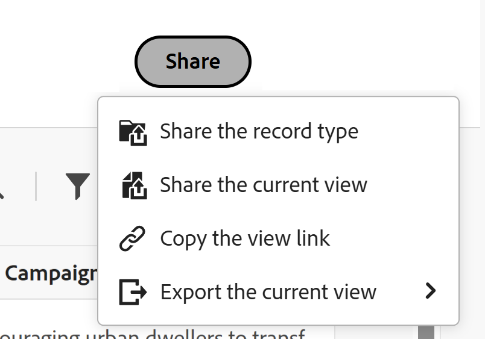

# テーブルビューからのレコードのエクスポート

<!--The information on this page refers to functionality not yet generally available. It is available only in the Preview environment for all customers. After the monthly releases to Production, the same features are also available in the Production environment for customers who enabled fast releases.    

For information about fast releases, see [Enable or disable fast releases for your organization](/help/quicksilver/administration-and-setup/set-up-workfront/configure-system-defaults/enable-fast-release-process.md). -->

{{planning-important-intro}}

レコードとその情報をテーブル表示からAdobe Workfront Planning の Excel または CSV ファイルにエクスポートできます。

## アクセス要件

+++ 展開して、この記事の機能のアクセス要件を表示します。 

<table style="table-layout:auto"> 
<col> 
</col> 
<col> 
</col> 
<tbody> 
    <tr> 
<tr> 
</tr>   
<tr> 
   <td role="rowheader">
Adobe Workfront パッケージ
</td> 
   <td> 
<ul> 
<li>
任意のWorkfrontと任意の Planning パッケージ
</li>
または
<li>
任意のワークフローおよび任意の計画パッケージ
</li></ul>

各Workfront Planning パッケージに含まれる内容について詳しくは、Workfront アカウント担当者にお問い合わせください。 
 
   </td> 
  <tr> 
   <td role="rowheader">
Adobe Workfront プラン
</td> 
   <td>
ライト以上

   </td> 
  </tr> 
  <tr> 
   <td role="rowheader">
オブジェクト権限
</td> 
   <td> 
ワークスペースおよびレコードタイプに対する表示以上の権限
   
   
ビューに対する表示以上の権限

</td> 
  </tr> 
  <tr>
   <td role="rowheader">
レイアウトテンプレート
</td>
   <td> ライト ライセンスまたはコントリビュータ ライセンスを持つユーザには、Planning を含むレイアウト テンプレートを割り当てる必要があります。
   
標準ユーザーとシステム管理者は、デフォルトで Planning 領域を有効にします。

</li></ul>
</td>
  </tr>  
</tbody> 
</table>

Workfrontのアクセス要件について詳しくは、[Workfront ドキュメントのアクセス要件 ](/help/quicksilver/administration-and-setup/add-users/access-levels-and-object-permissions/access-level-requirements-in-documentation.md) を参照してください。

+++   

<!--Old:
<table style="table-layout:auto"> 
<col> 
</col> 
<col> 
</col> 
<tbody> 
    <tr> 
<tr> 
<td> 
   
 Products
 </td> 
   <td> 
   <ul><li>
 Adobe Workfront
</li> 
   <li>
 Adobe Workfront Planning
</li></ul></td> 
  </tr>   
<tr> 
   <td role="rowheader">
Adobe Workfront plan*
</td> 
   <td> 

Any of the following Workfront plans:
 
<ul><li>Select</li> 
<li>Prime</li> 
<li>Ultimate</li></ul> 

Workfront Planning is not available for legacy Workfront plans
 
   </td> 
<tr> 
   <td role="rowheader">
Adobe Workfront Planning package*
</td> 
   <td> 

Any 
 

For more information about what is included in each Workfront Planning plan, contact your Workfront account manager. 
 
   </td> 
 <tr> 
   <td role="rowheader">
Adobe Workfront platform
</td> 
   <td> 

Your organization's instance of Workfront must be onboarded to the Adobe Unified Experience to be able to access Workfront Planning.
 

For more information, see <a href="/help/quicksilver/workfront-basics/navigate-workfront/workfront-navigation/adobe-unified-experience.md">Adobe Unified Experience for Workfront</a>. 
 
   </td> 
   </tr> 
  </tr> 
  <tr> 
   <td role="rowheader">
Adobe Workfront license*
</td> 
   <td>
 Light or higher 

   
Workfront Planning is not available for legacy Workfront licenses
 
  </td> 
  </tr> 
  <tr> 
   <td role="rowheader">
Access level configuration
</td> 
   <td> 
There are no access level controls for Adobe Workfront Planning
   
</td> 
  </tr> 
<tr> 
   <td role="rowheader">
Object permissions
</td> 
   <td>   
View or higher permissions to a view
  
   </td> 
  </tr> 
</tbody> 
</table> -->

## テーブルビューからのレコードのエクスポート

テーブルビューをエクスポートする場合は、以下の点に注意してください。

* Excel ファイルに書き出された情報は、Workfront Planning のテーブルビューに適用されたフィルター、グループ化および並べ替えを保持します。 グループ化は、CSV ファイルには表示されません。

* サムネールとカスタム行カラーは、書き出されたファイルではサポートされません。

* Workfront インターフェイスで表示されたフィールドのみが書き出されます。 非表示のフィールドは書き出されません。

テーブル表示またはレコードタイプから情報をエクスポートするには：

1. レコードタイプのページに移動し、「テーブル表示」タブをクリックします。
1. 次のいずれかの操作を行います。

   * テーブルビュータブの名前にカーソルを合わせ、ビュー名の右側にある **その他** メニュー  をクリックしてから、**エクスポート** をクリックしてください。

   

   * **共有**/**現在のビューを書き出し** をクリックします。 このオプションは、テーブルビューを表示する場合にのみ使用できます。

   

1. 次のいずれかの形式を選択します。

   * **Excel**
   * **CSV**

   >[!IMPORTANT]
   >
   >画面に別のビューを表示している場合、テーブルビューから情報をエクスポートすることはできません。 「詳細」 メニューの「エクスポート」 オプションにアクセスするには、エクスポートするテーブルビューを表示する必要があります。

   ファイルがコンピューターにダウンロードされます。

1. （オプション）コンピューターのダウンロードフォルダーに移動し、ダウンロードしたファイルを見つけます。

   書き出されるファイルの名前は、次の形式に従います。

   `Name of the view - name of the record type`

   例えば、キャンペーン レコードタイプのテーブル ビューでは、`Table view - Campaigns` という名前のファイルを生成します。

   ファイルには次の情報が表示されます。

   * Excel ファイルでは、列ヘッダーが黒でハイライト表示されます
   * Workfront インターフェイスに表示されるすべてのフィールド（同じ条件で並べ替えおよびフィルタリングされます）
   * グループ化は Excel ファイルに保持されます

   書き出したファイルを他のユーザーと共有したり、任意の通信に添付したりできるようになりました。

