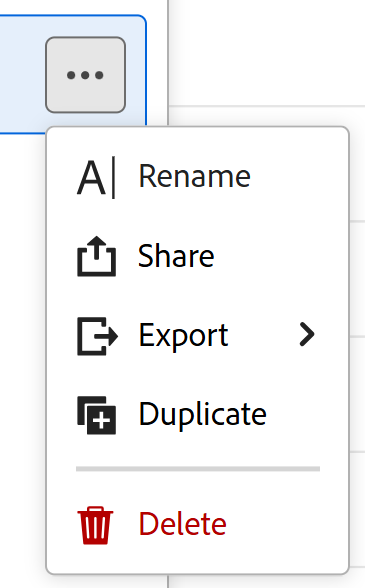
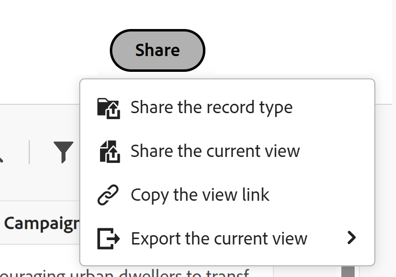

# テーブルビューからのレコードの書き出し

<!--
The information on this page refers to functionality not yet generally available. It is available only in the Preview environment for all customers. After the monthly releases to Production, the same features are also available in the Production environment for customers who enabled fast releases.    

For information about fast releases, see [Enable or disable fast releases for your organization](/help/quicksilver/administration-and-setup/set-up-workfront/configure-system-defaults/enable-fast-release-process.md). 
-->

{{planning-important-intro}}

レコードとその情報をテーブルビューからExcelまたはAdobe Workfront PlanningのCSV ファイルに書き出すことができます。

## アクセス要件

+++ 展開して、この記事の機能のアクセス要件を表示します。 

<table style="table-layout:auto"> 
<col> 
</col> 
<col> 
</col> 
<tbody> 
    <tr> 
<tr> 
</tr>   
<tr> 
   <td role="rowheader">
Adobe Workfront パッケージ
</td> 
   <td> 

任意のWorkfrontおよびプランニングパッケージ
 
任意のワークフローとプランニングパッケージ

各Workfront計画パッケージに含まれる内容について詳しくは、Workfrontの担当者にお問い合わせください。 
 
   </td> 
  <tr> 
   <td role="rowheader">
Adobe Workfront プラン
</td> 
   <td>
明るいまたはそれ以上

   </td> 
  </tr> 
  <tr> 
   <td role="rowheader">
オブジェクト権限
</td> 
   <td> 
ワークスペースおよびレコードタイプに対する表示以上の権限
   
   
ビューに対するアクセス許可を表示または上げる

</td> 
  </tr> 
  <tr>
   <td role="rowheader">
レイアウトテンプレート
</td>
   <td> LightまたはContributor ライセンスを持つユーザーには、Planningを含むレイアウトテンプレートを割り当てる必要があります。
   
標準ユーザーとシステム管理者は、デフォルトでプランニング領域を有効にできます。

</li></ul>
</td>
  </tr>  
</tbody> 
</table>

Workfrontのアクセス要件について詳しくは、[Workfront ドキュメント ](/help/quicksilver/administration-and-setup/add-users/access-levels-and-object-permissions/access-level-requirements-in-documentation.md)のアクセス要件を参照してください。

+++   

<!--
Old:
<table style="table-layout:auto"> 
<col> 
</col> 
<col> 
</col> 
<tbody> 
    <tr> 
<tr> 
<td> 
   
 Products
 </td> 
   <td> 
   <ul><li>
 Adobe Workfront
</li> 
   <li>
 Adobe Workfront Planning
</li></ul></td> 
  </tr>   
<tr> 
   <td role="rowheader">
Adobe Workfront plan*
</td> 
   <td> 

Any of the following Workfront plans:
 
<ul><li>Select</li> 
<li>Prime</li> 
<li>Ultimate</li></ul> 

Workfront Planning is not available for legacy Workfront plans
 
   </td> 
<tr> 
   <td role="rowheader">
Adobe Workfront Planning package*
</td> 
   <td> 

Any 
 

For more information about what is included in each Workfront Planning plan, contact your Workfront account manager. 
 
   </td> 
 <tr> 
   <td role="rowheader">
Adobe Workfront platform
</td> 
   <td> 

Your organization's instance of Workfront must be onboarded to the Adobe Unified Experience to be able to access Workfront Planning.
 

For more information, see <a href="/help/quicksilver/workfront-basics/navigate-workfront/workfront-navigation/adobe-unified-experience.md">Adobe Unified Experience for Workfront</a>. 
 
   </td> 
   </tr> 
  </tr> 
  <tr> 
   <td role="rowheader">
Adobe Workfront license*
</td> 
   <td>
 Light or higher 

   
Workfront Planning is not available for legacy Workfront licenses
 
  </td> 
  </tr> 
  <tr> 
   <td role="rowheader">
Access level configuration
</td> 
   <td> 
There are no access level controls for Adobe Workfront Planning
   
</td> 
  </tr> 
<tr> 
   <td role="rowheader">
Object permissions
</td> 
   <td>   
View or higher permissions to a view
  
   </td> 
  </tr> 
</tbody> 
</table>
-->

## テーブルビューからのレコードの書き出し

テーブルビューを書き出す際には、次の点を考慮してください。

* Excel ファイルに書き出されたデータは、Workfront Planningのテーブルビューに適用されたフィルター、グループ化、並べ替えが保持されます。 グループ化はCSV ファイルには表示されません。

* サムネールとカスタム行の色は、書き出したファイルではサポートされていません。

* Workfront インターフェイスで表示されたフィールドのみが書き出されます。 非表示のフィールドは書き出されません。

テーブルビューまたはレコードタイプから情報を書き出すには：

1. レコードタイプページに移動し、「表表示」タブをクリックします。
1. 次のいずれかの操作を行います。

   * テーブル表示タブの名前にカーソルを合わせ、ビュー名の右側にある&#x200B;**詳細** メニューをクリックし、**書き出し**&#x200B;をクリックします。

   

   * 「**共有**」 > 「**現在のビューを書き出し**」をクリックします。 このオプションは、テーブルビューを表示する場合にのみ使用できます。

   

1. 次のいずれかの形式を選択します。

   * **Excel**
   * **CSV**

   >[!IMPORTANT]
   >
   >画面に別のビューを表示する場合、テーブルビューから情報を書き出すことはできません。 詳細メニューの「書き出し」オプションにアクセスするには、書き出すテーブルビューを表示する必要があります。

   ファイルがコンピューターにダウンロードされます。

1. （オプション）コンピューターのダウンロードフォルダーに移動し、ダウンロードしたファイルを見つけます。

   書き出されたファイルの名前は、次の形式に従います。

   `Name of the view - name of the record type`

   例えば、Campaigns レコードタイプのテーブルビューは、`Table view - Campaigns`という名前のファイルを生成します。

   ファイルには次の情報が表示されます。

   * Excel ファイルで、列ヘッダーが黒で強調表示される
   * Workfront インターフェイスに表示されるすべてのフィールドが、同じ条件で並べ替えられ、フィルタリングされます
   * グループ化はExcel ファイルに保存されます

   書き出したファイルを他のユーザーと共有したり、任意のコミュニケーションに添付したりできるようになりました。

