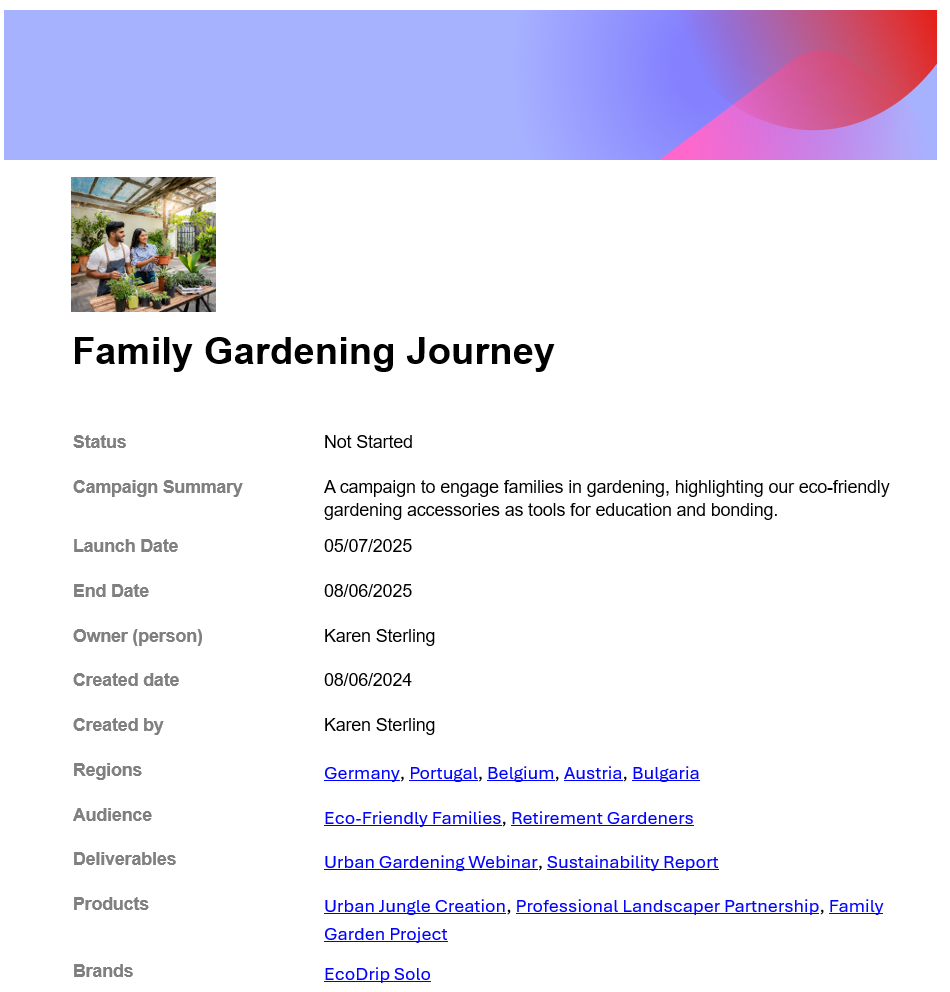

# レコードの詳細のエクスポート

<!--The highlighted information on this page refers to functionality not yet generally available. It is available only in the Preview environment for all customers, or in the Production environment for customers who enabled fast releases.

For information about fast releases, see [Enable or disable fast releases for your organization](/help/quicksilver/administration-and-setup/set-up-workfront/configure-system-defaults/enable-fast-release-process.md).

For information about the current release, see [Fourth Quarter 2023 release overview](/help/quicksilver/product-announcements/product-releases/23-q4-release-activity/23-q4-release-overview.md).-->

Workfront アカウントを持っていない他のユーザーとのより効率的な共同作業を行うために、レコードの詳細をファイルに書き出して共有できます。

## アクセス要件

+++ 展開すると、Workfront Planning のアクセス要件が表示されます。

この記事の手順を実行するには、次のアクセス権が必要です。

<table style="table-layout:auto"> 
<col> 
</col> 
<col> 
</col> 
<tbody> 
    <tr> 
<tr> 
<td> 
   
 製品
 </td> 
   <td> 
   <ul><li>
 Adobe Workfront
</li> 
   <li>
 Adobe Workfrontの計画
</li></ul></td> 
  </tr>   
<tr> 
   <td role="rowheader">
Adobe Workfront プラン*
</td> 
   <td> 

次のいずれかのWorkfront プラン：
 
<ul><li>選択</li> 
<li>Prime</li> 
<li>Ultimate</li></ul> 

Workfront Planning は、従来のWorkfront プランでは使用できません
 
   </td> 
<tr> 
   <td role="rowheader">
Adobe Workfront計画*
</td> 
   <td> 

任意 
 

各Workfront Planning プランに含まれる内容について詳しくは、Workfront担当営業または販売店にお問い合わせください。 
 
   </td> 
 <tr> 
   <td role="rowheader">
Adobe Workfront platform
</td> 
   <td> 

組織のWorkfront インスタンスは、Workfront Planning のすべての機能にアクセスできるように、Adobe Unified Experience にオンボーディングされる必要があります。
 

詳しくは、<a href="/help/quicksilver/workfront-basics/navigate-workfront/workfront-navigation/adobe-unified-experience.md">Workfront の Adobe Unified Experience</a> を参照してください。 
 
   </td> 
   </tr> 
  </tr> 
  <tr> 
   <td role="rowheader">
Adobe Workfront プラン*
</td> 
   <td> 
標準

   
Workfront Planning は、従来のWorkfront ライセンスでは使用できません
 
  </td> 
  </tr> 
  <tr> 
   <td role="rowheader">
アクセスレベルの設定
</td> 
   <td> 
Adobe Workfront Planning に対するアクセスレベルのコントロールはありません。
   
</td> 
  </tr> 
<tr> 
   <td role="rowheader">
オブジェクト権限
</td> 
   <td>   
ワークスペースに対する表示またはそれ以上の権限</a> 
  
   
システム管理者は、作成しなかったワークスペースも含め、すべてのワークスペースに対する権限を持っています。
 </td> 
  </tr> 
<tr> 
   <td role="rowheader">
レイアウトテンプレート
</td> 
   <td> 
Workfront の管理者を含むすべてのユーザーには、メインメニューの Planning エリアを含むレイアウトテンプレートを割り当てる必要があります。 
 </td> 
  </tr> 
</tbody> 
</table>

*Workfront のアクセス要件について詳しくは、[Workfront ドキュメントのアクセス要件](/help/quicksilver/administration-and-setup/add-users/access-levels-and-object-permissions/access-level-requirements-in-documentation.md)を参照してください。

+++

## レコードの詳細の書き出しに関する考慮事項：

* レコードの詳細を次のファイル形式で書き出すことができます。

   * .docx Word
   * .pdf

* レコードのページの「詳細」タブを書き出すことができます。

* 書き出されたファイルには、サムネールやカバー画像を含むレコードページのレイアウトが保持されます。

## レコードの詳細のエクスポート

{{step1-to-planning}}

1. ワークスペースのカードをクリックします。

   ワークスペースが開き、カードにレコードタイプが表示されます。

1. レコードタイプのカードをクリックします。
レコードタイプのページが開き、そのタイプのすべてのレコードが表示されます。

1. 任意のビューで、レコードの名前をクリックします。

   レコードのプレビューボックスが開きます。

1. （オプション） **新しいタブで開く** アイコン  をクリックして、レコードのページを開きます。

1. 「**詳細**」タブを選択します。 「詳細」タブは、デフォルトで開きます。

1. プレビューまたはレコードのページ  ある **エクスポート** メニューをクリックし、次のいずれかをクリックします。

   * **Microsoft Word**
   * **Adobe PDF**

   Word （.docx）またはPDF ファイルがダウンロードされ、コンピュータに保存されます。

   書き出されるファイルの名前は、レコードのプライマリフィールドです。

   

   >[!NOTE]
   >
   >    ページに表示されず、レコードの詳細領域の「詳細を表示」をクリックした後にのみ表示される追加情報は、書き出されたPDFファイルには表示されません。 ページに表示される情報のみが書き出されたファイルに表示されます。

1. （オプション）ダウンロードしたファイルに移動して、ファイルを開いて編集するか（Word ファイルの場合）、他のユーザーと共有します。

