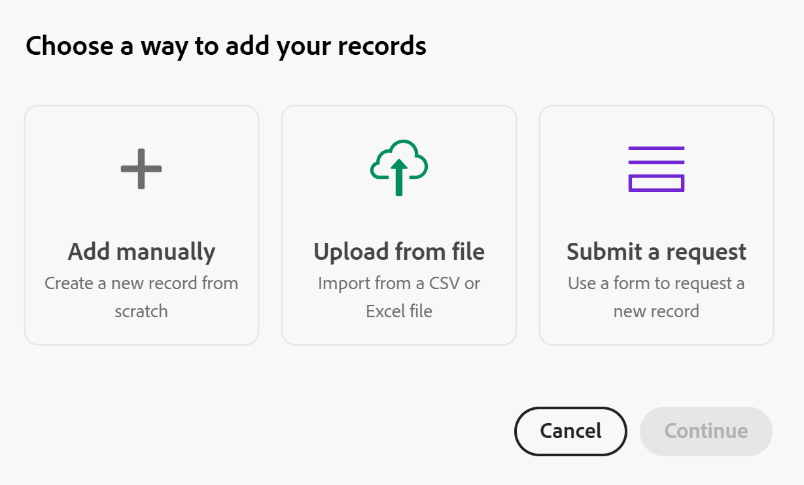
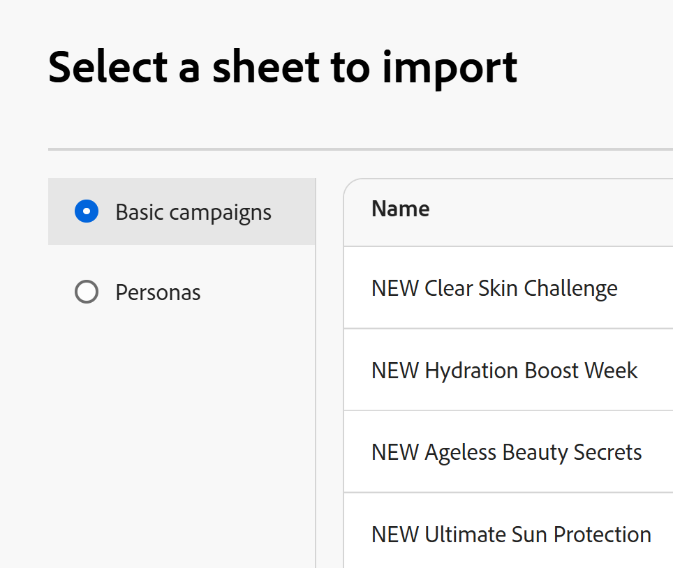
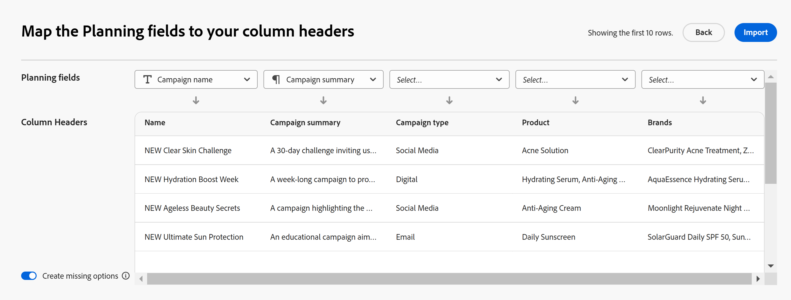

# CSV または Excel ファイルから情報を読み込んで、レコードを作成

<!--
The information on this page refers to functionality not yet generally available. It is available only in the Preview environment for all customers. After the monthly releases to Production, the same features are also available in the Production environment for customers who enabled fast releases.    

For information about fast releases, see [Enable or disable fast releases for your organization](/help/quicksilver/administration-and-setup/set-up-workfront/configure-system-defaults/enable-fast-release-process.md). 
-->

{{planning-important-intro}}

レコードは、Adobe Workfront Planningのオブジェクトタイプであるレコードタイプの個々のインスタンスです。 Workfront Planningでは、CSVまたはExcel ファイルから情報を読み込むことで、レコードを作成できます。

レコードの作成について詳しくは、[&#x200B; レコードの作成](/help/quicksilver/planning/records/create-records.md)を参照してください。

## アクセス要件

+++ 展開して、この記事の機能のアクセス要件を表示します。 

<table style="table-layout:auto"> 
<col> 
</col> 
<col> 
</col> 
<tbody> 
    <tr> 
<tr> 
</tr>   
<tr> 
   <td role="rowheader">
Adobe Workfront パッケージ
</td> 
   <td> 

任意のWorkfrontおよびプランニングパッケージ
 
任意のワークフローとプランニングパッケージ

各Workfront計画パッケージに含まれる内容について詳しくは、Workfrontの担当者にお問い合わせください。 
 
   </td> 
  <tr> 
   <td role="rowheader">
Adobe Workfront プラン
</td> 
   <td>
標準

   </td> 
  </tr>

<tr> 
   <td role="rowheader">
オブジェクト権限
</td> 
   <td> 
レコードを読み込むワークスペースおよびレコードタイプに対して、より高い権限を付与します。 

   
システム管理者は、作成しなかったワークスペースも含め、すべてのワークスペースに対する権限を持っています。

   </td> 
  </tr>  
</tbody> 
</table>

Workfrontのアクセス要件について詳しくは、[Workfront ドキュメント &#x200B;](/help/quicksilver/administration-and-setup/add-users/access-levels-and-object-permissions/access-level-requirements-in-documentation.md)のアクセス要件を参照してください。

+++  

<!--
Old:
<table style="table-layout:auto"> 
<col> 
</col> 
<col> 
</col> 
<tbody> 
    <tr> 
<tr> 
<td> 
   
 Products
 </td> 
   <td> 
   <ul><li>
 Adobe Workfront
</li> 
   <li>
 Adobe Workfront Planning
</li></ul></td> 
  </tr>   
<tr> 
   <td role="rowheader">
Adobe Workfront plan*
</td> 
   <td> 

Any of the following Workfront plans:
 
<ul><li>Select</li> 
<li>Prime</li> 
<li>Ultimate</li></ul> 

Workfront Planning is not available for legacy Workfront plans
 
   </td> 
<tr> 
   <td role="rowheader">
Adobe Workfront Planning package*
</td> 
   <td> 

Any 
 

For more information about what is included in each Workfront Planning plan, contact your Workfront account manager. 
 
   </td> 
 <tr> 
   <td role="rowheader">
Adobe Workfront platform
</td> 
   <td> 

Your organization's instance of Workfront must be onboarded to the Adobe Unified Experience to be able to access Workfront Planning.
 

For more information, see <a href="/help/quicksilver/workfront-basics/navigate-workfront/workfront-navigation/adobe-unified-experience.md">Adobe Unified Experience for Workfront</a>. 
 
   </td> 
   </tr> 
  </tr> 
  <tr> 
   <td role="rowheader">
Adobe Workfront license*
</td> 
   <td> Standard
   
Workfront Planning is not available for legacy Workfront licenses
 
  </td> 
  </tr> 
  <tr> 
   <td role="rowheader">
Access level configuration
</td> 
   <td> 
There are no access level controls for Adobe Workfront Planning
 
   
Edit access in Workfront for the object types that you want to create (projects, programs, and portfolios) as you connect them from new records  
  
</td> 
  </tr> 
<tr> 
   <td role="rowheader">
Object permissions
</td> 
   <td> 
Contribute or higher permissions to the workspace and record type where you want to add records. 
  
   
System Administrators have permissions to all workspaces, including the ones they did not create

   
Manage permissions to Workfront objects (portfolios) to add children objects (projects).

   </td> 
  </tr> 
</tbody> 
</table>
-->

## ExcelまたはCSV ファイルを使用したレコードの読み込みに関する考慮事項

* 各シートの列ヘッダーは、レコードに関連付けられたフィールドになります。
* 各シートの各行は、関連付けられた一意のレコードになります。
* Excel ファイルに複数のシートが含まれている場合は、読み込みプロセスで選択した1つのシートの情報のみが読み込まれます。
* ファイルは次の値を超えてはなりません。
   * 25,000 行
   * 500 列
* ファイルのサイズは5 MB以下にする必要があります。
* 空のシートはサポートされていません。
* 次のタイプのフィールドはサポートされていないため、インポートシートのフィールドにマッピングできません。

   * WorkfrontおよびAdobe Experience Managerのオブジェクトタイプにフィールドを接続します。 接続フィールドのみをPlanning レコードタイプにマッピングできます。
   * 接続されたPlanning レコードまたはWorkfrontおよびAdobe Experience Manager オブジェクトからのルックアップフィールド
   * 数式フィールド
   * 作成日、作成者
   * 最終変更日、最終変更者
   * 承認日、承認者
   * ユーザー
   * レコード ID
   * 複数選択または単一選択フィールドが読み込まれ、Planningの類似フィールドよりも多くの選択肢がある場合、読み込み中に追加のオプションが作成されます。 ワークスペースに対する管理権限を持つユーザーのみが、新しい選択肢をインポートできます。

## CSVまたはExcel ファイルを読み込んでレコードを作成する

{{step1-to-planning}}

1. レコードを作成するワークスペースをクリックします，

   または

   ワークスペースから、既存のワークスペース名の右側にある下向き矢印を展開し、ワークスペースを検索して、リストに表示されるときに選択します。
1. レコードを読み込むレコードタイプのカードをクリックします。
1. 画面の右上隅にある&#x200B;**新しいレコード**&#x200B;をクリックします。

   
1. 「**ファイルからアップロード**」、「**続行**」の順にクリックします。<!--add screen shot when all three buttons are added - with the Submit a request button-->
1. コンピューターに保存済みの Excel ファイルまたは CSV ファイルをドラッグアンドドロップするか、「**CSV ファイルまたは Excel ファイルを選択**」をクリックして参照します。
1. 「**プレビューして編集**」をクリックします。
1. （条件付き）読み込んだファイルに複数のシートがある場合は、**読み込むシートを選択** ボックスで読み込むシートのラジオボタンを選択し、**次へ**&#x200B;をクリックします。 それ以外は、次のステップに進みます。

   
1. **プランニングフィールドを列ヘッダーにマッピングする**&#x200B;で、シートの各列の情報に最も一致する&#x200B;**プランニングフィールド**&#x200B;を選択します。

   

   各行は新しいレコードを表します。「プレビューと編集」ボックスには、最初の 10 レコードのみが表示されます。

   >[!TIP]
   >
   >すべてのフィールドタイプがサポートされているわけではありません。 詳しくは、この記事の「[ExcelまたはCSV ファイルを使用したレコードの読み込みに関する考慮事項](#considerations-about-importing-records-using-an-excel-or-csv-file)」を参照してください。

1. （オプションおよび条件付き）ワークスペースに対する管理権限がある場合は、画面の左下隅にある「**見つからないオプションを作成**」を選択します。 有効にすると、単一選択フィールドと複数選択フィールドの選択肢が追加されます。

   >[!NOTE]
   >
   >例えば、選択したレコードタイプに「新規」、「進行中」、「クローズ」のオプションを含む単一選択の「ステータス」フィールドがあり、ファイルから読み込まれた「ステータス」フィールドにも「保留中ステータス」のオプションがある場合、「保留中」ステータスのオプションも追加されます。
   >
   >ワークスペースに対する管理権限がない場合は、レコードを読み込むことができますが、追加の選択肢は作成されません。 代わりに、「計画フィールドを列ヘッダーにマッピング」ボックスの右上隅に次のメッセージが表示されます。**接続に存在しない選択肢、単一または複数選択フィールドは追加されません**。

1. 「**インポート**」をクリックします。

   次の情報が Workfront Planning にインポートされます。

   * 選択したレコードタイプのテーブルビューの下部に表示される新しいレコード。
   * 各レコードに関連付けられた既存のフィールドの新しいフィールド値。
   * Planningに存在しなかった複数選択または単一選択フィールドの新しい選択肢。 <!--when we add connected records - add those here too-->

   レコードタイプ ページでフィールドとレコードの管理を開始できます。

   Workfront Planningおよびワークスペースにアクセスできるユーザーは、読み込まれたレコードとその情報を表示および編集できるようになりました。

   <!--when we add connected records and the info icon in the tool changes, also add those items to the Import step and to the NOTE above it-->
