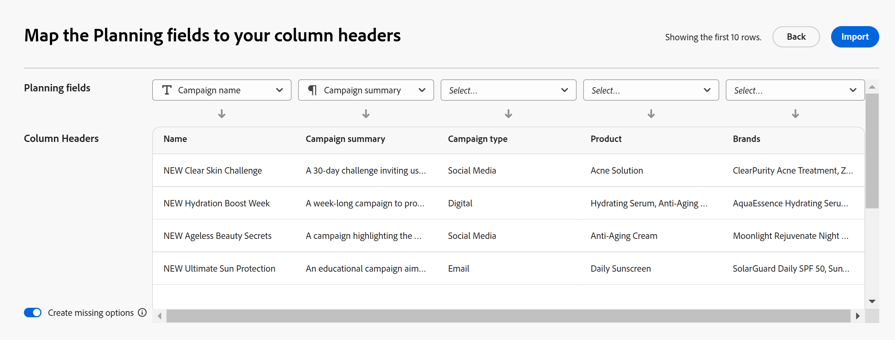

# CSV または Excel ファイルから情報を読み込んでレコードを作成

このページの情報は、まだ一般に提供されていない機能を指します。すべてのお客様が、プレビュー環境でのみ使用できます。 実稼動環境への毎月のリリースの後、迅速なリリースを有効にしたお客様には、実稼動環境でも同じ機能を利用できます。

迅速リリースについて詳しくは、[組織での迅速リリースを有効または無効にする](/help/quicksilver/administration-and-setup/set-up-workfront/configure-system-defaults/enable-fast-release-process.md)を参照してください。

{{planning-important-intro}}

レコードは、レコードタイプの個々のインスタンスであり、Adobe Workfront Planning のオブジェクトタイプです。 Workfront Planning では、CSV または Excel ファイルから情報をインポートしてレコードを作成できます。

レコードの作成について詳しくは、「[ レコードの作成 ](/help/quicksilver/planning/records/create-records.md)」を参照してください。

## アクセス要件

+++ 展開すると、Workfront Planning のアクセス要件が表示されます。

この記事の手順を実行するには、次のアクセス権が必要です。

<table style="table-layout:auto"> 
<col> 
</col> 
<col> 
</col> 
<tbody> 
    <tr> 
<tr> 
<td> 
   
 製品
 </td> 
   <td> 
   <ul><li>
 Adobe Workfront
</li> 
   <li>
 Adobe Workfrontの計画
</li></ul></td> 
  </tr>   
<tr> 
   <td role="rowheader">
Adobe Workfront プラン*
</td> 
   <td> 

次のいずれかのWorkfront プラン：
 
<ul><li>選択</li> 
<li>Prime</li> 
<li>Ultimate</li></ul> 

Workfront Planning は、従来のWorkfront プランでは使用できません
 
   </td> 
<tr> 
   <td role="rowheader">
Adobe Workfront Planning パッケージ*
</td> 
   <td> 

任意 
 

各Workfront Planning プランに含まれる内容について詳しくは、Workfront担当営業または販売店にお問い合わせください。 
 
   </td> 
 <tr> 
   <td role="rowheader">
Adobe Workfront platform
</td> 
   <td> 

組織のWorkfront インスタンスは、Workfront Planning のすべての機能にアクセスできるように、Adobe Unified Experience にオンボーディングされる必要があります。
 

詳しくは、<a href="/help/quicksilver/workfront-basics/navigate-workfront/workfront-navigation/adobe-unified-experience.md">Workfront の Adobe Unified Experience</a> を参照してください。 
 
   </td> 
   </tr> 
  </tr> 
  <tr> 
   <td role="rowheader">
Adobe Workfront プラン*
</td> 
   <td> 標準
   
Workfront Planning は、従来のWorkfront ライセンスでは使用できません
 
  </td> 
  </tr> 
  <tr> 
   <td role="rowheader">
アクセスレベルの設定
</td> 
   <td> 
Adobe Workfront Planning に対するアクセスレベルのコントロールはありません。
 
   
レコードを関連付ける際に作成するオブジェクトタイプ（プロジェクト、プログラム、ポートフォリオ）のWorkfrontでのアクセス権を編集します。 
  
</td> 
  </tr> 
<tr> 
   <td role="rowheader">
オブジェクト権限
</td> 
   <td> 
レコードを追加するワークスペースに対する投稿以上の権限。 
  
   
システム管理者は、作成しなかったワークスペースも含め、すべてのワークスペースに対する権限を持っています。

   
子オブジェクト（プロジェクト）を追加するためのWorkfront オブジェクト（ポートフォリオ）への権限を管理します。

   </td> 
  </tr> 
<tr> 
   <td role="rowheader">
レイアウトテンプレート
</td> 
   <td> 
Workfront管理者を含むすべてのユーザーには、メインメニューに計画エリアを含むレイアウトテンプレートを割り当てる必要があります 
 </td> 
  </tr> 
</tbody> 
</table>

*Workfront のアクセス要件について詳しくは、[Workfront ドキュメントのアクセス要件](/help/quicksilver/administration-and-setup/add-users/access-levels-and-object-permissions/access-level-requirements-in-documentation.md)を参照してください。

+++

## Excel または CSV ファイルを使用したレコードの読み込みに関する考慮事項

* 各シートの列ヘッダーは、レコードに関連付けられたフィールドになります。
* 各シートの各行は、一意のレコードに関連付けられます。
* Excel ファイルに複数のシートが含まれている場合、インポート時に選択したシートの情報のみがインポートされます。
* ファイルのサイズは次の値を超えないようにします。
   * 25,000 行
   * 500 列
* ファイルのサイズは 5 MB 以下にしてください。
* 空のシートはサポートされていません。
* 次のタイプのフィールドはサポートされておらず、インポートシートのフィールドにマッピングできません。
   * 接続されたレコードの接続およびルックアップフィールド <!--or connected Workfront objects-->
   * 数式フィールド
   * 作成日、作成者
   * 最終変更日、最終変更者
   * ユーザー
   * 複数選択または単一選択のフィールドがインポートされ、Planning の類似のフィールドより多くの選択肢がある場合、インポート中に追加のオプションが作成されます。 ワークスペースに対する管理権限を持つユーザーのみが、新しい選択肢を読み込むことができます。

## CSV または Excel ファイルの読み込みによるレコードの作成

{{step1-to-planning}}

1. レコードを作成するワークスペースをクリックします。

   または

   ワークスペースから、既存のワークスペース名の右側にある下向き矢印を展開してワークスペースを検索し、リストに表示されたら選択します。
1. レコードをインポートするレコードの種類のカードをクリックします。
1. 画面の右上隅にある「**新規レコード**」をクリックします。
1. **ファイルからアップロード** をクリックし、**続行** をクリックします。<!--add screen shot when all three buttons are added - with the Submit a request button-->
1. コンピューターに保存済みの Excel ファイルまたは CSV ファイルをドラッグアンドドロップするか、「**CSV ファイルまたは Excel ファイルを選択**」をクリックして参照します。
1. **プレビューと編集** をクリックします。
1. （条件付き）読み込まれたファイルに複数のシートがある場合は、読み込むシートのラジオボタンを **読み込むシートを選択** ボックスで選択し、**次へ** をクリックします。 それ以外の場合は、次の手順に進みます。

   
1. **計画フィールドを列ヘッダーにマッピングする** で、シートの各列の情報に最も一致する **計画フィールド** を選択します。

   

   各行は新しいレコードを表します。「プレビューと編集」ボックスには、最初の 10 レコードのみが表示されます。

1. （オプションおよび条件付き）ワークスペースに対する管理権限がある場合は、画面の左下隅にある **欠落しているオプションを作成** を選択します。 有効にすると、単一選択フィールドと複数選択フィールドの欠落している選択肢が追加されます。

   >[!NOTE]
   >
   >たとえば、選択したレコード・タイプに、新規、進行中、クローズという選択肢を持つ単一選択ステータス・フィールドがあり、ファイルからインポートしたステータス・フィールドにも「保留中ステータス」選択肢がある場合、「保留中ステータス」選択肢も追加されます。
   >
   >ワークスペースに対する管理権限がない場合、レコードをインポートできますが、追加の選択肢は作成されません。 代わりに、「プランニングフィールドを列ヘッダーにマッピング」ボックスの右上隅に **接続に存在しない選択肢、単一選択フィールドまたは複数選択フィールドは追加されません** というメッセージが表示されます。

1. 「**インポート**」をクリックします。

   次の情報が Workfront Planning にインポートされます。

   * 選択したレコードタイプのテーブル表示の下部に表示される新しいレコード。
   * 各レコードに関連付けられている既存フィールドの新しいフィールド値。
   * Planning に存在しない複数選択フィールドまたは単一選択フィールドの新しい選択肢。 <!--when we add connected records - add those here too-->

   「レコードタイプ」ページでフィールドとレコードの管理を開始できます。

   Workfront Planning およびワークスペースへのアクセス権を持つすべてのユーザーは、インポートされたレコードとその情報を表示および編集できるようになりました。

   <!--when we add connected records and the info icon in the tool changes, also add those items to the Import step and to the NOTE above it-->
