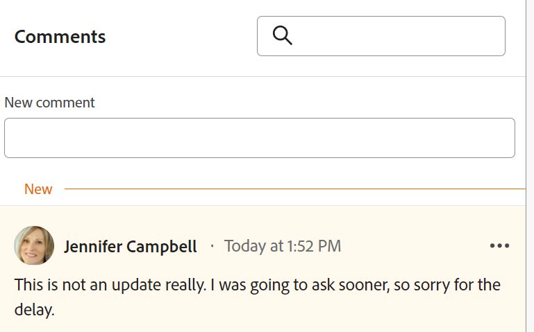

# レコードのコメントの管理

{{planning-important-intro}}

<!--update the system updates articles when we release to open beta - check the long commenting stream article list and see articles that document where in the system we have system updates; "Workfront Planning records" should be there-->

レコードの右側のパネルにコメントや返信を追加することで、Adobe Workfront Planning レコードに関する共同作業を行うことができます。また、レコードに加えられた他の変更やシステムにより記録された他の変更を、このエリアに表示することもできます。

レコードの右側のパネルには、次のセクションが表示されます。

* **コメント**：ユーザーがレコードに追加したコメントおよび返信を表示します。
* **履歴**：ユーザーがレコードフィールドに対して行った、システムで記録された変更を表示します。詳しくは、[「履歴」セクションの概要](/help/quicksilver/planning/records/history-section-overview.md)を参照してください。

## アクセス要件

+++ 展開すると、Workfront Planning のアクセス要件が表示されます。

Workfront Planning にアクセスするには、次のものが必要です：

<table style="table-layout:auto"> 
<col> 
</col> 
<col> 
</col> 
<tbody> 
    <tr> 
<tr> 
<td> 
   
 製品
 </td> 
   <td> 
   <ul><li>
 Adobe Workfront
</li> 
   <li>
 Adobe Workfrontの計画
</li></ul></td> 
  </tr>   
<tr> 
   <td role="rowheader">
Adobe Workfront プラン*
</td> 
   <td> 

次のいずれかのWorkfront プラン：
 
<ul><li>選択</li> 
<li>Prime</li> 
<li>Ultimate</li></ul> 

Workfront Planning は、従来のWorkfront プランでは使用できません
 
   </td> 
<tr> 
   <td role="rowheader">
Adobe Workfront計画*
</td> 
   <td> 

任意 
 

各Workfront Planning プランに含まれる内容について詳しくは、Workfront担当営業または販売店にお問い合わせください。 
 
   </td> 
 <tr> 
   <td role="rowheader">
Adobe Workfront platform
</td> 
   <td> 

組織のWorkfront インスタンスは、Workfront Planning のすべての機能にアクセスできるように、Adobe Unified Experience にオンボーディングされる必要があります。
 

詳しくは、<a href="/help/quicksilver/workfront-basics/navigate-workfront/workfront-navigation/adobe-unified-experience.md">Workfront の Adobe Unified Experience</a> を参照してください。 
 
   </td> 
   </tr> 
  </tr> 
  <tr> 
   <td role="rowheader">
Adobe Workfront プラン*
</td> 
   <td>
 共同作成者、ライト、または標準

   
Workfront Planning は、従来のWorkfront ライセンスでは使用できません
 
  </td> 
  </tr> 
  <tr> 
   <td role="rowheader">
アクセスレベルの設定
</td> 
   <td> 
Adobe Workfront Planning に対するアクセスレベルのコントロールはありません。
   
</td> 
  </tr> 
<tr> 
   <td role="rowheader">
オブジェクト権限
</td> 
   <td>   
ワークスペースに対する表示またはそれ以上の権限</a> 
  
   
システム管理者は、作成しなかったワークスペースも含め、すべてのワークスペースに対する権限を持っています。
 </td> 
  </tr> 
<tr> 
   <td role="rowheader">
レイアウトテンプレート
</td> 
   <td> 
Workfront の管理者を含むすべてのユーザーには、メインメニューの Planning エリアを含むレイアウトテンプレートを割り当てる必要があります。 
 </td> 
  </tr> 
</tbody> 
</table>

*Workfront のアクセス要件について詳しくは、[Workfront ドキュメントのアクセス要件](/help/quicksilver/administration-and-setup/add-users/access-levels-and-object-permissions/access-level-requirements-in-documentation.md)を参照してください。

+++

## レコードへのコメントに関する考慮事項

* レコードの「コメント」セクションで、Workfront Planning のレコードにコメントや返信を追加できます。

* リンク先のレコードに追加されたコメントは、リンク元のレコードには表示されません。例えば、キャンペーンレコードにリンクされている Workfront Planning の製品レコードにコメントを付けると、そのコメントは Workfront Planning の製品レコードにのみ表示され、リンク元のキャンペーンレコードには表示されません。

* レコードと別のアプリケーションのオブジェクトとの接続の結果として作成された Workfront Planning レコードにコメントを追加できます。

  例えば、Workfront プロジェクトを Workfront Planning レコードと接続した後で、プロジェクトの Workfront Planning レコードにコメントを付けることができます。詳しくは、[レコードの接続](/help/quicksilver/planning/records/connect-records.md)を参照してください。

* 他のアプリケーションでリンク先のオブジェクトに追加されたコメントは Workfront Planning には表示されず、Workfront Planning でリンク先のオブジェクトに追加されたコメントは他のアプリケーションには表示されません。

  例えば、Workfront のプロジェクトに追加されたコメントは、Workfront Planning のキャンペーンにリンクされている同じプロジェクトには表示されず、プロジェクトの Workfront Planning レコードに追加されたコメントは Workfront には表示されません。

* ユーザーにタグ付けして、更新に注意を向けさせることができます。タグ付きユーザーには、更新に関するアプリ内通知およびメールが届きません。<!--this might change??-->

* ユーザーにタグ付けして、更新に注意を向けさせることができます。タグ付けされたユーザーには、アプリ内通知または更新に関するメール通知が届きます。

  >[!NOTE]
  >
  >   Adobeの統合エクスペリエンスにオンボーディングした顧客のユーザーのみが、アプリ内通知とメール通知の両方を受け取ります。 会社がAdobe統合エクスペリエンスを使用しているかどうかを判断するには、[WorkfrontのAdobe統合エクスペリエンス ](/help/quicksilver/workfront-basics/navigate-workfront/workfront-navigation/adobe-unified-experience.md) を参照してください。

* Workfront Planning の次のエリアから、レコードに更新を追加したり、変更履歴を確認したりできます。

   * レコードの詳細ページから。
   * ビューの「レコードの詳細」ボックスに移動します。

### レコードに対するコメントの管理

{{step1-to-planning}}

1. ワークスペースのカードをクリックします。

   ワークスペースが開き、カードにレコードタイプが表示されます。

1. レコードタイプのカードをクリックします。
レコードタイプのページが開き、そのタイプのすべてのレコードが表示されます。

1. 「**表示**」ドロップダウンメニューからテーブルビューを選択します。
1. テーブルビューでレコードの名前をクリックします。

   レコードの&#x200B;**詳細**&#x200B;ページが開きます。デフォルトではコメントエリアが右側のパネルに開きます。

1. （条件付き）デフォルトで右側のパネルが開かない場合は、右上隅の&#x200B;**コメントを表示**  アイコンをクリックして、「コメント」セクションを開きます。

1. **新しいコメント**&#x200B;ボックスにコメントを入力します。

   

   >[!TIP]
   >
   >コメント入力を完了して送信する前に「コメント」セクションから移動すると、ログオフしてログオンし直した後でも、ページ上のコメントはドラフトモードのままです。コメントに追加された画像も下書きに保存されます。ドラフトは 7 日間保存され、その後は破棄され、復元できません。下書きのコメントは、入力したユーザーのみに表示されます。

1. （オプション）変更の取り消しまたはやり直しを行うには、以下のショートカットキーを使用します。
   * Ctrl + Z（Mac の場合は ⌘+z）で、変更を元に戻します
   * Ctrl + Y（Mac の場合は ⌘+y）で、変更をやり直します
1. （オプションおよび条件付き）Workfront インスタンスがAdobe統合エクスペリエンスの一部である場合は、**@** に続けて、更新でユーザーをタグ付けするユーザー名を追加します。 詳細については、この記事の [ レコードにコメントする場合の考慮事項 ](#considerations-about-commenting-on-a-record) を参照してください。

1. （オプション） リッチテキストツールバーのオプションを使用して、テキストの書式設定や、更新への絵文字、リンクまたは画像の追加を行い、コンテンツを充実させます。

1. 引き続きレコードにコメントを追加します。

   Workfront Planning レコードを含むオブジェクトの更新の詳細は、[ 作業の更新 ](/help/quicksilver/workfront-basics/updating-work-items-and-viewing-updates/update-work.md) を参照してください。

<!--
      >[!TIP]
      >
      >If another user submits a comment to the same item you are updating, there is a red line with a "New" indicator to inform you of the newer comments. 
      >
      >The indicator displays only after the comment was submitted on the item, and not when the comment is still composed. 
      >
      >

1. Click **Submit** to add the update to the record. 
1. (Optional) To edit a comment, click the **More** menu  in the upper-right corner of the comment, then click **Edit**.

   >[!IMPORTANT]
   >
   >You can edit your comment only within 15 minutes from submitting it.  

1. Edit the information in the comment, add or remove images or remove any of the tagged users. An "edited" indicator is added to the left of the comment.
   
      >[!TIP]
      >
      >Comments from the current year do not display the year in the date stamp. Hovering over a timestamp displays the full date, including the year.

1. (Optional and conditional) To search for an existing comment, start typing a keyword in the search box in the upper-right corner of the **Comments** area.     

   
     
1. (Optional) Click **Reply** or start typing a comment in the **Add reply ...** area, to reply to an existing comment, then follow steps 4-8 above. (**************accurate??***********)

1. (Conditional and optional) If other users have added comments that display outside of the visible area in the Comments section while you were adding your comments, click **View** inside the **new comments banner** at the bottom of the screen  to display these comments.

    

    Additional comments display at the bottom of the screen.
  
1. (Optional) Click the **Like** icon to like an update or acknowledge that you read it. The icon updates with the number of likes.
1. (Conditional and optional) If you included additional people in your comment, click the avatars of the users included in the update to display a list of users that the comment is shared with. 
1. (Optional) Click the **More** icon  in the upper-right corner of the comment and click one of the following options, to copy a information from a comment: 

    * **Copy link**: This copies a link to the comment to your clipboard.
    * **Copy body text**: This copies the text of the comment to your clipboard.
    * **Quote reply**: This copies the content of your comment into a new reply. Images are not included in the copied reply. 

    For more information, see [Update work](/help/quicksilver/workfront-basics/updating-work-items-and-viewing-updates/update-work.md). -->

1. （オプション）コメントの右上隅にある&#x200B;**その他**&#x200B;アイコンをクリックし、「**削除**」をクリックしてコメントを削除します。
1. （オプション）**コメントの非表示**&#x200B;アイコンをクリックして、右側のパネルを閉じます。

## 履歴セクションの概要

レコードに加えられた変更は、レコードの右パネルの「履歴」セクションで確認できます。

詳しくは、[「履歴」セクションの概要](/help/quicksilver/planning/records/history-section-overview.md)を参照してください。
