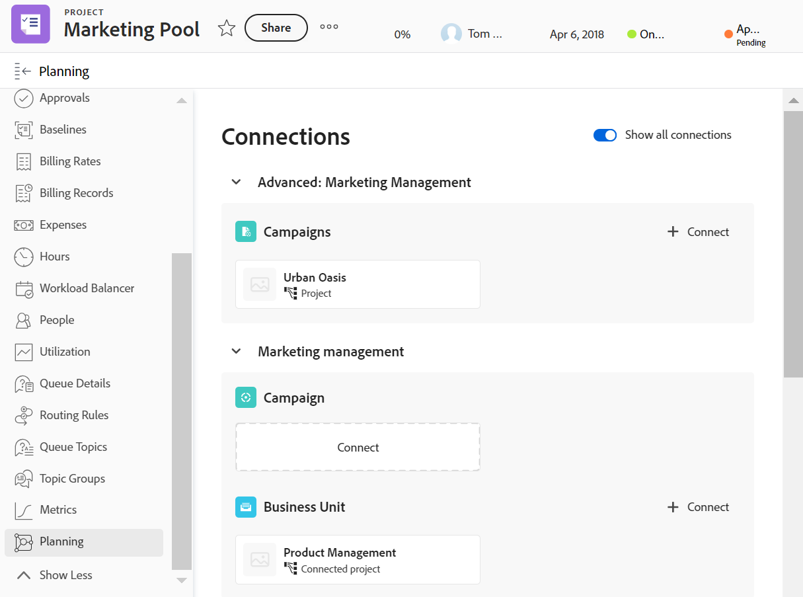
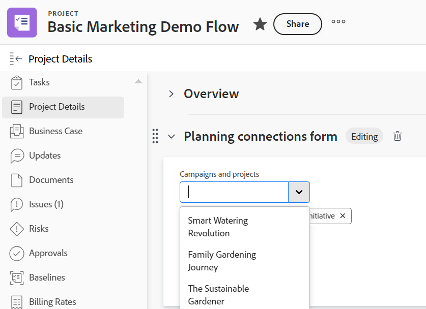
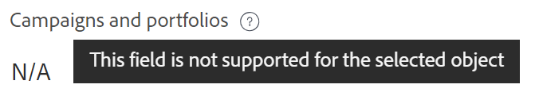
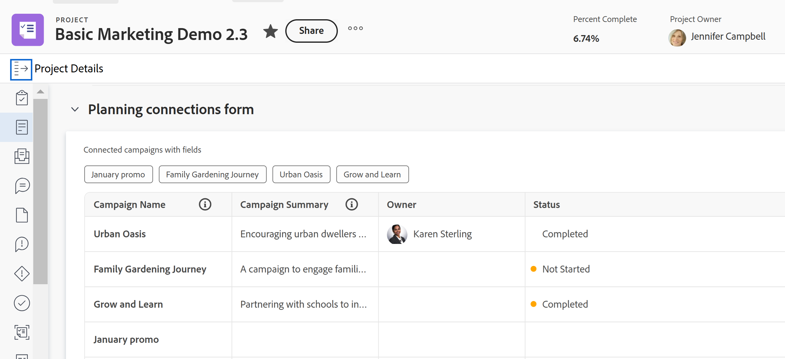

<!--add also Group and Company when they are available-->

# Workfront オブジェクトからのレコード接続の管理

<!--
The highlighted information on this page refers to functionality not yet generally available. It is available only in the Preview environment for all customers. After the monthly releases to Production, the same features are also available in the Production environment for customers who enabled fast releases.    

For information about fast releases, see [Enable or disable fast releases for your organization](/help/quicksilver/administration-and-setup/set-up-workfront/configure-system-defaults/enable-fast-release-process.md).
-->

{{planning-important-intro}}

WorkfrontのWorkfront計画レコードは、そのレコードに接続されているオブジェクトの次の領域に表示できます。

* Workfront オブジェクトの「計画」セクション：オブジェクトに接続されているすべてのレコードタイプと、それぞれの接続されているレコードが表示されます。
* Planning接続カスタムフィールド：1つのレコードタイプ、それぞれの接続されたレコード、および接続されたレコードの最大7つのルックアップフィールドが表示されます。

## アクセス要件

+++ 展開して、この記事の機能のアクセス要件を表示します。 

<table style="table-layout:auto"> 
<col> 
</col> 
<col> 
</col> 
<tbody> 
    <tr> 
<tr> 
</tr>   
<tr> 
   <td role="rowheader">
Adobe Workfront パッケージ
</td> 
   <td> 

任意のWorkfrontおよびプランニングパッケージ

任意のワークフローとプランニングパッケージ

各Workfront計画パッケージに含まれる内容について詳しくは、Workfrontの担当者にお問い合わせください。 
 
   </td> 
  <tr> 
   <td role="rowheader">
Adobe Workfront プラン
</td> 
   <td>
標準

   </td> 
  </tr> 
  <tr>
   <td role="rowheader">
アクセスレベル設定
</td>
   <td> 
プロジェクト、プログラム、ポートフォリオへのアクセス権を表示または上げる
  
   
Workfront Planningにはアクセスレベルの設定はありません。 

</td>
  </tr>
<tr>
   <td role="rowheader">
オブジェクト権限
</td>
   <td>
   
Workfrontで、プロジェクト、ポートフォリオ、またはプログラムに対する表示権限またはそれ以上の権限</a> 
 
   
Workfront Planningでは、次の操作を行います。

   <ul><li>ワークスペースとレコードタイプに対する権限を表示して、接続されているレコードを表示します </li>
   または
   <li> ワークスペースおよびレコードタイプに対して権限を付与し、レコードの接続または切断を行います</a></li></ul> 
   
システム管理者は、作成しなかったワークスペースを含め、すべてのWorkfront Planning ワークスペースに対する権限を持っています
 
  </td>
  </tr>   
</tbody> 
</table>

Workfrontのアクセス要件について詳しくは、[Workfront ドキュメント ](/help/quicksilver/administration-and-setup/add-users/access-levels-and-object-permissions/access-level-requirements-in-documentation.md)のアクセス要件を参照してください。

+++   

<!--
Old:
<table style="table-layout:auto">
 <col>
 </col>
 <col>
 </col>
 <tbody>
    <tr>
<tr>
<td>
   
 Products
 </td>
   <td>
   <ul><li>
 Adobe Workfront
</li>
   <li>
 Adobe Workfront Planning
</li></ul></td>
  </tr>  
 <tr>
   <td role="rowheader">
Adobe Workfront plan*
</td>
   <td>

Any of the following Workfront plans:

<ul><li>Select</li>
<li>Prime</li>
<li>Ultimate</li></ul>

Workfront Planning is not available for legacy Workfront plans

   </td>

<tr>
   <td role="rowheader">
Adobe Workfront Planning package*
</td>
   <td>

Any

For more information about what is included in each Workfront Planning plan, contact your Workfront account manager. 

   </td>

<tr>
   <td role="rowheader">
Adobe Workfront platform
</td>
   <td>

Your organization's instance of Workfront must be onboarded to the Adobe Unified Experience to be able to access Workfront Planning.

For more information, see <a href="/help/quicksilver/workfront-basics/navigate-workfront/workfront-navigation/adobe-unified-experience.md">Adobe Unified Experience for Workfront</a>. 

   </td>
  </tr>
  </tr>
  <tr>
   <td role="rowheader">
Adobe Workfront license*
</td>
   <td>
   
Standard

   
Workfront Planning is not available for legacy Workfront licenses

  </td>
  </tr>
  <tr>
   <td role="rowheader">
Access level configuration
</td>
   <td> 
View or higher access to Projects, Programs, and Portfolios
  
   
There is no access level configuration for Workfront Planning. 

</td>
  </tr>
<tr>
   <td role="rowheader">
Object permissions
</td>
   <td>
   
In Workfront, View or higher permissions to a project, portfolio, or program</a> 
 
   
In Workfront Planning:
   <ul><li>
   View permissions to a workspace and record type to view any connected records </li>
   or
   <li> Contribute or higher permissions to a workspace and record type  to connect or disconnect records</a></li></ul> 
  
   
System Administrators have permissions to all Workfront Planning workspaces, including the ones they did not create
 
  </td>
  </tr>
 </tbody>
</table>
-->

## 「計画」セクションでのレコードの管理

Workfront オブジェクトの「計画」セクションを使用すると、Workfront オブジェクトに接続されているすべてのレコードタイプとそれぞれのレコードを表示できます。
「計画」セクションは、次のWorkfront オブジェクトで使用できます。

* プロジェクト
* ポートフォリオ
* プログラム
<!--
* Group
* Company
-->

### Workfront オブジェクトの「計画」セクションに関する考慮事項

Workfront オブジェクトの「計画」セクションからWorkfront計画レコードを表示する場合は、次の点を考慮してください。

* Workfront計画レコードタイプは、まずWorkfront オブジェクトタイプに接続する必要があります。

  詳しくは、次の記事を参照してください。

   * [レコードタイプの接続](/help/quicksilver/planning/architecture/connect-record-types.md)
   * [レコードの接続](/help/quicksilver/planning/records/connect-records.md)
* Workfront オブジェクトに関連付けられているレコードがない場合でも、Workfront オブジェクトから計画セクションを表示できます。
* レコードタイプは、2つのレコードタイプ間の連結を作成する際に、リンクされたレコードタイプ設定の「対応するフィールドを作成」を有効にした場合にのみ、Workfront オブジェクトの「計画」領域に表示されます。

  詳しくは、[レコードタイプの接続](/help/quicksilver/planning/architecture/connect-record-types.md)を参照してください。

### 「計画」セクションからレコード接続を管理します

{{step1-to-planning}}

1. ワークスペースのカードをクリックします。

   ワークスペースが開き、レコードタイプがカードとして表示されます。

1. Workfront プロジェクト、ポートフォリオ、またはプログラムに接続されているレコードタイプのカードをクリックします。
1. テーブルビューまたはレコードの詳細ページから、Workfront オブジェクトとの接続を持つ接続レコードフィールドに移動します。 詳しくは、[レコードを接続する](/help/quicksilver/planning/records/connect-records.md)を参照してください。
1. 接続されたレコードフィールドで、Workfront オブジェクトの名前をクリックします。
オブジェクトのページがWorkfrontで開きます。

   >[!NOTE]
   >
   >  Workfront オブジェクトが既にプランニングレコードに接続されていることがわかっている場合は、Workfront オブジェクトからプランニングセクションに移動できます。

1. 左側のパネルで「**計画**」をクリックします。

   >[!NOTE]
   >
   >   Workfrontまたはグループ管理者は、Workfront プロジェクト、ポートフォリオ、またはプログラムに表示される前に、レイアウトテンプレートに「計画」セクションを追加する必要があります。

   「計画」セクションには、次の情報が表示されます。

   * 接続されたレコードは、次の情報を含む個々のカードに表示されます。
      * レコードの名前
      * レコードのサムネール
      * Workfront Planningに表示される、接続されたレコードフィールドの名前。
   * レコードは、それぞれのワークスペースとレコードタイプの下に表示されます。

   

1. （オプション）「**すべての接続を表示**」をクリックして、接続されたすべてのレコードタイプを表示します。これには、接続されたレコードがないレコードタイプも含まれます。 デフォルトでは、接続されたレコードのないレコードタイプは表示されません。
1. レコードカードをクリックすると、レコードに関する詳細情報が表示されます。 レコードプレビューボックスが表示されます。
1. （オプション）レコードのプレビューボックスでフィールドの変更を開始します。 変更内容は自動的に保存されます。
1. （オプション）プレビューボックスの右上隅にある「**新しいタブで開く**」アイコン「」をクリックして、レコードの詳細ページを開きます。 レコードの詳細ページがWorkfront Planningで開きます。
1. （オプション）レコードカードにカーソルを合わせ、レコードの切断アイコン **-**&#x200B;をクリックしてから、**切断**をクリックします。
次のことが発生します。
   * レコードはWorkfront オブジェクトに接続されなくなりました。
   * Workfront オブジェクトは、レコードの接続フィールドからWorkfront Planningからも削除されます。
   * プランニングレコードに接続されているWorkfront ルックアップフィールドの値も削除されます。
1. 接続されたレコードタイプのレコードをさらに接続するには、**接続**&#x200B;をクリックします。

   詳しくは、[レコードの接続](/help/quicksilver/planning/records/connect-records.md)を参照してください。
1. （オプション）接続するレコードが見つからず、追加する場合は、「**+追加**」をクリックして新しいレコードを追加します。 詳しくは、[ レコードを作成](/help/quicksilver/planning/records/create-records.md)の記事の「他のレコードからレコードを接続する際にレコードを作成する」の節を参照してください。

   次のことが発生します。

   * レコードはWorkfront オブジェクトにすぐに接続され、「計画」セクションに表示されます。
   * Workfront オブジェクトがWorkfront計画レコードの接続フィールドに追加されます。
   * 計画レコードに接続されたWorkfront ルックアップフィールドの値は、Workfront Planningに入力されます。

## 「計画接続」フィールドタイプでのレコードの管理

Workfront オブジェクトでPlanning Connection カスタムフィールドを使用すると、1つのレコードタイプと、Workfront オブジェクトに接続されたそれぞれのレコードを表示できます。

Planning接続のカスタムフィールドを作成する際に、Workfront オブジェクトに表示されるPlanning レコードタイプを制御できます。

* 「計画接続」フィールドには、接続が確立された後、および次のWorkfront オブジェクトのフォームにフィールドが添付された場合に、計画レコードが表示されます。

   * プロジェクト
   * ポートフォリオ
   * プログラム
   * グループ
   * 会社

詳細については、[ フォームの作成](/help/quicksilver/administration-and-setup/customize-workfront/create-manage-custom-forms/form-designer/design-a-form/design-a-form.md)を参照してください。

### 計画接続フィールドタイプに関する考慮事項

Workfront オブジェクトのPlanning Connection フィールドからWorkfront Planning レコードを表示する場合は、次の点を考慮してください。

* Planning レコードをWorkfront オブジェクトに接続すると、Workfront オブジェクトのカスタムフォームにPlanning接続フィールドが次のように表示されます。

   * 接続されたレコードのプライマリフィールドのみが選択されている場合、接続で複数のレコードをリンクできる場合、「計画接続」フィールドは複数の値を持つフィールドとして表示されます。 詳しくは、[接続レコードタイプの概要](/help/quicksilver/planning/architecture/connect-record-types-overview.md)を参照してください。
   * Workfrontまたはグループ管理者がカスタムフォーム上の接続されたレコードから追加のルックアップフィールドを追加した場合、「計画接続」フィールドがテーブルとして表示されます。 「計画接続」フィールドには、最大7つのフィールドを選択できます。 テーブルビューは読み取り専用です。

* 1つのレコードタイプのみを1つのPlanning接続フィールドに関連付けることができます。 フォームに含めるPlanning接続フィールドの数に制限はありません。
* Planning接続のカスタムフィールドを含むカスタムフォームをWorkfront オブジェクトに添付するには、オブジェクト、レコードおよびWorkfront Planningに対する正しいアクセス権と権限が必要です。
* Workfront オブジェクトのPlanning Connection フィールドにレコードを接続または切断するには、Workfront Planningのワークスペースに対するContribute権限が必要です。
* Workfront計画レコードタイプは、まずWorkfront オブジェクトタイプに接続する必要があります。 詳しくは、[ レコードタイプを接続](/help/quicksilver/planning/architecture/connect-record-types.md)を参照してください。これにより、WorkfrontからWorkfront計画レコードにアクセスできるようになります。
* レコードを接続または切断できるのは、Workfront オブジェクトのPlanning接続フィールドで、Workfront Planning接続を持つオブジェクトに限られます。

  例えば、Planning接続フィールドを含むカスタムフォームをタスクに添付することはできますが、Workfront Planning オブジェクトをタスクに接続することはできません。
* Workfront オブジェクトを一括編集する場合、Planning接続フィールドを編集することはできません。
* レコードタイプは、2つのレコードタイプ間の接続を作成する際に、リンクされたレコードタイプ設定の「対応するフィールドを作成」を有効にした場合にのみ、Workfront オブジェクトのPlanning接続カスタムフィールドに表示されます。

  詳しくは、[レコードタイプの接続](/help/quicksilver/planning/architecture/connect-record-types.md)を参照してください。

### 「計画接続」フィールドタイプからレコード接続を管理します

1. Workfront Planningのレコードタイプに接続されている次のいずれかのオブジェクトタイプに移動します。

   * プロジェクト
   * ポートフォリオ
   * プログラム
   * 会社
   * グループ

1. 左側のパネルで&#x200B;**&lt; オブジェクト/詳細**&#x200B;をクリックします。
1. （条件付き）選択したオブジェクトが存在しない場合は、少なくとも1つのPlanning接続フィールドを含むカスタムフォームを追加します。

   >[!NOTE]
   >
   >Workfrontまたはグループ管理者は、最初にフォームを作成し、その上にPlanning Connection フィールドを追加してから、そのフィールドをオブジェクトに追加する必要があります。

1. フィールド内をクリックして接続されたレコードを追加し、フィールド内の下向き矢印をクリックして、リストからレコードを選択します。

   

   >[!TIP]
   >
   >フィールドが設定されたときに選択したオブジェクト以外のWorkfront オブジェクトに関連付けられているPlanning接続フィールドにレコードを追加することはできません。
   >
   >例えば、プロジェクトのカスタムフォームからPortfolio接続用に作成されたPlanning接続フィールドにレコードを追加することはできません。
   >
   >フィールドのオブジェクトと選択したオブジェクトが一致しない場合があります。
   >
   >のサポートされていないオブジェクト計画接続フィールドに警告を表示しています

1. リストの外側をクリックして閉じます。

   次のことが発生します。

   * レコードはWorkfront オブジェクトにすぐに接続され、Workfront オブジェクトのPlanning Connection フィールドとPlanning セクションに表示されます。
   * Workfront オブジェクトがWorkfront計画レコードの接続フィールドに追加されます。
   * 計画レコードに接続されたWorkfront ルックアップフィールドの値は、Workfront Planningに入力されます。
   * Workfrontまたはグループ管理者がカスタムフォームの作成時にレコード参照フィールドを追加した場合、レコードの参照フィールドはテーブルビューに自動的に入力されます。 「計画接続」フィールドのテーブルビューは読み取り専用です。

     

     >[!NOTE]
     >
     >テーブルビューは、カスタムフォームの「計画接続」フィールドにルックアップフィールドが追加された場合にのみ表示されます。

1. （オプション）レコードの名前をクリックするか、テーブル内のレコードの名前にカーソルを合わせ、「Planning Connection」フィールドの「**レコードを開く**」アイコン「」をクリックして、Workfront Planningでレコードを開きます。
Workfront計画レコードの詳細プレビューボックスが開きます。
1. レコードに関する情報を確認または編集するか、**新しいタブで開く** アイコン をクリックして、レコードの詳細ページを開きます。

1. （オプション）Workfrontのカスタムフォームから、レコードの&#x200B;**Remove** アイコン をクリックして、Planning connection フィールドから削除し、Workfront オブジェクトから切断します。
Workfront オブジェクトがPlanning レコードから切断され、Workfrontからのルックアップ情報がレコードから削除されます。

1. 「**変更を保存**」をクリックして、カスタムフォームと、Workfront オブジェクトに加えた他の変更を保存します。
