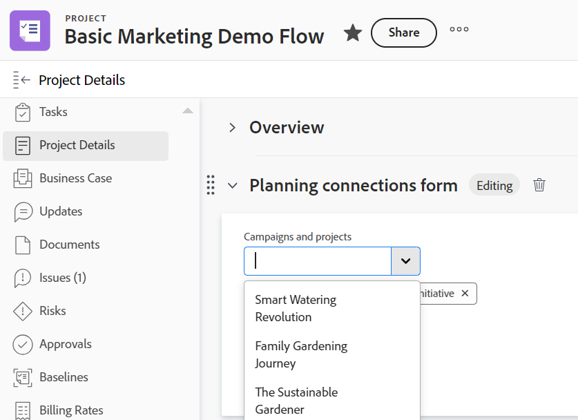

<!--add also Group and Company when they are available-->

# Workfront オブジェクトからのレコード接続の管理

<!--The highlighted information on this page refers to functionality not yet generally available. It is available only in the Preview environment for all customers. After the monthly releases to Production, the same features are also available in the Production environment for customers who enabled fast releases.    

For information about fast releases, see [Enable or disable fast releases for your organization](/help/quicksilver/administration-and-setup/set-up-workfront/configure-system-defaults/enable-fast-release-process.md).-->

{{planning-important-intro}}

WorkfrontのWorkfront Planning レコードは、それらに接続されたオブジェクトの次の領域に表示できます。

* Workfront オブジェクトの「プランニング」セクション：オブジェクトに接続されているすべてのレコードタイプと、接続されたそれぞれのレコードを表示します。
* Planning 接続のカスタム・フィールド：1 つのレコード・タイプ、それぞれの接続レコード、および接続レコードの最大 7 つの参照フィールドが表示されます。

## アクセス要件

+++ 展開して、この記事の機能のアクセス要件を表示します。 

<table style="table-layout:auto"> 
<col> 
</col> 
<col> 
</col> 
<tbody> 
    <tr> 
<tr> 
</tr>   
<tr> 
   <td role="rowheader">
Adobe Workfront パッケージ
</td> 
   <td> 

任意のWorkfrontと任意の Planning パッケージ

任意のワークフローおよび任意の計画パッケージ

各Workfront Planning パッケージに含まれる内容について詳しくは、Workfront アカウント担当者にお問い合わせください。 
 
   </td> 
  <tr> 
   <td role="rowheader">
Adobe Workfront プラン
</td> 
   <td>
標準

   </td> 
  </tr> 
  <tr>
   <td role="rowheader">
アクセスレベル設定
</td>
   <td> 
プロジェクト、プログラム、ポートフォリオへの表示以上のアクセス
  
   
Workfront Planning にはアクセス レベルのコンフィギュレーションがありません。 

</td>
  </tr>
<tr>
   <td role="rowheader">
オブジェクト権限
</td>
   <td>
   
Workfrontで、プロジェクト、ポートフォリオまたはプログラムに対する表示以上の権限 </a> 
 
   
Workfrontの計画では、次の操作を行います。

   <ul><li>ワークスペースの権限とレコードタイプを表示して、接続されたレコードを表示します </li>
   または
   <li> ワークスペースに対する投稿以上の権限と、レコードの接続または切断を行うためのレコードタイプ</a></li></ul> 
   
システム管理者には、未作成のワークスペースを含むすべてのWorkfront Planning ワークスペースに対する権限があります
 
  </td>
  </tr>   
</tbody> 
</table>

Workfrontのアクセス要件について詳しくは、[Workfront ドキュメントのアクセス要件 ](/help/quicksilver/administration-and-setup/add-users/access-levels-and-object-permissions/access-level-requirements-in-documentation.md) を参照してください。

+++   

<!--Old:
<table style="table-layout:auto">
 <col>
 </col>
 <col>
 </col>
 <tbody>
    <tr>
<tr>
<td>
   
 Products
 </td>
   <td>
   <ul><li>
 Adobe Workfront
</li>
   <li>
 Adobe Workfront Planning
</li></ul></td>
  </tr>  
 <tr>
   <td role="rowheader">
Adobe Workfront plan*
</td>
   <td>

Any of the following Workfront plans:

<ul><li>Select</li>
<li>Prime</li>
<li>Ultimate</li></ul>

Workfront Planning is not available for legacy Workfront plans

   </td>

<tr>
   <td role="rowheader">
Adobe Workfront Planning package*
</td>
   <td>

Any

For more information about what is included in each Workfront Planning plan, contact your Workfront account manager. 

   </td>

<tr>
   <td role="rowheader">
Adobe Workfront platform
</td>
   <td>

Your organization's instance of Workfront must be onboarded to the Adobe Unified Experience to be able to access Workfront Planning.

For more information, see <a href="/help/quicksilver/workfront-basics/navigate-workfront/workfront-navigation/adobe-unified-experience.md">Adobe Unified Experience for Workfront</a>. 

   </td>
  </tr>
  </tr>
  <tr>
   <td role="rowheader">
Adobe Workfront license*
</td>
   <td>
   
Standard

   
Workfront Planning is not available for legacy Workfront licenses

  </td>
  </tr>
  <tr>
   <td role="rowheader">
Access level configuration
</td>
   <td> 
View or higher access to Projects, Programs, and Portfolios
  
   
There is no access level configuration for Workfront Planning. 

</td>
  </tr>
<tr>
   <td role="rowheader">
Object permissions
</td>
   <td>
   
In Workfront, View or higher permissions to a project, portfolio, or program</a> 
 
   
In Workfront Planning:
   <ul><li>
   View permissions to a workspace and record type to view any connected records </li>
   or
   <li> Contribute or higher permissions to a workspace and record type  to connect or disconnect records</a></li></ul> 
  
   
System Administrators have permissions to all Workfront Planning workspaces, including the ones they did not create
 
  </td>
  </tr>
 </tbody>
</table>-->

## 計画セクションのレコードの管理

Workfront オブジェクトの「プランニング」セクションを使用すると、Workfront オブジェクトに接続されているすべてのレコードタイプとそれぞれのレコードを表示できます。
「計画」セクションは、次のWorkfront オブジェクトで使用できます。

* プロジェクト
* ポートフォリオ
* プログラム
<!--* Group
* Company-->

### Workfront オブジェクトのプランニング セクションに関する考慮事項

Workfront オブジェクトの「計画」セクションからWorkfront Planning レコードを表示する場合は、次の点に注意してください。

* Workfront Planning レコードタイプは、まずWorkfront オブジェクトタイプに接続する必要があります。

  詳しくは、次の記事を参照してください。

   * [レコードタイプの接続](/help/quicksilver/planning/architecture/connect-record-types.md)
   * [レコードの接続](/help/quicksilver/planning/records/connect-records.md)
* Workfrontオブジェクトに関連付けられたレコードがない場合でも、Workfrontオブジェクトから「プランニング」セクションを表示できます。
* レコードタイプは、2 つのレコードタイプ間の関連付けを作成する際に「リンクされたレコードタイプ」設定の対応するフィールドを作成を有効にした場合にのみ、Workfront オブジェクトのプランニング エリアに表示されます。

  詳しくは、[レコードタイプの接続](/help/quicksilver/planning/architecture/connect-record-types.md)を参照してください。

### 計画セクションからのレコード接続の管理

{{step1-to-planning}}

1. ワークスペースのカードをクリックします。

   ワークスペースが開き、レコードタイプがカードとして表示されます。

1. Workfront プロジェクト、ポートフォリオ、またはプログラムに接続されているレコードタイプのカードをクリックします。
1. テーブル ビューまたはレコードの詳細ページから、Workfront オブジェクトに接続されている [ 接続済みレコード ] フィールドに移動します。 詳しくは、[レコードを接続する](/help/quicksilver/planning/records/connect-records.md)を参照してください。
1. 「接続されたレコード」フィールドでWorkfront オブジェクトの名前をクリックします。
Workfrontでオブジェクトのページが開きます。

   >[!NOTE]
   >
   >  Planning レコードに既に接続されているWorkfront オブジェクトがわかっている場合は、Workfront オブジェクトから Planning セクションに移動できます。

1. 左側のパネルで「**計画**」をクリックします。

   >[!NOTE]
   >
   >   Workfrontまたはグループの管理者は、Workfrontのプロジェクト、ポートフォリオまたはプログラムに表示される前に、計画セクションをレイアウトテンプレートに追加する必要があります。

   「計画」セクションには、次の情報が表示されます。

   * 接続されたレコードは、次の情報を含む個々のカードに表示されます。
      * レコードの名前
      * レコードのサムネール
      * Workfront Planning に表示される、接続されたレコードフィールドの名前。
   * レコードは、それぞれのワークスペースとレコードタイプの下に表示されます。

   

1. （省略可能） [**すべての接続を表示**] をクリックすると、接続されたすべてのレコードの種類（接続されていないレコードを含む）が表示されます。 既定では、レコードが接続されていないレコード タイプは表示されません。
1. レコードカードをクリックすると、レコードに関する詳細情報が表示されます。 レコードのプレビューボックスが表示されます。
1. （オプション）レコードのプレビューボックスのフィールドの変更を開始します。 変更内容は自動的に保存されます。
1. （オプション）プレビューボックスの右上隅にある **新しいタブで開く** アイコン  をクリックして、レコードの詳細ページを開きます。 Workfront Planning にレコードの詳細ページが開きます。
1. （オプション）レコードカードの上にマウスポインターを置き、「レコードを切断」アイコン（**-**）をクリックしてから「**切断**」をクリックします。
次のことが発生します。
   * レコードがWorkfront オブジェクトに接続されなくなりました。
   * Workfront オブジェクトも、Workfront Planning からレコードの接続されたフィールドから削除されます。
   * 計画レコードに接続されているWorkfront参照フィールドの値も削除されます。
1. 「**接続**」をクリックすると、接続されたレコードタイプのその他のレコードを接続できます。

   詳しくは、[レコードの接続](/help/quicksilver/planning/records/connect-records.md)を参照してください。
1. （オプション）接続するレコードが見つからず、追加したい場合は、「**+追加**」をクリックして新しいレコードを追加します。 詳細については、「レコードを作成する」の「他のレコードから接続する際にレコードを作成する [ を参照し ](/help/quicksilver/planning/records/create-records.md) ください。

   次のことが発生します。

   * レコードは直ちにWorkfront オブジェクトに接続され、計画セクションに表示されます。
   * Workfront オブジェクトが、Workfront計画レコードの接続されたフィールドに追加されます。
   * 計画レコードに接続されたWorkfront参照フィールドの値は、Workfront Planning に入力されます。

## Planning 接続フィールド タイプのレコードの管理

Workfront オブジェクトに対して Planning 接続のカスタムフィールドを使用すると、1 つのレコードタイプと、Workfront オブジェクトに接続されたそれぞれのレコードを表示できます。

Planning 接続のカスタム・フィールドを作成するときに、Workfrontオブジェクトに表示する Planning レコード・タイプを制御できます。

* 「計画接続」フィールドには、接続が確立された後、および次のWorkfront オブジェクトのフォームにフィールドが添付されている場合に、計画レコードが表示されます。

   * プロジェクト
   * ポートフォリオ
   * プログラム
   * グループ
   * 会社

詳しくは、[ フォームの作成 ](/help/quicksilver/administration-and-setup/customize-workfront/create-manage-custom-forms/form-designer/design-a-form/design-a-form.md) を参照してください。

### Planning 接続フィールド・タイプに関する考慮事項

Workfrontオブジェクトの「Planning 接続」フィールドからWorkfront Planning レコードを表示する場合は、次の点に注意してください。

* Planning レコードがWorkfront オブジェクトに接続された後、Workfront オブジェクトのカスタム フォームに Planning 接続フィールドが次のように表示されます。

   * 接続されたレコードのプライマリ・フィールドのみが選択されている場合、複数のレコードをリンクできる接続であれば、Planning 接続フィールドは複数の値を持つフィールドとして表示されます。 詳しくは、[ レコードタイプの接続の概要 ](/help/quicksilver/planning/architecture/connect-record-types-overview.md) を参照してください。
   * Workfront管理者またはグループ管理者がカスタムフォーム上の接続されたレコードからさらにルックアップフィールドを追加した場合、Planning 接続フィールドはテーブルとして表示されます。 「計画接続」フィールドには、最大 7 つのフィールドを選択できます。 テーブル表示は読み取り専用です。

* 1 つの Planning 接続フィールドに関連付けることができるレコード・タイプは 1 つだけです。 フォーム上の Planning 接続フィールドの数に制限はありません。
* Planning 接続のカスタム フィールドを含むカスタム フォームをWorkfront オブジェクトに添付するには、オブジェクト、レコード、およびWorkfront Planning に対する適切なアクセス権と権限が必要です。
* Workfront オブジェクトの Planning 接続フィールドにレコードを接続または切断するには、Workfront Planning のワークスペースの投稿権限が必要です。
* Workfront Planning レコードタイプは、まずWorkfront オブジェクトタイプに接続する必要があります。 詳しくは、[ レコードタイプを接続 ](/help/quicksilver/planning/architecture/connect-record-types.md) を参照してください。これにより、WorkfrontからWorkfront Planning レコードにアクセスできるようになります。
* Workfront オブジェクトの Planning 接続フィールドに対するレコードの接続または切断は、Workfront Planning 接続を持つことができるオブジェクトに対してのみ行うことができます。

  例えば、Planning 接続フィールドを持つカスタムフォームをタスクに添付できても、Workfront Planning オブジェクトをタスクに接続できない場合があります。
* Workfrontオブジェクトを一括編集する場合は、Planning 接続フィールドを編集できません。
* レコードタイプは、2 つのレコードタイプ間の連結を作成する際に「リンクされたレコードタイプ」設定の対応するフィールドを作成を有効にした場合にのみ、Workfront オブジェクトの Planning 連結カスタムフィールドに表示されます。

  詳しくは、[レコードタイプの接続](/help/quicksilver/planning/architecture/connect-record-types.md)を参照してください。

### 計画接続フィールドタイプからのレコード接続の管理

1. Workfront Planning レコード タイプに接続されている次のオブジェクト タイプのいずれかに移動します：

   * プロジェクト
   * ポートフォリオ
   * プログラム
   * 会社
   * グループ

1. 左側のパネルで **&lt; オブジェクト /詳細** をクリックします。
1. （条件付き）選択したオブジェクトに対して 1 つ以上の Planning 接続フィールドを持つカスタムフォームを追加します（存在しない場合）。

   >[!NOTE]
   >
   >オブジェクトに追加する前に、Workfrontまたはグループ管理者が最初にフォームを作成し、そのフォームに Planning 接続フィールドを追加する必要があります。

1. フィールド内をクリックして接続レコードを追加し、フィールド内の下向き矢印をクリックして、リストからレコードを選択します。

   

   >[!TIP]
   >
   >フィールドの設定時に選択したオブジェクト以外のWorkfront オブジェクトに関連付けられている Planning 接続フィールドにレコードを追加することはできません。
   >
   >例えば、プロジェクトのカスタムフォームからPortfolio用に作成された Planning 接続フィールドにレコードを追加することはできません。
   >
   >フィールドのオブジェクトと選択したオブジェクトが一致しない場合があります。
   >
   >

1. リストの外側をクリックして閉じます。

   次のことが発生します。

   * レコードは直ちにWorkfront オブジェクトに接続され、Planning 接続フィールドとWorkfront オブジェクトの Planning セクションに表示されます。
   * Workfront オブジェクトが、Workfront計画レコードの接続されたフィールドに追加されます。
   * 計画レコードに接続されたWorkfront参照フィールドの値は、Workfront Planning に入力されます。
   * Workfront管理者またはグループ管理者がカスタムフォームの作成時にレコード検索フィールドを追加した場合、レコードの検索フィールドがテーブルビューに自動入力されます。 「計画接続」フィールドのテーブル・ビューは読取り専用です。

     

     >[!NOTE]
     >
     >テーブル ビューが表示されるのは、カスタム フォームの Planning 接続フィールドにルックアップ フィールドが追加されている場合だけです。

1. （オプション）レコード名をクリックするか、テーブル内のレコード名をポインタを合わせ、「Planning 接続」フィールドで **レコードを開く** アイコン  をクリックして、Workfront Planning で開きます。
Workfront計画レコードの詳細プレビューボックスが開きます。
1. レコードに関する情報を確認または編集するか、**新しいタブで開く** アイコン  をクリックして、レコードの詳細ページを開きます。

1. （オプション）Workfrontのカスタムフォームで、レコードの **削除** アイコン  をクリックして、Planning 接続フィールドから削除し、Workfront オブジェクトから切断します。
Workfront オブジェクトは計画レコードから切断され、Workfrontからのルックアップ情報はレコードから削除されます。

1. 「**変更を保存**」をクリックして、カスタムフォームや、Workfront オブジェクトに対して行ったその他の変更を保存します。
