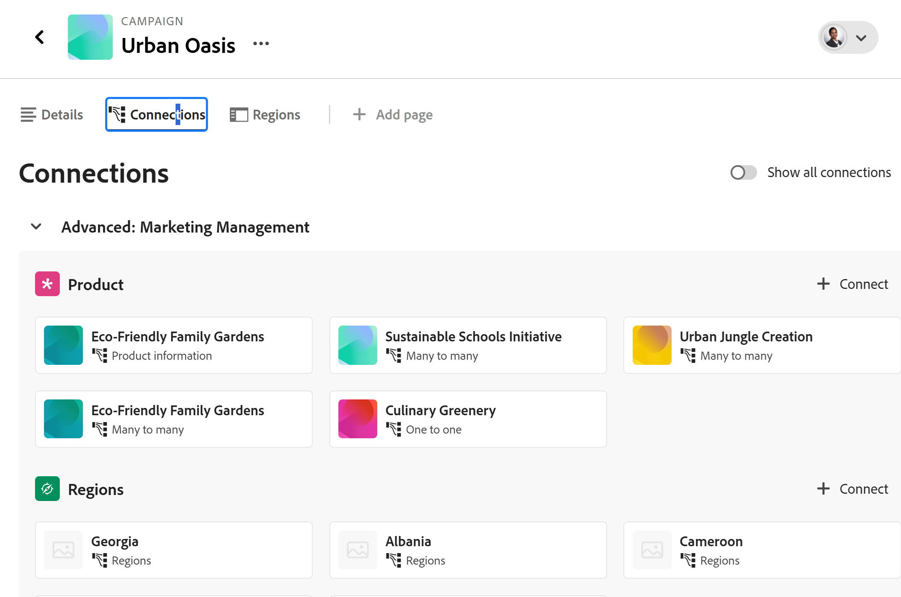

# レコードページレイアウトの管理

 このページでハイライト表示されている情報は、まだ一般公開されていない機能を指しています。 すべてのお客様が、プレビュー環境でのみ使用できます。 実稼動環境への毎月のリリースの後、迅速なリリースを有効にしたお客様には、実稼動環境でも同じ機能を利用できます。

迅速リリースについて詳しくは、[組織での迅速リリースを有効または無効にする](/help/quicksilver/administration-and-setup/set-up-workfront/configure-system-defaults/enable-fast-release-process.md)を参照してください。

{{planning-important-intro}}

Adobe Workfront Planning でレコードのプレビューとページのレイアウトを編集できます。

レコードのプレビューは、レコードタイプのビューに表示される、レコードページの小さいビューです。

レコードのプレビューおよびページのレイアウトを変更すると、同じ種類のすべてのレコードのプレビューボックスおよび詳細ページに変更が反映されます。

ここでは、レコードのプレビューボックスまたはレコード ページのレイアウトと外観を変更する方法について説明します。 レコードの編集方法については、「[&#x200B; レコードの編集 &#x200B;](/help/quicksilver/planning/records/edit-records.md)」を参照してください。

レコードページの編集を開始する前に、レコードタイプとレコードを作成する必要があります。

詳しくは、次の記事を参照してください。

* [レコードタイプの作成](/help/quicksilver/planning/architecture/create-record-types.md)

* [レコードの作成](/help/quicksilver/planning/records/create-records.md)

## アクセス要件

+++ 展開して、この記事の機能のアクセス要件を表示します。 

<table style="table-layout:auto"> 
<col> 
</col> 
<col> 
</col> 
<tbody> 
    <tr> 
<tr> 
</tr>   
<tr> 
   <td role="rowheader">
Adobe Workfront パッケージ
</td> 
   <td> 

任意のWorkfrontと任意の Planning パッケージ

任意のワークフローおよび任意の計画パッケージ

各Workfront Planning パッケージに含まれる内容について詳しくは、Workfront アカウント担当者にお問い合わせください。 
 
   </td> 
  <tr> 
   <td role="rowheader">
Adobe Workfront プラン
</td> 
   <td>
標準

   </td> 
  </tr> 
  <tr>
   <td role="rowheader">
オブジェクト権限
</td>
   <td>
   
ワークスペースおよびレコードタイプへの投稿以上の権限 
  
   
システム管理者は、作成しなかったワークスペースも含め、すべてのワークスペースに対する権限を持っています。
 
  </td>
  </tr>   
</tbody> 
</table>

Workfrontのアクセス要件について詳しくは、[Workfront ドキュメントのアクセス要件 &#x200B;](/help/quicksilver/administration-and-setup/add-users/access-levels-and-object-permissions/access-level-requirements-in-documentation.md) を参照してください。

+++   

<!--Old:
<table style="table-layout:auto">
 <col>
 </col>
 <col>
 </col>
 <tbody>
    <tr>
<tr>
<td>
   
 Products
 </td>
   <td>
   <ul><li>
 Adobe Workfront
</li>
   <li>
 Adobe Workfront Planning
</li></ul></td>
  </tr>  
 <tr>
   <td role="rowheader">
Adobe Workfront plan*
</td>
   <td>

Any of the following Workfront plans:

<ul><li>Select</li>
<li>Prime</li>
<li>Ultimate</li></ul>

Workfront Planning is not available for legacy Workfront plans

   </td>

<tr>
   <td role="rowheader">
Adobe Workfront Planning package*
</td>
   <td>

Any

For more information about what is included in each Workfront Planning plan, contact your Workfront account manager. 

   </td>

<tr>
   <td role="rowheader">
Adobe Workfront platform
</td>
   <td>

Your organization's instance of Workfront must be onboarded to the Adobe Unified Experience to be able to access Workfront Planning.

For more information, see <a href="/help/quicksilver/workfront-basics/navigate-workfront/workfront-navigation/adobe-unified-experience.md">Adobe Unified Experience for Workfront</a>. 

   </td>

  </tr>
  </tr>
  <tr>
   <td role="rowheader">
Adobe Workfront license*
</td>
   <td>
   
Standard

   
Workfront Planning is not available for legacy Workfront licenses

  </td>
  </tr>
  <tr>
   <td role="rowheader">
Access level configuration
</td>
   <td> 
There are no access level controls for Adobe Workfront Planning
  
</td>
  </tr>
<tr>
   <td role="rowheader">
Object permissions
</td>
   <td>
   
Contribute or higher permissions to a workspace and record type </a> 
  
   
System Administrators have permissions to all workspaces, including the ones they did not create
 
  </td>
  </tr>
 </tbody>
</table>-->

## レコードページの操作に関する考慮事項

* デフォルトでは、レコードの詳細ページには、レコードに関連付けられているすべてのフィールドが表示されます。

* プレビューまたは詳細ページでは、レコードに新しいフィールドを追加することはできません。 プレビューページと詳細ページに表示するには、テーブル表示で新しいフィールドを追加する必要があります。

* レコードのプレビューまたは詳細ページにセクションを追加して、共通の条件で情報を整理し、見つけやすくすることができます。

* 次の変更は、同じタイプのすべてのレコードに影響し、それらのレコードにアクセスするすべてのユーザーに表示されます。

   * フィールドの並べ替え
   * セクションの追加または削除
   * 接続されたレコードページの追加または削除

* レコードのプレビューで行った表示の変更は、レコードの詳細ページにすぐに表示されます。 レコードページで加えた変更は、レコードプレビューボックスにも表示されます。

* レコードにカバー画像またはサムネールを追加することが、レコードのプレビューまたはページの全体的なレイアウトの一部ではない。 各レコードに一意のカバー画像またはサムネールを追加できます。 詳しくは、[&#x200B; レコードへのカバー画像の追加 &#x200B;](/help/quicksilver/planning/records/add-a-cover-image-to-a-record.md) および [&#x200B; レコードへのサムネールの追加 &#x200B;](/help/quicksilver/planning/records/add-thumbnails-to-records.md) を参照してください。

* レコードのページに次のタイプのページを追加できます。

   * 接続されたレコードページ

     詳しくは、[&#x200B; 接続されたレコードページをレコードに追加する &#x200B;](#add-a-connected-records-page-to-a-record) の節を参照してください。

## レコードのプレビューまたはページへのセクションの追加

レコードページにセクションを追加する場合は、次の点を考慮してください。

* ページ上に配置できるセクションの数に制限はありません。
* 空のセクションを指定することはできません。 セクションに少なくとも 1 つのフィールドが必要です。
* あるセクションから別のセクションにフィールドをドラッグ&amp;ドロップできます。 詳しくは、この記事の「[&#x200B; レコードのプレビューまたは詳細ページのフィールドの管理 &#x200B;](#manage-fields-in-the-records-details-tab) を参照してください。
* セクションからすべてのフィールドを削除すると、そのセクションは自動的に削除され、元に戻すことはできません。

レコードのプレビューまたはページにセクションを追加するには：

{{step1-to-planning}}

1. ワークスペースのカードをクリックします。

   ワークスペースが開き、レコードタイプがカードとして表示されます。

1. レコードタイプのカードをクリックします。

   レコードタイプのページが開きます。

1. 任意のタイプのビューで、レコードの名前をクリックします

   または

   テーブルビューで、最初の列の **詳細を開く** アイコン  をクリックします。

   レコードのプレビューがビューで開きます。

   

1. （オプション）レコードプレビューの右上隅にある **新しいタブで開く** アイコン  新しいタブでレコードのページを開く）をクリックします。

   レコードページが開きます。 「詳細」タブがデフォルトで開きます。

   

1. レコードのプレビューまたはページの「**詳細**」タブで、フィールドの左側の空白にマウスポインターを置き、「**セクションを追加** アイコン  をクリックして、セクションを追加します。
1. セクション名の内側をクリックして **名称未設定セクション** を名前に置き換え、Enter キーを押します。 セクションの下に表示されるフィールドは、自動的に新しいセクションの一部になります。
1. この記事の節 [&#x200B; レコードのプレビューまたは詳細ページのフィールドの管理 &#x200B;](#manage-fields-in-the-records-details-tab) で説明しているように、新しいセクションへのフィールドのドラッグ&amp;ドロップを開始します。

1. （オプション）セクションの名前の上にマウスポインターを置いて、**詳細** メニュー  をクリックします。

   
1. （オプション）次のいずれかの操作を行って、セクションを編集します。

   * **名前変更** をクリックして、セクションの名前を変更します

     >[!TIP]
     >
     > 名前をクリックすると、セクションの名前をインラインで変更できます。

   * **上へ移動** をクリックして、セクションを 1 つ上の位置に移動します

     または

     **下に移動** をクリックして、セクションを 1 つ下の位置に移動します。
セクション内のすべてのフィールドは、セクションと共に移動します。

   * **削除** をクリックして、セクションを削除します。 セクションは削除され、復元できません。 このタイプのレコードにアクセスするすべてのユーザーに、削除されたセクションが表示されなくなります。

1. セクション名の左側にある下向き矢印をクリックして折りたたむか、右向き矢印をクリックして展開します。
デフォルトでは、すべてのセクションが展開されます。

1. （オプション）セクション名の左側にある **グラブ** アイコン  をクリックし、目的の場所にドラッグ&amp;ドロップします。

   レコードを表示するすべてのユーザーに対して、同じタイプのすべてのレコードのプレビューとページの両方で、セクションの新しい位置が更新されます。

   セクションとフィールドの順序に対するすべての変更は、自動的に保存されます。

1. （オプション） **エクスポート** メニュー  をクリックして、「詳細」タブを Word またはPDF ファイルにエクスポートします。 詳しくは、[&#x200B; レコードの詳細のエクスポート &#x200B;](/help/quicksilver/planning/records/export-the-record-page.md) を参照してください。

1. （オプション）「**詳細**」タブの横にある「**接続**」タブをクリックします。 場合によっては、[**接続**] タブをクリックする前に **詳細** をクリックする必要があります。

   選択したレコードに接続されているすべてのレコードまたはオブジェクトが、レコードタイプの名前または属するアプリケーションの名前の下に表示されます。

   

1. （オプション）「接続」タブの右上隅にある「**すべてのレコードを表示**」設定を選択します。 接続されているレコードがまだないレコードも含め、すべての接続されているレコードタイプが表示されます。 デフォルトでは、切替スイッチは選択解除されており、接続されたレコードがないレコードタイプは非表示になっています。

1. （任意）接続されたレコードタイプにさらにレコードを追加するには、「**接続**」をクリックします。 詳しくは、[レコードの接続](/help/quicksilver/planning/records/connect-records.md)を参照してください。

1. （オプション）レコードカードの上にマウスポインターを置き、「レコードを切断」アイコン（**-**）をクリックしてから「**切断**」をクリックします。 <!--this is copied to the Manage the Planning page in Workfront article; update in both articles-->
次のことが発生します。
   * レコードがWorkfront オブジェクトに接続されなくなりました。
   * Workfront オブジェクトも、Workfront Planning からレコードの接続されたフィールドから削除されます。
   * 計画レコードに接続されているWorkfront参照フィールドの値も削除されます。

## レコードの「詳細」タブでのフィールドの管理

{{step1-to-planning}}

1. ワークスペースのカードをクリックします。

   ワークスペースが開き、レコードタイプがカードとして表示されます。

1. レコードタイプのカードをクリックします。

   レコードタイプのページが開きます。

1. 任意のタイプのビューで、レコードの名前をクリックします

   または

   テーブルビューで、最初の列の **詳細を開く** アイコン  をクリックします。

   レコードのプレビューがビューで開きます。

   

1. （オプション）レコードプレビューの右上隅にある **新しいタブで開く** アイコン <!--check the icon; they are changing it--> をクリックして、レコードのページを新しいタブで開きます。

   レコードの **詳細** タブは、デフォルトで開きます。

   

1.  （オプションおよび条件付き）詳細ページに表示するフィールドに応じて、次のいずれかの操作を行います。

   

   * **テーブルフィールドを表示** 設定を選択して、レコードのテーブルビューで非表示になっていないフィールドのみを表示します。 これはデフォルト設定です
   * **テーブルフィールドを表示** 設定の選択を解除して、レコードのテーブルビューのすべてのフィールド（非表示のフィールドを含む）を表示します。

   <!--replace with this when they fix the UI text:
   * Select the **Show all fields** setting to include all the record's fields in the **Details** page. This is the default setting. 
   * Deselect the **Show all fields** setting to exclude the record's fields that are hidden in the table view of the record from the **Details** page.
   -->

   

1. レコード **詳細** タブで、フィールド名の左側にある **グラブ** アイコン  をクリックしてから、目的の場所にドラッグ&amp;ドロップします。

   >[!TIP]
   >
   >フィールドは、別のセクションにドラッグ&amp;ドロップできます。
   >セクションに少なくとも 1 つのフィールドが必要です。
   >

   レコードを表示しているすべてのユーザーについて、同じタイプのすべてのレコードのプレビューとページの両方でフィールドの新しい位置が更新されます。

   レコードのプレビューまたはページのレイアウトに対するすべての変更が、自動的に保存されます。

## 接続されたレコード ページをレコードに追加する

レコードの詳細領域に [ 接続されたレコード ] ページのタブを追加すると、接続されたレコードまたはオブジェクトの情報を表示できます。 これにより、テーブル表示またはリスト表示の接続されたレコードがタブに追加されます。

詳しくは、[&#x200B; 接続されたレコードページのレコードへの追加 &#x200B;](/help/quicksilver/planning/records/add-a-connected-records-page-to-a-record.md) を参照してください。

<!--this content has been moved to the page linked above
Consider the following when adding a Connected records page to a record: 

* You can add a Connected records page to a record after you connected record or object types to the record type from the table view of a record type.

* You can add a Connected records page from a record's preview area or the record's page.

* Connected records pages display only the connected objects or records from one object or record type in a table view. The page does not display all records of that type. 

* You can add Connected records pages for the following connected record or object types:

   * Workfront Planning record types
   * Workfront projects, programs, portfolios, groups, or companies. You can view the connected Workfront objects even when you do not have permissions to access them in Workfront. 

To add a Connected records page:

1. Click the name of the record to open it from any view of a record type page. 
1. Click **Add page** from one of the following areas: 

   * The record's preview window
   * The record's details page, after clicking the **Open in new tab** icon  in the upper-right corner of the preview page.  

   The **Create page** box opens.

    

1. Add the **Page name**, click **Connected records page**, then click **Create**.

   A new connected records page is added as a new tab to the record's page.
   
   The records that are connected to the current record display in the table view.  

      >[!TIP]
      >
      >You must add connected records in the table or Details area of a record before you can display them in a connected records page.

   (^^^^^^All fields of the connected record display in the table view of the connected record's tab.^^^^^^^^)
   
   The first five fields of the connected records display by default. (^^^^No lookup fields display by default.^^^^^^^)

   

1. (Optional) Search for or click the name of a connected record or object type in the list.

1. (Optional and conditional) In the table view of the connected records page, do any of the following when viewing connected Planning records or any Workfront objects except for projects: 

   * Click the name of a record. This opens the record's page in a new tab. 

   * Click **Connect** at the bottom of the table view to connect more records, then click outside the connection box to close it. The new records are automatically added to the table. 

      For information, see [Connect records](/help/quicksilver/planning/records/connect-records.md).
   * Edit any information from the connected records inline in the table view. 

   * Hover over a connected record's name, then click the **More** menu 
   
      Or 
      
      Select one of the records, then click one of the following options in the blue bar at the bottom of the list: 

      * **View** to open the record page in a new tab
      * **Copy link** to copy a link to the record page
      * **Edit thumbnail** to open the **Record thumbnail** box and edit the record's thumbnail image
      * **Duplicate** to duplicate the connected record. The duplicated record is also connected to the current record.
      * **Insert record above or below** to add new records to the connected record type. New records added here are also connected to the current record. This option is not available in the blue bar when selecting a record in the table.
      * **Delete** to delete the record. Deleting a connected record deletes it from its record type and from everywhere where the record is connected.

      For information about editing records in the table view, see [Edit records](/help/quicksilver/planning/records/edit-records.md). 

      >[!TIP]
      >
      >You can select more than one record or object to delete them.

   * Inline edit any of the Planning records in the table on the Connected records page. 
   
      All other Workfront objects display in a read-only table view and you cannot edit them. 
   
1. (Optional and conditional) In the table view of the connected records page, do any of the following when viewing connected Workfront projects:

     * Click **Connect records** in the upper-right corner of the connected record page to connect existing projects.

      For information, see [Connect records](/help/quicksilver/planning/records/connect-records.md).
     * Inline edit project information in the table.
     * Click **New row** to create a project without a template. The new project is connected to the current record immediately.

         For more information, see [Create Workfront objects from Workfront Planning as you connect them to records](/help/quicksilver/planning/records/create-workfront-objects-from-workfront-planning.md)
     * Hover over a project and click the **More** menu [More menu](assets/more-menu.png)
     
         Or

         Select one or more projects, and notice the blue bar at the bottom of the list, then click one of the following:
         
         * **Delete** to delete the project. Deleting a project disconnects it from the record and moves it to the Workfront's Recycle Bin. 
         * **Disconnect** to disconnect the project from the record. Disconnecting a project removes it and all the values of its lookup fields from the current record.
      
1. (Optional) Double-click the name of the **Connected records page** tab

   Or

   Hover over the name of the tab, then click **More** , then click **Rename** to rename to new Connected view tab.
1. (Optional) Use any of the following view elements in the toolbar of a connected record page to manage the table view:

   * Filters
   * Sort
   * Grouping
   * Fields, to display, hide, or rearrange fields
   * Row height
   * Search

   For information, see [Manage the table view](/help/quicksilver/planning/views/manage-the-table-view.md). 

   >[!NOTE]
   >
   >You cannot create, edit, or delete fields in the table view of a connected record's tab.
   
1. (Optional)  Hover over the name of the Connected records page tab, click **More** , then click **Delete** to remove to tab.-->

<!--
## Add a Brief page to a record

(^^^^^^^^^^move this content to its own article, like you did above - leave the header here with a link^^^^^^^^^^^^)

You can add a Brief page to the record's preview or pages. 

Brief pages contain the same information as the Details tab, in a read-only format. <!--edit this when we can remove fields from this page-->

<!--
1. From a record's page view, click the name of a record to open its preview or page.
1. Click **Add page** > **Brief**. 
1. Add the **Page name**, then click **Create**. 
-->

