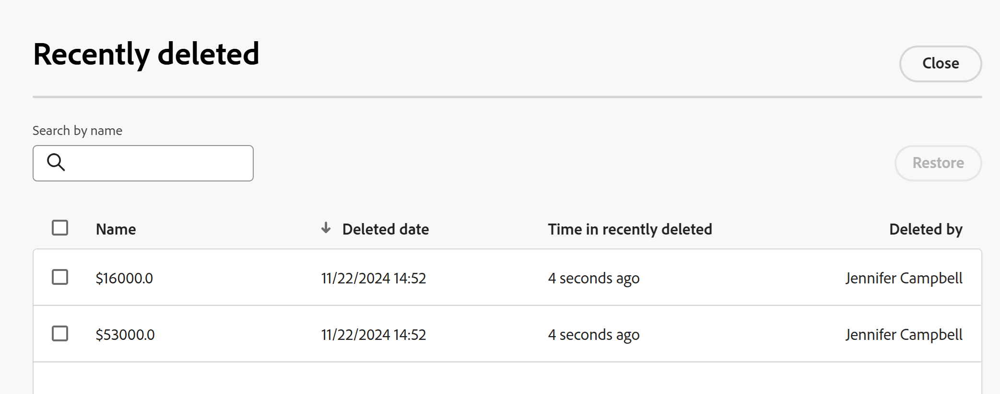

# 削除されたレコードを復元

<!--The highlighted information on this page refers to functionality not yet generally available. It is available only in the Preview environment for all customers. After the monthly releases to Production, the same features are also available in the Production environment for customers who enabled fast releases.    

For information about fast releases, see [Enable or disable fast releases for your organization](/help/quicksilver/administration-and-setup/set-up-workfront/configure-system-defaults/enable-fast-release-process.md). -->

{{planning-important-intro}}

Adobe Workfront Planning の「最近削除されたレコード」領域から削除されたレコードを復元できます。

レコードの削除について詳しくは、[ レコードの削除 ](/help/quicksilver/planning/records/delete-records.md) を参照してください。

## アクセス要件

+++ 展開してアクセス要件を表示します…

この記事の手順を実行するには、次のアクセス権が必要です。

<table style="table-layout:auto"> 
<col> 
</col> 
<col> 
</col> 
<tbody> 
    <tr> 
<tr> 
<td> 
   
 製品
 </td> 
   <td> 
   <ul><li>
 Adobe Workfront
</li> 
   <li>
 Adobe Workfrontの計画
</li></ul></td> 
  </tr>   
<tr> 
   <td role="rowheader">
Adobe Workfront プラン*
</td> 
   <td> 

次のいずれかのWorkfront プラン：
 
<ul><li>選択</li> 
<li>Prime</li> 
<li>Ultimate</li></ul> 

Workfront Planning は、従来のWorkfront プランでは使用できません
 
   </td> 
<tr> 
   <td role="rowheader">
Adobe Workfront Planning パッケージ*
</td> 
   <td> 

任意 
 

各Workfront Planning プランに含まれる内容について詳しくは、Workfront担当営業または販売店にお問い合わせください。 
 
   </td> 
 <tr> 
   <td role="rowheader">
Adobe Workfront platform
</td> 
   <td> 

組織のWorkfront インスタンスは、Workfront Planning のすべての機能にアクセスできるように、Adobe Unified Experience にオンボーディングされる必要があります。
 

詳しくは、<a href="/help/quicksilver/workfront-basics/navigate-workfront/workfront-navigation/adobe-unified-experience.md">Workfront の Adobe Unified Experience</a> を参照してください。 
 
   </td> 
   </tr> 
  </tr> 
  <tr> 
   <td role="rowheader">
Adobe Workfront プラン*
</td> 
   <td>
 標準

   
Workfront Planning は、従来のWorkfront ライセンスでは使用できません
 
  </td> 
  </tr> 
  <tr> 
   <td role="rowheader">
アクセスレベルの設定
</td> 
   <td> 
Adobe Workfront Planning に対するアクセスレベルのコントロールはありません。
   
</td> 
  </tr> 
<tr> 
   <td role="rowheader">
オブジェクト権限
</td> 
   <td>   
Workspace <!--and record type--> </a> への投稿以上の権限 
  
   
システム管理者は、作成しなかったワークスペースも含め、すべてのワークスペースに対する権限を持っています。
 </td> 
  </tr> 
<tr> 
   <td role="rowheader">
レイアウトテンプレート
</td> 
   <td> 
Workfront の管理者を含むすべてのユーザーには、メインメニューの Planning エリアを含むレイアウトテンプレートを割り当てる必要があります。 
 </td> 
  </tr> 
</tbody> 
</table>

*Workfront のアクセス要件について詳しくは、[Workfront ドキュメントのアクセス要件](/help/quicksilver/administration-and-setup/add-users/access-levels-and-object-permissions/access-level-requirements-in-documentation.md)を参照してください。

+++

## 削除されたレコードの復元に関する考慮事項

* レコードは、最近削除された bin に 30 日間保存されます。 30 日後、レコードはWorkfront Planning から完全に削除されます。
* 削除されたレコードが他のレコードにリンクされている場合、リンクされているレコードは削除されませんが、削除されたレコードの情報も削除されます。 削除したレコードを復元すると、接続されたレコードから情報が復元されます。
* レコードを一括で復元できます。
* レコードを削除すると、次の情報が最近削除された bin に格納されます。
   * **名前**：これは、レコードのプライマリフィールド内の情報です。 レコードプライマリフィールドについて詳しくは、[プライマリフィールドの概要 ](/help/quicksilver/planning/fields/primary-field-overview.md) を参照してください。
   * **削除日**：レコードが削除された日時。
   * **最近削除された時間**: レコードが削除されてからの時間。 現在の日付より 30 日以上前に削除されたレコードは、「最近削除された項目」ビンに表示されません。
   * **削除者**: レコードを削除したユーザーの名前。

## 削除されたレコードを復元

1. レコードを削除したレコードタイプ ページに移動します。
1. 任意のレコードタイプのページビューの右上隅にある **取り消し** アイコン  ージをクリックしてから、**最近削除された項目** をクリックします。

   **最近削除された項目** ボックスが表示されます。

   

1. 削除するレコードを選択し、**復元**/**復元** をクリックします。 複数のレコードを選択できます。

   復元が成功すると、画面の下部に成功通知が表示されます。
1. テーブル表示に移動し、復元されたレコードを確認します。
