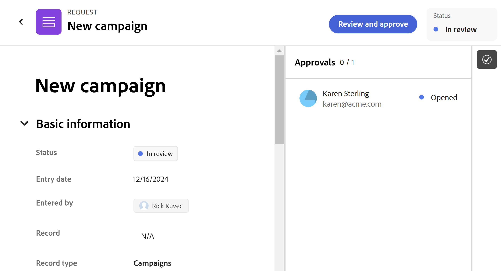

<!--

---
title: Approve a Request
description: When a user submits a request to a request form associated with an approval in Adobe Workfront Planning, approvers receive a notification and an email about the pending approval. They must approve the request before Workfront Planning creates an object. 
feature: Workfront Planning
role: User, Admin
author: Alina
recommendations: noDisplay, noCatalog
---

-->

# リクエストを承認

<!--update the metadata with real information when making this available in TOC and in the left nav-->

<!--take Preview and Production references at Production time-->

<!-- do you need to add that only workspace owners can view the Submitted/ Planning tab?? - asking team in slack-->

このページの情報は、まだ一般に提供されていない機能を指します。すべてのお客様が、プレビュー環境でのみ使用できます。 実稼動環境への毎月のリリースの後、迅速なリリースを有効にしたお客様には、実稼動環境でも同じ機能を利用できます。

迅速リリースについて詳しくは、[組織での迅速リリースを有効または無効にする](/help/quicksilver/administration-and-setup/set-up-workfront/configure-system-defaults/enable-fast-release-process.md)を参照してください。

{{planning-important-intro}}

Adobe Workfront Planning で、ユーザーが承認に関連付けられた要求フォームに要求を送信すると、承認者に承認保留中の承認に関する通知と電子メールが届きます。 Workfront Planning がオブジェクトを作成する前に、顧客がリクエストを承認する必要があります。

この記事では、Workfront Planning に送信されたリクエストを Workspace Manager で承認してレコードを作成する方法について説明します。

次の記事も参照することをお勧めします。

* [Adobe Workfront Planning でのリクエストフォームの作成と管理](/help/quicksilver/planning/requests/create-request-form.md)
* [レコードを作成するためのAdobe Workfront Planning 要求の発行](/help/quicksilver/planning/requests/submit-requests.md)
* [リクエストフォームへの承認の追加](/help/quicksilver/planning/requests/add-approval-to-request-form.md)

## リクエストの承認とリクエストのステータスに関する考慮事項

送信されたリクエストは、Workfrontの「リクエスト」領域の「送信済み」セクションの「計画」タブに、次のいずれかのリクエストステータスで表示されます。

* **レビュー保留中**：このステータスは、どの承認者もリクエストオブジェクトを開いていない場合に表示されます。
* **レビュー中**：少なくとも 1 人の承認者がリクエストオブジェクトを開くと、ステータスは **レビュー中** に変わります。 すべての承認者がリクエストを承認するまで、リクエストのステータスは **レビュー中** のままです。
* **承認済み**：承認者がリクエストオブジェクトを承認すると、個々のステータスが
* **承認済み** ですが、リクエストオブジェクトの全体的なステータスは、すべての承認者が決定するまで **レビュー中** のままです。
* **完了**：すべての承認者が要求オブジェクトを承認すると、その状態は **完了** に変わります。または、要求に承認が必要なかった場合も同様です。
* **却下**：承認者がリクエストオブジェクトを却下した場合、ステータスは **却下** になります。

## アクセス要件

+++ 展開すると、この記事の機能のアクセス要件が表示されます。

この記事の手順を実行するには、次のアクセス権が必要です。

<table style="table-layout:auto">
 <col>
 </col>
 <col>
 </col>
 <tbody>
    <tr>
<tr>
<td>
   
 製品
 </td>
   <td>
   <ul><li>
 Adobe Workfront
</li>
   <li>
 Adobe Workfrontの計画
</li></ul></td>
  </tr>  
 <tr>
   <td role="rowheader">
Adobe Workfront プラン*
</td>
   <td>

次のいずれかのWorkfront プラン：

<ul><li>選択</li>
<li>Prime</li>
<li>Ultimate</li></ul>

Workfront Planning は、従来のWorkfront プランでは使用できません

   </td>

<tr>
   <td role="rowheader">
Adobe Workfront Planning パッケージ*
</td>
   <td>

任意 
  

各Workfront Planning プランに含まれる内容について詳しくは、Workfront担当営業または販売店にお問い合わせください。 </td>

<tr>
   <td role="rowheader">
Adobe Workfront platform
</td>
   <td>

組織のWorkfront インスタンスは、Workfront Planning のすべての機能にアクセスできるように、Adobe Unified Experience にオンボーディングされる必要があります。

詳しくは、<a href="/help/quicksilver/workfront-basics/navigate-workfront/workfront-navigation/adobe-unified-experience.md">Workfront の Adobe Unified Experience</a> を参照してください。 

   </td>
  </tr>
  </tr>
  <tr>
   <td role="rowheader">
Adobe Workfront プラン*
</td>
   <td>
   
標準

   
Workfront Planning は、従来のWorkfront ライセンスでは使用できません

  </td>
  </tr>
  <tr>
   <td role="rowheader">
アクセスレベルの設定
</td>
   <td> 
Adobe Workfront Planning に対するアクセスレベルのコントロールはありません。
  
</td>
  </tr>
<tr>
   <td role="rowheader">
オブジェクト権限
</td>
   <td>
   <ul>
   <li>
ワークスペースに対する権限の管理
</li>
    <li>
システム管理者は、自分が作成していないワークスペースを管理できます。 
</li>
    </ul>
   
Workfront Planning オブジェクトの共有権限について詳しくは、
<a href="/help/quicksilver/planning/access/sharing-permissions-overview.md">Adobe Workfront Planning での共有権限の概要</a>を参照してください。 
  </td>
  </tr>
<tr>
   <td role="rowheader">
レイアウトテンプレート
</td>
   <td> 
Workfront の管理者を含むすべてのユーザーには、メインメニューの Planning エリアを含むレイアウトテンプレートを割り当てる必要があります。 
  
</td>
  </tr>
 </tbody>
</table>

*Workfront のアクセス要件について詳しくは、[Workfront ドキュメントのアクセス要件](/help/quicksilver/administration-and-setup/add-users/access-levels-and-object-permissions/access-level-requirements-in-documentation.md)を参照してください。

+++

## レコード作成リクエストの承認

ユーザーが承認に関連付けられたレコードタイプのリクエストフォームにリクエストを追加すると、リクエストが承認者に送信されます。

承認者は、承認待ちの要求に関する次の通知を受信します。

* アプリ内通知
* メール通知

リクエストを承認するには：

1. 次のいずれかの操作を行います。

   * Workfront Planning へのアクセス権がある場合は、画面の右上隅にある **メインメニュー** または **メインメニュー** 左上隅にある **要求**/**送信済み**/**計画** をクリックし、ステータスが **レビュー中** の要求をクリックします。<!--did they change this to Pending approval; logged  a bug-->

     >[!TIP]
     >
     >    Workfront Planning へのアクセス権がない場合は、通知を使用して承認するリクエストにのみアクセスできます。

   * 画面の右上隅の **通知** 領域に移動し、承認待ちのリクエストに関する通知をクリックしてリクエストを開きます。
   * 承認待ちのリクエストを通知するメール内のメール通知に移動し、クリックしてリクエストを開きます。<!--add the name of the button here, from the email-->

   リクエストページが読み取り専用モードで開きます。

   
1. （任意）リクエストの右上隅に  る **承認** アイコンをクリックして、承認者を表示します。
1. 「**レビューして承認**」をクリックして、次のいずれかを選択します。<!--did they fix the button and removed the &??-->

   * **承認**：リクエストを承認します。 リクエストフォームに関連付けられたレコードタイプに対して、レコードが直ちに作成されます。
   * **却下**：リクエストを却下します。 リクエストフォームに関連付けられたレコードタイプのレコードは作成されません。<!--check to see if there is a notification sent to the requestor about it being rejected OR approved??--> <!--checking with PM what happens with the other approvers when one of them is rejecting it: does it ask them to approve it? Deleted the request? -->
