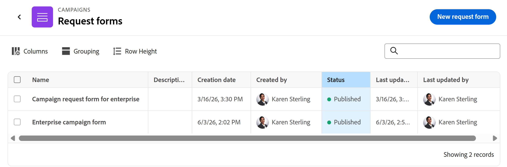
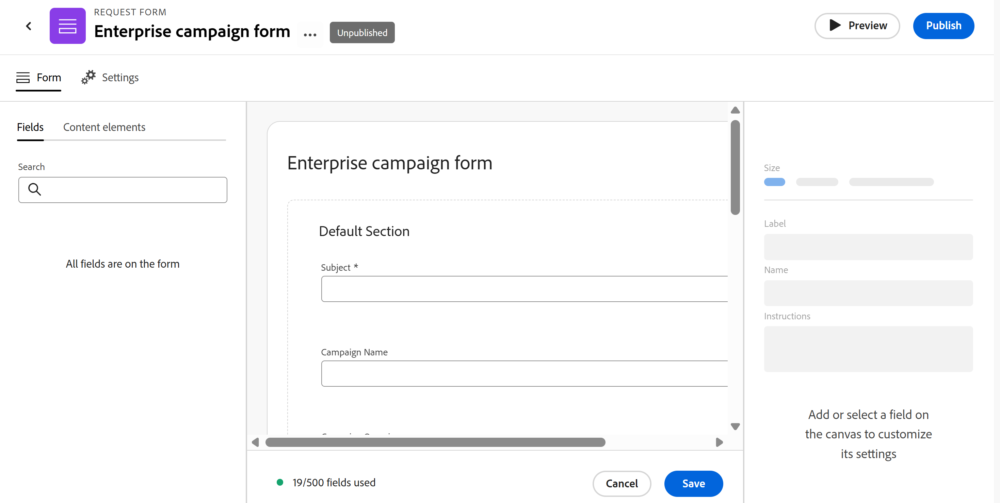
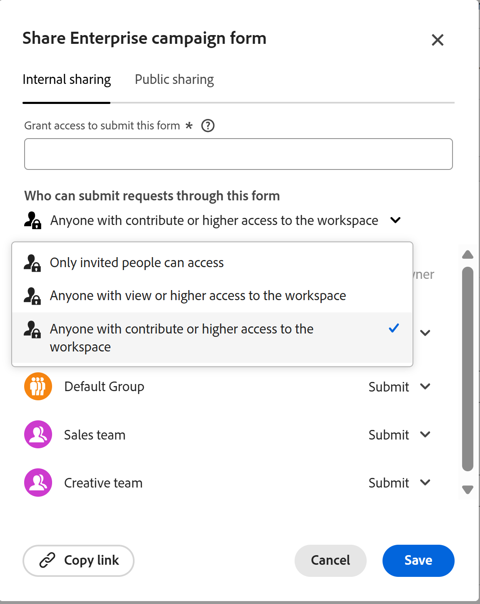

# Adobe Workfront Planning でのリクエストフォームの作成と管理

<!--update the metadata with real information when making this available in TOC and in the left nav-->

<!--take Preview and Production references at Production time-->

<!--
The highlighted information on this page refers to functionality not yet generally available. It is available only in the Preview environment for all customers. After the monthly releases to Production, the same features are also available in the Production environment for customers who enabled fast releases.    

For information about fast releases, see [Enable or disable fast releases for your organization](/help/quicksilver/administration-and-setup/set-up-workfront/configure-system-defaults/enable-fast-release-process.md). 
-->

{{planning-important-intro}}

リクエストフォームを作成し、Adobe Workfront Planningのレコードタイプに関連付けることができます。 その後、フォームを他のユーザーと共有し、そのタイプのレコードを作成するリクエストを送信できます。

この記事では、ワークスペースマネージャーがレコードタイプに関連付けられたリクエストフォームを作成する方法について説明します。

レコードを作成するためのレコードタイプへのリクエストの送信について詳しくは、[ レコードを作成するためのAdobe Workfront計画リクエストの送信](/help/quicksilver/planning/requests/submit-requests.md)を参照してください。

## アクセス要件

+++ 展開すると、この記事の機能のアクセス要件が表示されます。 

<table style="table-layout:auto"> 
<col> 
</col> 
<col> 
</col> 
<tbody> 
<tr> 
   <td role="rowheader">
Adobe Workfront パッケージ
</td> 
   <td> 

任意のWorkfront パッケージと任意のPlanning パッケージ

または

任意のワークフローパッケージと任意のプランニングパッケージ

各Workfront計画パッケージに含まれる内容について詳しくは、Workfrontの担当者にお問い合わせください。

   </td> </tr>

</tr> 
  <tr> 
   <td role="rowheader">
Adobe Workfront プラン
</td> 
   <td>
標準
 
  </td> 
  </tr> 
  <tr> 
   <td role="rowheader">
オブジェクト権限
</td> 
   <td>   
ワークスペースまたはレコードタイプ </a>に対する権限の管理 
  
   
システム管理者は、作成しなかったワークスペースも含め、すべてのワークスペースに対する権限を持っています。
  </td> 
  </tr>  
</tbody> 
</table>

Workfrontのアクセス要件について詳しくは、[Workfront ドキュメント ](/help/quicksilver/administration-and-setup/add-users/access-levels-and-object-permissions/access-level-requirements-in-documentation.md)のアクセス要件を参照してください。

+++

## リクエストフォームでのフィールドと値の表示の制限

リクエストフォームに特定のフィールドを表示する方法と、リクエストを送信した後にレコードまたはリクエストの詳細ページに後で値を表示する方法には制限があります。

Workfront計画リクエストの送信について詳しくは、[ レコードを作成するためのAdobe Workfront計画リクエストの送信](/help/quicksilver/planning/requests/submit-requests.md)を参照してください。

* 以下は、特定のフィールドがリクエストフォーム、リクエストフォームで作成されたレコード、またはリクエスト詳細ページに表示される方法に関する制限です。

   * 次のタイプのフィールドをリクエストフォームに追加することはできません。

      * 作成者、最終変更者、承認者
      * 作成日、最終変更日、承認日
      * レコード ID
      * Workfront オブジェクトのルックアップフィールド
      * Workfront Planningの接続されたレコードのルックアップフィールド

* 次に、リクエストフォームビルダーでのフィールド形式の表示方法と、レコードまたはリクエスト詳細ページでのフィールドの値の書式設定方法の違いを示します。

   * 「通貨」、「数値」および「割合」フィールドは、フォームビルダーで1行のテキストフィールドタイプとして表示されます。

     ただし、フィールド形式は保持され、フィールド値は、リクエストの送信後、レコードタイプおよびリクエスト詳細ページに通貨、数値、およびパーセンテージとして表示されます。

* 次に、リクエストフォームとリクエスト詳細ページに表示されるフィールド値の例を示します。

   * 「通貨」、「数値」および「割合」フィールドの特殊な書式設定は保持されません。 例えば、小数点以下の精度は、これらの領域のフィールドの値に保持されません。
   * 人物フィールド値はIDとして表示されます。
   * 他のフィールドや計算を参照しない数式フィールドには、値は表示されません。 例えば、`STRING`式を持つフィールドには「N/A」値が表示されます。
   * 「通貨」フィールドを参照する数式フィールドには、為替レートを考慮せずに値が表示されます。
   * 段落フィールドの値は、リクエストフォームに「N/A」値を表示し、リクエストの詳細ページに書式設定されたテキストではなくHTML タグを表示します。

## リクエストフォームの作成

リクエストフォームを作成するには、フォームの作成、フォームの詳細の設定、フォームの公開と共有を完了する必要があります。

### リクエストフォームの作成を開始

リクエストフォームは、フォーム <!-- or from the Requests area of Workfront-->に関連付けられているレコードタイプから作成できます。

#### レコードタイプからのリクエストフォームの作成

{{step1-to-planning}}

1. レコードを追加するワークスペースをクリックします。

   ワークスペースが開き、レコードタイプがカードとして表示されます。

1. レコードタイプのカードをクリックします。レコードタイプの作成については、[レコードタイプの作成](/help/quicksilver/planning/architecture/create-record-types.md)を参照してください。

   最後にアクセスしたビューで、レコードタイプのページが開きます。デフォルトでは、レコードタイプページがテーブルビューで開きます。

1. ページヘッダーのレコードタイプ名の右側にある&#x200B;**詳細** メニューをクリックし、**リクエストフォームの作成**&#x200B;または&#x200B;**リクエストフォームの管理**&#x200B;をクリックします。既にフォームがあり、追加のフォームを作成する場合です。

   **要求フォーム** ページが開き、要求がリストビューに表示されます。

   

1. （条件付き）別のフォームを追加する場合は、**新しいリクエストフォーム**&#x200B;をクリックします。

   「**リクエストフォームを作成**」ボックスが開きます。

1. リクエストフォームを作成ボックスで、リクエストフォームの名前を更新します。 デフォルトでは、フォームの名前は&#x200B;**名称未設定のフォーム**&#x200B;です。<!--check this; you logged a bug to rename it to 'Untitled request form' but was it fixed?-->
1. （オプション）リクエストフォームに&#x200B;**説明**&#x200B;を追加します。

   <!--Not possible yet: The Description is visible when you access the request form from the Requests area of Workfront.-->

1. 「**作成**」をクリックします。

   選択したレコードタイプのリクエストフォームが「フォーム」タブで開きます。
1. 引き続き[ リクエストフォームの詳細を設定](#set-up-details-for-the-request-form)します。

<!--

#### Create a request form from the Requests area of Workfront

1. Click the **[!UICONTROL Main Menu]** icon  in the upper-right corner of Adobe Workfront, or (if available), click the **[!UICONTROL Main Menu]** icon  in the upper-left corner, then click **Requests**.
1. In the upper-right corner of the screen, click **Request forms**.
1. (Conditional) If you are editing an existing request form, select it from the list, then continue to [Configure the form](#confgure-the-form).
1. If you are creating a new request form, in the upper-right corner of the screen, click **New request form**.

   The Create request form box opens

1. In the Create request form box, update the name of the request form. By default, the name of the form is **Untitled form**. 
1. In the Object types field, select the record type that the request form will be associated with. Record types are grouped into the workspace that they exist within.
1. (Optional) Add a **Description** for the request form. 

1. Click **Create**. 

   The request form for the selected record type opens in the Form tab.
1. Continue to [Set up details for the request form](#set-up-details-for-the-request-form).

-->

### リクエストフォームの詳細の設定

フォームの詳細はタブに分かれています。

* 「**フォーム**」タブでは、フォームにフィールドとコンテンツ要素を追加できます
* 「**設定**」タブでは、フォームの承認プロセスを設定したり、リクエスト完了オプションを設定したりできます。

#### フォームの詳細の設定

1. 「[ リクエストフォームの作成を開始](#begin-creating-a-request-form)」の節で説明しているように、リクエストフォームの作成または編集を開始します。

   または

   リクエストフォーム リストでリクエストフォームを見つけ、フォーム名の横にあるボックスをクリックし、画面下部の青いバーにある「**フォームを編集**」をクリックします。

   選択したレコードタイプのリクエストフォームが「フォーム」タブで開きます。

   

   リクエストフォームには、デフォルトで次の情報が含まれます。

   * 選択したレコードタイプのテーブルビューで使用できるレコードフィールド。<!--they are working on removing the limitation below-->

   * **既定のセクション**：これは、Workfrontがリクエストフォームに適用する既定のセクション区切りです。 すべてのレコードフィールドは、**デフォルトセクション**&#x200B;領域に表示されます。
   * **件名** フィールド：Workfrontでリクエストを識別するフィールド。 **件名** フィールドの設定と値は編集できません。

     >[!NOTE]
     >
     >* **件名** フィールドは、リクエストフォームに表示される場合に値が必要です。 ただし、**件名** フィールドは、必要に応じて削除できます。また、依頼者はリクエストを送信するときにフォームに表示されません。
     >* リクエストフォームに「**件名**」フィールドがないが、将来のレコードの名前に「名前」フィールドがある場合、リクエストの名前は、作成されたレコードと同じ名前が自動的に割り当てられます。
     >* リクエストフォームに&#x200B;**件名**&#x200B;と&#x200B;**名前**&#x200B;の両方のフィールドがない場合、リクエストには次のパターンを使用して名前が付けられます：`< Request form name > < Entry date of the request >`。レコードの名前は&#x200B;**名称未設定**&#x200B;です。
     >* Workfront Planningで&#x200B;**件名** フィールドの情報を表示するには、リクエストフォームに関連付けられているレコードタイプに&#x200B;**オリジナルリクエスト**&#x200B;接続フィールドを追加します。 詳しくは、[レコードタイプの接続](/help/quicksilver/planning/architecture/connect-record-types.md)を参照してください。

   * レコードタイプに関連付けられているすべてのフィールド。

     リクエストフォームに含まれるフィールドは、このレコードタイプにリクエストを送信するすべてのユーザーに表示されます。

1. （オプション）削除するフォームのフィールドにカーソルを合わせ、**x** アイコンをクリックして削除します。 フォームの左側にある「**フィールド**」タブに追加されます。

1. （オプション）フォームから&#x200B;**デフォルトセクション**&#x200B;を削除するには、次の操作を行います。

   1. デフォルトセクションからすべてのフィールドを削除します。
   1. 「**コンテンツ要素**」をクリックして新しいセクションを追加し、セクションの名前を追加します。
   1. 新しいセクションにフィールドを追加します。
   1. **x** アイコンをクリックして、**既定のセクション**&#x200B;を削除します。
1. 任意のフィールドをクリックし、フォームの右側のパネルにあるコントロールを使用して、サイズまたは次のいずれかの情報を定義します。

   * **ラベル**：これは、リクエストフォームに表示されるフィールド名です。 これは、レコードフィールドの名前を変更するものではありません。
   * **手順**: フィールドに関する詳細情報を追加します。
   * **必須フィールドを作成**：選択した場合、フィールドには値が必要です。 それ以外の場合は、フォームを送信できません。
   * **ロジックを追加**: フィールドを表示または非表示にするには、どの条件を満たす必要があるかを定義します。

   >[!TIP]
   >
   >   各フィールドのフィールドタイプは、フォームでフィールドを選択した後、右側のパネルの上部に表示されます。
   >     

1. （オプション）フォームの左側にある「**コンテンツ要素**」タブをクリックし、次のいずれかの要素を追加します。

   * **説明テキスト**
   * **セクション区切り**

   カスタムフォームの作成について詳しくは、[ カスタムフォームの作成](/help/quicksilver/administration-and-setup/customize-workfront/create-manage-custom-forms/form-designer/design-a-form/design-a-form.md)を参照してください。

1. （オプション）「**プレビュー**」をクリックして、フォームを使用して新しいレコードを送信する際に、他のユーザーがフォームをどのように表示するかを確認します。
1. 次のいずれかに進みます。

   <!--
   * [Set up Configuration details](#set-up-configuration-details) if you want to configure more details for the form in the Production environment
   -->
   * 実稼動環境でフォームの詳細を設定する場合は、[設定](#configure-settings)を構成します
   * [さらに設定を行わない場合は、リクエストフォームの作成を完了します](#complete-request-form-creation)。

<!--
#### Set up Configuration details

>[!NOTE]
>
>This tab is available only in the Production environment.

On the Configuration tab, you can set the approval process and configure when a request created from this form will be marked as Completed.

1. Begin creating or editing a request form, as described in the section [Begin creating a request form](#begin-creating-a-request-form).
   
    The request form for the selected record type opens in the Form tab. 
1. (Optional) Set up any form details, as described in [Set up Form details](#set-up-form-details).    

1. (Optional) If you want to add approvers, click the **Configuration** tab, then add at least one user or team to the **Approvers** field to approve new requests for this record form. 

   

   (******)-below bullet list is duplicated in the Add approval to a request form article(****)

   * You can add one or several approvers to a request form.
   * If at least one approver rejects the request, the request is rejected and the record is not created. The request remains in the Requests area of Workfront.
   * If you add more than one approver, and the Only one decision is required option is not enabled, all approvers must make a decision before a request is either approved or rejected.
   * If a team is set as an approver, only one decision is required from the team.

   For more information about adding approvals to request forms, see [Add approval to a request form](/help/quicksilver/planning/requests/add-approval-to-request-form.md). 

1. (Conditional) If you want the record to be created after any one of the approvers has approved it, check the **Only one decision is required** checkbox.

1. Select whether you want a request created from this form to be marked complete when the requested object is created, or when the requested object is completed.
1. (Conditional) If you have selected for the request to be marked complete when the requested object is completed, select the field and value that indicate when the object is complete. For example, you could select the field Status and the value Complete to complete the request when the created object's status is set to Complete.
1. Continue to [Set up Automations details](#set-up-configuration-details) if you want to configure more details for the form, or go to [Complete request form creation](#complete-request-form-creation).

-->

### 設定を行う

「設定」タブで、承認ルールを設定し、このフォームから作成されたリクエストが完了としてマークされるタイミングを設定できます。

#### 承認ルールの設定

承認ルールは、送信されたリクエストのフィールド値に基づいて承認プロセスを定義します。

例えば、リクエストフォームに「Campaign type」フィールドがある場合、そのフィールドに「Digital」という値がある場合は1人に、そのフィールドに「Print」という値がある場合は別のユーザーにリクエストを送信するルールを作成できます。

承認ルールを追加する際には、次の点を考慮してください。

* ルールは順序で優先順位付けされます。 最初のルール条件が満たされた場合、リストの下位のルールの条件も満たされたとしても、そのルールが適用されます。
* 条件が満たされない場合、デフォルトのルールが適用されます。
* 承認ルールには、1人または複数の承認者を追加できます。
* 少なくとも1人の承認者がリクエストを拒否すると、リクエストは拒否され、レコードは作成されません。 リクエストはWorkfrontのリクエスト領域に残ります。
* 複数の承認者を追加し、「1つの決定のみが必要」オプションが有効になっていない場合、リクエストが承認または却下される前に、すべての承認者が決定を下す必要があります。
* チームが承認者として設定されている場合、チームから必要な決定はひとつだけです。

承認の追加について詳しくは、[ リクエストフォームへの承認の追加](/help/quicksilver/planning/requests/add-approval-to-request-form.md)を参照してください。

リクエストフォームの承認ルールを設定するには：

1. 「[ リクエストフォームの作成を開始](#begin-creating-a-request-form)」の節で説明しているように、リクエストフォームの作成または編集を開始します。

   選択したレコードタイプのリクエストフォームが「フォーム」タブで開きます。
1. （オプション）「[ フォームの詳細を設定](#set-up-form-details)」の説明に従って、フォームの詳細を設定します。

1. 承認ルールの設定を開始するには、左側のナビゲーションで「承認をクリックします。

1. （オプション）デフォルトの承認プロセスを設定する場合は、デフォルトの承認ルール領域の「**承認者**」フィールドに少なくとも1人のユーザーまたはチームを追加し、デフォルトの承認者のいずれかが承認した後にレコードを作成する場合は、「**1つの決定のみが必要です**」チェックボックスをクリックします。

   

   <!--below bullet list is duplicated in the Add approval to a request form article-->

1. （オプション）追加の承認ルールごとに、次の操作を行います。

   1. **承認ルールを追加**&#x200B;をクリックします
   1. プレースホルダータイトル「名称未設定の承認ルール」をクリックし、承認ルールの名前を入力します。
   1. 「**フィールドを選択**」をクリックし、ルールをアクティブ化するフィールドを選択します。
   1. ルールの演算子を選択します。 演算子は、フィールドのタイプによって異なります。
   1. 選択した演算子に値が必要な場合は、プラスアイコンをクリックして1つ以上の値を追加します。
   1. （オプション）条件を追加するには、「条件を追加」をクリックし、追加の条件を設定します。
   1. 承認ルールの「アクション」エリアの「**承認者**」フィールドに、条件が満たされたときに承認者で設定するユーザーまたはチームを少なくとも1つ追加します。
   1. （条件付き）承認者のいずれかがレコードを承認した後にレコードを作成する場合は、「**1つの決定のみが必要です**」チェックボックスをオンにします。

1. （オプション）ルーティングルールを並べ替えるには、ルールの左側にあるドラッグハンドルをクリックし、ルールを目的の場所にドラッグします。

   デフォルトのルールを並べ替えることはできません。

1. （オプション）ルーティングルールを削除するには、ルールの右側にある&#x200B;**X**&#x200B;をクリックします。
1. **保存**&#x200B;をクリックして、承認ルールを保存します。
1. [要求の完了オプションの設定](#set-request-completion-options)に進みます

#### リクエスト完了オプションの設定

完了オプションを使用すると、リクエストされたオブジェクトが作成されたときにリクエストが完了したか、作成されたオブジェクトがいつ完了したかを設定できます。 指定した条件に基づいて、オブジェクトが完了するタイミングを定義します。

1. 「[ リクエストフォームの作成を開始](#begin-creating-a-request-form)」の節で説明しているように、リクエストフォームの作成または編集を開始します。

   選択したレコードタイプのリクエストフォームが「フォーム」タブで開きます。
1. （オプション）「[ フォームの詳細を設定](#set-up-form-details)」の説明に従って、フォームの詳細を設定します。

1. このフォームから作成されたリクエストを、リクエストされたオブジェクトが作成されたときに完了としてマークするか、リクエストされたオブジェクトがいつ完了したかを選択します。
1. （条件付き）要求されたオブジェクトが完了したときに要求が「完了」とマークされるように選択した場合は、オブジェクトがいつ完了したかを示すフィールドと値を選択します。 例えば、作成したオブジェクトのステータスが「完了」に設定されている場合、「ステータス」フィールドと「完了」の値を選択して、リクエストを完了できます。
1. <!--[Set up Automations details](#set-up-configuration-details) if you want to configure more details for the form, or go to -->[ リクエストフォームの作成を完了](#complete-request-form-creation)に進みます。

<!--
 

#### Set up Automations

You can configure automations in Adobe Workfront Planning that, when activated, create objects in Workfront or records in Workfront Planning when triggered from a Planning record. 

For information on creating automations in other areas of Workfront Planning, see [Configure Adobe Workfront Planning automations](/help/quicksilver/planning/records/configure-automations-to-create-records.md).

1. On the automation's details page, update the following fields in the **Triggers** section: 

   * **Trigger**: Select the action that will trigger the automation. Currently, the only available trigger for request form automation is `When request object status equals pending creation`.

1. Update the following fields in the **Actions** section: 

   * **Actions**: Select the action that you want Workfront to perform when triggering the automation. This is a required field. 
   Currently, the only available Action for request form automation is `Create record`.

     >[!TIP]
     >
     >After you saved the automation, you can no longer change the action selected in this field.
1. Continue to  [Complete request form creation](#complete-request-form-creation).

-->

### リクエストフォームの作成を完了

1. 「[ リクエストフォームの作成を開始](#begin-creating-a-request-form)」および「[ リクエストフォームの詳細を設定](#set-up-details-for-the-request-form)」の説明に従ってフォームを作成および設定します。
1. （オプション）ヘッダーのフォーム名の右側にある&#x200B;**詳細** メニューをクリックし、**編集**&#x200B;をクリックしてフォーム名とその&#x200B;**説明**&#x200B;を更新し、**保存**&#x200B;をクリックします。

1. 「**公開**」をクリックしてフォームを公開し、一意のリンクを取得します。

   次のことが発生します。

   * **公開** ボタンが削除されました。

     フォームは、Workfrontのメインメニューの「リクエスト」エリアで使用できるようになります。
   * **非公開** ボタンがフォームに追加されます。 これをクリックすると、フォームにアクセスできなくなります。
   * **共有** ボタンがフォームに追加されました。

1. 「**共有**」をクリックして、フォームを他のユーザーと共有します。

   リクエストフォームの共有について詳しくは、この記事の「[ リクエストフォームの共有](#share-a-request-form)」セクションを参照してください
1. ヘッダー内のフォーム名の左側にある左向き矢印をクリックして、フォームを閉じます。

   **要求フォーム**&#x200B;のリスト ビューが開き、フォームが追加されます。

## 既存のリクエストフォームの管理

1. リクエストフォームを管理するワークスペースをクリックします。

   ワークスペースが開き、レコードタイプがカードとして表示されます。

1. レコードタイプのカードをクリックします。レコードタイプの作成については、[レコードタイプの作成](/help/quicksilver/planning/architecture/create-record-types.md)を参照してください。

   最後にアクセスしたビューで、レコードタイプのページが開きます。デフォルトでは、レコードタイプページがテーブルビューで開きます。

1. ページヘッダーのレコードタイプ名の右側にある&#x200B;**詳細** メニューをクリックし、**リクエストフォームの管理**&#x200B;をクリックします。

   **リクエストフォーム** ページが開き、レコードタイプに関連付けられたすべてのリクエストフォームがテーブルビューに表示されます。
1. （オプション） **要求フォーム** ページの次のビュー要素を更新して、テーブルでの情報の表示方法を変更します。

   * 列
   * グループ化
   * 行の高さ

   詳しくは、[ リスト表示の管理](/help/quicksilver/planning/views/manage-the-list-view.md)を参照してください。

1. （オプション）テーブルビューでリクエストフォームの名前にカーソルを合わせ、フォーム名の右側にある&#x200B;**詳細** メニューをクリックし、次のいずれかをクリックします。

   * **フォームを編集**：これをクリックして、フォームに関する情報をさらに編集します。
   * **非公開**：これをクリックすると、Workfrontのリクエスト領域からフォームが削除されます。
   * **共有**: フォームへのアクセス権を持つユーザーを変更するには、これをクリックします。
   * **リンクをコピー**：これをクリックすると、フォームを開かずにリクエストフォームのリンクをすばやくコピーできます。
   * **削除**：これをクリックしてフォームを削除します。 フォームを使用して追加されたすべてのリクエストとレコードは削除されません。 フォームを復元できません。

   

1. ヘッダーの&#x200B;**リクエストフォーム**&#x200B;の左側にある左向き矢印をクリックして、リクエストフォームテーブルを閉じます。

   レコードタイプのページが開きます。
1. （オプションおよび条件付き）ヘッダーのレコードタイプ名の右側にある&#x200B;**詳細** メニューをクリックし、次のいずれかの操作を行います。

   1. 「**リクエストフォームを更新**」をクリックしてリクエストフォームを変更し、リクエストフォームをクリックして開いて編集します。
   1. 「**リンクをコピー」をクリックして、フォームへのリンクを他のユーザーと共有するには、**&#x200B;をリクエストします。

1. （オプション）Workfrontの&#x200B;**リクエスト**&#x200B;領域に移動し、リクエストを送信するための共有フォームを見つけます。 詳しくは、[ レコードを作成するためのAdobe Workfront計画リクエストの送信](/help/quicksilver/planning/requests/submit-requests.md)を参照してください。

## リクエストフォームの共有

1. この記事の「[ レコードタイプのリクエストフォームの作成](#create-a-request-form-for-a-record-type)」セクションの説明に従って、リクエストフォームを作成します。
1. レコードタイプのページのリクエストフォーム名の右側にある&#x200B;**詳細** メニューをクリックします。
1. 「**共有**」をクリックして、フォームを他のユーザーと共有します。

1. 社内でフォームを共有するには、「**内部共有**」タブを選択し、「**このフォームを送信するためのアクセス権を付与**」フィールドでユーザー、チーム、担当業務、グループ、または会社の名前を検索し、リストに表示されたら選択します。 **送信**&#x200B;権限は、各エンティティに対してデフォルトで選択されています。

   

1. （オプション）エンティティの名前の後にあるドロップダウンメニューをクリックし、**削除**&#x200B;をクリックしてリストから削除し、フォームの共有を停止します。

   >[!NOTE]
   >
   >グループ、グループ、企業、担当業務に加えて、Adobe Admin Consoleに追加されたユーザーとのみ共有できます。 Workfrontのみのユーザーを追加することはできません。 詳しくは、[Adobe Admin Consoleでのユーザーの管理](/help/quicksilver/administration-and-setup/add-users/create-and-manage-users/admin-console.md)を参照してください。

1. このフォームを通じてリクエストを送信できる&#x200B;**担当者** セクションで、次のオプションから選択して、このフォームにアクセスできるユーザーのタイプを示します。

   * 招待されたユーザーのみがアクセス可能
   * ワークスペースに対する表示またはそれ以上のアクセス権を持つすべてのユーザー
   * ワークスペースに対する参加またはそれ以上のアクセス権を持つすべてのユーザー
1. （オプション）「**リンクをコピー**」をクリックして、フォームへのリンクを、アクセス権のあるユーザーと共有します。 リンクがクリップボードにコピーされます。
1. フォームを公開で共有するには、「**公開共有**」タブを選択し、「**公開リンクを作成**」設定を有効にします。

   

   >[!WARNING]
   >
   >* **公開リンクを作成**&#x200B;設定を有効にすると、Workfront アカウントを持たない組織外のユーザーであっても、誰でもフォームにアクセスして新しいレコードを送信できます。
   >
   >* 次のフィールドタイプを含むフォームは公開できません：
   >
   >     * WorkfrontまたはAdobe Experience Managerとの連携
   >     * ユーザー
   >

1. **リンクの有効期限**&#x200B;を選択します。

   今後の日付は、現在の日付から180日以内に選択できます。

   >[!TIP]
   >
   >共有日が終了すると、Workfrontのリクエスト領域でリクエストフォームが使用できなくなり、他のユーザーと共有されているリンクにアクセスできなくなります。

   リンクの有効期限が切れると、ユーザーにエラーが表示されます。ユーザーがフォームに再度アクセスするには、リンクの日付を更新し、共有する新しいリンクを生成する必要があります。

1. （オプションおよび条件付き）フォームの共有の詳細を保存するには、**保存**&#x200B;をクリックします。
1. （条件付き）以前にフォームが保存されている場合は、**リンクをコピー**&#x200B;をクリックします。

   フォーム共有オプションが保存され、リンクがクリップボードにコピーされます。 これで、他のユーザーと共有できます。

   リクエストフォームへのリンクを使用してレコードを作成する方法について詳しくは、[Adobe Workfront計画リクエストの送信](/help/quicksilver/planning/requests/submit-requests.md)を参照してください。

1. 「**フォーム**」タブの右下隅にある「**保存**」をクリックして、フォームを保存します。
