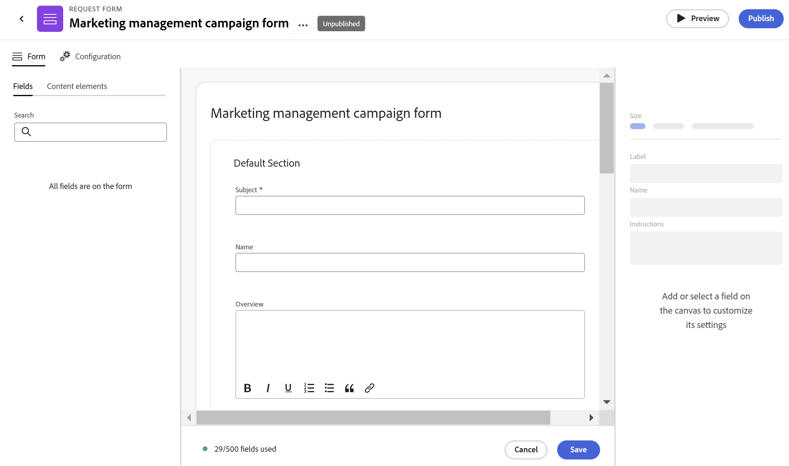

# Adobe Workfront Planning でのリクエストフォームの作成と管理

<!--update the metadata with real information when making this available in TOC and in the left nav-->

<!--take Preview and Production references at Production time-->

このページでハイライト表示されている情報は、まだ一般に利用できない機能を示します。すべてのお客様が、プレビュー環境でのみ使用できます。 実稼動環境への毎月のリリースの後、迅速なリリースを有効にしたお客様には、実稼動環境でも同じ機能を利用できます。

迅速リリースについて詳しくは、[組織での迅速リリースを有効または無効にする](/help/quicksilver/administration-and-setup/set-up-workfront/configure-system-defaults/enable-fast-release-process.md)を参照してください。

{{planning-important-intro}}

リクエストフォームを作成し、Adobe Workfront Planning でレコードタイプに関連付けることができます。 その後、フォームを他のユーザーと共有し、他のユーザーがレコードを作成するリクエストを送信できます。

この記事では、ワークスペースマネージャーがレコードタイプに関連付けられたリクエストフォームを作成する方法について説明します。

レコードを作成するレコード・タイプにリクエストを発行する方法は、「レコードを作成するためのAdobe Workfront Planning リクエストの発行 [ を参照してください ](/help/quicksilver/planning/requests/submit-requests.md)。

## アクセス要件

+++ 展開すると、この記事の機能のアクセス要件が表示されます。

この記事の手順を実行するには、次のアクセス権が必要です。

<table style="table-layout:auto">
 <col>
 </col>
 <col>
 </col>
 <tbody>
    <tr>
<tr>
<td>
   
 製品
 </td>
   <td>
   <ul><li>
 Adobe Workfront
</li>
   <li>
 Adobe Workfrontの計画
</li></ul></td>
  </tr>  
 <tr>
   <td role="rowheader">
Adobe Workfront プラン*
</td>
   <td>

次のいずれかのWorkfront プラン：

<ul><li>選択</li>
<li>Prime</li>
<li>Ultimate</li></ul>

Workfront Planning は、従来のWorkfront プランでは使用できません

   </td>

<tr>
   <td role="rowheader">
Adobe Workfront Planning パッケージ*
</td>
   <td>

任意 
  

各Workfront Planning プランに含まれる内容について詳しくは、Workfront担当営業または販売店にお問い合わせください。 </td>

<tr>
   <td role="rowheader">
Adobe Workfront platform
</td>
   <td>

組織のWorkfront インスタンスは、Workfront Planning のすべての機能にアクセスできるように、Adobe Unified Experience にオンボーディングされる必要があります。

詳しくは、<a href="/help/quicksilver/workfront-basics/navigate-workfront/workfront-navigation/adobe-unified-experience.md">Workfront の Adobe Unified Experience</a> を参照してください。 

   </td>

</tr>
  </tr>
  <tr>
   <td role="rowheader">
Adobe Workfront プラン*
</td>
   <td>
   
標準

   
Workfront Planning は、従来のWorkfront ライセンスでは使用できません

  </td>
  </tr>
  <tr>
   <td role="rowheader">
アクセスレベルの設定
</td>
   <td> 
Adobe Workfront Planning に対するアクセスレベルのコントロールはありません。
  
</td>
  </tr>
<tr>
   <td role="rowheader">
オブジェクト権限
</td>
   <td>
   <ul>
   <li>
ワークスペース  およびレコードタイプ  に対する権限の管理 
</li>
    <li>
システム管理者は、自分が作成していないワークスペースを管理できます。 
</li>
    </ul>
   
Workfront Planning オブジェクトの共有権限について詳しくは、
<a href="/help/quicksilver/planning/access/sharing-permissions-overview.md">Adobe Workfront Planning での共有権限の概要</a>を参照してください。 
  </td>
  </tr>
<tr>
   <td role="rowheader">
レイアウトテンプレート
</td>
   <td> 
Workfront の管理者を含むすべてのユーザーには、メインメニューの Planning エリアを含むレイアウトテンプレートを割り当てる必要があります。 
  
</td>
  </tr>
 </tbody>
</table>

*Workfront のアクセス要件について詳しくは、[Workfront ドキュメントのアクセス要件](/help/quicksilver/administration-and-setup/add-users/access-levels-and-object-permissions/access-level-requirements-in-documentation.md)を参照してください。

+++

## リクエストフォームのフィールドと値の表示制限

リクエストを送信した後、リクエストフォームに表示されるフィールドとその値がレコードまたはリクエストの詳細ページに表示される方法には、制限があります。

Workfront Planning 要求の発行の詳細は、[ レコードを作成するためのAdobe Workfront Planning 要求の発行 ](/help/quicksilver/planning/requests/submit-requests.md) を参照してください。

* リクエストフォーム、リクエストフォームで作成されたレコードまたはリクエストの詳細ページに表示されるフィールドには、以下のような制限があります。

   * リクエストフォームに次のタイプのフィールドを追加することはできません。

      * 作成者と最終変更者
      * 作成日と最終変更日
      * 式
      * Workfront オブジェクトの参照フィールド
      * Workfront Planning 接続レコードの参照フィールド

* リクエストフォームビルダーでのフィールド形式の表示方法と、レコードまたはリクエスト詳細ページでのフィールド値の書式設定方法の違いを次に示します。

   * 通貨、数値、割合の各フィールドは、フォームビルダー内で 1 行のテキストフィールドタイプとして表示されます。

     ただし、フィールドの形式は保持され、リクエストの送信後に、レコードタイプとリクエストの詳細ページに通貨、数値、割合としてフィールド値が表示されます。

* 以下では、リクエストフォームとリクエストの詳細ページに表示されるフィールド値について説明します。

   * 「通貨」、「数値」、「パーセンテージ」の各フィールドの特殊な書式は保持されません。 例えば、これらの領域のこれらのフィールドの値に対して、小数点以下の精度は保持されません。
   * 人物フィールドの値は ID として表示されます。
   * 他のフィールドや計算を参照しない数式フィールドには、値は表示されません。 例えば、`STRING` 式を持つフィールドは「N/A」値を表示します。
   * 通貨フィールドを参照する数式フィールドは、為替レートを考慮せずに値を表示します。
   * 段落フィールドの値は、リクエストフォームに「N/A」値を表示し、リクエストの詳細ページに書式設定されたテキストの代わりに HTML タグを表示します。

## レコードタイプ用のリクエストフォームの作成

{{step1-to-planning}}

1. レコードを追加するワークスペースをクリックします。

   ワークスペースが開き、レコードタイプがカードとして表示されます。

1. レコードタイプのカードをクリックします。レコードタイプの作成については、[レコードタイプの作成](/help/quicksilver/planning/architecture/create-record-types.md)を参照してください。

   最後にアクセスしたビューで、レコードタイプのページが開きます。デフォルトでは、レコードタイプのページがテーブル表示で開きます。

1. ページ ヘッダーのレコードの種類名の右側にある **その他** メニュー  をクリックし、既にフォームがあり、追加のフォームを作成する場合は **リクエストフォームを作成** または **リクエストフォームを管理** をクリックします。
1. （条件付き）別のフォームを追加する場合は、「**新規リクエストフォーム**」をクリックします。
1. リクエストフォームの名前を更新します。 デフォルトでは、フォームの名前は **名称未設定フォーム** です。<!--check this; you logged a bug to rename it to 'Untitled request form' but was it fixed?-->
1. （オプション）リクエストフォームに **説明** を追加します。

   <!--Not possible yet: The Description is visible when you access the request form from the Requests area of Workfront.-->

1. 「**作成**」をクリックします。選択したレコードタイプのリクエストフォームが「フォーム」タブで開きます。

   

   リクエストフォームには、デフォルトで次の情報が含まれています。

   * 選択したレコードタイプのテーブル表示で使用可能なレコードフィールド。<!--they are working on removing the limitation below-->

   * **デフォルトセクション**：これは、Workfrontがリクエストフォームに適用するデフォルトのセクション区切りです。 すべてのレコードフィールドが **デフォルトセクション** 領域に表示されます。
   * **件名** フィールド：Workfrontでリクエストを識別するフィールド。 「件名」フィールドの設定と値は編集できません。

     >[!NOTE]
     >
     >* **件名** フィールドは、リクエストフォームに表示される場合、値が必要です。 ただし、必要に応じて「**件名** フィールドを削除することができ、リクエスターがリクエストを送信してもフォームに表示されません。
     >* リクエストフォームに「件名」フィールドがなく、将来のレコードの名前に対する「名前」フィールドがある場合、リクエストの名前は、作成されたレコードと同じ名前に自動的に割り当てられます。
     >* リクエストフォームに「件名」フィールドと「名前」フィールドの両方がない場合、リクエストは、`< Record name > request form < Entry date of the request >` のパターンを使用して名前が付けられます。レコードの名前は **名称未設定** です。

   * レコードタイプに関連付けられているすべてのフィールド。

     リクエストフォームに含まれるフィールドは、このレコードタイプにリクエストを送信するすべてのユーザーに表示されます。

1. （オプション）削除するフォーム上のフィールドの上にマウスポインターを置き、「**x**」アイコンをクリックして削除します。 これらは、フォームの左側にある **フィールド** タブに追加されます。

   例えば、「**件名** フィールドはWorkfront Planning には表示されないので、これを削除します。<!--remove this example if this becomes visible in Planning?-->

1. （オプション）フォームから **デフォルトセクション** を削除するには、次の手順を実行します。

   1. デフォルトセクションからすべてのフィールドを削除します。
   1. **コンテンツ要素** をクリックし、新しいセクションを追加して、セクションの名前を追加します。
   1. 新しいセクションにフィールドを追加します。
   1. **x** アイコンをクリックして **デフォルトのセクション** を削除します。
1. 任意のフィールドをクリックし、フォームの右側のパネルにあるコントロールを使用して、フィールドのサイズまたは次の情報を定義します。

   * **ラベル**：リクエストフォームに表示されるフィールドの名前です。 レコードフィールドの名前は変更されません。
   * **手順**：フィールドに関する詳細情報を追加します。
   * **必須フィールドにする**：選択する場合、フィールドには値が必要です。 追加されていない場合、フォームを送信できません。
   * **ロジックの追加**：フィールドを表示または非表示にするには、どの条件を満たす必要があるかを定義します。

   >[!TIP]
   >
   >   フォームでフィールドを選択すると、各フィールドのフィールドタイプが右側のパネルの上部に表示されます。
   >     

1. （オプション）フォームの左側にある「**コンテンツ要素**」タブをクリックして、次の要素のいずれかを追加します。

   * **説明テキスト**
   * **セクション区切り**

   カスタムフォームの作成について詳しくは、「[ カスタムフォームの作成 ](/help/quicksilver/administration-and-setup/customize-workfront/create-manage-custom-forms/form-designer/design-a-form/design-a-form.md)」を参照してください。

1. （オプション） **プレビュー** をクリックして、他のユーザーが新しいレコードを送信する際にフォームを使用する際のフォームの表示方法を表示します。

1. （オプション）「**設定**」タブをクリックし、「**承認者**」フィールドに少なくとも 1 人のユーザーを追加して、このレコードフォームの新しいリクエストを承認します。

   

   <!--below bullet list is duplicated in the Add approval to a request form article-->

   * リクエストフォームを承認者に関連付ける場合、新しいリクエストは、新しいレコードを生成する前に、最初にすべての承認者の承認を受ける必要があります。
   * リクエストフォームには、1 人または複数の承認者を追加できます。
   * 少なくとも 1 人の承認者が要求を拒否した場合、要求は拒否され、レコードは作成されません。
   * すべての承認者は、リクエストが承認または却下される前に決定を行う必要があります。

     リクエストフォームへの承認の追加について詳しくは、「[ リクエストフォームへの承認の追加 ](/help/quicksilver/planning/requests/add-approval-to-request-form.md)」を参照してください。

1. （オプション）ヘッダーのフォーム名の右側にある **詳細** メニュー  をクリックしてから、「**編集**」をクリックしてフォーム名を更新します。
1. 「**公開**」をクリックしてフォームを公開し、フォームの一意のリンクを取得します。

   次のことが発生します。

   * **公開** ボタンは削除されました。
   * **非公開** ボタンがフォームに追加されます。 クリックすると、フォームにアクセスできなくなります。
   * 「**共有** ボタンがフォームに追加されます。

1. **共有** をクリックして、フォームを他のユーザーと共有します。

   

1. このフォームにアクセスできるユーザーのタイプを指定するには、次のオプションから選択します。

   * ワークスペースに対する表示またはそれ以上のアクセス権を持つすべてのユーザー
   * ワークスペースに対する参加またはそれ以上のアクセス権を持つすべてのユーザー
   * リンクを知っているすべてのユーザー

   >[!WARNING]
   >
   >* **リンクを持つすべてのユーザー** を選択すると、組織外のユーザーであっても、Workfront アカウントを持たないユーザーであっても、誰でもフォームにアクセスして、新しいレコードを送信できます。
   >
   >* 次のフィールドタイプを含むフォームは、パブリックに共有できません。
   >
   >     * WorkfrontまたはAEM Assetsの接続
   >     * ユーザー
   >

1. （条件付き）前の手順で「**リンクを持つすべてのユーザー**」を選択した場合は、使用可能なカレンダーから **有効期限をリンク** を選択します。

   リンクの有効期限が切れた後、ユーザーはエラーを受け取ります。ユーザーがフォームに再度アクセスできるようにするには、リンクの日付を更新し、新しいリンクを生成して共有する必要があります。

   現在の日付から 180 日以内の将来の日付を選択できます。

   >[!TIP]
   >
   >共有日が終了すると、Workfrontの「リクエスト」領域でリクエストフォームが使用できなくなり、他のユーザーと共有されていたリンクにもアクセスできなくなります。

1. （任意）「**リンクを保存してコピー**」をクリックして、フォームの共有の詳細を保存します。 フォームが以前に保存されている場合は、「**リンクをコピー**」をクリックします。

   フォーム共有オプションが保存され、リンクがクリップボードにコピーされます。 他のユーザーと共有できるようになりました。

   リクエストフォームへのリンクを使用してレコードを作成する方法については、「[Adobe Workfront Planning リクエストの送信 ](/help/quicksilver/planning/requests/submit-requests.md)」を参照してください。

1. **フォーム** タブの右下隅にある「**保存**」をクリックしてフォームを保存します。

1. ヘッダーでフォーム名の左側にある左向き矢印をクリックして、フォームを閉じます。

   **リクエストフォーム** テーブル表示が開き、フォームが追加されます。

1. （オプション）テーブル表示でリクエストフォームの名前の上にマウスポインターを置き、フォーム名の右側にある **詳細** メニュー  をクリックして、次のいずれかをクリックします。

   * **フォームを編集**：フォームの情報をさらに編集するには、これをクリックします。
   * **非公開**：このボタンをクリックしてフォームを非公開にすると、Workfrontのリクエスト領域から削除されます。
   * **共有**: フォームへのアクセス権を持つユーザーを変更するには、これをクリックします。
   * **リンクをコピー**：フォームを開かずにリクエストフォームのリンクをすばやくコピーする場合は、これをクリックします。
   * **削除**：フォームを削除するには、これをクリックします。 フォームを使用して追加されたリクエストとレコードはすべて削除されません。 フォームを復元できません。

   

1. ヘッダーにある **リクエストフォーム** の左側の左向き矢印をクリックして、リクエストフォームテーブルを閉じます。

   レコードタイプのページが開きます。
1. （オプションおよび条件付き）ヘッダーのレコードタイプ名の右側にある **その他** メニュー  をクリックし、次のいずれかの操作を行います。

   1. 「**リクエストフォームを更新**」をクリックしてリクエストフォームに変更を加え、リクエストフォームをクリックして開いて編集します。
   1. **リクエストフォームにリンクをコピー** をクリックして、フォームへのリンクを他のユーザーと共有します。

1. （オプション）Workfrontの **リクエスト** エリアに移動して、リクエストを送信する共有フォームを見つけます。 詳しくは、[ レコードを作成するためのAdobe Workfront Planning リクエストの発行 ](/help/quicksilver/planning/requests/submit-requests.md) を参照してください。

