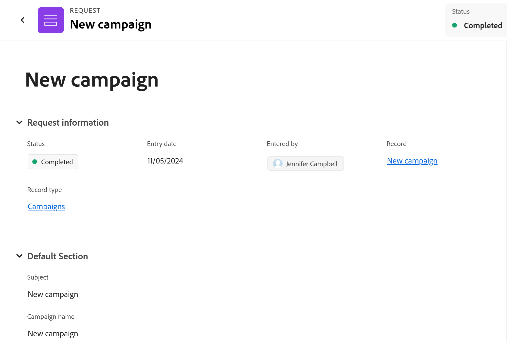

# レコードを作成するためのAdobe Workfront Planning 要求の発行

<!--update title when there will be more functionality added to the Planning requests, besides creating records-->
<!--take Preview and Prod references out when releasing to Prod all-->

<!--The highlighted information on this page refers to functionality not yet generally available. It is available only in the Preview environment for all customers. After the monthly releases to Production, the same features are also available in the Production environment for customers who enabled fast releases.    

For information about fast releases, see [Enable or disable fast releases for your organization](/help/quicksilver/administration-and-setup/set-up-workfront/configure-system-defaults/enable-fast-release-process.md). -->

{{planning-important-intro}}

Adobe Workfront Planning の「レコードタイプ」ページでユーザーがリクエストフォームへのリンクを共有すると、リクエストを追加して、リクエストフォームに関連付けられた「レコードタイプ」のレコードを作成できます。

Workfront ユーザーと外部ユーザーは、Planning レコードタイプに対してリクエストを送信し、レコードを作成できます。<!--double check on the external users-->

この記事では、新しいレコードをレコードタイプに追加するリクエストを送信する方法について説明します。

ワークスペースマネージャーがリクエストフォームを作成し、レコードタイプに関連付ける方法について詳しくは、[Adobe Workfront Planning でのリクエストフォームの作成と管理 ](/help/quicksilver/planning/requests/create-request-form.md) を参照してください。

## アクセス要件

+++ 展開すると、この記事の機能のアクセス要件が表示されます。

この記事の手順を実行するには、次のアクセス権が必要です。

<table style="table-layout:auto">
 <col>
 </col>
 <col>
 </col>
 <tbody>
    <tr>
<tr>
<td>
   
 製品
 </td>
   <td>
   <ul><li>
 Adobe Workfront
</li>
   <li>
 Adobe Workfrontの計画
</li></ul></td>
  </tr>  
 <tr>
   <td role="rowheader">
Adobe Workfront プラン*
</td>
   <td>

次のいずれかのWorkfront プラン：

<ul><li>選択</li>
<li>Prime</li>
<li>Ultimate</li></ul>

Workfront Planning は、従来のWorkfront プランでは使用できません

   </td>
<tr>
   <td role="rowheader">
Adobe Workfront Planning パッケージ*
</td>
   <td>

任意 
  

各Workfront Planning プランに含まれる内容について詳しくは、Workfront担当営業または販売店にお問い合わせください。 </td>
<tr>
   <td role="rowheader">
Adobe Workfront platform
</td>
   <td>

組織のWorkfront インスタンスは、Workfront Planning のすべての機能にアクセスできるように、Adobe Unified Experience にオンボーディングされる必要があります。

詳しくは、<a href="/help/quicksilver/workfront-basics/navigate-workfront/workfront-navigation/adobe-unified-experience.md">Workfront の Adobe Unified Experience</a> を参照してください。 

   </td>

</tr>
  </tr>
  <tr>
   <td role="rowheader">
Adobe Workfront プラン*
</td>
   <td>
   
外部、コントリビューター、ライト、または標準のライセンス

   
Workfront Planning は、従来のWorkfront ライセンスでは使用できません

  </td>
  </tr>
  <tr>
   <td role="rowheader">
アクセスレベルの設定
</td>
   <td> 
Adobe Workfront Planning に対するアクセスレベルのコントロールはありません。
  
</td>
  </tr>
<tr>
   <td role="rowheader">
オブジェクト権限
</td>
   <td>
   
Workfront ユーザーの場合は、ワークスペースに対する以上の権限を表示します。
 
  </td>
  </tr>
<tr>
   <td role="rowheader">
レイアウトテンプレート
</td>
   <td> 
Workfrontのプランニング エリアにアクセスするには、メインメニューのプランニング エリアを含むレイアウトテンプレートを割り当てる必要があります。 

   
 ただし、Workfront Planning にリクエストを送信するために Planning エリアにアクセスする必要はありません。 
  
</td>
  </tr>
 </tbody>
</table>

*Workfront のアクセス要件について詳しくは、[Workfront ドキュメントのアクセス要件](/help/quicksilver/administration-and-setup/add-users/access-levels-and-object-permissions/access-level-requirements-in-documentation.md)を参照してください。

+++

## 前提条件

Workfront Planning 要求フォームに要求を送信するには、次の手順を実行する必要があります。

* Workfront Planning には、次のものが存在する必要があります。

   * ワークスペース
   * リクエストフォームに関連付けられたレコードタイプ。 詳しくは、[Adobe Workfront Planning でのリクエストフォームの作成 ](/help/quicksilver/planning/requests/create-request-form.md) を参照してください。

* リクエストフォームは、アクセスできる方法でリンクと共有する必要があります。 次のシナリオが存在します。

   * Workfront アカウントをお持ちの場合、リンクは社内ユーザーとのみ共有されており、ワークスペースに対する投稿以上のアクセス権を持っています。 Workfront外のユーザーは、社内で共有されているリンクにアクセスできません。
   * Workfront アカウントがない場合、リンクは外部のユーザーと共有されています。 また、Workfront ユーザーは、外部のユーザーと共有されているリンクにアクセスすることもできます。

* フォームへのリンクは期限切れにできません。

## Workfront Planning への要求の送信に関する考慮事項

* Workfront Planning 要求の要求フォームには、フォームへのリンクからのみアクセスできます。
* Workfront Planning に送信したリクエストをWorkfrontで編集することはできません。
* フォームが承認に関連付けられていない場合や、すべての承認者によって承認が付与された場合、送信されたリクエストごとに、使用するフォームに関連付けられたレコードタイプのレコードが作成されます。
* リクエストフォームを送信して作成されたレコードを、他の方法で追加されたレコードと区別することはできません。 詳しくは、[レコードの作成](/help/quicksilver/planning/records/create-records.md)を参照してください。
* 送信されたリクエストは、Workfrontの「リクエスト」領域の「送信済み」セクションの「計画」タブに表示されます。
* フォーム送信後のリクエストフォームまたはリクエストの詳細ページでの特定のフィールドタイプの表示方法には制限があります。 詳しくは、[Adobe Workfront Planning でのリクエストフォームの作成と管理 ](/help/quicksilver/planning/requests/create-request-form.md) を参照してください。

<!--Not sure how to change the request status, but dev also said: Changing the names of the statuses might lead to some inconsistency between unified-approvals-service and intake-approvals-flow.-->

## Workfront Planning への要求の発行

<!--

Submitting requests to Workfront Planning differs depending on what environment you use. 

### Submit a request to Workfront Planning in the Preview Environment

>[!NOTE]
>
>After the monthly releases to Production, the features described in this section are also available in the Production environment for customers who enabled fast releases.

{{step1-to-requests}}

1. Enable the **Switch to a new experience** setting, in the upper-right corner of he screen. 
   Enabling this setting makes the Workfront Planning request forms available in the **Requests** area of Workfront.

   >[!TIP]
   >
   >This setting is available only when the following are in place:
   >
   >* Your company has purchased a Workfront Planning package. 
   >* Your Workfront instance is onboarded to the Adobe Unified Experience. 
   >* You have access to view at least one workspace. 
   >

1. Click **New request**. (********* update screen shot at release ********)

   

   The New request area opens with the following information: 

   * The 6 most recently accessed Workfront request queues and Planning request forms display in the Recent section. 
   * 50 additional Workfront request queues and Planning request forms display in alphabetical order in the **All request forms** section. You can search for a request queue that does not display by default. 

1. Do one of the following:

   * Click the card for one of the Planning request forms in the Recent or All request forms sections
   * Start typing the name of a Planning request form in the search box, then click the card when it displays in the list. 

   The request form opens.

1. Update the fields available in the request form. Fields with a red asterisk are required. 
1. Click **Submit**.
    
   The request form closes and you return to the **Requests** area. 

   Your form is submitted and the following things occur:

   * If the request form was not associated with an approval, the request is added to the Planning tab of the Submitted section of the Workfront Requests area and a new record is added to the record type associated with the form.
   
   * If the request form was associated with an approval, the request is added to the Planning tab of the Submitted section of the Workfront Requests area. A new record is added to the record type page only after all the approvers have approved it.
   
      For information, see [Add an approval to a request form](/help/quicksilver/planning/requests/add-approval-to-request-form.md).

      

      >[!IMPORTANT]
      >
      >All users who have access to at least one workspace can view the Planning tab in the Requests area. You can view only the requests submitted by you or anyone else to the workspaces that you have at least permissions to View. Workfront administrators can view all requests submitted to any workspace in the system. (******** ensure this is correct; asking team in slack **************)

   * You receive an in-app and an email notification that the request has either been submitted successfully or has been sent for review.
   * If the request form was associated with an approval, the approvers receive an in-app and an email notification to review and approve the request.

      >[!NOTE]
      >
      >The email and in-app notifications are visible only when your organization's instance of Workfront is onboarded to the Adobe Unified Experience.

1. (Optional) Click the **Planning** tab in the Requests area to view your request, then click the name of the request. 

   The request details page opens. 

   

1. (Conditional) If the request form is not associated with an approval, or if the request has been approved, click the name of the request, then click the name of the record in the **Record** field. 

   The record's page opens in Workfront Planning. 

   >[!TIP]
   >
   >* If the record name was not added to the request form, the name of the record in the Record field of the request displays as **Untitled**. 
   >
   >* If the request form is associated with an approval, the approval must be granted before you can access the record from the request page. 

1. (Optional) Click the name of the **Record type**. 

   The record type page opens in Workfront Planning. 

### Submit a request to Workfront Planning in the Production environment

-->

1. Workfront Planning レコードタイプから共有されたリンクに移動します。

1. フォームで使用可能なフィールドを更新します。 アスタリスクの付いたフィールドは必須です。

   >[!TIP]
   >
   >   **件名** フィールドが使用可能な場合、リクエストの送信後に、Workfront Planning に表示されません。
   >
   >新しいレコードがWorkfront Planning のレコードタイプに追加された際に識別可能になるように、リクエストのできるだけ多くのフィールドを更新することをお勧めします。

1. 「**送信**」をクリックします。

   フォームが送信され、次の処理が行われます。

   * リクエストフォームが承認に関連付けられていない場合、リクエストは「Workfront リクエスト」エリアの「送信済み」セクションの「計画」タブに追加され、新しいレコードがフォームに関連付けられたレコードタイプに追加されます。

   * リクエストフォームが承認に関連付けられている場合、リクエストは「Workfront リクエスト」エリアの「送信済み」セクションの「計画」タブに追加されます。 新しいレコードは、すべての承認者が承認した後にのみ、レコードタイプページに追加されます。

     詳しくは、[ リクエストフォームへの承認の追加 ](/help/quicksilver/planning/requests/add-approval-to-request-form.md) を参照してください。

     

     >[!IMPORTANT]
     >
     >1 つ以上のワークスペースにアクセスできるすべてのユーザーは、リクエスト エリアの「計画」タブを表示できます。 表示可能な少なくとも権限を持つ、自分または他のユーザーがワークスペースに送信したリクエストのみを表示できます。 Workfront管理者は、システム内の任意のワークスペースに送信されたすべてのリクエストを表示できます。<!--ensure this is correct; asking team in slack-->

   * アプリ内と、リクエストが正常に送信されたかレビュー用に送信された旨のメール通知が届きます。
   * リクエストフォームが承認に関連付けられている場合、承認者は、リクエストをレビューして承認するためのアプリ内通知とメール通知を受け取ります。

     >[!NOTE]
     >
     >メールおよびアプリ内通知は、組織のWorkfront インスタンスがAdobe Unified Experience にオンボードされている場合にのみ表示されます。

1. （オプション）要求領域の **計画** タブをクリックして要求を表示し、要求名をクリックします。

   リクエストの詳細ページが開きます。

   

1. （条件付き）リクエストフォームが承認と関連付けられていない場合、またはリクエストが承認されている場合は、リクエストの名前をクリックし、「**レコード**」フィールドのレコードの名前をクリックします。

   Workfront Planning でレコードのページが開きます。

   >[!TIP]
   >
   >* レコード名がリクエストフォームに追加されなかった場合、リクエストのレコードフィールドのレコード名は **名称未設定** と表示されます。
   >
   >* リクエストフォームが承認に関連付けられている場合、リクエストページからレコードにアクセスするには、承認を付与する必要があります。

1. （オプション） **レコードタイプ** の名前をクリックします。

   Workfront Planning に「レコードタイプ」ページが開きます。

