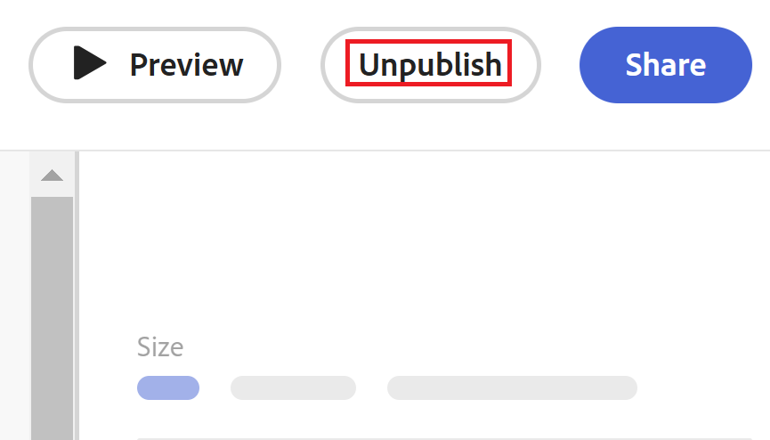

# Adobe Workfront Planning でリクエストフォームを非公開

<!--take Preview and Production references at Production time-->

<!--

The highlighted information on this page refers to functionality not yet generally available. It is available only in the Preview environment for all customers. After the monthly releases to Production, the same features are also available in the Production environment for customers who enabled fast releases.    

For information about fast releases, see [Enable or disable fast releases for your organization](/help/quicksilver/administration-and-setup/set-up-workfront/configure-system-defaults/enable-fast-release-process.md). 

-->

{{planning-important-intro}}

リクエストフォームが不要になった場合や関連性がなくなった場合は、そのフォームを非公開にすることができます。 非公開にすると、フォームにアクセスするための全員の権限が削除されます。

小さいグループのユーザーがリクエストフォームを利用できるようにしたい場合は、リクエストフォームを共有するエンティティを変更することもできます。

## アクセス要件

+++ 展開すると、この記事の機能のアクセス要件が表示されます。 

<table style="table-layout:auto"> 
<col> 
</col> 
<col> 
</col> 
<tbody> 
<tr> 
   <td role="rowheader">
Adobe Workfront パッケージ
</td> 
   <td> 

任意のWorkfront パッケージと任意のPlanning パッケージ

または

任意のワークフローパッケージと任意のプランニングパッケージ

各Workfront計画パッケージに含まれる内容について詳しくは、Workfrontの担当者にお問い合わせください。

   </td> </tr>

</tr> 
  <tr> 
   <td role="rowheader">
Adobe Workfront プラン
</td> 
   <td>
標準
 
  </td> 
  </tr> 
  <tr> 
   <td role="rowheader">
オブジェクト権限
</td> 
   <td>   
ワークスペースとレコードタイプ </a>に対する権限を管理 
  
   
システム管理者は、作成しなかったワークスペースも含め、すべてのワークスペースに対する権限を持っています。
  </td> 
  </tr>  
</tbody> 
</table>

Workfrontのアクセス要件について詳しくは、[Workfront ドキュメント ](/help/quicksilver/administration-and-setup/add-users/access-levels-and-object-permissions/access-level-requirements-in-documentation.md)のアクセス要件を参照してください。

+++

## リクエストフォームの共有を変更する

組織外のユーザーを含む全員と公開でリクエストを共有する場合は、フォームが関連付けられているワークスペースを表示または管理する特定のユーザーに、このアクセスを制限することを検討してください。

リクエストフォームの共有を変更するには：

{{step1-to-planning}}

1. フォームを共有するワークスペースをクリックします。

   ワークスペースが開き、レコードタイプがカードとして表示されます。

1. レコードタイプのカードをクリックします。 レコードタイプの作成については、[レコードタイプの作成](/help/quicksilver/planning/architecture/create-record-types.md)を参照してください。

   最後にアクセスしたビューで、レコードタイプのページが開きます。 デフォルトで、レコードタイプのページがテーブルビューで開きます。

1. ページヘッダーのレコードタイプ名の右側にある&#x200B;**詳細** メニューをクリックし、**リクエストフォームの管理**&#x200B;をクリックします。

   レコードタイプに関連付けられたすべてのリクエストフォームがテーブルビューに表示されます。
1. リクエストフォームの名前にカーソルを合わせ、名前の右側にある&#x200B;**詳細** メニューをクリックし、**共有**&#x200B;をクリックします。
1. 次のいずれかを選択して、共有の選択肢を更新します。

   * ワークスペースに対する表示またはそれ以上のアクセス権を持つすべてのユーザー
   * ワークスペースに対する参加またはそれ以上のアクセス権を持つすべてのユーザー
   * リンクを知っているすべてのユーザー

   詳しくは、[Adobe Workfront Planning](/help/quicksilver/planning/requests/create-request-form.md)でのリクエストフォームの作成と管理を参照してください。
1. （オプション） リクエストフォームの共有を変更し、新しいリンクを持つ新しいグループのユーザーに共有する場合は、「**リンクをコピー**」をクリックします。

## レコードタイプのリクエストフォームの非公開

リクエストフォームが無関係になり、誰にもそれ以上アクセスしてもらいたくない場合は、非公開にすることができます。

{{step1-to-planning}}

1. レコードを追加するワークスペースをクリックします。

   ワークスペースが開き、レコードタイプがカードとして表示されます。

1. レコードタイプのカードをクリックします。 レコードタイプの作成については、[レコードタイプの作成](/help/quicksilver/planning/architecture/create-record-types.md)を参照してください。

   最後にアクセスしたビューで、レコードタイプのページが開きます。 デフォルトで、レコードタイプのページがテーブルビューで開きます。

1. ページヘッダーのレコードタイプ名の右側にある&#x200B;**詳細** メニューをクリックし、**リクエストフォームの管理**&#x200B;をクリックします。

   レコードタイプに関連付けられたすべてのリクエストフォームがテーブルビューに表示されます。
1. リクエストフォームの名前にカーソルを合わせ、**詳細** メニューをクリックしてから、**非公開**&#x200B;をクリックします

または

リクエストフォームの名前をクリックして開き、リクエストフォームの右上隅にある「**非公開**」をクリックします。

画面の下部に、フォームが非公開になったことを知らせる確認が表示されます。

**非公開** リンクまたはボタンが&#x200B;**公開**&#x200B;に変更されます。

1. （条件付き）フォームを開いた後に未公開にした場合は、**保存**&#x200B;をクリックします。

   ユーザーは、Workfrontのリクエスト領域のリンクまたはリクエストキューからリクエストフォームにアクセスできなくなりました。

   リクエストフォームを使用して以前に追加したレコードは、レコードタイプページに残ります。

   以前に追加したリクエストはすべて、Workfrontのリクエスト領域に残ります。
