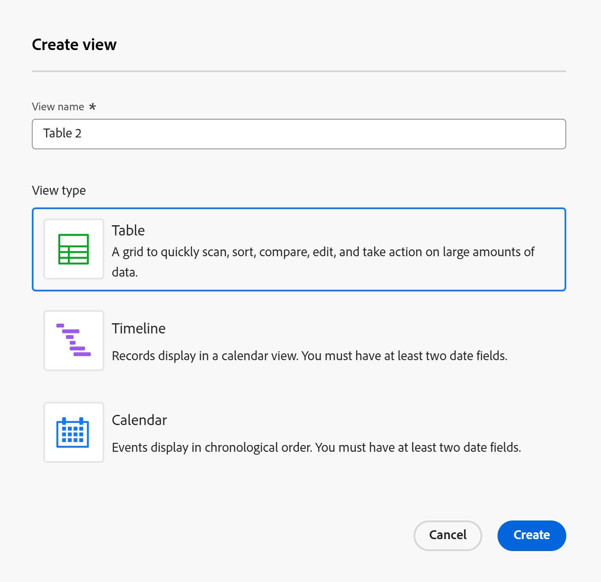
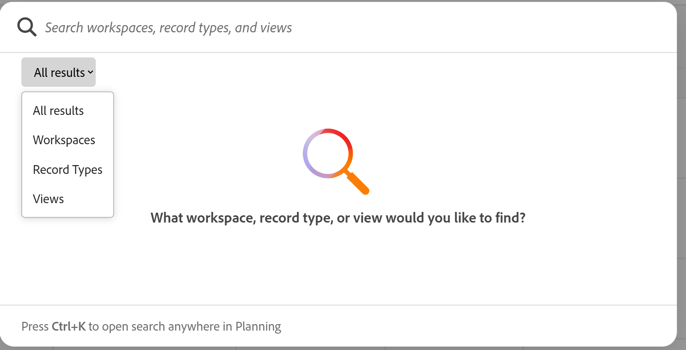
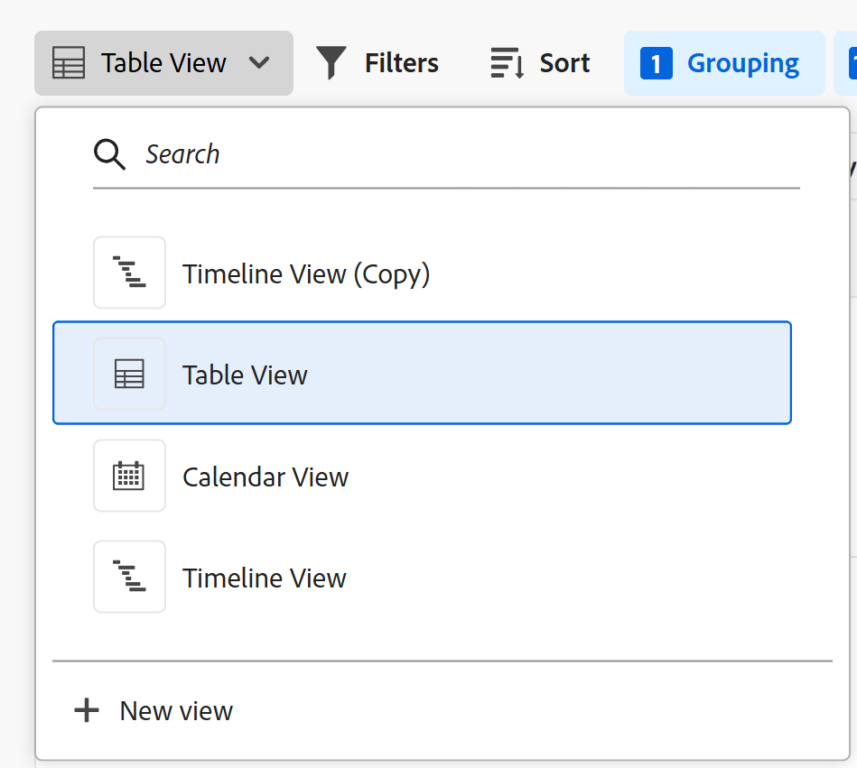

# レコードビューの管理

<!--

The highlighted information on this page refers to functionality not yet generally available. It is available only in the Preview environment for all customers. After the monthly releases to Production, the same features are also available in the Production environment for customers who enabled fast releases.    

For information about fast releases, see [Enable or disable fast releases for your organization](/help/quicksilver/administration-and-setup/set-up-workfront/configure-system-defaults/enable-fast-release-process.md). 

-->

{{planning-important-intro}}

Adobe Workfront計画領域でレコードタイプを選択すると、そのタイプのすべてのレコードをさまざまな方法で表示できます。

レコードをさまざまな形式で表示できるため、最適な方法で情報を柔軟に検索し、把握できます。 構造化された概要、時系列のストーリー、日付ベースのレイアウト、シンプルなスクロール可能なリストなど、各ビューで一意の視点を提供できます。

レコードは、次のビューで表示できます。

* テーブル

  詳しくは、[テーブルビューの管理](/help/quicksilver/planning/views/manage-the-table-view.md)を参照してください。

* タイムライン

  詳しくは、[タイムラインビューの管理](/help/quicksilver/planning/views/manage-the-timeline-view.md)を参照してください。

* カレンダー

  詳しくは、[タイムラインビューの管理](/help/quicksilver/planning/views/manage-the-calendar-view.md)を参照してください。

* リスト

  接続されたレコードページのレコードは、リストビューで表示できます。

  >[!IMPORTANT]
  >
  >レコードタイプページのレコードリストには、リストビューを適用できません。 レコードの接続されたレコードページのリストビューは、接続されたプロジェクトのリストにのみ適用できます。<!--this will change-->

  詳しくは、次の記事を参照してください。

   * [レコードへの接続されたレコードページの追加](/help/quicksilver/planning/records/add-a-connected-records-page-to-a-record.md)
   * [リスト表示の管理](/help/quicksilver/planning/views/manage-the-list-view.md)

この記事では、レコードビューに関する次の情報について説明します。

* [ビューの作成と編集](#create-or-edit-record-views)
* [&#x200B; ビューでリアルタイム プレゼンス指標を有効にする](#enable-the-real-time-presence-indicator-in-a-view)
  <!--* [Add a view as a favorite](#add-a-view-as-a-favorite) - not possible yet-->

Workfront Planning レコード ビューの管理の詳細については、次の記事も参照してください。

* [レコードビューの削除](/help/quicksilver/planning/views/delete-record-views.md)
* [レコードビューの複製](/help/quicksilver/planning/views/duplicate-record-views.md)
* [ビューの共有](/help/quicksilver/planning/access/share-views.md)

## アクセス要件

+++ 展開して、この記事の機能のアクセス要件を表示します。 

<table style="table-layout:auto"> 
<col> 
</col> 
<col> 
</col> 
<tbody> 
    <tr> 
<tr> 
</tr>   
<tr> 
   <td role="rowheader">
Adobe Workfront パッケージ
</td> 
   <td> 

任意のWorkfrontおよびプランニングパッケージ

任意のワークフローとプランニングパッケージ

各Workfront計画パッケージに含まれる内容について詳しくは、Workfrontの担当者にお問い合わせください。 
 
   </td> 
  <tr> 
   <td role="rowheader">
Adobe Workfront プラン
</td> 
   <td>
 ビューの作成と削除を行う標準

   
ビュー要素を更新する貢献者以上

  </td> 
  </tr> 
  <tr> 
   <td role="rowheader">
オブジェクト権限
</td> 
   <td>   
ビューに対する権限を管理
  
   
ビューの権限を表示して、ビュー設定を一時的に変更したり、ビュー設定を複製したりできます
 </td> 
  </tr> 
<tr>
   <td role="rowheader">
レイアウトテンプレート
</td>
   <td> LightまたはContributor ライセンスを持つユーザーには、Planningを含むレイアウトテンプレートを割り当てる必要があります。
   
標準ユーザーとシステム管理者は、デフォルトでプランニング領域を有効にできます。

</li></ul>
</td>
  </tr> 
</tbody> 
</table>

Workfrontのアクセス要件について詳しくは、[Workfront ドキュメント &#x200B;](/help/quicksilver/administration-and-setup/add-users/access-levels-and-object-permissions/access-level-requirements-in-documentation.md)のアクセス要件を参照してください。

+++

<!--
Old:
<table style="table-layout:auto"> 
<col> 
</col> 
<col> 
</col> 
<tbody> 
    <tr> 
<tr> 
<td> 
   
 Products
 </td> 
   <td> 
   <ul><li>
 Adobe Workfront
</li> 
   <li>
 Adobe Workfront Planning
</li></ul></td> 
  </tr>   
<tr> 
   <td role="rowheader">
Adobe Workfront plan*
</td> 
   <td> 

Any of the following Workfront plans:
 
<ul><li>Select</li> 
<li>Prime</li> 
<li>Ultimate</li></ul> 

Workfront Planning is not available for legacy Workfront plans
 
   </td> 
<tr> 
   <td role="rowheader">
Adobe Workfront Planning package*
</td> 
   <td> 

Any 
 

For more information about what is included in each Workfront Planning plan, contact your Workfront account manager. 
 
   </td> 
 <tr> 
   <td role="rowheader">
Adobe Workfront platform
</td> 
   <td> 

Your organization's instance of Workfront must be onboarded to the Adobe Unified Experience to be able to access Workfront Planning.
 

For more information, see <a href="/help/quicksilver/workfront-basics/navigate-workfront/workfront-navigation/adobe-unified-experience.md">Adobe Unified Experience for Workfront</a>. 
 
   </td> 
   </tr> 
  </tr> 
  <tr> 
   <td role="rowheader">
Adobe Workfront license*
</td> 
   <td>
 Standard to create and delete views

   
Contributor or higher to update view elements

   
Workfront Planning is not available for legacy Workfront licenses
 
  </td> 
  </tr> 
  <tr> 
   <td role="rowheader">
Access level configuration
</td> 
   <td> 
There are no access level controls for Adobe Workfront Planning
   
</td> 
  </tr> 
<tr> 
   <td role="rowheader">
Object permissions
</td> 
   <td>   
Manage permissions to a view
  
   
View permissions to a view to temporarily change the view settings or to duplicate it
 </td> 
  </tr> 
<tr>
   <td role="rowheader">
Layout template
</td>
   <td> Users with a Light or Contributor license must be assigned a layout template that includes Planning.
   
Standard users and System Administrators have the Planning areas enabled by default.

</li></ul>
</td>
  </tr>
</tbody> 
</table>
-->

## レコードビューを使用する際の考慮事項

* Workfront Planning のビューは、レコードタイプに固有です。同じビューを 2 つの異なるレコードタイプに適用することはできません。
* 作成したビューは、自分と、そのビューを共有しているユーザーにのみ表示されます。
* ビューを変更または削除すると、そのビューに対する権限を持つすべてのユーザーに対して、ビューが変更および削除されます。
* 各ユーザーは最大100個のビューを作成できます。 レコードタイプには100以上のビューを表示できますが、1人のユーザーが作成できるビューは100までです。
* 一部のビュー要素は、同じレコードの複数のビューに適用できますが、各レコードビューに固有です。

   * フィルター
   * 並べ替え（テーブルビュー用）
   * 行のカラー（テーブルビュー用）
   * フィールド（テーブルビュー用）
   * 分類（タイムラインビュー用）
   * グループ化（テーブルとタイムラインビューの場合）
   * バーの外観（タイムラインビューとカレンダービュー用）
   * 行の高さ（テーブルと月次カレンダービュー用）

  例えば、テーブルビューでフィルターを作成する場合、フィルターの結果は、選択したビュー（テーブルビュー）でのみ表示され、レコードタイプに関連付けられているすべてのビューには表示されません。

  >[!TIP]
  >
  >一部のビュー要素は、すべてのビューで使用できるわけではありません。

## レコードビューの類似点と相違点

テーブルビュー、タイムラインビューおよびカレンダービューの類似点と相違点を次の表に示します。

<!--some of these are NOT available right now; if you make this public, comment out the ones not there-->

| 機能 | テーブルビュー | タイムラインビュー | カレンダービュー | リスト表示 |
|-----------------------------------------------------------------------|------------|---------------|--------------|---------|
| テーブル形式でのレコードの表示 | ✓ |              | | ✓ |
| すべてのフィールドを表またはリストの列として表示する | ✓ |              |    | ✓ |
| フィールド（または列）の表示／非表示を切り替える | ✓ |               |    | ✓ |
| 各レコードのフィールド値を編集 | ✓ |               |             | ✓ |
| ビューにレコードを新しい行として追加 | ✓ |               |        | ✓ |
| ビューにフィールドを新しい列として追加 | ✓ |               |         | ✓ |
| 外部リストから行をコピーしてテーブルに貼り付ける | ✓ |               |          | ✓ |
| タイムラインでレコードを表示 |            | ✓ |             |  |
| レコードのフィルタリング | ✓ | ✓ | ✓ | ✓ |
| カレンダーにレコードを表示 |           |              | ✓ |  |
| レコードをグループ化 | ✓ | ✓ |  |  |
| レコードの並べ替え | ✓ |              |  | ✓ |
| カラーコードのレコード | ✓ | ✓ | ✓ |  |
| カラーコードのグループ化 |           | ✓ |  |  |
| 特定のレコードを検索 | ✓ | ✓ |  | ✓ |
| 他のユーザーとビューを共有する | ✓ | ✓ | ✓ | ✓ |
| ビューからレコードのページを開く | ✓ | ✓ |    | ✓ |
| 年と四半期ごとのレコードの表示 |           | ✓ |    |  |
| レコードを月別に表示 |           | ✓ | ✓ |  |
| レコードを週別に表示 |           |               | ✓ |  |
| ビューからの情報の書き出し | ✓ |               |    |  |
| 全画面表示 | ✓ | ✓ | ✓ |  |
| ビューでのレコードの作成 | ✓ | ✓ | ✓ | ✓ |
| つながりごとにレコードを分解し |          | ✓ |    |  |

## ビューを作成または編集 {#create-or-edit-views}

この節の情報は、次のビュータイプに適用されます。

* テーブル
* タイムライン
* カレンダー

リスト ビューについて詳しくは、[&#x200B; リスト ビューの管理](/help/quicksilver/planning/views/manage-the-list-view.md)を参照してください。

{{step1-to-planning}}

1. ワークスペースのカードをクリックします。

   ワークスペースが開き、レコードタイプがカードとして表示されます。

1. レコードタイプのカードをクリックします。

   レコードタイプのページが開きます。

   デフォルトでは、選択したタイプのすべてのレコードがテーブルビューに表示されます。

1. 現在のビュー名の横にあるドロップダウンアイコン をクリックし、**+新しいビュー**&#x200B;をクリックします。

1. 次のタイプのビューから選択します。

   * テーブル
   * タイムライン
   * カレンダー

1. 表示タイプを選択し、**作成**&#x200B;をクリックします。 ドロップダウンメニューに新しいビューが追加されます。

   >[!TIP]
   >
   >レコードタイプを作成すると、テーブルビューもデフォルトで作成されます。
   >
   >タイムラインまたはカレンダービューを作成するには、ビューを作成するレコードタイプに少なくとも2つの日付フィールドが必要です。
   >
   >それ以外の場合は、「タイムライン」および「カレンダー」オプションは淡色表示になります。
   >  

   

1. （オプション）既存のビューを編集するには、現在のビュー名の右側にあるドロップダウンメニューをクリックし、**検索** フィールドにビュー名を入力して、キーボードのEnter キーを押します。

   >[!TIP]
   >
   >次のキーボードの組み合わせを使用して、任意のWorkfront計画ページからグローバル検索ボックスを開き、ビューを検索できます。
   >
   >* Windowsの場合はCTRL+K
   >* Macの⌘+K
   >
   >

1. （オプション）ビューのドロップダウンメニューから、ビューを環境設定の順にドラッグ&amp;ドロップします。

   

1. （条件付き）タイムラインビューまたはカレンダービューを作成する際は、「**次へ**」をクリックします。

   デフォルトでは、ビューに次のいずれかの名前が付けられます。

   * `Table < number >`
   * `Timeline < number >`
   * `Calendar < number >`

   この数字は自動的に 1 ずつ増えて生成されます。

1. （条件付き）タイムラインビューまたはカレンダービューに表示されるレコードの場合は、「**開始日**」と「**終了日**」を選択します。

   >[!NOTE]
   >
   >    レコード日付フィールドから選択するか、接続されたレコードまたはオブジェクトタイプから検索日付フィールドを選択できます。
   >
   >レコードタイプを接続する際にルックアップフィールドを選択する場合は、日付フィールド（MAXまたはMIN）に集計を使用する必要があります。 アグリゲーターを追加するだけで、タイムラインビューとカレンダービューの開始日と終了日として接続の日付を使用できます。
   >
   >詳しくは、[レコードタイプの接続](/help/quicksilver/planning/architecture/connect-record-types.md)を参照してください。

1. 「**作成**」をクリックします。

   ビューは新しいタブとして表示されます。ビューは、作成時または共有時からの時間順で表示されます。
1. （オプション）最後のビューの横にある&#x200B;**詳細** メニューをクリックすると、選択したレコードタイプのすべてのビューが表示されます。

   最後のビュータブの後の&#x200B;**その他**&#x200B;メニューに、追加のビューが表示されます。**その他**&#x200B;メニューの横の数字は、追加のビューの数を示します。
1. （オプション）作成後にビューの名前を変更するには、ビューのドロップダウンメニューをクリックし、**詳細** メニュー > **名前変更**&#x200B;をクリックしてビュー名を更新します

   または

   ビュー名をダブルクリックし、新しい名前を入力していきます。<!--ensure there is not another saving step here?!-->

1. （オプション）「**フルスクリーン**」アイコン をクリックしてフルスクリーンで任意のビューを開き、**フルスクリーンを終了** アイコン またはキーボードのEscapeをクリックしてフルスクリーンを終了します。

1. （オプション）特定のタイプのビューを管理するには、次の記事を参照してください。

   * [テーブルビューの管理](/help/quicksilver/planning/views/manage-the-table-view.md)
   * [タイムラインビューの管理](/help/quicksilver/planning/views/manage-the-timeline-view.md)
   * [カレンダービューの管理](/help/quicksilver/planning/views/manage-the-calendar-view.md)

## ビューでリアルタイム プレゼンス インジケーターを有効にする

ビューのリアルタイムのプレゼンス指標に従って、他のユーザーが同時にレコードを編集しているかどうかを確認できます。

>[!NOTE]
>
>リストビューでは、リアルタイムのプレゼンス指標を表示することはできません。

すべてのレコードビューの右上隅に表示すると同時に、レコード情報を編集している他のユーザーのアバター（デフォルト）。

テーブルビューを表示すると、レコードを表示しているときに別のユーザーが編集しているフィールドを表示することもできます。

詳しくは、[テーブルビューの管理](/help/quicksilver/planning/views/manage-the-table-view.md)を参照してください。

<!--## Add a view as a favorite - this is not possible yet-->
