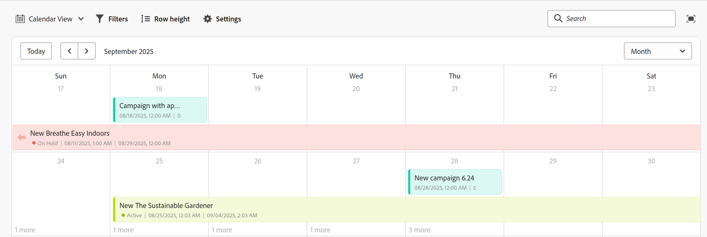
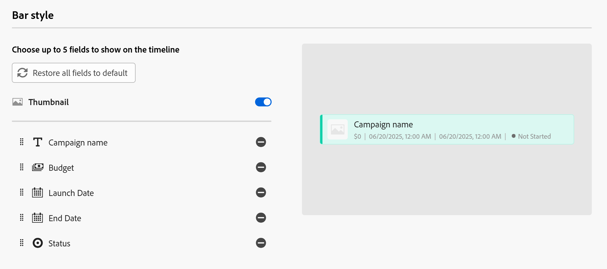
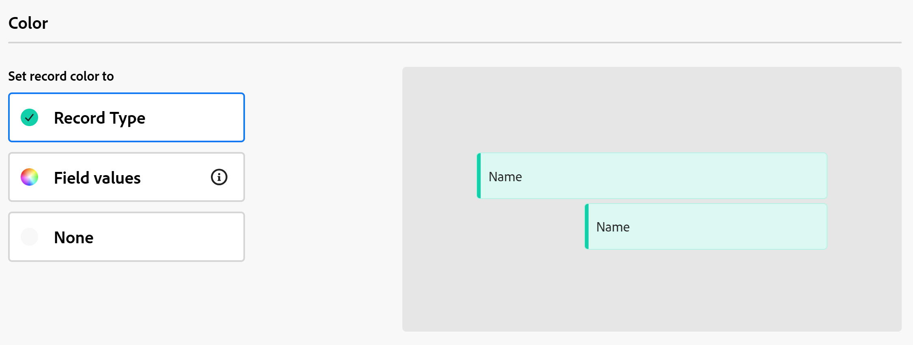
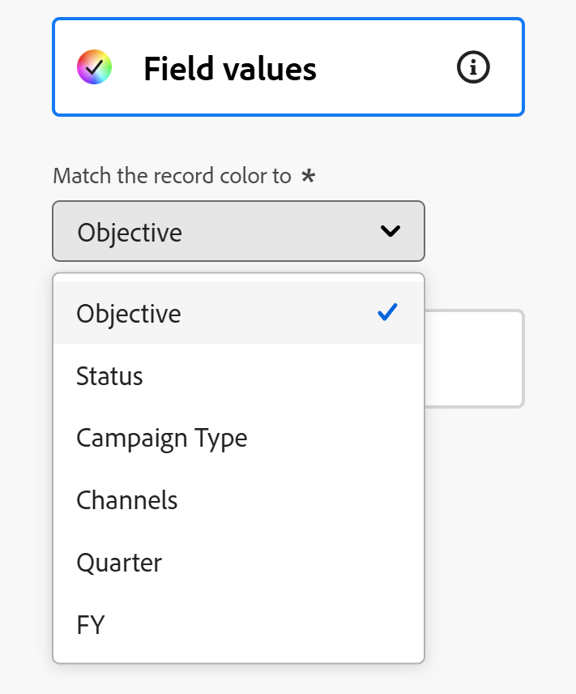

# カレンダービューの管理

<!--
The highlighted information on this page refers to functionality not yet generally available. It is available only in the Preview environment for all customers. After the monthly releases to Production, the same features are also available in the Production environment for customers who enabled fast releases.    

For information about fast releases, see [Enable or disable fast releases for your organization](/help/quicksilver/administration-and-setup/set-up-workfront/configure-system-defaults/enable-fast-release-process.md). 
-->

{{planning-important-intro}}

レコードの種類ページから、レコードとそのフィールドをカレンダービューに表示できます。

Adobe Workfront計画ビューとその管理方法について詳しくは、[&#x200B; レコードビューの管理](/help/quicksilver/planning/views/manage-record-views.md)を参照してください。

## アクセス要件

+++ 展開して、この記事の機能のアクセス要件を表示します。 

<table style="table-layout:auto"> 
<col> 
</col> 
<col> 
</col> 
<tbody> 
    <tr> 
<tr> 
</tr>   
<tr> 
   <td role="rowheader">
Adobe Workfront パッケージ
</td> 
   <td> 

任意のWorkfrontおよびプランニングパッケージ

任意のワークフローとプランニングパッケージ

各Workfront計画パッケージに含まれる内容について詳しくは、Workfrontの担当者にお問い合わせください。 
 
   </td> 
  <tr> 
   <td role="rowheader">
Adobe Workfront プラン
</td> 
   <td>
 ビューの作成と削除を行う標準

   
ビュー要素を更新する貢献者以上

  </td> 
  </tr> 
  <tr> 
   <td role="rowheader">
オブジェクト権限
</td> 
   <td>   
ビューに対する権限を管理
  
   
ビューの権限を表示して、ビュー設定を一時的に変更したり、ビュー設定を複製したりできます
 </td> 
  </tr> 
<tr>
   <td role="rowheader">
レイアウトテンプレート
</td>
   <td> LightまたはContributor ライセンスを持つユーザーには、Planningを含むレイアウトテンプレートを割り当てる必要があります。
   
標準ユーザーとシステム管理者は、デフォルトでプランニング領域を有効にできます。

</li></ul>
</td>
  </tr> 
</tbody> 
</table>

Workfrontのアクセス要件について詳しくは、[Workfront ドキュメント &#x200B;](/help/quicksilver/administration-and-setup/add-users/access-levels-and-object-permissions/access-level-requirements-in-documentation.md)のアクセス要件を参照してください。

+++ 

<!--
Old:
 <table style="table-layout:auto"> 
<col> 
</col> 
<col> 
</col> 
<tbody> 
    <tr> 
<tr> 
<td> 
   
 Products
 </td> 
   <td> 
   <ul><li>
 Adobe Workfront
</li> 
   <li>
 Adobe Workfront Planning
</li></ul></td> 
  </tr>   
<tr> 
   <td role="rowheader">
Adobe Workfront plan*
</td> 
   <td> 

Any of the following Workfront plans:
 
<ul><li>Select</li> 
<li>Prime</li> 
<li>Ultimate</li></ul> 

Workfront Planning is not available for legacy Workfront plans
 
   </td> 
<tr> 
   <td role="rowheader">
Adobe Workfront Planning package*
</td> 
   <td> 

Any 
 

For more information about what is included in each Workfront Planning plan, contact your Workfront account manager. 
 
   </td> 
 <tr> 
   <td role="rowheader">
Adobe Workfront platform
</td> 
   <td> 

Your organization's instance of Workfront must be onboarded to the Adobe Unified Experience to be able to access Workfront Planning.
 

For more information, see <a href="/help/quicksilver/workfront-basics/navigate-workfront/workfront-navigation/adobe-unified-experience.md">Adobe Unified Experience for Workfront</a>. 
 
   </td> 
   </tr> 
  </tr> 
    <td role="rowheader">
Adobe Workfront license*
</td> 
   <td>
 Standard to create and delete views

   
Contributor or higher to update view elements

   
Workfront Planning is not available for legacy Workfront licenses
 
  </td> 
  </tr> 
  <tr> 
   <td role="rowheader">
Access level configuration
</td> 
   <td> 
There are no access level controls for Adobe Workfront Planning
   
</td> 
  </tr> 
<tr> 
   <td role="rowheader">
Object permissions
</td> 
   <td>   
Manage permissions to a view
  
   
View permissions to a view to temporarily change the view settings or to duplicate it
 </td> 
  </tr> 
<tr>
   <td role="rowheader">
Layout template
</td>
   <td> Users with a Light or Contributor license must be assigned a layout template that includes Planning.
   
Standard users and System Administrators have the Planning areas enabled by default.

</li></ul>
</td>
  </tr>

</tbody> 
</table>
-->

## カレンダービューの管理 {#manage-a-calendar-view}

<!--insert screen shot of calendar view-->

次の点に注意してください。

* カレンダービューを作成できるのは、少なくとも2つの日付フィールドがレコードタイプに関連付けられている場合のみです。 レコードタイプに日付フィールドが1つまたはまったく関連付けられていない場合、カレンダービューのオプションはグレー表示になります。

  レコード日付フィールドから選択するか、接続されたレコードまたはオブジェクトタイプから検索日付フィールドを選択できます。
* 次のシナリオが存在します。

   * 開始日と終了日の両方に値がない場合、レコードはカレンダーに表示されません
   * 開始日または終了日に値がない場合、レコードは1日イベントとして表示されます
   * 開始日が終了日より後の場合、レコードはカレンダーに表示されません。

カレンダービューを管理するには：

1. カレンダーを表示するレコードタイプページに移動します。
1. 記事[&#x200B; レコードビューの管理](/help/quicksilver/planning/views/manage-record-views.md)の説明に従って、カレンダービューを作成します。

   

   選択したレコードタイプに関連付けられているレコードは、カレンダーにバーとして表示されます。 バーの色は、デフォルトではレコードアイコンの色と一致します。

1. カレンダー内を移動するには、次のいずれかの操作を行います。

   * カレンダーの左上隅にある左右のアイコンをクリックするか、水平スクロールを使用してカレンダー内を前後に移動します。
   * 右上隅の&#x200B;**Today**&#x200B;をクリックして、カレンダーを今日の日付の中央に配置します。
   * 時間枠ドロップダウンメニューから次のいずれかのオプションを選択して、時間間隔を更新します。

      * **月**：月次カレンダーにレコードが表示されます。

      * **週**: レコードは次の領域に表示されます：

         * 複数日にまたがるレコードは、カレンダーの上部に表示されます。
         * 1日以下の期間のレコードは、カレンダービューの下半分に表示されます。 開始日と終了日の時間を表示するように選択した場合、レコードは発生した日内の適切な時間に表示されます。

1. （オプション）「**フルスクリーン**」アイコン をクリックしてフルスクリーンで表示を開き、**フルスクリーンを終了** アイコン またはキーボードのEscapeをクリックしてフルスクリーンを終了します。

1. カレンダービューでレコードを作成したり、その日付を編集したりするには、次のいずれかの操作を行います。

   * カレンダー上の任意の場所をダブルクリックして、レコードを作成します。

     詳しくは、[レコードの作成](/help/quicksilver/planning/records/create-records.md)を参照してください。

   * レコードバーの左または右の余白をクリックし、新しい位置にドラッグ&amp;ドロップします。 レコードのバーのサイズを変更すると、開始日または終了日がすぐに更新されます。

   * レコードバーをドラッグ&amp;ドロップして、位置と日付を更新します。 レコードのバーを移動すると、開始日と終了日がすぐに更新されます。

     詳しくは、[レコードの編集](/help/quicksilver/planning/records/edit-records.md)を参照してください。

1. 以下のサブセクションで説明するように、次のビュー要素を更新します。
   * [フィルター](#add-filters)
   * [行の高さ](#modify-row-height)
   * [設定](#edit-the-calendar-view-settings)

   <!--* [Grouping](#add-grouping)-->
   <!--* [Sort](#add-sort) not sure if this is present in calendar views?!; also check the anchor and make sure it's correct-->

### フィルターを追加

フィルターを使用すると、画面に表示される情報の量を減らすことができます。

カレンダービューでフィルターを使用する場合は、次の点を考慮してください。

<!-- this list is almost identical to the one for the table view - update both-->

* カレンダービューに対して作成するフィルターは、同じレコードタイプに適用されている他のビューのフィルターとは独立して機能します。

* フィルターは、選択したビューに固有です。同じレコードタイプの2つのカレンダービューに、異なるフィルターを適用することができます。

* 同じカレンダービューを見ている2人のユーザーには、現在適用されている同じフィルターが表示されます。

* カレンダービュー用に作成するフィルターに名前を付けることはできません。

* フィルターを削除すると、自分と同じレコードタイプにアクセスし、同じビューを表示している人から、フィルターが削除されます。

* 接続されているレコードフィールドまたはルックアップフィールドでフィルタリングできます。

* 複数の値を表示するルックアップフィールドでフィルタリングできます。

カレンダービューにフィルターを追加するには：

1. 記事[&#x200B; レコードビューの管理](/help/quicksilver/planning/views/manage-record-views.md)の説明に従って、レコードタイプページのカレンダービューを作成します。
1. カレンダービューを選択し、カレンダーのツールバーの「**フィルター**」をクリックします。
1. 「**条件を追加**」をクリックして、次の情報を追加します。

   * **フィールドを選択**&#x200B;してフィールドを検索し、リストから選択します

   * **オプション** （またはフィルター修飾子）を選択して、フィールドが満たす必要がある条件を定義します

     次の表には、各タイプのフィールドで使用可能な修飾子が表示されています。

     <table>
        <thead>
        <tr>
            <th><b>フィールドタイプ</b></th>
            <th><b>修飾子</b></th>
        </tr>
        </thead>
        <tbody>
        <tr>
            <td>1 行、段落、式 </td>
            <td>
が次を含む

            
が次を含まない

            
が次に等しい

            
が次に等しくない

            
が空である

            
が空ではない
</td>
        </tr>
        <tr><td>単一選択</td>
            <td>
が次に等しい

            
が次に等しくない

            
が次のいずれかである

            
が次のいずれでもない

            
が空である

            
が空ではない
</td>
        </tr>
        <tr>
            <td>複数選択、人物</td>
            <td>
が次のいずれかを含む

            
が次のすべてを含む

            
が次に完全に等しい

            
が次のいずれも含まない

            
が空である

            
が空ではない
</td>
        </tr>
        <tr>
            <td>数値、割合、通貨</td>
            <td>
=

            
≠

            
 &lt; 

            
&gt;

            
≤

            
≥

            
が空である

            
が空ではない
</td>
        </tr>
        <tr>
            <td>日付</td>
            <td>
が次に等しい

            
が次に等しくない

            
が次の後にある

            
が次の前にある

            
が次の範囲である

が次の範囲ではない

            
が空である

が空ではない
</td>
        </tr>

     <tr>
            <td>チェックボックス</td>
            <td>
が次に等しい

        </tr>
        </tbody>
        </table>

   * 選択したフィールドの値を選択します。

   

   追加できるフィルタリング条件の数に制限はありません。

1. （オプション）「**条件を追加**」をクリックして、別のフィルタリングオプションを追加し、上記の手順を繰り返します。適用されたフィルターの数が、フィルターアイコンの左側に表示されます。
1. 次の演算子をクリックして、フィルター条件の結合方法と適用方法を指定します。

   * **AND**：指定したすべての条件を満たす必要があります。
   * **OR**：指定された条件のいずれかを満たす必要があります。 これはデフォルトのオプションです。

   1. （オプション）複数の条件グループ間に&#x200B;**AND**&#x200B;または&#x200B;**OR**&#x200B;演算子を追加します。

      

   レコードのリストは自動的にフィルタリングされます。<!--at this time, you can't name and save the filter - but will this change?!-->
   <!-- asked on the task for the simple filters whether there is a limitation for how many statements a filter can have?!-->

1. （オプション）「**x**」アイコンをクリックして、フィルター条件を削除します。
1. （オプション）「**フィルター**」をクリックして、フィルターボックスを閉じます。<!--right now you cannot "clear all" for filters, but this might come later-->

### 行の高さを変更

カレンダーセルの行の高さを変更して、各セルに表示するレコードバーの数を増減できます。

カレンダーに表示されるレコードの数は、レコードのバーに表示するフィールドの数によって異なります。

>[!TIP]
>
>この設定は、月ごとにカレンダーを表示する場合にのみ使用できます。

1. 記事[&#x200B; レコードビューの管理](/help/quicksilver/planning/views/manage-record-views.md)の説明に従って、レコードタイプページのカレンダービューを作成します。
1. （条件付き）月ごとにカレンダービューを表示し、カレンダーのツールバーで「**行の高さ**」をクリックします。
1. 次のオプションから選択します。

   <table>
    <thead>
    <tr>
        <th><b>行の高さオプション</b></th>
        <th><b>デフォルトの最大レコード数</b></th>
    </tr>
    </thead>
    <tbody>
    <tr>
        <td>低い</td>
        <td>
次の内容：

   <ul><li>1つのフィールドを表示する2つのレコード</li>
    <li>1つ以上のフィールドを表示する1つのレコード</li></ul>
        </td>
    </tr>
    <tr><td>標準</td>
        <td>
次の内容：

   <ul><li>1つのフィールドを表示する4つのレコード</li>
    <li>1つ以上のフィールドを表示する2つのレコード</li></ul>
        </td>
    </tr>
    <tr>
        <td>中</td>
        <td>
次の内容：

   <ul><li>1つのフィールドを表示する8つのレコード</li>
    <li>1つ以上のフィールドを表示する4つのレコード</li></ul>
        </td>
    </tr>
    <tr>
        <td>高い</td>
        <td>
次の内容：

   <ul><li>1つのフィールドを表示する12個のレコード</li>
    <li>1つ以上のフィールドを表示する6つのレコード</li></ul>
        </td>
    </tr>
    <tr>
        <td>コンテンツに合わせる</td>
        <td>
すべてのレコードが表示されます（最大500 レコード）
</td>
    </tr>
    </tbody>
    </table>

1. （オプション）カレンダーに表示されないレコードがある場合は、**more**&#x200B;をクリックします。

### カレンダービュー設定の編集

カレンダービューの設定を更新して、ビューに表示される情報とその表示方法を示します。

1. 記事[&#x200B; レコードビューの管理](/help/quicksilver/planning/views/manage-record-views.md)の説明に従って、レコードタイプのカレンダービューを作成します。
1. 「**設定**」をクリックします。
1. 左側のパネルで&#x200B;**日付と時刻**&#x200B;をクリックし、**開始日**&#x200B;と&#x200B;**終了日**&#x200B;を選択して、カレンダーに表示します。 デフォルトの開始日と終了日を選択するか、使用可能な任意の日付フィールドを選択できます。

   レコードを表すバーは、開始日に指定した日付で始まり、終了日に指定した日付で終わります。

   >[!NOTE]
   >
   >* 開始日または終了日の値がない、または開始日が終了日より後のレコードは、カレンダービューに表示されません。
   >
   >* 「分類」オプションを使用して追加のレコードを表示する場合、開始日と終了日はメインレコードの日付になります。 この領域で接続されているレコードの開始日と終了日は選択できません。

1. 左側のパネルの&#x200B;**棒スタイル**&#x200B;をクリックして、レコードバーに表示する情報を指定します。

   レコードのテーブルビューで定義されているレコードのプライマリフィールド（またはタイトル）は、デフォルトで選択されます。
   <!--adjust this when the primary field is released??-->

1. （オプションおよび条件付き）レコードにサムネールを追加した場合は、**サムネール** オプションを選択して、レコードに関連付けられた画像をレコードバーに表示します。

   >[!NOTE]
   >
   >    カレンダービューにサムネールを表示するには、まずテーブルビューにサムネールを追加する必要があります。 詳しくは、[&#x200B; レコードにサムネールを追加](/help/quicksilver/planning/records/add-thumbnails-to-records.md)を参照してください。

1. **フィールドを追加**&#x200B;をクリックし、**フィールドを検索** ボックス内をクリックして、追加するフィールドをクリックします。

   >[!TIP]
   >
   >   * レコードバーにフィールドを追加する前に、フィールドを作成する必要があります。
   > 
   >   * 1 つ以上のフィールドを選択する必要があります。**名前**&#x200B;はデフォルトで選択されています。
   >
   >   * 最大5つのフィールドを追加できます。

   カレンダーのバーのプレビューが右側に表示されます。

   

1. 左側のパネルの&#x200B;**カラー**&#x200B;をクリックして、カレンダーのレコードの色をカスタマイズします。

   

1. 「**レコードの色を**&#x200B;に設定」セクションで、次のオプションからレコードの色を設定することを選択します。

   * **レコードタイプ**：カレンダーのレコードバーの色は、選択したレコードタイプの色と一致します。 これはデフォルトのオプションです。
   * **フィールド値**：レコードの色は、指定したフィールドの色と一致します。
   * **なし**：レコードは白いバーで表示されます。

1. （条件付き）レコードの色に&#x200B;**フィールド値**&#x200B;を選択した場合、**レコードの色を次と一致させる**&#x200B;ドロップダウンメニューからフィールドを選択します。

   

   ドロップダウンメニューには、色分けされたオプションを持つフィールドのみが表示されます。

   例えば、複数選択フィールドや単一選択フィールドには、色分けされたオプションを含めることができます。

   選択したレコードタイプに対して色分けされたオプションを含むフィールドがない場合、このオプションは淡色表示になります。

1. 「**保存**」をクリックします。

   レコードは、選択した仕様でカレンダービューに表示されます。