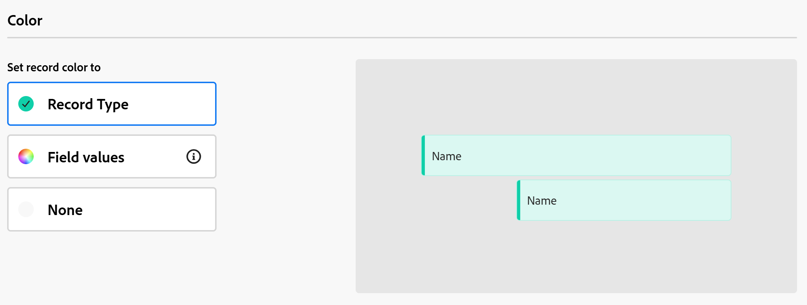

# カレンダービューの管理

このページでハイライト表示されている情報は、まだ一般に利用できない機能を示します。すべてのお客様が、プレビュー環境でのみ使用できます。 実稼動環境への毎月のリリースの後、迅速なリリースを有効にしたお客様には、実稼動環境でも同じ機能を利用できます。

迅速リリースについて詳しくは、[組織での迅速リリースを有効または無効にする](/help/quicksilver/administration-and-setup/set-up-workfront/configure-system-defaults/enable-fast-release-process.md)を参照してください。

{{planning-important-intro}}

レコードタイプページから、レコードとそのフィールドをカレンダー表示で表示できます。

Adobe Workfrontのプランニングビューとその管理方法について詳しくは、[ レコードビューの管理 ](/help/quicksilver/planning/views/manage-record-views.md) を参照してください。

## アクセス要件

+++ 展開して、この記事の機能のアクセス要件を表示します。 

<table style="table-layout:auto"> 
<col> 
</col> 
<col> 
</col> 
<tbody> 
    <tr> 
<tr> 
</tr>   
<tr> 
   <td role="rowheader">
Adobe Workfront パッケージ
</td> 
   <td> 

任意のWorkfrontと任意の Planning パッケージ

任意のワークフローおよび任意の計画パッケージ

各Workfront Planning パッケージに含まれる内容について詳しくは、Workfront アカウント担当者にお問い合わせください。 
 
   </td> 
  <tr> 
   <td role="rowheader">
Adobe Workfront プラン
</td> 
   <td>
 ビューを作成および削除するための標準

   
ビュー要素を更新する投稿者以上

  </td> 
  </tr> 
  <tr> 
   <td role="rowheader">
オブジェクト権限
</td> 
   <td>   
ビューに対する権限を管理
  
   
ビュー設定を一時的に変更したり、複製したりするためのビューへのアクセス許可を表示します
 </td> 
  </tr> 
<tr>
   <td role="rowheader">
レイアウトテンプレート
</td>
   <td> ライト ライセンスまたはコントリビュータ ライセンスを持つユーザには、Planning を含むレイアウト テンプレートを割り当てる必要があります。
   
標準ユーザーとシステム管理者は、デフォルトで Planning 領域を有効にします。

</li></ul>
</td>
  </tr> 
</tbody> 
</table>

Workfrontのアクセス要件について詳しくは、[Workfront ドキュメントのアクセス要件 ](/help/quicksilver/administration-and-setup/add-users/access-levels-and-object-permissions/access-level-requirements-in-documentation.md) を参照してください。

+++ 

<!--Old:
 <table style="table-layout:auto"> 
<col> 
</col> 
<col> 
</col> 
<tbody> 
    <tr> 
<tr> 
<td> 
   
 Products
 </td> 
   <td> 
   <ul><li>
 Adobe Workfront
</li> 
   <li>
 Adobe Workfront Planning
</li></ul></td> 
  </tr>   
<tr> 
   <td role="rowheader">
Adobe Workfront plan*
</td> 
   <td> 

Any of the following Workfront plans:
 
<ul><li>Select</li> 
<li>Prime</li> 
<li>Ultimate</li></ul> 

Workfront Planning is not available for legacy Workfront plans
 
   </td> 
<tr> 
   <td role="rowheader">
Adobe Workfront Planning package*
</td> 
   <td> 

Any 
 

For more information about what is included in each Workfront Planning plan, contact your Workfront account manager. 
 
   </td> 
 <tr> 
   <td role="rowheader">
Adobe Workfront platform
</td> 
   <td> 

Your organization's instance of Workfront must be onboarded to the Adobe Unified Experience to be able to access Workfront Planning.
 

For more information, see <a href="/help/quicksilver/workfront-basics/navigate-workfront/workfront-navigation/adobe-unified-experience.md">Adobe Unified Experience for Workfront</a>. 
 
   </td> 
   </tr> 
  </tr> 
    <td role="rowheader">
Adobe Workfront license*
</td> 
   <td>
 Standard to create and delete views

   
Contributor or higher to update view elements

   
Workfront Planning is not available for legacy Workfront licenses
 
  </td> 
  </tr> 
  <tr> 
   <td role="rowheader">
Access level configuration
</td> 
   <td> 
There are no access level controls for Adobe Workfront Planning
   
</td> 
  </tr> 
<tr> 
   <td role="rowheader">
Object permissions
</td> 
   <td>   
Manage permissions to a view
  
   
View permissions to a view to temporarily change the view settings or to duplicate it
 </td> 
  </tr> 
<tr>
   <td role="rowheader">
Layout template
</td>
   <td> Users with a Light or Contributor license must be assigned a layout template that includes Planning.
   
Standard users and System Administrators have the Planning areas enabled by default.

</li></ul>
</td>
  </tr>

</tbody> 
</table> -->

## カレンダー表示の管理 {#manage-a-calendar-view}

<!--insert screen shot of calendar view-->

次の点に注意してください。

* カレンダー表示を作成できるのは、1 つのレコードタイプに 2 つ以上の日付フィールドが関連付けられている場合のみです。 レコードタイプに日付フィールドが関連付けられている場合は、「カレンダー」表示オプションがグレー表示になります。

  レコードの日付フィールドから選択することも、接続されたレコードまたはオブジェクトタイプから日付フィールドを参照することもできます。
* 次のシナリオが存在します。

   * 開始日と終了日の両方に値がない場合、レコードはカレンダーに表示されません
   * 開始日または終了日に値がない場合、レコードは 1 日のイベントとして表示されます
   * 開始日が終了日より後の場合、レコードはカレンダーに表示されません。

カレンダー表示を管理するには：

1. カレンダーを表示するレコードタイプ ページに移動します。
1. 「レコードビューの管理 [ の記事の説明に従って、カレンダービューを作成 ](/help/quicksilver/planning/views/manage-record-views.md) ます。

   

   選択したレコードタイプに関連付けられているレコードは、カレンダーにバーとして表示されます。 バーの色は、既定ではレコード アイコンの色と一致します。

1. カレンダー内を移動するには、次のいずれかの操作を行います。

   * カレンダーの左上隅にある左右のアイコンをクリックするか、水平スクロールを使用してカレンダーを前後に移動します。
   * 右上隅にある **今日** をクリックして、カレンダーを今日の日付の中央に配置します。
   * 時間枠ドロップダウンメニューから次のいずれかのオプションを選択して、時間間隔を更新します。

      * **月**：レコードは月別カレンダーに表示されます。

      * **週**：レコードは次の領域に表示されます。

         * 複数日にまたがるレコードは、カレンダーの上部に表示されます。
         * 1 日以下のレコードは、カレンダー表示の下半分に表示されます。 開始日と終了日の時間を表示するように選択した場合、レコードは該当する日の適切な時間に表示されます。

1. （オプション） **フルスクリーン** アイコン  をクリックしてフルスクリーンでビューを開き、**フルスクリーンを終了** アイコン  またはキーボードの Esc キーをクリックしてフルスクリーンを終了します。

1. カレンダー表示でレコードを作成したり、日付を編集したりするには、次のいずれかの操作を行います。

   * レコードを作成するには、カレンダー上の任意の場所をダブルクリックします。

     詳しくは、[レコードの作成](/help/quicksilver/planning/records/create-records.md)を参照してください。

   * レコードバーの左右の余白をクリックし、新しい位置にドラッグ&amp;ドロップします。 レコードのバーのサイズを変更すると、開始日または終了日が直ちに更新されます。

   * レコードバーをドラッグ&amp;ドロップして、位置と日付を更新します。 レコードのバーを移動すると、開始日と終了日が直ちに更新されます。

     詳しくは、[レコードの編集](/help/quicksilver/planning/records/edit-records.md)を参照してください。

1. 以下のサブセクションで説明するように、次のビュー要素を更新します。
   * [フィルター](#add-filters)
   * [行の高さ](#modify-row-height)
   * [設定](#edit-the-calendar-view-settings)

   <!--* [Grouping](#add-grouping)-->
   <!--* [Sort](#add-sort) not sure if this is present in calendar views?!; also check the anchor and make sure it's correct-->

### フィルターを追加

フィルターを使用すると、画面に表示される情報の量を減らすことができます。

カレンダー表示でフィルターを使用する場合は、次の点に注意してください。

<!-- this list is almost identical to the one for the table view - update both-->

* カレンダー表示に対して作成するフィルターは、同じレコードタイプに適用される他の表示のフィルターとは独立して機能します。

* フィルターは、選択したビューに固有です。同じレコードタイプの 2 つのカレンダービューに異なるフィルターを適用できます。

* 2 人のユーザーが同じカレンダー表示を見ると、現在適用されているのと同じフィルターが表示されます。

* 作成したカレンダー表示のフィルターに名前を付けることはできません。

* フィルターを削除すると、自分と同じレコードタイプにアクセスし、同じビューを表示している人から、フィルターが削除されます。

* 接続されたレコードフィールドまたはルックアップフィールドでフィルタリングできます。

* 複数の値を表示する参照フィールドでフィルタリングできます。

カレンダー表示にフィルターを追加するには：

1. 「レコードビューの管理 [ の記事の説明に従って、レコードタイプのページのカレンダービューを作成 ](/help/quicksilver/planning/views/manage-record-views.md) ます。
1. カレンダー表示を選択し、カレンダーのツールバーの **フィルター** をクリックします。
1. 「**条件を追加**」をクリックして、次の情報を追加します。

   * **フィールドを選択** して  フィールドを検索するか、ドロップダウンメニューをクリックしてフィールドのリストを表示し、リストから選択します

   * **オプションを選択** （またはフィルター修飾子）して、フィールドが満たす必要がある条件の種類を定義します

     次の表に、各タイプのフィールドで使用可能な修飾子を示します。

     <table>
        <thead>
        <tr>
            <th><b>フィールドタイプ</b></th>
            <th><b>修飾子</b></th>
        </tr>
        </thead>
        <tbody>
        <tr>
            <td>1 行、段落、式 </td>
            <td>
が次を含む

            
が次を含まない

            
が次に等しい

            
が次に等しくない

            
が空である

            
が空ではない
</td>
        </tr>
        <tr><td>単一選択</td>
            <td>
が次に等しい

            
が次に等しくない

            
が次のいずれかである

            
が次のいずれでもない

            
が空である

            
が空ではない
</td>
        </tr>
        <tr>
            <td>複数選択、人物</td>
            <td>
が次のいずれかを含む

            
が次のすべてを含む

            
が次に完全に等しい

            
が次のいずれも含まない

            
が空である

            
が空ではない
</td>
        </tr>
        <tr>
            <td>数値、割合、通貨</td>
            <td>
=

            
≠

            
 &lt; 

            
&gt;

            
≤

            
≥

            
が空である

            
が空ではない
</td>
        </tr>
        <tr>
            <td>日付</td>
            <td>
が次に等しい

            
が次に等しくない

            
が次の後にある

            
が次の前にある

            
が次の範囲である

が次の範囲ではない

            
が空である

が空ではない
</td>
        </tr>

     <tr>
            <td>チェックボックス</td>
            <td>
が次に等しい

        </tr>
        </tbody>
        </table>

   * 選択したフィールドの値を選択します。

   

   追加できるフィルタリング条件の数に制限はありません。

1. （オプション）「**条件を追加**」をクリックして、別のフィルタリングオプションを追加し、上記の手順を繰り返します。適用されたフィルターの数が、フィルターアイコンの左側に表示されます。
1. 次の演算子をクリックして、フィルター条件の結合方法と適用方法を指定します。

   * **AND**：指定されたすべての条件が満たされている必要があります。
   * **OR**：指定された条件のいずれかが満たされている必要があります。 これはデフォルトのオプションです。

   1. （任意）複数の条件グループの間に、追加の **AND** または **OR** 演算子を追加します。

      

   レコードのリストは自動的にフィルタリングされます。<!--at this time, you can't name and save the filter - but will this change?!-->
   <!-- asked on the task for the simple filters whether there is a limitation for how many statements a filter can have?!-->

1. （任意）「**x**」アイコンをクリックして、フィルター条件を削除します。
1. （任意）「**フィルター**」をクリックして、「フィルター」ボックスを閉じます。<!--right now you cannot "clear all" for filters, but this might come later-->

### 行の高さを修正

カレンダーセルの行の高さを変更して、各セルに表示するレコードバーの数を増減させることができます。

カレンダーに表示されるレコードの数は、レコードのバーに表示するフィールドの数によって異なります。

>[!TIP]
>
>この設定は、月別にカレンダーを表示する場合にのみ使用できます。

1. 「レコードビューの管理 [ の記事の説明に従って、レコードタイプのページのカレンダービューを作成 ](/help/quicksilver/planning/views/manage-record-views.md) ます。
1. （条件付き）カレンダー表示を月別に表示し、カレンダーのツールバーの **行の高さ** をクリックします。
1. 次のオプションから選択します。

   <table>
    <thead>
    <tr>
        <th><b>行の高さオプション</b></th>
        <th><b>デフォルトの最大レコード数</b></th>
    </tr>
    </thead>
    <tbody>
    <tr>
        <td>低い</td>
        <td>
含む：

   <ul><li>1 つのフィールドを表示する 2 つのレコード</li>
    <li>1 件のレコードに複数のフィールドが表示されています</li></ul>
        </td>
    </tr>
    <tr><td>標準</td>
        <td>
含む：

   <ul><li>1 つのフィールドを表示する 4 つのレコード</li>
    <li>2 件のレコードに複数のフィールドが表示されています</li></ul>
        </td>
    </tr>
    <tr>
        <td>中</td>
        <td>
含む：

   <ul><li>1 つのフィールドを表示する 8 件のレコード</li>
    <li>4 件のレコードに複数のフィールドが表示されています</li></ul>
        </td>
    </tr>
    <tr>
        <td>高い</td>
        <td>
含む：

   <ul><li>1 つのフィールドを表示する 12 件のレコード</li>
    <li>6 件のレコードに複数のフィールドが表示されています</li></ul>
        </td>
    </tr>
    <tr>
        <td>コンテンツに合わせる</td>
        <td>
すべてのレコード（最大 500 件）が表示されます
</td>
    </tr>
    </tbody>
    </table>

1. （任意）カレンダーに表示されていないレコードがある場合は、「**詳細**」をクリックします。

### カレンダー表示設定の編集

カレンダー表示設定を更新して、ビューに表示する情報と方法を指定します。

1. 「レコードビューの管理 [ の記事の説明に従って、レコードタイプのカレンダービューを作成 ](/help/quicksilver/planning/views/manage-record-views.md) ます。
1. 「**設定**」をクリックします。
1. 左側のパネルで **日時** をクリックし、**開始日** と **終了日** を選択してカレンダーに表示します。 デフォルトの開始日と終了日を選択することも、使用可能な任意の日付フィールドを選択することもできます。

   レコードを表すバーは、開始日に指定した日付で始まり、終了日に指定した日付で終わります。

   >[!NOTE]
   >
   >* 開始日または終了日の値がないレコード、または開始日が終了日よりも後のレコードは、カレンダー表示に表示されません。
   >
   >* 「分類」オプションを使用して追加のレコードを表示する場合、開始日と終了日はメインレコードの日付です。 この領域で接続されているレコードの開始日と終了日を選択することはできません。

1. 左側のパネルで **バースタイル** をクリックし、レコードバーに表示する情報を指定します。

   レコードのテーブルビューで定義されたレコードのプライマリフィールド（またはタイトル）は、デフォルトで選択されています。
   <!--adjust this when the primary field is released??-->

1. （オプションおよび条件付き）レコードにサムネールを追加した場合、「**サムネール**」オプションを選択すると、レコードに関連付けられている画像がレコードバーに表示されます。

   >[!NOTE]
   >
   >    カレンダー表示にサムネイルを表示するには、まずテーブル ビューにサムネイルを追加する必要があります。 詳しくは、[ レコードへのサムネールの追加 ](/help/quicksilver/planning/records/add-thumbnails-to-records.md) を参照してください。

1. **フィールドを追加** をクリックして、**フィールドを検索** ボックス内をクリックし、追加するフィールドをクリックします。

   >[!TIP]
   >
   >   * レコードバーにフィールドを追加する前に、フィールドを作成する必要があります。
   > 
   >   * 1 つ以上のフィールドを選択する必要があります。**名前**&#x200B;はデフォルトで選択されています。
   >
   >   * 最大 5 個のフィールドを追加できます。

   カレンダー上でバーがどのように表示されるかを示すプレビューが右側に表示されます。

   

1. 左側のパネルで **カラー** をクリックして、カレンダー上のレコードの色をカスタマイズします。

   

1. **レコードの色を設定** セクションで、次のオプションからレコードの色を設定します。

   * **レコードタイプ**：カレンダーのレコードバーの色は、選択したレコードタイプの色と一致します。 これはデフォルトのオプションです。
   * **フィールド値**：レコードの色は、指定したフィールドの色と一致します。
   * **なし**：レコードは白いバーで表示されます。

1. （条件付き）レコードの色に&#x200B;**フィールド値**&#x200B;を選択した場合、**レコードの色を次と一致させる**&#x200B;ドロップダウンメニューからフィールドを選択します。

   

   ドロップダウンメニューには、色分けされたオプションを持つフィールドのみが表示されます。

   例えば、複数選択フィールドや単一選択フィールドには、色分けされたオプションを含めることができます。

   選択したレコードタイプに対して色分けされたオプションを含むフィールドがない場合、このオプションは淡色表示になります。

1. 「**保存**」をクリックします。

   レコードは、選択した仕様でカレンダー表示に表示されます。