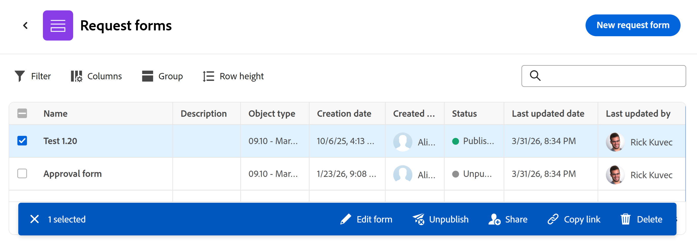

# Adobe Workfront Planningでのリストビューの管理

<!--
although list views in Planning are very similar to Workfront enhanced lists, keep this one separate with all the information, because of Planning standalone; some information here is also duplicated in this main Glist article: help/quicksilver/workfront-basics/navigate-workfront/use-lists/enhanced-lists.md
-->

<!--
The information highlighted on this page refers to functionality not yet generally available. It is available only in the Preview environment for all customers. After the monthly releases to Production, the same features are also available in the Production environment for customers who enabled fast releases.    

For information about fast releases, see [Enable or disable fast releases for your organization](/help/quicksilver/administration-and-setup/set-up-workfront/configure-system-defaults/enable-fast-release-process.md). 
-->

{{planning-important-intro}}

Workfront Planningの次の領域では、リストビューでオブジェクトを表示できます。

* レコードの詳細領域にあるプロジェクトの接続されたレコードページ

  

* レコードタイプレベルでのリクエストフォームのリスト

  

ここでは、Workfront Planningでリスト表示を操作、作成または編集する方法について説明します。

## アクセス要件

+++ 展開して、この記事の機能のアクセス要件を表示します。 

<table style="table-layout:auto"> 
<col> 
</col> 
<col> 
</col> 
<tbody> 
    <tr> 
<tr> 
</tr>   
<tr> 
   <td role="rowheader">
Adobe Workfront パッケージ
</td> 
   <td> 

任意のWorkfrontおよびプランニングパッケージ

任意のワークフローとプランニングパッケージ

各Workfront計画パッケージに含まれる内容について詳しくは、Workfrontの担当者にお問い合わせください。 
 
   </td> 
  <tr> 
   <td role="rowheader">
Adobe Workfront プラン
</td> 
   <td>
 ビューの作成と削除を行う標準

   
ビュー要素を更新する貢献者以上

  </td> 
  </tr> 
  <tr> 
   <td role="rowheader">
オブジェクト権限
</td> 
   <td>   
ビューに対する権限を管理
  
   
ビューの権限を表示して、ビュー設定を一時的に変更したり、ビュー設定を複製したりできます
 </td> 
  </tr> 
<tr>
   <td role="rowheader">
レイアウトテンプレート
</td>
   <td> LightまたはContributor ライセンスを持つユーザーには、Planningを含むレイアウトテンプレートを割り当てる必要があります。
   
標準ユーザーとシステム管理者は、デフォルトでプランニング領域を有効にできます。

</li></ul>
</td>
  </tr> 
</tbody> 
</table>

Workfrontのアクセス要件について詳しくは、[Workfront ドキュメント ](/help/quicksilver/administration-and-setup/add-users/access-levels-and-object-permissions/access-level-requirements-in-documentation.md)のアクセス要件を参照してください。

+++ 

## リストビューに関する考慮事項

* 接続されたレコードのページリストビューについては、次を考慮してください。

   * プロジェクトは、レコードの接続されたレコードページのリストビューでのみ表示できます。 リスト表示は、接続されたレコードページ内の他のオブジェクトまたはレコードタイプでは使用できません。

  接続レコードページの作成について詳しくは、[接続レコードページをレコードに追加](/help/quicksilver/planning/records/add-a-connected-records-page-to-a-record.md)を参照してください。
   * レコードの接続されたレコードページでリストビューを表示する前に、Workfront プロジェクトをプランニングレコードタイプに接続する必要があります。 詳しくは、[レコードタイプの接続](/help/quicksilver/planning/architecture/connect-record-types.md)を参照してください。
   * レコードの接続されたレコードページで、プロジェクトの複数のリストビューを作成できます。

* リクエストフォームのリストビューでは、次の点を考慮してください。

   * Planning リクエストフォームの追加リストビューを作成または編集することはできません。 Workfrontは、リクエストフォームに対して1つのリストビューを作成します。<!--this will change-->

     リクエストフォームについて詳しくは、[Adobe Workfront Planningでのリクエストフォームの作成と管理](/help/quicksilver/planning/requests/create-request-form.md)を参照してください。
* 表示される場所に応じて、すべてのリストビューがこの記事に記載されているすべての要素を持っているわけではありません。

## リスト表示の管理 {#manage-a-list-view}

Workfront計画のリストビューは、Workfrontの拡張リストと似ています。 拡張ビューからのほとんどの要素は、Workfront Planningのリストビューにも存在します。

詳しくは、[拡張リストの使用](/help/quicksilver/workfront-basics/navigate-workfront/use-lists/enhanced-lists.md)を参照してください。

<!--
Removed - more direct steps below: 
{{step1-to-planning}}

1. (Conditional) To access a projects connected page, do the following: 

    1. Click a workspace card, then click a record type card. 
    1. From any view, click the name of a record to open the record's preview or details page. 
    1. Add a **Connected records page** for connected projects as described in the article [Add a Connected records page to a record](/help/quicksilver/planning/records/add-a-connected-records-page-to-a-record.md).

    The Connected records page displays projects connected to the record in the list view. 

    

1. (Conditional) To access a list of request forms, do the following: 

    1. {{step1-to-planning}}

    1. (Conditional) To access a projects connected page, do the following: 

    1. Click a workspace card, then click a record type card.
    1. Click the **More** menu  to the right of the record name in the header, then click **Manage request forms**.

        A list of request forms displays.

-->

1. 次のいずれかの領域でリスト表示に移動します。

   * レコードの詳細領域にあるプロジェクトの接続されたレコードページ
   * レコードタイプのリクエストフォームページ

1. （条件付き）使用可能な場合は、次のいずれかの操作を行ってリスト表示を変更します。

   1. リストの左上隅にあるドロップダウンビューメニューを展開して別のビューを選択するか、**新しいビュー**&#x200B;をクリックして別のビューを作成します。

      >[!TIP]
      >
      >ビューはシステム全体で共有されます。 1つのレコードタイプのプロジェクトビューを作成すると、接続されたプロジェクトを表示する他のレコードタイプで表示できます。

   1. 既存のビューの名前にカーソルを合わせて、**詳細** メニューをクリックし、次のいずれかをクリックします。
      * **名前を変更**&#x200B;して、ビューに新しい名前を付けます
      * **共有**、他のユーザーとビューを共有する
      * **削除**、ビューを削除します。

      >[!NOTE]
      >
      >* ビューを編集、共有、または削除するには、ビューの管理権限が必要です。
      >
      >* システムビューは変更できません。
      >
      >* 表示する権限のみを持つ自分と共有されたビューを、元の環境設定を復元するように変更した後にリセットしたり、変更内容をコピーしてコピーを共有したりできます。 詳しくは、[拡張リストの使用](/help/quicksilver/workfront-basics/navigate-workfront/use-lists/enhanced-lists.md)を参照してください。

   1. **フィルター** アイコン をクリックして、フィルターをビューに追加します。 結果はリスト内ですぐにフィルタリングされます。 フィルターを保存して名前を付けることはできません。 フィルターは、後でページにアクセスしたときに記憶され、共有ビューの一部になります。

      >[!TIP]
      >
      >パーソナライズされたフィルターを適用するには、フィールド値に次のいずれかのオプションを選択します。
      >
      >* ユーザーを参照するフィールドでログイン ユーザーを参照するには、**自分（ログイン ユーザー）**。
      >
      >* **マイチーム**&#x200B;または&#x200B;**マイホームチーム**&#x200B;は、チームを参照するフィールドでチームを参照します。
      >
      >* **マイグループ**&#x200B;または&#x200B;**マイホームグループ**&#x200B;は、グループを参照するフィールドでグループを参照します。
      >
      >* **会社**&#x200B;は、会社を参照するフィールドで会社を参照します。
      > 
      >* **自分の役割**&#x200B;または&#x200B;**自分の主な役割**&#x200B;を参照して、役割を参照するフィールドで自分の担当業務を参照します。

   1. **列** アイコン をクリックして、表示する列または表示しない列を選択します。
   1. 列の名前にカーソルを合わせ、列名の左側にある下向き矢印をクリックしてから、次のいずれかをクリックします。
      * **列の** カスタムラベル **を追加するには、**&#x200B;の名前を変更します。 Workfrontの元のフィールド名は変更されません。
      * **並べ替え**。選択したフィールドでリストを並べ替えます。 列ヘッダーには、並べ替えの方向を示す並べ替えアイコンが追加される。
   1. リストの右上隅にある&#x200B;**+** アイコンをクリックして、リストに列を追加または削除し、**保存**&#x200B;をクリックします。

      **列マネージャー**&#x200B;が開きます。

      リスト表示に追加できるのは、既存のフィールドのみです。
最初の列に表示されるリストビューのプライマリフィールドは削除できません。

   1. **セルの書式設定** アイコン をクリックします。 **形式** ボックスが開きます。 <!--change the name of the box when they update it-->
次の操作を行います。

      1. 「**条件を追加**」をクリックします。
      1. **If**&#x200B;行で、フィールドを選択し、フィールド値を選択して修飾子を追加します。 選択したフィールドタイプによって修飾子が変更されます。

         >[!TIP]
         >
         >リスト表示に表示されるフィールドのみが、条件付き書式設定に使用できます。

      1. （オプション）フィールド値を追加する代わりに、**別のフィールドと比較** アイコン をクリックし、選択したフィールドの値と比較するフィールドを選択します。 例えば、「プロジェクト所有者」フィールドと「プロジェクトのスポンサー」フィールドを比較できます。

         >[!TIP]
         >
         >リスト表示に表示されるフィールドのみが、条件付き書式設定に使用できます。 比較するフィールドは同じタイプである必要があります。

      1. （オプション） **If**&#x200B;行の&#x200B;**条件を追加**&#x200B;をクリックして、同じルールにさらに条件を追加します。

         >[!TIP]
         >
         >条件付きルールには最大10個の条件を追加でき、1つのフィールドには最大20個のルールを追加できます。

      1. 条件間の&#x200B;**または** コネクタをクリックして&#x200B;**および**&#x200B;に変更し、複数の条件を同時に満たす必要があることを示します。 **または**&#x200B;が既定のコネクタです。
      1. **形式**&#x200B;行で、書式設定する列を示すフィールドを選択します。<!--edit this area, if it changes names??-->
      1. （オプション）選択したフィールドの横にある&#x200B;**カラーサークル** アイコン をクリックして展開し、**セルの塗りつぶし**&#x200B;領域で別の色を選択して、セルの背景の色を変更するか、**テキストの色**&#x200B;領域から色を選択して、セルのテキストの色を変更します。
      1. **テキスト形式** アイコン をクリックし、次のオプションから選択してセル内のテキストを書式設定します。
         * 太字
         * 斜体

      1. **行に適用**&#x200B;設定を有効にして、条件を満たすフィールドの行全体に書式を適用します。
      1. （オプション）「**形式**」ボックスの「**条件を追加**」をクリックして、別のフィールドに別のルールを追加し、上記の手順を繰り返します。
      1. （オプション）「**すべてをクリア**」をクリックして、すべての書式設定を削除します。
      1. 「**形式**」ボックスの外側をクリックして閉じます。

         リストビューに戻ります。
書式設定は、リスト表示にすぐに適用されます。
「**セルを書式設定**」アイコンの横に青い点があり、ビューに特殊な書式設定が適用されていることを示します。

   1. （オプション）「**グループ化**」アイコン「<!--have they updated this to "Grouping"??-->」をクリックして、リスト内の項目を共通フィールドでグループ化します。 オプションのいずれかを選択するか、検索バーを使用してフィールドを検索します。

      フィールドをグループ化するには、リスト内の列である必要があります。 すべてのフィールドタイプをグループ化に使用できるわけではありません。

   1. **行の高さ** アイコン をクリックして、行の垂直方向の長さを更新します。 次のオプションから選択します。

      * 低い
      * 標準： これはデフォルトの選択肢です。
      * 中
      * 高い

   <!--leave these here, although they duplicate for Enhanced lists in Workfront-->

1. （オプション）リストの右上隅にある検索ボックスにキーワードを追加して、項目を検索します。

   検索語に一致する項目がリストで強調表示されます。

1. （オプションおよび条件付き）接続されたプロジェクト <!--change projects to items here when more items will display in the Glist-->のページで、リストにさらに項目を追加し、選択したレコードに自動的に接続するには、次のいずれかの操作を行います。

   * リストの右上隅にある「**レコードを接続**」をクリックして、既存の項目を追加します。
   * リストの下部にある&#x200B;**新しい行**&#x200B;をクリックして、新しい項目を追加します。
1. リスト内の接続されたアイテムの名前をクリックして、別のブラウザータブで開きます。
1. リスト内のセル内をダブルクリックしてフィールドの情報を編集し、Enter キーを押して変更を保存します。

   一部のフィールドは読み取り専用です。 例えば、プロジェクトの完了率は、システムによって計算されたフィールドであり、手動で編集することはできません。

1. リスト内の項目の名前にカーソルを合わせ、**詳細** メニュー[詳細メニュー](assets/more-menu.png)をクリックし、**表示**&#x200B;をクリックして、別のタブでプロジェクトを開きます

   または

   1つ以上の項目を選択し、リストの下部にあるアクションバーに注目してから、次のいずれかをクリックします（使用可能な場合）。 リスト表示にアクセスする領域に応じて、次のいずれかのオプションをクリックします。

   * 項目を削除するには、**削除**&#x200B;してください。 プロジェクトを削除すると、レコードからそのレコードが切断され、Workfrontのごみ箱に移動されます。 Workfront管理者は、削除されたプロジェクトを削除してから最大30日後に復元できます。 フォームを削除しても、フォームの送信時に作成されたリクエストやレコードは削除されません。
   * **切断**&#x200B;して、プロジェクトをレコードから切断します。 プロジェクトを切断すると、そのプロジェクトとそのルックアップフィールドのすべての値が現在のレコードから削除されます。

     <!--update screen shot at preview release-->

     

   * **フォームを編集**：計画依頼フォームを開き、それを編集できます。
   * **非公開**: リクエストフォームを非公開にします。 これにより、リクエスト領域からフォームが削除され、ユーザーはこのレコードタイプにリクエストを追加できなくなります。
   * **共有**：他のユーザーと共有できるリクエストフォームの共有ボックスを開きます。
   * **リンクをコピー**: リンクをPlanning リクエストフォームにコピーして、他のユーザーと共有できるようにします。 フォームが公開されている場合は、Workfront Planning以外のユーザーとリンクを共有できます。

     

