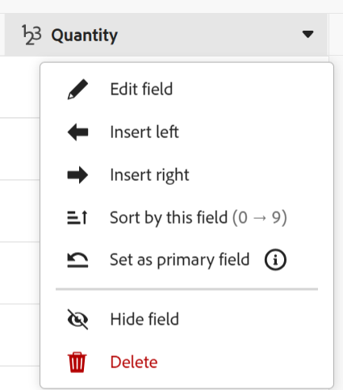
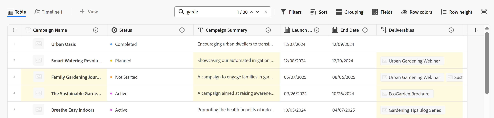
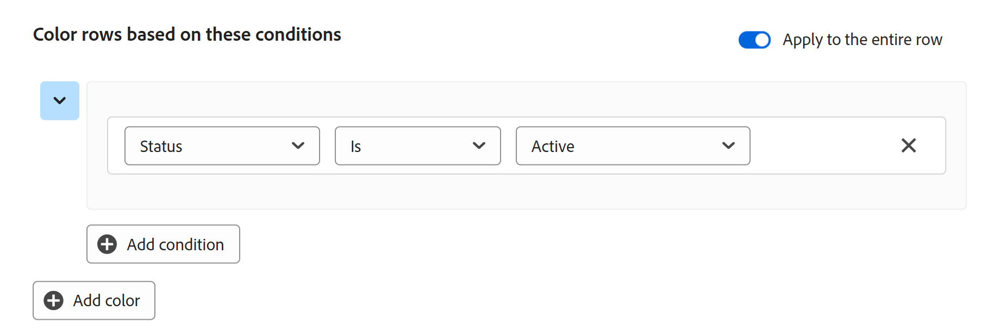

# テーブルビューの管理

<!--
The information highlighted on this page refers to functionality not yet generally available. It is available only in the Preview environment for all customers. After the monthly releases to Production, the same features are also available in the Production environment for customers who enabled fast releases. 

For information about fast releases, see [Enable or disable fast releases for your organization](/help/quicksilver/administration-and-setup/set-up-workfront/configure-system-defaults/enable-fast-release-process.md). 
-->

{{planning-important-intro}}

Adobe Workfront Planning のレコードタイプのページにアクセスすると、レコードとそのフィールドをテーブルビューで表示できます。

レコードビューとその管理方法について詳しくは、[レコードビューの管理](/help/quicksilver/planning/views/manage-record-views.md)を参照してください。

この記事では、次の情報について説明します。

* [テーブルビューでの列と行の作成または編集](#manage-a-table-view)
* [テーブルビューのリアルタイムプレゼンス指標を有効にする](#enable-the-real-time-presence-indicator)

テーブルビューをExcelまたはCSV ファイルに書き出す方法について詳しくは、[&#x200B; テーブルビューからのレコードの書き出し](/help/quicksilver/planning/records/export-records-from-the-table-view.md)を参照してください。

## アクセス要件

+++ 展開して、この記事の機能のアクセス要件を表示します。 

<table style="table-layout:auto"> 
<col> 
</col> 
<col> 
</col> 
<tbody> 
    <tr> 
<tr> 
</tr>   
<tr> 
   <td role="rowheader">
Adobe Workfront パッケージ
</td> 
   <td> 

任意のWorkfrontおよびプランニングパッケージ

任意のワークフローとプランニングパッケージ

各Workfront計画パッケージに含まれる内容について詳しくは、Workfrontの担当者にお問い合わせください。 
 
   </td> 
  <tr> 
   <td role="rowheader">
Adobe Workfront プラン
</td> 
   <td>
 ビューの作成と削除を行う標準

   
ビュー要素を更新する貢献者以上

  </td> 
  </tr> 
  <tr> 
   <td role="rowheader">
オブジェクト権限
</td> 
   <td>   
ビューに対する権限を管理
  
   
ビューの権限を表示して、ビュー設定を一時的に変更したり、ビュー設定を複製したりできます
 </td> 
  </tr> 
</tbody> 
</table>

Workfrontのアクセス要件について詳しくは、[Workfront ドキュメント &#x200B;](/help/quicksilver/administration-and-setup/add-users/access-levels-and-object-permissions/access-level-requirements-in-documentation.md)のアクセス要件を参照してください。

+++ 

<!--
Old:
<table style="table-layout:auto"> 
<col> 
</col> 
<col> 
</col> 
<tbody> 
    <tr> 
<tr> 
<td> 
   
 Products
 </td> 
   <td> 
   <ul><li>
 Adobe Workfront
</li> 
   <li>
 Adobe Workfront Planning
</li></ul></td> 
  </tr>   
<tr> 
   <td role="rowheader">
Adobe Workfront plan*
</td> 
   <td> 

Any of the following Workfront plans:
 
<ul><li>Select</li> 
<li>Prime</li> 
<li>Ultimate</li></ul> 

Workfront Planning is not available for legacy Workfront plans
 
   </td> 
<tr> 
   <td role="rowheader">
Adobe Workfront Planning package*
</td> 
   <td> 

Any 
 

For more information about what is included in each Workfront Planning plan, contact your Workfront account manager. 
 
   </td> 
 <tr> 
   <td role="rowheader">
Adobe Workfront platform
</td> 
   <td> 

Your organization's instance of Workfront must be onboarded to the Adobe Unified Experience to be able to access Workfront Planning.
 

For more information, see <a href="/help/quicksilver/workfront-basics/navigate-workfront/workfront-navigation/adobe-unified-experience.md">Adobe Unified Experience for Workfront</a>. 
 
   </td> 
   </tr> 
  </tr> 
    <td role="rowheader">
Adobe Workfront license*
</td> 
   <td>
 Standard to create and delete views

   
Contributor or higher to update view elements

   
Workfront Planning is not available for legacy Workfront licenses
 
  </td> 
  </tr> 
  <tr> 
   <td role="rowheader">
Access level configuration
</td> 
   <td> 
There are no access level controls for Adobe Workfront Planning
   
</td> 
  </tr> 
<tr> 
   <td role="rowheader">
Object permissions
</td> 
   <td>   
Manage permissions to a view
  
   
View permissions to a view to temporarily change the view settings or to duplicate it
 </td> 
  </tr> 
<tr>
   <td role="rowheader">
Layout template
</td>
   <td> Users with a Light or Contributor license must be assigned a layout template that includes Planning.
   
Standard users and System Administrators have the Planning areas enabled by default.

</li></ul>
</td>
  </tr>
</tbody> 
</table>
-->

## テーブルビューを使用したレコードの編集

レコード情報はテーブルビューで編集できます。

テーブルビューでのレコードの編集について詳しくは、[&#x200B; レコードの編集](/help/quicksilver/planning/records/edit-records.md)を参照してください。

## テーブルビューの管理 {#manage-a-table-view}

<!--
Depending on what environment you access record types from, the record type page displays using two different views: 

* Table view, in the Production environment
* List view, in the Preview environment

OR: 

If the List view in Project connected pages and request forms stays the same after GTable rolls out - keep that list as the List view and change the Table view in this article to "Table redesigned view" for now; keep it "the table view" here for the future; for the time being, just say "Updating the view in Prod and Preview is different and make the separate sections for Preview and Prod below with the different steps.

### Manage the table view in the Production environment
-->

テーブルビューを作成すると、選択したタイプのすべてのレコードがテーブルに表示されます。 各行は一意のレコードであり、各列はレコードフィールドです。 デフォルトでは、すべてのフィールドとすべてのレコードが表示されます。

テーブルビューを管理するには：

1. [レコードビューの管理](/help/quicksilver/planning/views/manage-record-views.md)の記事の説明に従って、テーブルビューを作成します。

   

1. （オプション）「**行の高さ**」をクリックし、次のオプションから選択して、テーブルの行の高さを変更します。
   * 低い
   * 標準
   * 中
   * 高い

1. （オプション）「**フルスクリーン**」アイコン をクリックしてフルスクリーンで表示を開き、**フルスクリーンを終了** アイコン またはキーボードのEscapeをクリックしてフルスクリーンを終了します。

1. 以下のサブセクションで説明するように、次のビュー要素を更新します。
   * [列（またはフィールド）](#add-columns-or-fields)
   * [行（またはレコード）](#add-rows-or-records)
   * [フィルター](#add-filters)
   * [並べ替え](#add-a-sort)
   * [グループ化](#add-groupings)
   * [行の色分け](#add-row-colors)
   * [リアルタイムプレゼンス指標](#enable-the-real-time-presence-indicator)

### 列（またはフィールド）の追加 {#add-columns}

テーブルビューの列ヘッダーには、ビュー内のレコードに関連付けられたフィールドが表示されます。 テーブルビューに表示されるフィールドは、レコードの「詳細」セクションにも表示されます。

詳しくは、[レコードの編集](/help/quicksilver/planning/records/edit-records.md)を参照してください。

<!--this is not available yet:You can display record fields (or columns) in both a table and a timeline view. However, the number of columns displayed in the table of the timeline view is limited and you cannot add columns in addition to those selected by default.-->

ビューへの列の追加は、レコードタイプへのフィールドの追加と同じです。

テーブルビューには最大 500 個のフィールド（または列）を追加できます。

1. レコードタイプページに移動し、テーブルビューのタブをクリックするか、**+ ビュー**&#x200B;をクリックして新しいビューを追加し、**テーブル**&#x200B;を選択します。

1. [フィールドの作成](/help/quicksilver/planning/fields/create-fields.md)の記事の説明に従って、フィールド（または列）の追加を開始します。

   追加した列は、レコードタイプにアクセスするすべてのユーザーに表示され、レコードのページに新しいフィールドとして追加されます。

1. （オプション）ツールバーの&#x200B;**フィールド** アイコン をクリックし、フィールドを検索してから、フィールド名の右側にあるトグルを選択解除して、フィールドを非表示にします。

1. テーブルの列を並べ替えるには、次のいずれかの操作を行います。

   * 列ヘッダーをつかみ、目的の位置にドラッグ＆ドロップします。 移動した列は、テーブルに他の調整を行うまで、青色の背景で短時間表示されます。

   * テーブルのツールバーで&#x200B;**フィールド**&#x200B;をクリックし、フィールドを目的の順序でドラッグ＆ドロップし、「**フィールドの表示と順序**」ボックスの外側をクリックしてボックスを閉じます。

     

     >[!TIP]
     >
     >* デフォルトでは、「名前」フィールドが常にテーブルビューの最初のフィールドです。 これは、プライマリフィールドと見なされます。
     >
     >* 別のフィールドをプライマリフィールドとして指定しない限り、「名前」フィールドを別の位置に移動することはできません。 詳しくは、手順 4 に進んでください。<!--accurate?-->
     >
     >

   * 最初の列のフィールドを別のフィールドに置き換えるには、プライマリフィールドを変更します。 詳しくは、手順 4 に進んでください。<!--accurate?-->

1. （オプション）テーブルの最初の列に表示されないフィールドの列ヘッダーにあるフィールド名の上にポインタを合わせ、フィールド名の右側にある下向き矢印をクリックして、「**プライマリフィールドとして設定**」をクリックします。

   

1. 「**フィールドを設定**」をクリックして確認します。

   フィールドは、テーブルビューの最初の列として表示されるプライマリフィールドになります。 前のプライマリフィールドは、2 番目の列に移動します。

   プライマリフィールドは、レコードのタイトルとなり、レコードのページのヘッダー領域や、レコードが表示されるあらゆる場所に表示されます。 例えば、接続されたフィールドとすべてのビューにレコードタイトルが表示されます。 プライマリフィールドについて詳しくは、[プライマリフィールドの概要](/help/quicksilver/planning/fields/primary-field-overview.md)を参照してください。

1. 列の区切り線をクリックしてドラッグし、目的の場所にドロップして、列の幅を広げます。

   >[!TIP]
   >
   >列の幅と順序に対して行った変更は永続的に適用され、レコードタイプにアクセスするすべてのユーザーに表示されます。

1. 列ヘッダー上にポインタを合わせ、下向き矢印をクリックして、「**フィールドを非表示**」をクリックします。

   または

   テーブルツールバーの「**フィールド**」をクリックし、非表示にするフィールド（または列）に関連付けられた切替スイッチを無効にします。 **フィールドの表示と順序**&#x200B;ボックスが表示されます。

   >[!TIP]
   >
   >非表示のフィールドの数は、ツールバーのフィールドアイコンの左側に表示されます。
   >
   >デフォルトでは、非表示フィールドはレコードの&#x200B;**詳細** プレビューボックスに表示されません。 すべてのフィールドは、レコードの詳細ページに表示されます。 詳しくは、[&#x200B; レコードページレイアウトの管理](/help/quicksilver/planning/records/manage-the-record-page.md)を参照してください。

1. **フィールド**&#x200B;アイコンをクリックし、テーブルの列に表示するフィールドに関連付けられた切替スイッチを有効にします。 デフォルトでは、すべてのフィールドが表示されます。

1. キーワードに一致するレコードをすばやく検索するには、次の手順を実行します。

   1. **検索** ボックス で、画面に表示されるレコードの任意のフィールドに関連付けられたキーワードの入力を開始します。 正しい一致の数が検索項目の横に表示され、正しく一致するフィールドがハイライト表示されます。

      

      画面に表示される任意の単語や特殊文字を使用できます。

      テーブルビューで非表示になっているフィールドに関連付けられたキーワードは使用できません。

   1. キーボードの **Enter** キーを押して、次に見つかったフィールドに移動します。

   1. （オプション）複数の一致がある場合は、検索キーワードの右にある上下の矢印をクリックすると、表内のすべての一致を確認できます。

   1. 検索ボックスの **x** アイコンをクリックして、検索キーワードをクリアします。

### 行（またはレコード）の追加 {#add-rows}

テーブルビューの行には、選択したレコードタイプの個別のレコードが表示されます。

のレコード（または行）は最大50,000個まで指定できます。

1. レコードタイプページに移動し、テーブルビューのタブをクリックするか、**+ ビュー**&#x200B;をクリックして新しいビューを追加し、**テーブル**&#x200B;を選択します。

1. [レコードの作成](/help/quicksilver/planning/records/create-records.md)の記事の説明に従って、レコード（または行）の追加を開始します。

   テーブルビューで追加したレコードはすぐに保存され、ワークスペースに対する表示以上の権限を持つすべてのユーザーに表示されます。

   サムネイル画像もレコードに追加されます。

1. （オプション）レコード名の右側にある&#x200B;**詳細** メニューをクリックし、**サムネールを編集**&#x200B;をクリックして、新しいレコードに新しいサムネールを追加します。

1. テーブルの上部にある&#x200B;**フィールド**&#x200B;をクリックし、**サムネール** フィールドの切り替えスイッチを選択して、プライマリフィールドの左側に表示します。

   詳しくは、[レコードへのサムネールの追加](/help/quicksilver/planning/records/add-thumbnails-to-records.md)を参照してください。

1. （オプション）行内の1つまたは複数のレコードを選択し、**ハンドル** アイコン をレコードの左側にドラッグ&amp;ドロップして、行を並べ替えます。

   >[!NOTE]
   >
   >テーブルビューに少なくとも 1 つの並べ替えが適用されていると、行の並べ替えを行うことができません。
   >
   >行の順序に加えた変更は、レコードタイプにアクセスするすべてのユーザーに表示されます

<!-- this section below links from the timeline view; consider splitting them if they become different-->

### フィルターを追加 {#add-filters}

フィルターを使用すると、画面に表示される情報の量を減らすことができます。

テーブルビューでフィルターを使用する場合は、次の点に注意してください。

<!-- this list is almost identical to the one for the table view - update both-->

* テーブルビュー用に作成したフィルターは、同じレコードタイプに適用された場合、タイムラインビューのフィルターとは独立して機能します。

* フィルターは、選択したビューに固有です。 同じレコードタイプの 2 つのテーブルビューには、異なるフィルターを適用できます。 同じテーブルビューを見ている 2 人のユーザーには、現在適用されている同じフィルターが表示されます。

* 作成したフィルターに名前を付けて、テーブルビューに適用することはできません。

* フィルターを削除すると、自分と同じレコードタイプにアクセスするすべてのユーザーからフィルターが削除され、自分が使用している同じビューが使用されます。

* 接続されているレコードフィールドまたはルックアップフィールドでフィルタリングできます。

* 複数の値を表示するルックアップフィールドでフィルタリングできます。

* 現在のレコードタイプから最大4 レベル離れたフィールドを参照できます。 例えば、アクティビティレコードタイプのフィルターを作成し、アクティビティがWorkfront プロジェクトに接続されているCampaign レコードタイプに接続されている製品レコードタイプに接続されている場合、アクティビティレコードタイプ用に作成するフィルターでプロジェクトの予算を参照できます。

テーブルビューにフィルターを追加するには：

1. [レコードビューの管理](/help/quicksilver/planning/views/manage-record-views.md)の記事の説明に従って、レコードタイプのページのテーブルビューを作成します。
1. テーブルビューを選択し、テーブルの右上隅にある&#x200B;**フィルター**&#x200B;をクリックします。
1. 「**条件を追加**」をクリックして、次の情報を追加します。

   * フィールドを検索し、リストに表示されたら選択します。

   * **オプション** （またはフィルター修飾子）を選択して、フィールドが満たす必要がある条件を定義します

     次の表には、各タイプのフィールドで使用可能な修飾子が表示されています。

     <table>
        <thead>
        <tr>
            <th><b>フィールドタイプ</b></th>
            <th><b>修飾子</b></th>
        </tr>
        </thead>
        <tbody>
        <tr>
            <td>1 行、段落、式 </td>
            <td>
が次を含む

            
が次を含まない

            
が次に等しい

            
が次に等しくない

            
が空である

            
が空ではない
</td>
        </tr>
        <tr><td>単一選択</td>
            <td>
が次に等しい

            
が次に等しくない

            
が次のいずれかである

            
が次のいずれでもない

            
が空である

            
が空ではない
</td>
        </tr>
        <tr>
            <td>複数選択、人物</td>
            <td>
が次のいずれかを含む

            
が次のすべてを含む

            
が次に完全に等しい

            
が次のいずれも含まない

            
が空である

            
が空ではない
</td>
        </tr>
        <tr>
            <td>数値、割合、通貨</td>
            <td>
=

            
≠

            
 &lt; 

            
&gt;

            
≤

            
≥

            
が空である

            
が空ではない
</td>
        </tr>
        <tr>
            <td>日付</td>
            <td>
が次に等しい

            
が次に等しくない

            
が次の後にある

            
が次の前にある

            
が次の範囲である

が次の範囲ではない

            
が空である

が空ではない
</td>
        </tr>

     <tr>
            <td>チェックボックス</td>
            <td>
が次に等しい

        </tr>
        </tbody>
        </table>

   * 選択したフィールドの値を選択します。

   

   追加できるフィルタリング条件の数に制限はありません。

1. （オプション）「**条件を追加**」をクリックして、別のフィルタリングオプションを追加し、上記の手順を繰り返します。 適用されたフィルターの数が、フィルターアイコンの左側に表示されます。
1. 次の演算子をクリックして、フィルター条件の結合方法と適用方法を指定します。

   * **AND**：指定したすべての条件を満たす必要があります。
   * **OR**：指定された条件のいずれかを満たす必要があります。 これはデフォルトのオプションです。

   1. （オプション）複数の条件グループ間に&#x200B;**AND**&#x200B;または&#x200B;**OR**&#x200B;演算子を追加します。

      

   レコードのリストは自動的にフィルタリングされます。<!--at this time, you can't name and save the filter - but will this change?!-->
   <!-- asked on the task for the simple filters whether there is a limitation for how many statements a filter can have?!-->

1. （オプション）「**x**」アイコンをクリックして、フィルター条件を削除します。
1. （オプション）「**フィルター**」をクリックして、フィルターボックスを閉じます。<!--right now you cannot "clear all" for filters, but this might come later-->

### 並べ替えの追加 {#sort-information}

並べ替えを適用すると、情報を特定の順序で整理できます。

次の情報を並べ替えることができます。

* テーブルビュー内のすべてのレコード。<!--or timeline view. ***********verify this is the case for the timeline view*********************-->
  <!--* All groupings. - this is not available yet-->

テーブルビューでレコードを並べ替える際は、次の点を考慮してください。

<!-- if this is available for the timeline view, update both when you update one-->

* 並べ替えは、選択したビューに一意です。 同じレコードタイプの 2 つのテーブルビューには、異なる並べ替え基準を適用できます。 同じテーブルビューを見ている 2 人のユーザーには、現在適用されている同じ並べ替えが表示されます。

* 作成した並べ替えに名前を付けて、テーブルビューに適用することはできません。

* 作成した並べ替えは、別の場所に移動しても保持されます。

* レコードタイプのテーブルビューに表示されるフィールドの数だけ並べ替えることができます。

* 接続されたレコードフィールドで並べ替えることはできませんが、接続されたレコードタイプからルックアップフィールドで並べ替えることはできます。

* 複数の値（集計によって要約されていない値）を持つルックアップフィールドで並べ替えると、最初の値が並べ替えに使用されます。

* 並べ替え基準を削除すると、自分と同じレコードタイプにアクセスするすべてのユーザーから並べ替え基準が削除され、自分が使用している同じビューが使用されます。

* 現在のレコードタイプから最大4 レベル離れたフィールドを参照できます。 例えば、アクティビティレコードタイプのソートを作成し、アクティビティがWorkfront プロジェクトに接続されているCampaign レコードタイプに接続されている製品レコードタイプに接続されている場合、アクティビティレコードタイプ用に作成しているソートでプロジェクトのステータスを参照できます。

<!--ungrouped (add this when sorting for groupings will be available--> レコードを並べ替えるには、次の操作を行います。

1. [レコードビューの管理](/help/quicksilver/planning/views/manage-record-views.md)の記事の説明に従って、テーブルビューを作成します。
1. テーブルの右上隅にある&#x200B;**並べ替え** アイコン をクリックします

   または

   テーブルビューの列の名前の上にポインタを合わせ、列ヘッダー名の右側にある下向き矢印をクリックして、「**このフィールドで並べ替え**」をクリックします。 このフィールドは、テーブルビューの右上隅にある、並べ替えアイコンの並べ替え選択として追加されます。

1. （条件付き）「**レコードを**&#x200B;で並べ替え」ボックスで、候補フィールドの1つをクリックするか、**別のフィールドを選択**&#x200B;して検索し、リストに表示されたらクリックします。

   並べ替えはテーブルビューに自動的に適用され、レコードは選択した条件に従って並べ替えられて表示されます。

   <!-- add a step that you can rearrange the sorting fields here, when this will be possible-->

1. （オプション）「**条件を追加**」をクリックし、上記の手順を繰り返して追加フィールドで並べ替えます。

   並べ替えるフィールドの数が、ツールバーの右上隅にある並べ替えアイコンの左側に表示されます。 テーブルビューの列に表示されるフィールドのみを選択できます。

1. （オプション）「**レコードの並べ替え基準**」ボックスで、並べ替えフィールドの右側にある **x** アイコンをクリックして並べ替えを削除します

   または

   「**すべてクリア**」をクリックして、並べ替えからすべてのフィールドを削除します。

1. 「**レコードの並べ替え基準**」ボックスの外側をクリックしてボックスを閉じます。

   

   テーブルに表示される情報は、選択した条件に従って並べ替えられます。

   並べ替え用に選択されたフィールドには、並べ替えアイコンと、その後に並べ替えが適用される順序を示す数字が表示されます。

### グループ化の追加 {#add-groupings}

<!--this section exists in the timeline view too, but the display is slightly different, so I kept both steps; consider updating both sections if any updates to groupings are introduced-->

ビューにグループ化を適用する際に、類似の情報でレコードをグループ化できます。

次の点に注意してください。

* テーブルビューとタイムラインビューの両方でグループ化を適用できます。 テーブルビューのグループ化は、同じレコードタイプのタイムラインビューのグループ化とは独立しています。
* ビューには3つのレベルのグループ化を適用できます。レコードは、選択したグループ化の順序でグループ化されます。
&lt;!—* APIを使用する場合、最大4つのレベルのグループ化を適用できます。 – 今すぐこれを確認します – >
* グループは、選択したビューに固有です。 同じレコードタイプの 2 つのテーブルビューに、異なるグループ化を適用することができます。 同じテーブルビューを見ている 2 人のユーザーには、現在適用されているのと同じグループ化が表示されます。
* テーブルビュー用に作成したグループ化に名前を付けることはできません。
* グループ化を削除すると、自分と同じレコードタイプにアクセスし、同じビューを表示している人から、グループ化が削除されます。
* グループ化の下に一覧表示されたレコードは編集できます。
* 接続されたレコードフィールドまたはルックアップフィールドでグループ化できます。
* 複数の値（集計によって集計されていない値）を持つルックアップフィールドでグループ化すると、フィールド値の一意の組み合わせごとにレコードがグループ化されます。
* 現在のレコードタイプから最大4 レベル離れたフィールドを参照できます。 例えば、アクティビティレコードタイプのグループを作成する場合、アクティビティがWorkfront プロジェクトに接続されているCampaign レコードタイプに接続されている製品レコードタイプに接続されている場合、アクティビティレコードタイプ用に作成するグループでプロジェクトのステータスを参照できます。
* グループ化は、値のアルファベット順にリストされます。
<!--checking into this: * You can apply up to 4 levels of grouping when using the API. -->
<!-- checking also into this: * You cannot group by a Paragraph-type field.-->

グループ化を追加するには：

1. [レコードビューの管理](/help/quicksilver/planning/views/manage-record-views.md)の記事の説明に従って、レコードタイプのタイムラインビューを作成します。
1. テーブルビューの右上隅にある「**グループ化**」をクリックします。

   

1. フィールド候補の 1 つをクリックするか、「**別のフィールドを選択**」をクリックして別のフィールドを検索し、リストに表示されたらクリックします。

   グループ化はテーブルに自動的に適用され、レコードがグループ化の区切り線の下に表示されます。

1. （オプション）「**条件を追加**」をクリックし、上記の手順を繰り返して最大3つのグループ化を追加します。

   グループ化用に選択したフィールドの数がグループ化アイコンの横に表示されます。

   

1. （オプション）「**レコードを**&#x200B;でグループ化」ボックス内で、グループ化のために選択されたフィールドの右側にある&#x200B;**x** アイコンをクリックして、グループ化を削除します。

1. 「**以下でレコードをグループ化**」ボックスの外側をクリックして閉じます。
1. （オプション）グループ化の最後にある&#x200B;**+新しいレコード**&#x200B;をクリックして新しいレコードを追加し、ページを更新して新しいレコードを適切なグループ化に追加します。<!--this might need to be changed when they add the Refresh button on the toolbar of the table view-->

1. グループ化を展開または折りたたむには、次のいずれかの操作を行います。

   1. 「**グループ化**」アイコンをクリックし、**すべてを展開**、または&#x200B;**すべてを折りたたむ**」をクリックします。 これにより、テーブルビュー内のすべてのグループ化とサブグループ化が展開されます。

      

   1. テーブルビューでグループ化ヘッダーのいずれかを右クリックし、次のいずれかのオプションをクリックします。
      * **グループを展開**
      * **グループを折りたたむ**
      * **すべて展開**
      * **すべてを折りたたむ**
      * **サブグループを展開**
      * **サブグループを折りたたむ**

      ビューに適用するグループ化の数によっては、一部のオプションが使用できない場合があります。

<!--
 this is not available yet: 

To sort grouped records: 

1. Create a view, as described in [Create or edit record views](#create-or-edit-record-views). 
1. ************************* add steps here for sorting grouped records****************

-->

### 行の色を追加

1. （オプション）「**行の色**」をクリックして条件を定義し、テーブル行に異なる色を設定します。

1. 「**色を追加**」をクリックし、フィールドを検索してリストに表示されたら選択します。 これは、行の色を決定する値を持つフィールドです。

   例えば、「**ステータス**」を選択し、フィールドに修飾子と値を選択して、ステータスが「アクティブ」のキャンペーンを緑色で表示します。

   アクティブなステータスが選択され、デフォルトの色が選択された

1. 選択した条件の左上隅にあるカラーピッカーのドロップダウンメニューをクリックして、条件のカラーを選択し、カラーピッカーボックスの外側をクリックして閉じます。

   

1. （オプション）「**条件を追加**」をクリックして、最初の条件セットにフィールドと値をさらに追加します

   または

   **色を追加**&#x200B;をクリックして、新しい条件セットを追加し、新しい色を識別します。

   例えば、新しい条件セットを定義することで、キャンペーンをプランニングステータスで黄色で表示できます。

   アクティブおよびプランニング状態のカスタムカラーを含む

1. （オプション）行の色ボックスの右上隅にある「**行全体に適用**」設定をオンにします。 条件が満たされた行全体が、選択した色で自動的に表示されます。

   >[!NOTE]
   >
   >* 「行全体に適用」設定がオフになっている場合は、プライマリフィールドの左側にのみ、選択した色の狭いカラーインジケーターが表示されます。 デフォルトでは、この設定はオフになっています。
   >
   >* テーブルビューで少なくとも1つのグループ化を選択している場合、行全体に行の色を適用することはできません。 ロールカラーは、グループ化がテーブルに適用される場合にのみ、プライマリフィールドセルの左側に適用されます。

1. 「**行の色**」ボックスの外側をクリックして閉じます。 色は自動的に適用されます。

### リアルタイムプレゼンス指標を有効にする

すべてのレコードビューの右上隅に表示すると同時に、レコード情報を編集している他のユーザーのアバター（デフォルト）。

テーブルビューを表示すると、レコードを表示しているときに別のユーザーが編集しているフィールドを表示することもできます。

1. レコードタイプページに移動し、任意のビューを開きます。
1. （条件付き）選択したタイプのレコードを同時に編集する他のユーザーがいる場合、そのアバターはビューの右上隅に表示されます。
1. アバターの横にあるドロップダウンメニューをクリックし、**共同作業者を表示**&#x200B;設定をオンにします。 設定はデフォルトでオンになっています。

   

   >[!TIP]
   >
   >**共同作業者を表示**&#x200B;切り替えスイッチは、任意のビューから選択できます。 他のユーザーが現在編集しているフィールドは、テーブルビューでのみ概説されます。

1. （条件付き）テーブルビューを開くと、他のユーザーがアクティブに編集しているフィールドが、テーブルビューのアバターのアウトラインに対応する色で強調表示されます。

   アバターのハイライトカラーがグレーの場合、ユーザーは30秒以上前にレコードのアクティブな編集を停止しました。

   

   <!--maybe include a screen shot after release if they update the UI text in this list of users-->

1. （オプション）他のユーザーが編集したフィールドを含むセルの右上隅にある三角形をクリックします。 現在フィールドを編集しているユーザーのリストが表示されます。

>[!TIP]
>
>リアルタイムのプレゼンス指標には、現在Workfront Planningの任意の場所でフィールドを編集しているユーザーが表示されます。 これには、レコードのテーブルビューまたは詳細領域が含まれます。

<!--

### Manage the list view in the Preview environment

**********MAYBE THIS IS VALID ONLY WHEN WE REPLACE THE NAVIGATION?????????*********

(*****************Maybe add this when they remove the list view from connection pages and request form list: In the Preview environment, the table view has been replaced with the list view. *******************)

*******************IF THEY REPLACE THE LIST VIEW (IN PROJECTS AND FORMS) WITH THE NEW LIST, THEN JUST UPDATE THAT ARTICLE - "MANAGE THE LIST VIEW" - AND ADD A LINK TO IT HERE; IF NOT, THEN ADD THE SPECIFICS OF THE VIEW HERE**************

When creating a table view, all records of the selected type display in a table. Each row is a unique record and each column is a record field. All fields and all records display by default. 

To manage a table view: 

1. Create a table view, as described in the article [Manage record views](/help/quicksilver/planning/views/manage-record-views.md).

    

1. (Optional) Click **Row height**, then select from the following options to modify the height of the table rows: 
    * Short
    * Standard
    * Medium
    * Tall 

1. (Optional) Click the **Full screen** icon  to open the view in full screen, then the **Exit full screen** icon  or Escape on your keyboard to exit the full screen.

1. Update the following view elements as described in the subsections below:
    * [Columns (or fields)](#add-columns-or-fields)
    * [Rows (or records)](#add-rows-or-records)
    * [Filters](#add-filters) 
    * [Sort](#add-a-sort) 
    * [Grouping](#add-groupings)
    * [Row colors](#add-row-colors)
    * [Real-time presence indicator](#enable-the-real-time-presence-indicator)

### Add columns (or fields) {#add-columns}

The column headers of a table view display fields associated with the records in the view. Fields displayed in the table view also display in the Details section of a record. 

For more information, see [Edit records](/help/quicksilver/planning/records/edit-records.md). 

************ this is not available yet:You can display record fields (or columns) in both a table and a timeline view. However, the number of columns displayed in the table of the timeline view is limited and you cannot add columns in addition to those selected by default. ***************

Adding columns to a view is identical to adding fields to a record type.  

You can add up to 500 fields (or columns) in a table view. 

1. Go to a record type page and click a table view tab, or click **+ View** to add a new view, then choose **Table**. 

1. Start adding fields (or columns), as described in the article [Create fields](/help/quicksilver/planning/fields/create-fields.md). 

    The columns you add are visible to all users who access the record type and are added as new fields on the record's page.

1. (Optional) Click the **Fields** icon  in the toolbar, search for a field, then unselect the toggle to the right of the field name to hide the field. 
   
1. Do one of the following to reorder columns in the table:

    * Grab the column header and drag and drop it in the desired position. The column you moved briefly displays with a blue background until you make other adjustments to the table. 

    * Click **Fields** in the table's toolbar, then drag and drop the fields in the desired order, then click outside the **Fields visibility and order** box to close it.
        
        

        >[!TIP]
        >
        >* The Name field is always the first field in the table view, by default. This is considered a primary field. 
        >
        >* You cannot move the Name field to another position, unless you designate another field as the primary field. For more information, continue with Step 5. **********************accurate?**************
        >
        >
 
    * Replace the field in the first column with another field by changing the primary field. For more information, continue to step 5. **********************accurate?**************

1. (Optional) Hover over a field name in the column header of any field that does not display in the first column of the table, click the downward-pointing arrow to the right of the field name, then click **Set as primary field**. 
    
    

1. Click **Set field** to confirm. 

    The field becomes a primary field which means it displays as the first column of the table view. The previous primary field moves to the second column.

    Primary fields become the record's title and display in the header area of the record's page, and everywhere where the records display. For example, the record title displays in connected fields and all views. For more information about primary fields, see [Primary field overview](/help/quicksilver/planning/fields/primary-field-overview.md). 

1. Click and drag the column separation lines and drop them in the desired spot to increase the width of the columns. 

    >[!TIP]
    >
    >The changes you make to the column width and order are permanent and visible to all users who access the record type. 

1. Hover over the column header, then click the downward-pointing arrow, then click **Hide field**

    Or

    Click **Fields** in the table toolbar and deselect the toggle associated with the fields (or columns) you want to hide. The **Fields visibility and order** box displays.

    >[!TIP]
    >
    >The number of hidden fields displays to the left of the Fields icon in the toolbar.
    >
    >By default, hidden fields do not display in the record's **Details** preview box. All fields display in the record's Details page. For information, see [Manage the record page layout](/help/quicksilver/planning/records/manage-the-record-page.md).

1. Click the **Fields** icon and select the toggle associated with the fields you want to display in the columns of the table. All fields display by default.

1. Do the following to quickly find records that match a keyword:

    1. In the **Search** box  and start typing a keyword associated with any field of a record that displays on the screen. The number of correct matches displays next to the search item and the field with the correct match is highlighted. 

        

        You can use any word or special character that is visible on the screen. 
    
        You cannot use keywords that are associated with fields that are hidden in the table view. 

    1. Press **Enter** on your keyboard to go to the next found field. 

    1. (Optional) If there is more than one match, click the up and down arrows to the right of the search keyword to find all the matches in the table. 

    1. Click the **x** icon in the search box to clear the search keyword. 
1. For number, currency, percentage, and formula fields that are formatted as any of these field types, expand the aggregator dropdown menu at the bottom of the columns, and select from the following options:

    * SUM: Displays the total of all cells in the column. This is the default selection. 
    * MIN: Displays the lowest value from all the cells in the column. 
    * MAX: Displays the highest value from all the cells in the column. 
    * AVG: Displays the average value of all the cells in the column. 

    The aggregator row in the column is frozen and is part of the view settings. The aggregator you choose will be shared with the view when you share the view with others. 

### Add rows (or records) {#add-rows}

The rows of a table view display individual records of the selected record type. 

You can have up to 50,000 records (or rows) for a record type. 

1. Go to a record type page and select a table view, or click **+ View** to add a new view, then choose **Table**. 

1. Start adding records (or rows), as described in the article [Create records](/help/quicksilver/planning/records/create-records.md). 

    The records you add in the table view are saved immediately and are visible to all users who have View or higher permissions to the workspace. 

    A default thumbnail image is also added to the new record.

1. (Optional) Click the **More** menu  to the right of the record, then click **Edit thumbnail** to add a thumbnail to each record
1. Click **Fields** at the top of the table, then select the toggle for the **Thumbnail** field to display it to the left of the primary field. It is deselected by default. 
    
    For information, see [Add a thumbnail to a record](/help/quicksilver/planning/records/add-thumbnails-to-records.md).

******************** NOT POSSIBLE NOW **********

1. (Optional) Select one or multiple records in a row, then drag and drop the **handle** icon  to the left of the record to reorder the rows. 

    >[!NOTE]
    >
    >You cannot reorder rows if you apply at least one sort to the table view. 
    >
    >The changes you make to the row order are visible to all users who access the record type

******************** NOT POSSIBLE ABOVE **************

### Add filters {#add-filters}

Filters help you reduce the amount of information displayed on the screen.

Adding filters in the table view in the Preview environment is identical to adding filters in the Production environment. 

For information, see the [Add filters](#add-filters) section in this article. 

*****************at production, paste here the information from the Production section above*******************

### Add a sort {#sort-information} 

By applying a sort, you can organize information in a given order. 

You can sort the following information:

* All records in a table view. 
************** * All groupings. - this is not available yet***********

Consider the following when sorting records in the table view: 

*********** if this is available for the timeline view, update both when you update one ****************

* Sorting is unique to the view that you select. Two table views of the same record type can have different sorting criteria applied to them. Two users looking at the same table view see the same sorting that is currently applied. 

* You cannot name the sortings you build and apply to a table view.

* The sorting you create is preserved when you navigate away.

* You can sort by as many fields as you see displayed in the table view of a record type.

* You cannot sort by connected record fields, but you can sort by lookup fields from connected record types. 

* When you sort by lookup fields with multiple values (that have not been summarized by an aggregator), the first value is used for sorting. 

* Removing sorting criteria removes them from anyone accessing the same record type as you and uses the same view as you use.

* You can reference a field that is up to 4 levels away from the current record type. For example, if you are creating a sort for an Activity record type, and the Activity is connected to the Product record type which is connected to the Campaign record type which is connected to a Workfront Project, you can reference the project's Status in the sort you are creating for the Activity record type. 

To sort records, do the following:

1. Create a table view, as described in the article [Manage record views](/help/quicksilver/planning/views/manage-record-views.md).
1. Click the **Sort** icon  in the upper-right corner of the table
    
    Or

    Hover over the name of a column in the table view, click the downward-pointing arrow to the right of the column header name, then click **Sort by this field**. 
    
1. (Conditional) If you clicked the **Sort** icon at the top of the table, also select the order in which you want the field sorted. The options for the sorting order depend on the type of field you are sorting by. 

    >[!TIP]
    >
    >The selections below are not available when you access sorting from the column header. 

    Choose from the following options: 

    * Date fields: 
        * Earliest to latest
        * Latest to earliest
    * Text, paragraph, select fields, people, Record ID:
        * Alphabetical A to Z
        * Reverse alphabetical Z to A
    * Number, percentage, currency fields:
        * Ascending 0 to 9
        * Descending 9 to 0
    * Checkbox fields: 
        * Selected first
        * Deselected first

    The field is added as a sorting selection in the **Sort** icon at the top of the table. 

1. (Conditional) In the **Sort records by** box, click one of the suggested fields, or click **Choose a different field** and search for a different field, then click it when it displays in the list. 

    The sorting is applied automatically to the table view and records display sorted by your selected criteria. 
    
1. (Optional) Click **Add condition**, and repeat the above steps to sort by additional fields.  

    The number of fields that you are sorting by displays to the left of the Sort icon in the upper-right corner of the toolbar. You can choose only fields that display in the columns of the table view.

1. (Optional) In the **Sort records by** box, click the **x** icon to the right of a sorting field to remove the sort

    Or

    Click **Clear all** to remove all fields from the sort. 

1. Click outside the **Sort records by** box to close it. 

    

    The information displayed in the table is sorted according to your selected criteria. 
    
    The fields selected for the sort display a sorting icon followed by a number that indicates the order in which the sorting is applied. 

### Add groupings {#add-groupings}

***********************this section exists in the timeline view too, but the display is slightly different, so I kept both steps; consider updating both sections if any updates to groupings are introduced***************

You can group records by similar information when applying  a grouping to a view.

Consider the following:

* You can apply groupings both in the table and timeline views. The groupings of the table view are independent from those in the timeline view of the same record type.
* You can apply 3 levels of grouping in a view. The records are grouped in the order of groupings that you select. 
***************  * You can apply up to 4 levels of grouping when using the API. --checking on this one for now ******************
* The groupings are unique to the view that you select. Two table views of the same record type can have different groupings applied to them. Two users looking at the same table view see the same grouping that is currently applied. 
* You cannot name the groupings you build for a table view.
* Removing groupings removes them from anyone accessing the same record type as you and who displays the same view as you do. 
* You can edit records listed under a grouping. 
* You can group by connected record fields or lookup fields. 
* When you group by lookup fields with multiple values (that have not been summarized by an aggregator), records are grouped by each unique combination of field values.  
* You can reference a field that is up to 4 levels away from the current record type. For example, if you are creating a grouping for an Activity record type, and the Activity is connected to the Product record type which is connected to the Campaign record type which is connected to a Workfront Project, you can reference the project's Status in the grouping you are creating for the Activity record type. 
* Groupings are listed in the alphabetical order of their values. 
********************* checking into this: * You can apply up to 4 levels of grouping when using the API. ******************

To add a grouping:

1. Create a table view for a record type, as described in the article [Manage record views](/help/quicksilver/planning/views/manage-record-views.md). 
1. Click **Grouping** in the upper-right corner of the table view.

    

1. Click one of the suggested fields, or click **Choose a different field**, search for a different field, then click it when it displays in the list.

    The grouping is applied automatically to the table and records display under the grouping separation line.
    
1. (Optional) Click **Add condition** and repeat the above steps to add up to 3 groupings. 

    The number of fields selected for the grouping displays next to the Grouping icon. 

    

1. (Optional) Inside the **Group records by** box, click the **x** icon to the right of a field selected for the grouping to remove the grouping. 

1. Click outside the **Group records by** box to close it. 
1. (Optional) Click **+ New record** at the end of any grouping to add new records, then refresh your page to add the new record to the appropriate grouping.

1. To expand or collapse groupings, click the **Grouping** icon, then **Expand all**, or **Collapse all**. This expands all the groupings and subgroupings in the table view. 

    

    
    ******** NOT POSSIBLE **********
    1. Right-click any of the grouping headers in the table view, then click one of the following options:
        * **Expand group**
        * **Collapse group**
        * **Expand all**
        * **Collapse all**
        * **Expand subgroups**
        * **Collapse subgroups**

        Depending on the number of groupings you apply to the view, some options might not be available.
    ********* NOT POSSIBLE ABOVE **********
   

************* EDIT THIS OR HIDE FOR PREVIEW RELEASE ***************

### Add row colors

1. (Optional) Click **Row colors** to define conditions and choose configure different colors for table rows.

1. Click **Add color**, then search for a field then select it when it displays in the list. This is the field whose value you want to define the color of a row.

    For example, to display campaigns with a status of Active in green, select **Status**, then choose a modifier and a value for the field. 

    

1. Click the drop-down menu for the color picker in the upper-left corner of the condition you selected, to pick the color for the condition, then click outside the color picker box to close it. 

    

1. (Optional) Click **Add condition** to add more fields and values to the first set of conditions 

    Or

    Click **Add color** to add a new set of conditions and identify a new color. 
    
    For example, you can display campaigns in a Planning status in yellow by defining a new set of conditions. 

    

1. (Optional) Turn on the **Apply to the entire row** setting in the upper-right corner of the **Row colors** box. The entire row where the condition is met automatically displays in the selected color. 

    >[!NOTE]
    >
    >If the **Apply to the entire row** setting is turned off, only the background of the primary field cell displays in the selected color. The setting is turned off by default.
    >

1. Click outside the **Row colors** box to close it. The colors are applied automatically.

### Enable the real-time presence indicator

The avatars of other users who are editing record information at the same time as you display in the upper-right corner of all record views, by default.

When you display the table view, you can also view which field another user is editing at the time you are viewing the record. 

Enabling the real-time presence indicator in the table view in the Preview environment is identical to enabling it in the Production environment. 

For information, see the [Enable the real-time presence indicator](#enable-the-real-time-presence-indicator) section in this article. 

************* at production, paste here the information from the Production section above ****************

-->

