# タイムラインビューの管理

このページでハイライト表示されている情報は、まだ一般に利用できない機能を示します。すべてのユーザーのプレビュー環境でのみ使用できます。 実稼動環境への毎月のリリース後、高速リリースを有効にしたお客様は、実稼動環境でも同じ機能を利用できます。

迅速リリースについて詳しくは、[組織での迅速リリースを有効または無効にする](/help/quicksilver/administration-and-setup/set-up-workfront/configure-system-defaults/enable-fast-release-process.md)を参照してください。

{{planning-important-intro}}

Adobe Workfront Planning でレコードタイプのページにアクセスする際、レコードをタイムラインビューで表示できます。

レコードビューについて詳しくは、[レコードビューの管理](/help/quicksilver/planning/views/manage-record-views.md)を参照してください。

## アクセス要件

+++ 展開して、この記事の機能のアクセス要件を表示します。 

<table style="table-layout:auto"> 
<col> 
</col> 
<col> 
</col> 
<tbody> 
    <tr> 
<tr> 
</tr>   
<tr> 
   <td role="rowheader">
Adobe Workfront パッケージ
</td> 
   <td> 

任意のWorkfrontおよびプランニングパッケージ

任意のワークフローとプランニングパッケージ

各Workfront計画パッケージに含まれる内容について詳しくは、Workfrontの担当者にお問い合わせください。 
 
   </td> 
  <tr> 
   <td role="rowheader">
Adobe Workfront プラン
</td> 
   <td>
 ビューの作成と削除を行う標準

   
ビュー要素を更新する貢献者以上

  </td> 
  </tr> 
  <tr> 
   <td role="rowheader">
オブジェクト権限
</td> 
   <td>   
ビューに対する権限を管理
  
   
ビューの権限を表示して、ビュー設定を一時的に変更したり、ビュー設定を複製したりできます
 </td> 
  </tr> 
<tr>
   <td role="rowheader">
レイアウトテンプレート
</td>
   <td> LightまたはContributor ライセンスを持つユーザーには、Planningを含むレイアウトテンプレートを割り当てる必要があります。
   
標準ユーザーとシステム管理者は、デフォルトでプランニング領域を有効にできます。

</li></ul>
</td>
  </tr> 
</tbody> 
</table>

Workfrontのアクセス要件について詳しくは、[Workfront ドキュメント &#x200B;](/help/quicksilver/administration-and-setup/add-users/access-levels-and-object-permissions/access-level-requirements-in-documentation.md)のアクセス要件を参照してください。

+++ 

<!--
Old:
<table style="table-layout:auto"> 
<col> 
</col> 
<col> 
</col> 
<tbody> 
    <tr> 
<tr> 
<td> 
   
 Products
 </td> 
   <td> 
   <ul><li>
 Adobe Workfront
</li> 
   <li>
 Adobe Workfront Planning
</li></ul></td> 
  </tr>   
<tr> 
   <td role="rowheader">
Adobe Workfront plan*
</td> 
   <td> 

Any of the following Workfront plans:
 
<ul><li>Select</li> 
<li>Prime</li> 
<li>Ultimate</li></ul> 

Workfront Planning is not available for legacy Workfront plans
 
   </td> 
<tr> 
   <td role="rowheader">
Adobe Workfront Planning package*
</td> 
   <td> 

Any 
 

For more information about what is included in each Workfront Planning plan, contact your Workfront account manager. 
 
   </td> 
 <tr> 
   <td role="rowheader">
Adobe Workfront platform
</td> 
   <td> 

Your organization's instance of Workfront must be onboarded to the Adobe Unified Experience to be able to access Workfront Planning.
 

For more information, see <a href="/help/quicksilver/workfront-basics/navigate-workfront/workfront-navigation/adobe-unified-experience.md">Adobe Unified Experience for Workfront</a>. 
 
   </td> 
   </tr> 
  </tr> 
    <td role="rowheader">
Adobe Workfront license*
</td> 
   <td>
 Standard to create and delete views

   
Contributor or higher to update view elements

   
Workfront Planning is not available for legacy Workfront licenses
 
  </td> 
  </tr> 
  <tr> 
   <td role="rowheader">
Access level configuration
</td> 
   <td> 
There are no access level controls for Adobe Workfront Planning
   
</td> 
  </tr> 
<tr> 
   <td role="rowheader">
Object permissions
</td> 
   <td>   
Manage permissions to a view
  
   
View permissions to a view to temporarily change the view settings or to duplicate it
 </td> 
  </tr> 
<tr>
   <td role="rowheader">
Layout template
</td>
   <td> Users with a Light or Contributor license must be assigned a layout template that includes Planning.
   
Standard users and System Administrators have the Planning areas enabled by default.

</li></ul>
</td>
  </tr>
</tbody> 
</table>
-->

## タイムラインビューの管理 {#manage-a-timeline-view}

タイムラインビューを作成すると、選択したレコードタイプのすべてのレコードが時系列で表示されます。

次の点に注意してください。

* タイムラインビューを作成できるのは、レコードタイプに関連付けられた日付フィールドが 2 つ以上ある場合のみです。レコードタイプに関連付けられた日付フィールドが 1 つのみ、またはまったくない場合は、タイムライン表示のオプションは淡色表示になります。

  タイムラインビューを作成する場合は、次の日付フィールドから選択できます。

   * レコード日付
   * システム生成フィールドを記録：作成日、最終変更日
   * 接続されたレコードまたはオブジェクトタイプからの参照日（レコードまたはオブジェクトタイプを接続したときに集計を追加した場合のみ）
* 以下のシナリオのように、レコードに関連付けられた日付によっては、一部のレコードがタイムラインビューに表示されないことがあります。

   * 開始日と終了日に値がない場合
   * 開始日または終了日のどちらかに値がない場合
   * 開始日が終了日より後の場合

タイムラインビューを管理するには：

1. タイムラインを表示するレコードタイプページに移動します。
1. タイムラインビューを作成します。詳しくは、[レコードビューの管理](/help/quicksilver/planning/views/manage-record-views.md)を参照してください。

   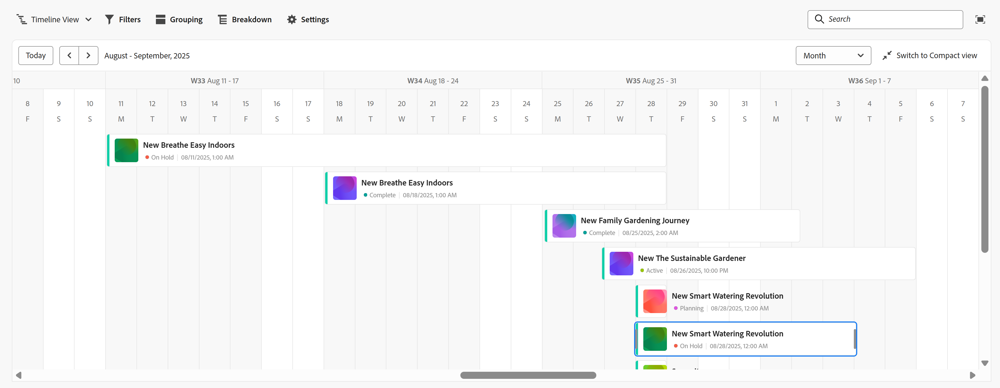

   選択したレコードタイプに関連付けられたレコードは、タイムラインにバーとして表示され、デフォルトでは開始日の時系列で並べ替えられます。

   >[!TIP]
   >
   >    タイムラインのレコードの並べ替えは、コンパクト表示には表示されません。

1. （条件付き）管理者がカスタム四半期を有効にし、Workfrontがカスタム四半期の設定方法に関する問題を検出した場合、タイムラインビューを開くと警告が表示される場合があります。

   次のシナリオが存在します。

   * 四半期の日付の間にギャップまたは重複が検出された場合は、カスタム四半期を設定できるようになり、編集が必要になる可能性があるという通知が表示されます。

     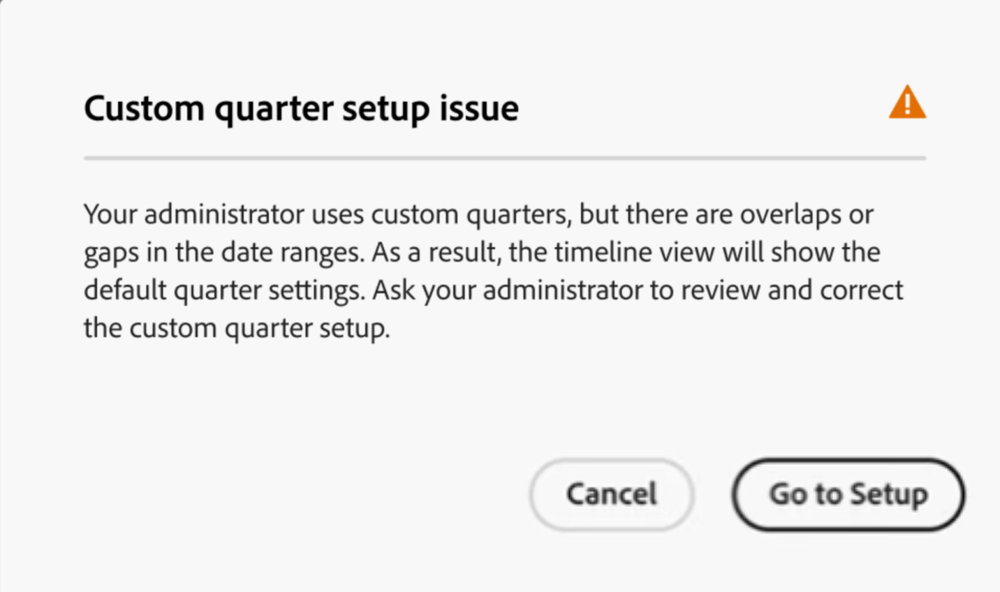

     >[!TIP]
     >
     >このメッセージは、組織が購入した直後に表示されます。プランニングおよびカスタム四半期は、購入前にすでに有効になっています。 四半期の重複とギャップは、組織のWorkfront計画を有効にした後は許可されません。

   * 四半期が部分的に設定されていて、同年の中に数か月が欠落している場合、スクロールして欠落している四半期を表示すると、その年の残りの部分を欠落している四半期で設定する必要があるという通知が表示される場合があります。

   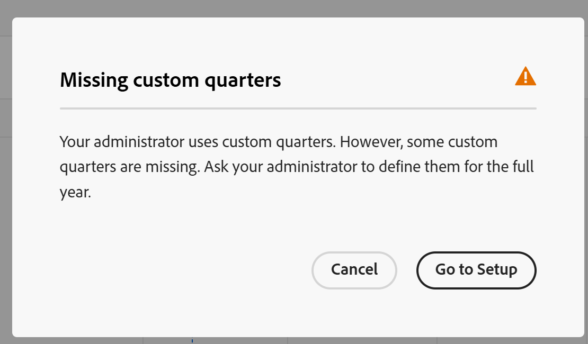

   カスタム四半期に関する警告メッセージは、各ユーザーごとに1回表示されます。

   >[!NOTE]
   >
   >カスタム四半期が正しく保存されていない場合、タイムラインビューには従来の四半期が表示されます。
   >設定領域でカスタム四半期を設定すると、タイムラインビューには従来の四半期ではなくカスタム四半期が表示されます。
   >詳しくは、[&#x200B; カスタム四半期を有効にする](/help/quicksilver/administration-and-setup/set-up-workfront/configure-system-defaults/enable-custom-quarters-projects.md)を参照してください。

1. （条件付き）Workfront管理者の場合は、**設定**&#x200B;に移動して四半期を設定します。 そうでない場合は、**OK**&#x200B;をクリックし、Workfront管理者にカスタム四半期の設定を依頼します。

   >[!TIP]
   >
   >「設定に移動」ボタンは、Workfront管理者にのみ表示されます。

1. （オプションおよび条件付き）レコード名が切り捨てられている場合は、レコードバーにカーソルを合わせると、レコードのフルネームと追加情報が表示されます。 タイムラインでのレコードバーの切り捨ての設定について詳しくは、この記事の「[&#x200B; タイムラインビュー設定の編集](#edit-the-timeline-view-settings)」を参照してください。

1. タイムラインを移動するには、次のいずれかを行います。

   * 左上隅の左右のアイコンをクリックするか、水平スクロールを使用して、タイムラインで前後に移動します。 ページを更新すると、選択した時間枠が保持されます。
   * 右上隅の&#x200B;**Today**&#x200B;をクリックして、タイムラインを今日の日付に中央に配置します。
   * 時間枠ドロップダウンメニューから次のいずれかのオプションを選択して、時間増分を更新し、ビューを更新します。

      * **年**：年が表示された四半期と月が表示されます。
      * **四半期**：四半期が表示された月と週を表示します。
      * **月**：週と日を表示します。
1. （オプション）「**コンパクトビューに切り替え**」をクリックして、日付が同じ行で交差しないレコードを表示します。<!--check to see if they updated the name of the setting here-->
1. （条件付き）モードを&#x200B;**コンパクト**&#x200B;に変更した場合は、**標準**&#x200B;表示に切り替えをクリックして、レコードを別々の行に表示します。 **Standard** オプションがデフォルトです。 <!--check to see if they updated the name of the setting here-->

1. キーワードに一致するレコードをすばやく検索するには、次の手順を実行します。

   1. **検索** アイコン をクリックし、画面に表示されるレコードの任意のフィールドに関連付けられたキーワードの入力を開始します。 正しい一致の数が検索項目の横に表示され、正しい一致のレコードがハイライト表示されます。

      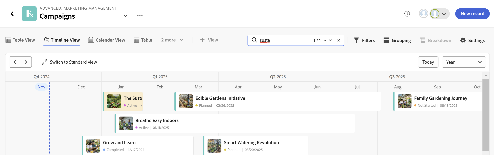

      画面に表示される任意の単語や特殊文字を使用できます。

      タイムラインビューに表示されないフィールドに関連付けられたキーワードは使用できません。

   1. キーボードの Enter キーを押して、次に見つかったフィールドに移動します。
   1. （オプション）複数の一致がある場合は、検索キーワードの右にある上下の矢印をクリックすると、表内のすべての一致を確認できます。
   1. 検索ボックスの **x** アイコンをクリックすると、検索キーワードをクリアできます。

   1. （オプション）「**フルスクリーン**」アイコン をクリックしてフルスクリーンで表示を開き、**フルスクリーンを終了** アイコン またはキーボードのEscapeをクリックしてフルスクリーンを終了します。

1. （オプション）「**分類**」をクリックして、タイムラインに接続されたレコードを表示します。

   詳しくは、この記事の「[分割機能を使用して、タイムラインビュー](#break-down-connected-records-in-the-timeline-view)に接続されたレコードを表示する」の節を参照してください。
1. タイムラインビューでレコードを作成したり、その日付を編集したりするには、次のいずれかの操作を行います。

   * タイムライン上の任意の場所をダブルクリックして、レコードを作成します。

     詳しくは、[レコードの作成](/help/quicksilver/planning/records/create-records.md)を参照してください。

   >[!TIP]
   >
   >タイムラインでレコードを作成するためのダブルクリックは、グループ化の内部では実行できません。

   * レコードバーの左または右の余白をクリックし、新しい位置にドラッグ&amp;ドロップします。 レコードのバーのサイズを変更すると、開始日または終了日がすぐに更新されます。

   * レコードをドラッグ&amp;ドロップして、タイムライン内の位置と日付を更新します。 レコードのバーを移動すると、開始日と終了日がすぐに更新されます。

     詳しくは、[レコードの編集](/help/quicksilver/planning/records/edit-records.md)を参照してください。

   >[!TIP]
   >
   >分類に表示されるWorkfrontおよびAEM Assets オブジェクトタイプのタイムラインでは、レコードのサイズ変更とドラッグ&amp;ドロップはできません。

1. 以下のサブセクションで説明するように、次のビュー要素を更新します。
   * [フィルター](#add-filters)
   * [グループ化](#add-grouping)
   * [設定](#edit-the-timeline-view-settings)
     <!--* [Sort](#add-sort) not yet in timeline; also check the anchor and make sure it's correct-->

### フィルターを追加

フィルターを使用すると、画面に表示される情報の量を減らすことができます。

タイムラインビューでフィルターを使用する際は、次の点を考慮してください。

<!-- this list is almost identical to the one for the table view - update both-->

* タイムラインビュー用に作成したフィルターは、同じレコードタイプに適用される他のビューのフィルターとは独立して機能します。

* フィルターは、選択したビューに固有です。同じレコードタイプの 2 つのタイムラインビューに、異なるフィルターを適用できます。

* 同じタイムラインビューを表示する 2 人のユーザーには、現在適用されている同じフィルターが表示されます。

* タイムラインビュー用に作成したフィルターには名前を付けることはできません。

* フィルターを削除すると、自分と同じレコードタイプにアクセスし、同じビューを表示している人から、フィルターが削除されます。

* 接続されているレコードフィールドまたはルックアップフィールドでフィルタリングできます。
* 複数の値を表示するルックアップフィールドでフィルタリングできます。

タイムラインビューにフィルターを追加するには：

1. 記事[&#x200B; レコードビューの管理](/help/quicksilver/planning/views/manage-record-views.md)の説明に従って、レコードタイプページのタイムラインビューを作成します。
1. タイムラインビューを選択し、テーブルの右上隅にある「**フィルター**」をクリックします。
1. 「**条件を追加**」をクリックして、次の情報を追加します。

   * **フィールドを選択**&#x200B;してフィールドを検索するか、リストからフィールドを選択します。

   * **オプション** （またはフィルター修飾子）を選択して、フィールドが満たす必要がある条件を定義します。

     次の表には、各タイプのフィールドで使用可能な修飾子が表示されています。

     <table>
        <thead>
        <tr>
            <th><b>フィールドタイプ</b></th>
            <th><b>修飾子</b></th>
        </tr>
        </thead>
        <tbody>
        <tr>
            <td>1 行、段落、式 </td>
            <td>
が次を含む

            
が次を含まない

            
が次に等しい

            
が次に等しくない

            
が空である

            
が空ではない
</td>
        </tr>
        <tr><td>単一選択</td>
            <td>
が次に等しい

            
が次に等しくない

            
が次のいずれかである

            
が次のいずれでもない

            
が空である

            
が空ではない
</td>
        </tr>
        <tr>
            <td>複数選択、人物</td>
            <td>
が次のいずれかを含む

            
が次のすべてを含む

            
が次に完全に等しい

            
が次のいずれも含まない

            
が空である

            
が空ではない
</td>
        </tr>
        <tr>
            <td>数値、割合、通貨</td>
            <td>
=

            
≠

            
 &lt; 

            
&gt;

            
≤

            
≥

            
が空である

            
が空ではない
</td>
        </tr>
        <tr>
            <td>日付</td>
            <td>
が次に等しい

            
が次に等しくない

            
が次の後にある

            
が次の前にある

            
が次の範囲である

が次の範囲ではない

            
が空である

が空ではない
</td>
        </tr>

     <tr>
            <td>チェックボックス</td>
            <td>
が次に等しい

        </tr>
        </tbody>
        </table>

   * 選択したフィールドの値を選択します。

   

   追加できるフィルタリング条件の数に制限はありません。

1. （オプション）「**条件を追加**」をクリックして、別のフィルタリングオプションを追加し、上記の手順を繰り返します。適用されたフィルターの数は、**フィルター** アイコンの左側に表示されます。
1. 左の次の演算子をクリックして、フィルター条件の結合方法と適用方法を示します。

   * **AND**：指定したすべての条件を満たす必要があります。
   * **OR**：指定された条件のいずれかを満たす必要があります。
これはデフォルトのオプションです。

   1. （オプション）追加のフィルターグループを追加し、**AND**&#x200B;または&#x200B;**OR**&#x200B;演算子で結合します。

      

   レコードのリストは、フィルター条件に基づいて自動的にフィルタリングされます。 <!--at this time, you can't name and save the filter - but will this change?!-->
   <!-- asked on the task for the simple filters whether there is a limitation for how many statements a filter can have?!-->

1. （オプション）「**x**」アイコンをクリックして、フィルター条件を削除します。
1. （オプション）「**フィルター**」またはページ上の任意の場所をクリックして、フィルターボックスを閉じます。<!--right now you cannot "clear all" for filters, but this might come later-->

### グループ化を追加

<!-- groupings are almost identical between this view and table  but they display a little differently, so I kept the steps for both; update in both places if they make changes to groupings-->

ビューにグループ化を適用する際に、類似の情報でレコードをグループ化できます。

タイムラインビューでグループ化を操作する際は、次の点を考慮してください。

* テーブルビューとタイムラインビューの両方でグループ化を適用できます。テーブルビューのグループ化は、同じレコードタイプのタイムラインビューのグループ化とは独立しています。
* ビューでは、3 つのレベルのグループ化を適用できます。レコードは、選択したグループ化の順にグループ化されます。
&lt;!--* API を使用すると、最大 4 レベルのグループ化を適用できます。--現在これを確認中-->
* グループは、選択したビューに固有です。同じレコードタイプの 2 つのテーブルビューに、異なるグループ化を適用することができます。同じテーブルビューを見ている 2 人のユーザーには、現在適用されているのと同じグループ化が表示されます。
* テーブルビュー用に作成したグループ化に名前を付けることはできません。
* グループ化を削除すると、自分と同じレコードタイプにアクセスし、同じビューを表示している人から、グループ化が削除されます。
* グループ化の下に一覧表示されたレコードは編集できます。
* 接続されたレコードフィールドまたはルックアップフィールドでグループ化できます。
* 複数の値（集計によって集計されていない値）を持つルックアップフィールドでグループ化すると、フィールド値の一意の組み合わせごとにレコードがグループ化されます。
* 現在のレコードタイプから最大4 レベル離れたフィールドを参照できます。 例えば、アクティビティレコードタイプのグループを作成する場合、アクティビティがWorkfront プロジェクトに接続されているCampaign レコードタイプに接続されている製品レコードタイプに接続されている場合、アクティビティレコードタイプ用に作成するグループでプロジェクトのステータスを参照できます。
* グループ化は、値のアルファベット順にリストされます。
<!--checking into this: * You can apply up to 4 levels of grouping when using the API. -->
<!-- checking also into this: * You cannot group by a Paragraph-type field.-->

タイムラインビューでグループ化を追加するには：

1. レコードタイプのタイムラインビューを作成します。詳しくは、[レコードビューの管理](/help/quicksilver/planning/views/manage-record-views.md)を参照してください。
1. タイムラインビューの右上隅にある&#x200B;**グループ化**&#x200B;をクリックします。

   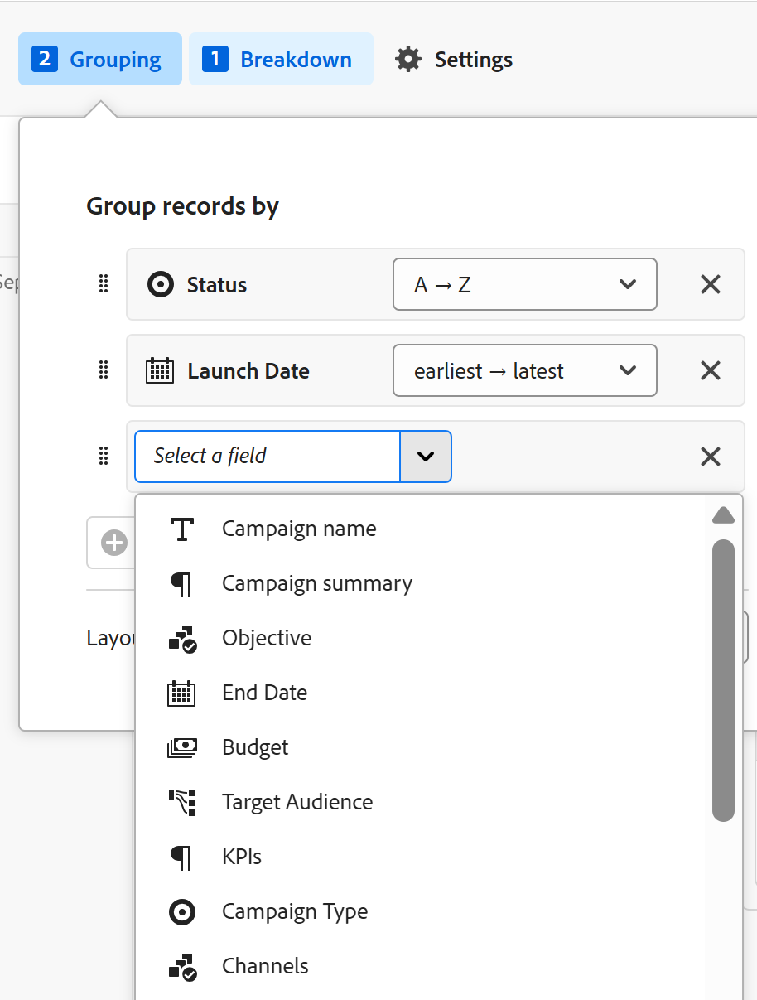

1. 候補フィールドの1つをクリックするか、**別のフィールドを選択**&#x200B;し、別のフィールドを検索して、リストに表示されたらクリックします。

   グループ化はタイムラインに自動的に適用され、レコードがグループ化ボックス内に表示されます。
1.  （オプションおよび条件付き）グループ化に選択したフィールドタイプに応じて、次のいずれかの並べ替えオプションを選択して、グループ化を昇順または降順で並べ替えます：

   

   * 選択フィールド、テキストフィールド、段落フィールド、接続されたレコードまたはオブジェクト、人物フィールドの&#x200B;**A -> Z**&#x200B;または&#x200B;**Z -> A**
   * 数値、通貨、またはパーセンテージ フィールドの&#x200B;**0 -> 9**&#x200B;または&#x200B;**9 -> 0**。
   * 日付フィールドの&#x200B;**earliest -> latest**&#x200B;または&#x200B;**latest -> earliest**

   

    タイムラインビューのグループは、それに応じて並べ替えられます。 グループ内のレコードは、デフォルトの並べ替えである&#x200B;**開始日**&#x200B;の順序で並べ替えられます。

1. （オプション）上記の手順を繰り返して、最大 3 つのグループ化を追加できます。

   グループ化用に選択したフィールドの数がグループ化アイコンの横に表示されます。

   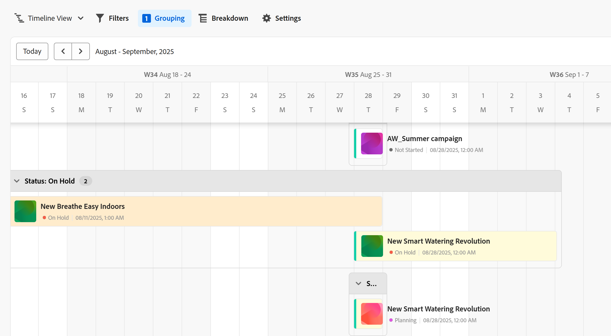

1. 「**レコードを**&#x200B;でグループ化」ボックスで、グループ化を正しい順序でドラッグ&amp;ドロップします。

1. （オプション）「**以下でレコードをグループ化**」ボックスで、グループ化用に選択したフィールドの右側にある **x** アイコンをクリックすると、グループ化を削除できます。

   または

   **すべてクリア**&#x200B;をクリックすると、すべてのフィールドを削除できます。

1. 「**以下でレコードをグループ化**」ボックスの外側をクリックして閉じます。
1. （オプション）「**設定**」、「**カラー**」の順にクリックすると、グループ化をカラーコーディングできます。詳しくは、この記事の[タイムラインビュー設定の編集](#edit-the-timeline-view-settings)の節を参照してください。

<!-- 

### Add sort

this is not possible right now; if this is the same functionality as the table view, document it there and link from here. 

-->

### タイムラインビュー設定の編集 {#edit-the-timeline-view-settings}

タイムラインビュー設定を更新すると、ビューのタイムラインセクションに表示される情報と表示の方法を指定できます。

1. レコードタイプのタイムラインビューを作成します。詳しくは、[レコードビューの管理](/help/quicksilver/planning/views/manage-record-views.md)を参照してください。
1. 「**設定**」をクリックします。
1. 左パネルの&#x200B;**日付および時刻**&#x200B;をクリックし、**開始日**&#x200B;と&#x200B;**終了日**&#x200B;を選択してタイムラインで表示します。デフォルトの開始日と終了日を選択するか、使用可能な任意の日付フィールドを選択できます。

   レコードを表すバーは、開始日に指定した日付で始まり、終了日に指定した日付で終わります。

   >[!NOTE]
   >
   >* 開始日または終了日の値がないレコード、または開始日が終了日より後のレコードは、タイムラインビューに表示されません。
   >
   >* 「分類」オプションを使用して追加のレコードを表示する場合、開始日と終了日はメインレコードの日付になります。 この領域で接続されているレコードの開始日と終了日は選択できません。

1. （条件付きとオプション）Workfront管理者の場合は、「**カスタム四半期を使用**」ボックスの「**セットアップに移動**」をクリックして、セットアップ領域に移動し、カスタム四半期を設定します。 カスタム四半期を設定した後、従来の四半期ではなくタイムラインビューに表示できます。 Workfront管理者でない場合は、管理者からカスタム四半期を有効にするように依頼できます。

   詳しくは、[&#x200B; カスタム四半期を有効にする](/help/quicksilver/administration-and-setup/set-up-workfront/configure-system-defaults/enable-custom-quarters-projects.md)を参照してください。

   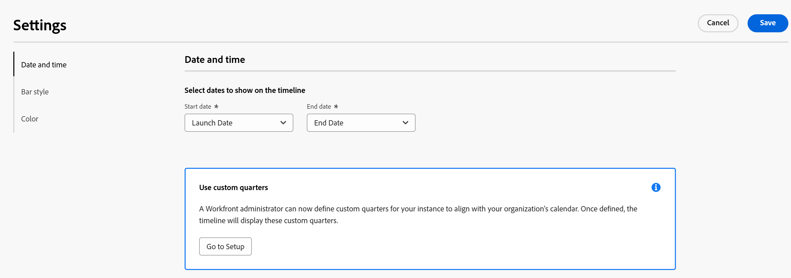

   >[!TIP]
   >
   >「設定に移動」ボタンは、Workfront管理者にのみ表示されます。

1. 左側のパネルの&#x200B;**棒スタイル**&#x200B;をクリックして、レコードバーに表示する情報を指定します。

   標準ビューで「分類」オプションを使用する場合は、メインレコードの棒スタイルと、接続されているレコードの棒スタイルを定義できます。

   レコードのテーブルビューで定義されているレコードのプライマリフィールド（またはタイトル）は、デフォルトで選択されます。
   <!--adjust this when the primary field is released??-->

1. （オプションおよび条件付き）レコードにサムネールを追加した場合は、**サムネール** オプションを選択して、レコードに関連付けられた画像をレコードバーに表示します。

   >[!NOTE]
   >
   >    タイムラインビューにサムネールを表示するには、まずテーブルビューにサムネールを追加する必要があります。詳しくは、[&#x200B; レコードにサムネールを追加](/help/quicksilver/planning/records/add-thumbnails-to-records.md)を参照してください。

1. **フィールドを追加**&#x200B;をクリックし、**フィールドを検索** ボックス内をクリックして、追加するフィールドをクリックします。

   >[!TIP]
   >
   >   * レコードバーにフィールドを追加する前に、フィールドを作成する必要があります。
   > 
   >   * 1 つ以上のフィールドを選択する必要があります。**名前**&#x200B;はデフォルトで選択されています。
   >
   >   * 最大5つのフィールドを追加できます。

   タイムライン上でバーがどのように表示されるかを示すプレビューが右側に表示されます。

   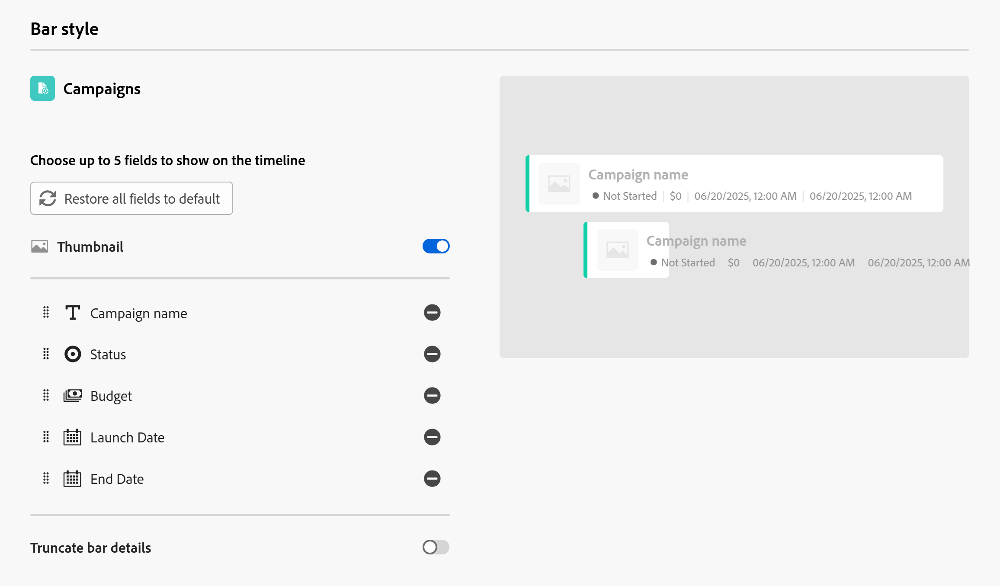

1. （オプションおよび条件付き）標準モードでタイムラインを表示する場合は、**バーの詳細を切り捨て**&#x200B;設定を選択します。 選択すると、レコードバーの情報は切り捨てられ、バーにカーソルを合わせたときにのみ完全に表示されます。 この設定はデフォルトで選択解除され、レコード情報はバーに完全に表示されます。

   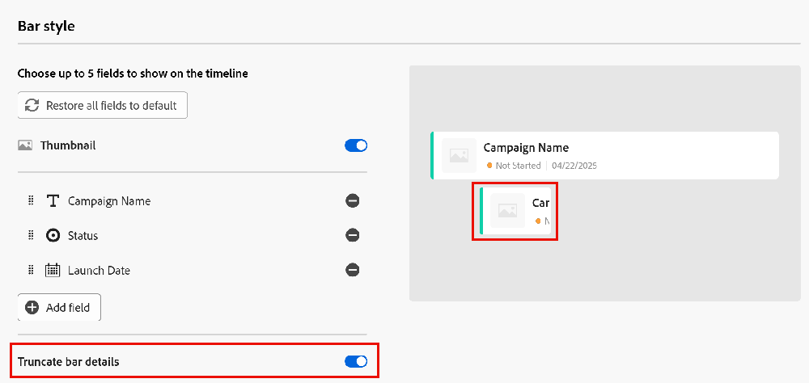

   >[!TIP]
   >
   >タイムラインビューをコンパクトモードで表示する場合、バーの詳細切り捨て設定は使用できません。
   >

1. 左パネルの&#x200B;**カラー**&#x200B;をクリックすると、タイムラインのレコードとグループ化の色をカスタマイズできます。

   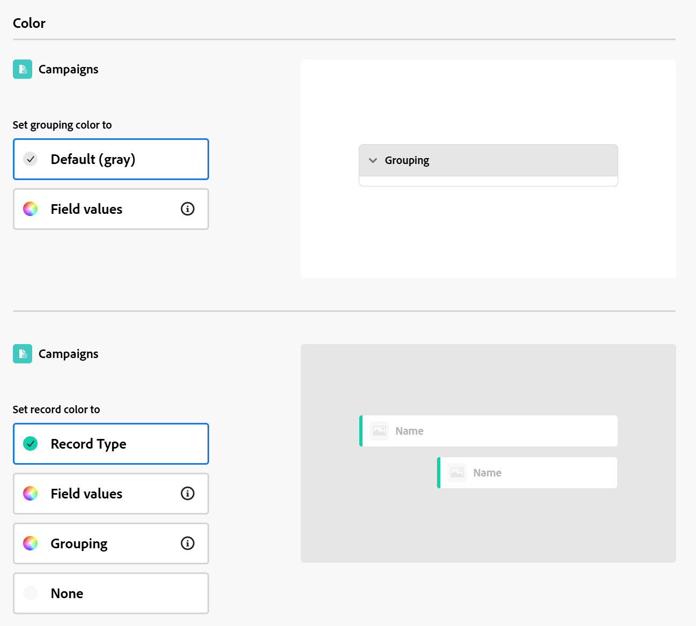

   標準ビューで「分類」オプションを使用すると、メインレコードの色と、接続されているレコードの色を定義できます。

1. （条件付きおよびオプション）タイムラインビューにグループ化を追加した場合、グループ化の色を設定するには、「**グループ化の色を設定**」セクションで次のオプションから選択します。

   * **デフォルト（グレー）**：グループ化の色をグレーに設定します。これがデフォルトです。
   * **フィールド値**：グループ化の色は、グループ化するフィールドの色と一致します。

     >[!NOTE]
     >
     >    * カラーは、色分けされたオプションを含むフィールドにのみ一致させることができます。 例えば、色をステータス フィールドに一致させたり、色に関連するオプションを持つフィールドを一致させたりできます。
     >    
     >    * リンクされたレコードまたはオブジェクトタイプのルックアップフィールドに色を一致させることはできません。

   例えば、複数選択フィールドや単一選択フィールドには、色分けされたオプションを含めることができます。

   色分けされたオプションを使用しないフィールドでグループ化した場合、グループ化の色はグレーのままになります。

   >[!TIP]
   >
   >タイムラインビューにグループ化を追加しなかった場合、このセクションは表示されません。

1. レコードの色を設定するには、「**レコードの色を設定**」セクションで次のオプションから選択します。

   * **レコードタイプ**：レコードの色を、選択したレコードタイプの色と一致させます。これはデフォルトのオプションです。
   * **フィールド値**：レコードの色を、指定したフィールドの色と一致させます。手順 10 に進みます。<!--ensure this stays accurate-->
   * **グループ化**：レコードの色を、グループ化で指定した色と一致させます。タイムラインビューにグループ化が適用されていない場合、このオプションは淡色表示になります。
   * **なし**：レコードは白いバーで表示されます。

1. （条件付き）レコードの色に&#x200B;**フィールド値**&#x200B;を選択した場合、**レコードの色を次と一致させる**&#x200B;ドロップダウンメニューからフィールドを選択します。

   タイムラインビューの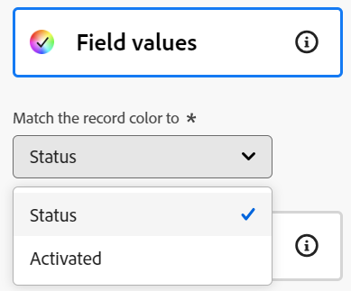

   ドロップダウンメニューには、色分けされたオプションを持つフィールドのみが表示されます。

   例えば、複数選択フィールドや単一選択フィールドには、色分けされたオプションを含めることができます。

   選択したレコードタイプに対して色分けされたオプションを含むフィールドがない場合、このオプションは淡色表示になります。

1. （オプション）「**分類**」オプションを使用している場合は、タイムラインに表示される接続された各レコードについて、手順4から始まる手順を繰り返します。

1. 「**保存**」をクリックします。

   選択した設定でレコードがタイムラインビューに表示されます。

### タイムラインビューで接続されているレコードを分割する

分類を使用すると、レコードのタイムラインビューに接続されたレコードを表示できます。 レコードを接続別に分類すると、接続された他のレコードのタイムラインを表示し、レコードのパフォーマンスや期限にどのような影響を与えるかを把握できます。

#### 分類を使用する際の考慮事項

レコードのタイムラインを、接続されたレコードタイプごとに分類する場合は、次の点を考慮してください。

* タイムラインビューでは、選択したレコードタイプのレコードの下に、接続されたレコードまたはオブジェクトを表示できます。
* タイムラインビューでは、レコードを標準モードで表示する場合にのみ、接続されたレコードを表示できます。 タイムラインビューのコンパクトモードでは、「分類」オプションは使用できません。
* タイムラインビューでは、分類の機能を使用して次の情報を表示できます。
   * 選択したレコードタイプに接続されたWorkfront Planning レコード。
   * 選択したレコードタイプに接続されているWorkfront オブジェクトタイプまたはExperience Manager アセット。
   * 選択したレコードタイプに接続されたレコードに接続されている他のアプリケーションのWorkfront Planning レコードまたはオブジェクト。

     たとえば、キャンペーンをポートフォリオに結び付けることができます。 さらに、別のレコードタイプである製品を、プロジェクトやキャンペーンと連携させることができます。 キャンペーンのタイムラインビューを構築すると、ポートフォリオ、製品、プロジェクトごとにキャンペーンを分類できます。

* WorkfrontのWorkfront オブジェクトにのみ接続され、Workfront計画レコードタイプに接続されていないオブジェクトタイプを表示することはできません。 Workfront Planningで接続されているオブジェクトまたはレコードタイプのみを表示できます。

  例えば、タスクはWorkfrontのプロジェクトに接続されます。 「分類」機能を使用すると、Planningのキャンペーンに接続されているプロジェクトを表示できますが、Workfrontのプロジェクトに接続されているタスクを表示することはできません。

  Workfront Planning レコードタイプのタイムラインビューにポートフォリオとプロジェクトの両方を表示する場合は、ポートフォリオとプロジェクトの両方を、プランニングレコードまたはタイムラインビューを管理しているプランニングレコードに接続されたレコードに接続する必要があります。
* プランニングレコードタイプに接続されているAdobe GenStudio ブランドを表示することはできません。
詳しくは、[レコードタイプの接続](/help/quicksilver/planning/architecture/connect-record-types.md)を参照してください。
* 少なくとも2つの日付フィールドに関連付けられているレコードタイプのみを表示できます。
* タイムラインビューに表示するレコードタイプの日付フィールドは、選択したレコードタイプのテーブルビューでルックアップフィールドとして表示されている必要があります。
* タイムラインビューに表示するレコードタイプの開始日と終了日は、時系列で指定する必要があります。 例えば、レコードの開始日が1月31日で終了日が1月1日の場合、タイムラインビューには表示されません。 詳しくは、この記事の「[&#x200B; タイムラインビューの管理](#manage-a-timeline-view)」の節を参照してください。
* レコードの分類に含めることができるレコードタイプは、5つまでです。

#### 接続されたレコードの分解

1. レコードタイプのタイムラインビューを作成します。詳しくは、[レコードビューの管理](/help/quicksilver/planning/views/manage-record-views.md)を参照してください。
1. **標準**&#x200B;または&#x200B;**コンパクト** モードで、タイムラインビューの右上隅にある&#x200B;**分類**&#x200B;をクリックします。
1. 「**リンクされたレコードタイプを選択**」ボックスを展開し、接続されたレコードタイプを選択します。<!--add a new screen shot - submitted a bug to remove the "the"-->

   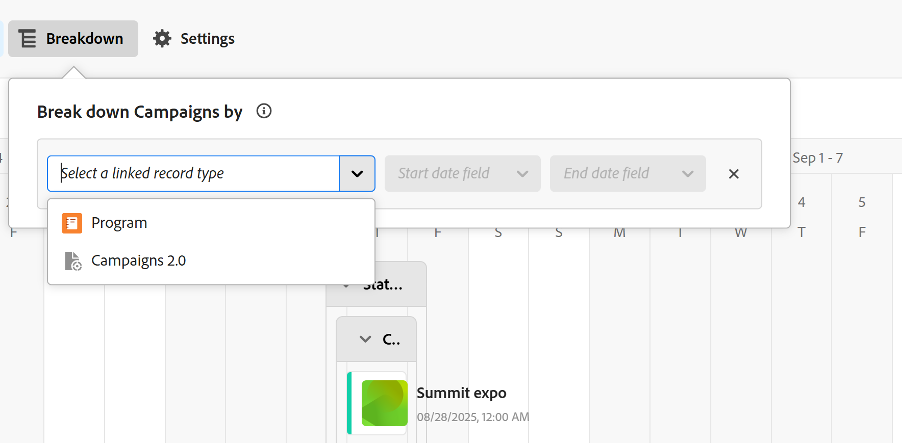

   >[!TIP]
   >
   >    接続されたレコードがない場合、または接続されたレコードに2つ以上の日付フィールドがない場合、「**リンクされたレコードタイプを選択**」ボックスは使用できません。

1. **開始日**&#x200B;と&#x200B;**終了日フィールド**&#x200B;を選択します。

   >[!TIP]
   >
   >    開始日と終了日は連続している必要があります。 終了日が開始日より前の場合、タイムラインにレコードは表示されません。

   選択したレコードのバーが他のレコードと接続されている場合、右向きの矢印がタイムラインに表示されます。
1. 右向きの矢印をクリックして、レコードタイプを展開し、その接続を表示します。<!--update screen shot at production-->

   タイムラインビューのプログラムごとに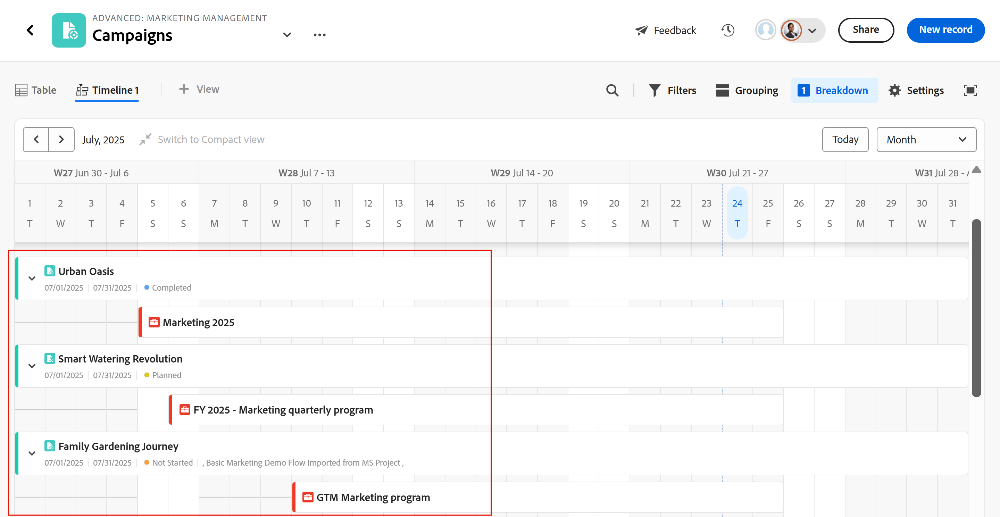

   >[!IMPORTANT]
   >
   >    分類に複数の接続されたレコードを表示する場合、それらのレコードは階層順ではありません。
   >
   >例えば、キャンペーンのタイムラインを表示し、分類に「製品」と「プログラム」を追加した場合、プログラムは必ずしも最初に「製品」に接続されるわけではありません。
   >
   >「製品」と「プログラム」の両方をキャンペーンに接続して、「分類」オプションの選択肢として表示する必要があり、任意の順序で分類に追加できます。

1. （条件付き）タイムラインをコンパクトモードで表示している場合は、**ビューを切り替え**&#x200B;をクリックします。 分類は&#x200B;**コンパクト** モードでは表示されません。

   >[!TIP]
   >
   >「**これを再度表示しない**」を選択します（**標準ビューに切り替える）。ビューを切り替える前に、** ボックスを選択します。
   >
   >この環境設定は、現在のブラウザーでのみ記憶されます。 ブラウザーやコンピューターを変更する場合は、この環境設定を再度選択する必要があります。
   >
   >ビューを標準に切り替え、接続されたレコードをビューに表示すると、コンパクトモードに戻すことはできません。
1. （オプション）上記の手順を繰り返して、より多くの接続されたレコードを追加します。

