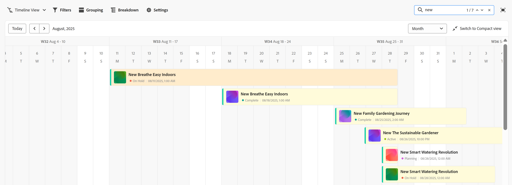

# タイムラインビューの管理

<!--
title: Manage the timeline view 
description: You can display records in a timeline view, when accessing the record type page in Adobe Workfront Planning. 
hidefromtoc: yes
hide: yes
author: Alina
feature: Work Management
role: User
-->

<!--update the metadata with real information when making this available in TOC and in the left nav-->

{{planning-important-intro}}

Adobe Workfront Planning でレコードタイプのページにアクセスする際、レコードをタイムラインビューで表示できます。

レコードビューについて詳しくは、[レコードビューの管理](/help/quicksilver/planning/views/manage-record-views.md)を参照してください。

## アクセス要件

この記事の手順を実行するには、次のアクセス権が必要です。

<table style="table-layout:auto">
 <col>
 </col>
 <col>
 </col>
 <tbody>
    <tr>
<tr>
<td>
   
 製品
 </td>
   <td>
   
 Adobe Workfront
 </td>
  </tr>  
 <td role="rowheader">
Adobe Workfront 契約
</td>
   <td>

Workfront Planning の早期アクセス段階に登録されている必要があります 

   </td>
  </tr>
  <tr>
   <td role="rowheader">
Adobe Workfront プラン
</td>
   <td>

任意

   </td>
  </tr>
  <tr>
   <td role="rowheader">
Adobe Workfront プラン
</td>
   <td>
   
任意
 
   
システム管理者は、自分が作成したビューまたは自分と共有されているビューにのみアクセスできます。 

  </td>
  </tr>

<tr>
   <td role="rowheader">アクセスレベルの設定</td>
   <td> 
Adobe Workfront Planning に対するアクセスレベルのコントロールはありません。 
  
</td>
  </tr>

<tr>
   <td role="rowheader">
権限
</td>
   <td> 
ビューに対する権限を管理
  
</td>
  </tr>

<tr>
   <td role="rowheader">レイアウトテンプレート</td>
   <td> 
システム管理者がレイアウトテンプレートに Planning エリアを追加する必要があります。詳しくは、<a href="/help/quicksilver/planning/access/access-overview.md">アクセス権の概要</a>を参照してください。 
  
</td>
  </tr>
 </tbody>
</table>

## タイムラインビューの管理 {#manage-a-timeline-view}

<!--insert screen shot of timeline view-->

タイムラインビューを作成すると、選択したレコードタイプのすべてのレコードが時系列で表示されます。

次の点に注意してください。

* タイムラインビューを作成できるのは、レコードタイプに関連付けられた日付フィールドが 2 つ以上ある場合のみです。レコードタイプに関連付けられた日付フィールドが 1 つのみ、またはまったくない場合は、タイムライン表示のオプションは淡色表示になります。

  レコードの日付フィールドから選択することも、接続されたレコードまたはオブジェクトタイプから日付フィールドを参照することもできます。
* 以下のシナリオのように、レコードに関連付けられた日付によっては、一部のレコードがタイムラインビューに表示されないことがあります。

   * 開始日と終了日に値がない場合
   * 開始日または終了日のどちらかに値がない場合
   * 開始日が終了日より後の場合

タイムラインビューを管理するには：

1. タイムラインを表示するレコードタイプページに移動します。
1. タイムラインビューを作成します。詳しくは、[レコードビューの管理](/help/quicksilver/planning/views/manage-record-views.md)を参照してください。

   

   選択したレコードタイプに関連付けられたレコードは、タイムラインにバーとして表示され、デフォルトでは開始日の時系列で並べ替えられます。

   >[!TIP]
   >
   >    タイムラインのレコードの並べ替えは、コンパクト表示には表示されません。

1. タイムラインを移動するには、次のいずれかを行います。

   * 左右のアイコンをクリックするか、水平スクロールを使用してタイムライン内を前後に移動します。
   * 「**今日**」をクリックして、今日の日付をタイムラインの中心に置きます。
   * 時間枠ドロップダウンメニューから次のいずれかのオプションを選択して、時間間隔を更新します。

      * 年
      * 四半期
      * 月
1. **標準ビューに切り替え**&#x200B;をクリックして、別々の行にレコードを表示します。<!--check to see if they updated the name of the setting here-->

   または

   **コンパクトビューに切り替え**&#x200B;をクリックして、日付が同じ行で交わらないレコードを表示します。<!--check to see if they updated the name of the setting here-->

   デフォルトでは、レコードはコンパクトビューで表示されます。

1. キーワードに一致するレコードをすばやく検索するには、次の手順を実行します。

   1. **検索**&#x200B;アイコン  をクリックして、画面に表示されるレコードの任意のフィールドに関連付けられたキーワードを入力し始めます。正しい一致の数が検索項目の横に表示され、正しい一致のレコードがハイライト表示されます。

      

      画面に表示される任意の単語や特殊文字を使用できます。

      タイムラインビューに表示されないフィールドに関連付けられたキーワードは使用できません。

   1. キーボードの Enter キーを押して、次に見つかったフィールドに移動します。
   1. （オプション）複数の一致がある場合は、検索キーワードの右にある上下の矢印をクリックすると、表内のすべての一致を確認できます。
   1. 検索ボックスの **x** アイコンをクリックすると、検索キーワードをクリアできます。

1. 以下のサブセクションで説明するように、次のビュー要素を更新します。
   * [フィルター](#add-filters)
   * [グループ化](#add-grouping)
   * [設定](#edit-the-timeline-view-settings)
     <!--* [Sort](#add-sort) not sure if this is present in timeline views?!; also check the anchor and make sure it's correct-->

### フィルターを追加

フィルターを使用すると、画面に表示される情報の量を減らすことができます。

タイムラインビューでフィルターを使用する際は、次の点を考慮してください。

<!-- this list is almost identical to the one for the table view - update both-->

* タイムラインビュー用に作成したフィルターは、同じレコードタイプに適用される他のビューのフィルターとは独立して機能します。

* フィルターは、選択したビューに固有です。同じレコードタイプの 2 つのタイムラインビューに、異なるフィルターを適用できます。

* 同じタイムラインビューを表示する 2 人のユーザーには、現在適用されている同じフィルターが表示されます。

* タイムラインビュー用に作成したフィルターには名前を付けることはできません。

* フィルターを削除すると、自分と同じレコードタイプにアクセスし、同じビューを表示している人から、フィルターが削除されます。

* タイムラインビューでのフィルターの追加方法は、テーブルビューでのフィルターの追加方法と同じです。

  詳しくは、[テーブルビューの管理](/help/quicksilver/planning/views/manage-the-table-view.md)の記事の「フィルターの追加」の節を参照してください。

* 接続されたレコードフィールドまたはルックアップフィールドでフィルタリングできますが、複数のレコードへのリンクを許可するフィールドではフィルタリングできません。

### グループ化を追加

<!-- groupings are almost identical between this view and table  but they display a little differently, so I kept the steps for both; update in both places if they make changes to groupings-->

ビューにグループ化を適用する際に、類似の情報でレコードをグループ化できます。

タイムラインビューでグループ化を追加する操作は、テーブルビューでグループ化を追加する操作と似ています。

タイムラインビューでグループ化を操作する際は、次の点を考慮してください。

* テーブルビューとタイムラインビューの両方でグループ化を適用できます。テーブルビューのグループ化は、同じレコードタイプのタイムラインビューのグループ化とは独立しています。
* ビューでは、3 つのレベルのグループ化を適用できます。レコードは、選択したグループ化の順にグループ化されます。
* API を使用する場合、最大 4 レベルのグループ化を適用できます。
* グループは、選択したビューに固有です。同じレコードタイプの 2 つのタイムラインビューで、異なるグループ化を適用することができます。同じタイムラインビューを表示している 2 人のユーザーには、現在適用されているのと同じグループ化が表示されます。
* タイムラインビュー用に作成したグループ化に名前を付けることはできません。
* グループ化を削除すると、自分と同じレコードタイプにアクセスするユーザーおよび自分と同じビューを表示するユーザーに対して、グループ化が削除されます。
* 接続されたレコードフィールドまたはルックアップフィールドでグループ化できますが、複数のレコードへのリンクを許可するフィールドではできません。

タイムラインビューでグループ化を追加するには、次の手順に従います。

1. レコードタイプのタイムラインビューを作成します。詳しくは、[レコードビューの管理](/help/quicksilver/planning/views/manage-record-views.md)を参照してください。
1. タイムラインビューの右上隅にある&#x200B;**グループ化**&#x200B;をクリックします。

   

1. 推奨フィールドの 1 つをクリックするか、「**別のフィールドを選択**」で別のフィールドを検索して、リストに表示されたらクリックします。

   グループ化はタイムラインに自動的に適用され、レコードがグループ化ボックス内に表示されます。

   <!-- add a step that you can rearrange the groupings here, when this will be possible-->

1. （オプション）上記の手順を繰り返して、最大 3 つのグループ化を追加できます。

   グループ化用に選択したフィールドの数がグループ化アイコンの横に表示されます。

   <!-- update screen shot with view redesign-->

   

1. （オプション）「**以下でレコードをグループ化**」ボックスで、グループ化用に選択したフィールドの右側にある **x** アイコンをクリックすると、グループ化を削除できます。

   または

   **すべてクリア**&#x200B;をクリックすると、すべてのフィールドを削除できます。

1. 「**以下でレコードをグループ化**」ボックスの外側をクリックして閉じます。
1. （オプション）「**設定**」、「**カラー**」の順にクリックすると、グループ化をカラーコーディングできます。詳しくは、この記事の[タイムラインビュー設定の編集](#edit-the-timeline-view-settings)の節を参照してください。

<!-- 

### Add sort

this is not possible right now; if this is the same functionality as the table view, document it there and link from here. 

-->

### タイムラインビュー設定の編集 {#edit-the-timeline-view-settings}

タイムラインビュー設定を変更すると、ビューのタイムラインセクションに表示される情報と表示のされ方を指定できます。

1. レコードタイプのタイムラインビューを作成します。詳しくは、[レコードビューの管理](/help/quicksilver/planning/views/manage-record-views.md)を参照してください。
1. 「**設定**」をクリックします。
1. 左パネルの&#x200B;**日付および時刻**&#x200B;をクリックし、**開始日**&#x200B;と&#x200B;**終了日**&#x200B;を選択してタイムラインで表示します。デフォルトの開始日と終了日を選択するか、使用可能な任意の日付フィールドを選択できます。レコードを表すバーは、開始日に指定した日付で始まり、終了日に指定した日付で終わります。

   >[!NOTE]
   >
   >開始日または終了日の値がないレコード、または開始日が終了日より後のレコードは、タイムラインビューに表示されません。

1. 左パネルで「**バーのスタイル**」をクリックし、レコードバーに表示するフィールドを指定します。

   デフォルトでは、名前フィールドが選択されています。<!--adjust this when the primary field is released??-->

1. （オプションおよび条件付き）レコードにサムネールを追加した場合、「サムネール」オプションを選択すると、レコードに関連付けられた画像がレコードバーに表示されます。

   >[!NOTE]
   >
   >    タイムラインビューにサムネールを表示するには、まずテーブルビューにサムネールを追加する必要があります。詳しくは、を参照してください [レコードへのサムネールの追加](/help/quicksilver/planning/records/add-thumbnails-to-records.md).

1. **フィールドを追加**&#x200B;をクリックすると、レコードバーに最大 4 つのフィールドを追加できます。
1. **フィールドを検索**&#x200B;ボックスの内側をクリックし、追加するフィールドをクリックします。

   >[!TIP]
   >
   >   * レコードバーにフィールドを追加する前に、フィールドを作成する必要があります。
   > 
   >   * 1 つ以上のフィールドを選択する必要があります。**名前**&#x200B;はデフォルトで選択されています。

   タイムライン上でバーがどのように表示されるかを示すプレビューが右側に表示されます。

   

1. 左パネルの&#x200B;**カラー**&#x200B;をクリックすると、タイムラインのレコードとグループ化の色をカスタマイズできます。

   

1. （条件付きおよびオプション）タイムラインビューにグループ化を追加した場合、グループ化の色を設定するには、「**グループ化の色を設定**」セクションで次のオプションから選択します。

   * **デフォルト（グレー）**：グループ化の色をグレーに設定します。これがデフォルトです。
   * **フィールド値**：グループ化の色は、グループ化の基準にするフィールドの色と一致します。

     >[!NOTE]
     >
     >    * カラーは、色分けされたオプションを含むフィールドにのみ一致させることができます。 例えば、カラーをステータスフィールドに一致させたり、カラーに関連付けられたオプションを含むフィールドに一致させることができます。
     >    
     >    * リンクされたレコードまたはオブジェクト タイプのルックアップ フィールドの色を一致させることはできません。

   例えば、複数選択フィールドや単一選択フィールドには、色分けされたオプションを含めることができます。

   色分けされたオプションを使用しないフィールドでグループ化した場合、グループ化の色はグレーのままになります。

   >[!TIP]
   >
   >タイムラインビューにグループ化を追加しなかった場合、このセクションは表示されません。

1. レコードの色を設定するには、「**レコードの色を設定**」セクションで次のオプションから選択します。

   * **レコードタイプ**：レコードの色を、選択したレコードタイプの色と一致させます。これはデフォルトのオプションです。
   * **フィールド値**：レコードの色を、指定したフィールドの色と一致させます。手順 10 に進みます。<!--ensure this stays accurate-->
   * **グループ化**：レコードの色を、グループ化で指定した色と一致させます。タイムラインビューにグループ化が適用されていない場合、このオプションは淡色表示になります。
   * **なし**：レコードは白いバーで表示されます。

1. （条件付き）レコードの色に&#x200B;**フィールド値**&#x200B;を選択した場合、**レコードの色を次と一致させる**&#x200B;ドロップダウンメニューからフィールドを選択します。

   

   ドロップダウンメニューには、色分けされたオプションを持つフィールドのみが表示されます。

   例えば、複数選択フィールドや単一選択フィールドには、色分けされたオプションを含めることができます。

   選択したレコードタイプに対して色分けされたオプションを含むフィールドがない場合、このオプションは淡色表示になります。

1. 「**保存**」をクリックします。

   選択した設定でレコードがタイムラインビューに表示されます。
