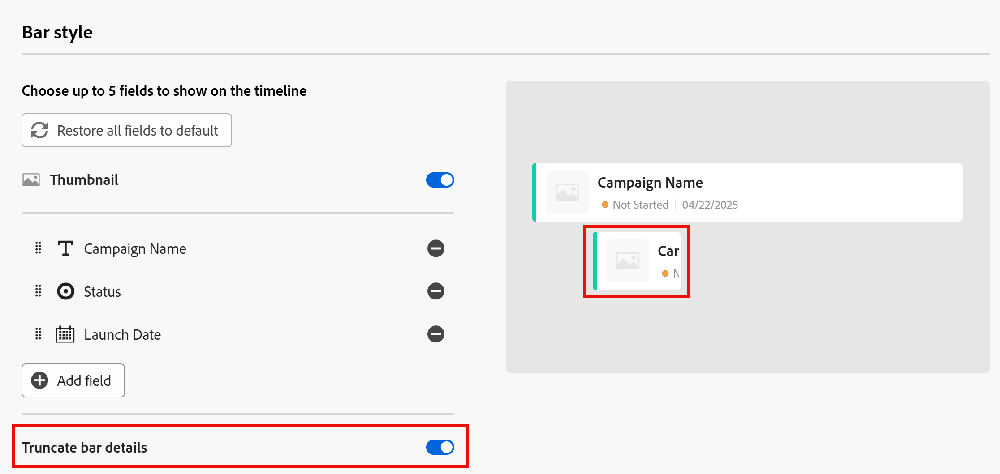

# タイムラインビューの管理

このページでハイライト表示されている情報は、まだ一般に利用できない機能を示します。すべてのお客様が、プレビュー環境でのみ使用できます。 実稼動環境への毎月のリリースの後、迅速なリリースを有効にしたお客様には、実稼動環境でも同じ機能を利用できます。

迅速リリースについて詳しくは、[組織での迅速リリースを有効または無効にする](/help/quicksilver/administration-and-setup/set-up-workfront/configure-system-defaults/enable-fast-release-process.md)を参照してください。

{{planning-important-intro}}

Adobe Workfront Planning でレコードタイプのページにアクセスする際、レコードをタイムラインビューで表示できます。

レコードビューについて詳しくは、[レコードビューの管理](/help/quicksilver/planning/views/manage-record-views.md)を参照してください。

## アクセス要件

+++ 展開すると、アクセス要件が表示されます。

この記事の手順を実行するには、次のアクセス権が必要です。

<table style="table-layout:auto"> 
<col> 
</col> 
<col> 
</col> 
<tbody> 
    <tr> 
<tr> 
<td> 
   
 製品
 </td> 
   <td> 
   <ul><li>
 Adobe Workfront
</li> 
   <li>
 Adobe Workfrontの計画
</li></ul></td> 
  </tr>   
<tr> 
   <td role="rowheader">
Adobe Workfront プラン*
</td> 
   <td> 

次のいずれかのWorkfront プラン：
 
<ul><li>選択</li> 
<li>Prime</li> 
<li>Ultimate</li></ul> 

Workfront Planning は、従来のWorkfront プランでは使用できません
 
   </td> 
<tr> 
   <td role="rowheader">
Adobe Workfront Planning パッケージ*
</td> 
   <td> 

任意 
 

各Workfront Planning プランに含まれる内容について詳しくは、Workfront担当営業または販売店にお問い合わせください。 
 
   </td> 
 <tr> 
   <td role="rowheader">
Adobe Workfront platform
</td> 
   <td> 

組織のWorkfront インスタンスは、Workfront Planning のすべての機能にアクセスできるように、Adobe Unified Experience にオンボーディングされる必要があります。
 

詳しくは、<a href="/help/quicksilver/workfront-basics/navigate-workfront/workfront-navigation/adobe-unified-experience.md">Workfront の Adobe Unified Experience</a> を参照してください。 
 
   </td> 
   </tr> 
  </tr> 
  <tr> 
   <td role="rowheader">
Adobe Workfront プラン*
</td> 
   <td>
 標準 

   
Workfront Planning は、従来のWorkfront ライセンスでは使用できません
 
  </td> 
  </tr> 
  <tr> 
   <td role="rowheader">
アクセスレベルの設定
</td> 
   <td> 
Adobe Workfront Planning に対するアクセスレベルのコントロールはありません。
   
</td> 
  </tr> 
<tr> 
   <td role="rowheader">
オブジェクト権限
</td> 
   <td>   
ビューに対する権限を管理
  
   
ビュー設定を一時的に変更したり、複製したりするためのビューへのアクセス許可を表示します
 </td> 
  </tr> 
<tr> 
   <td role="rowheader">
レイアウトテンプレート
</td> 
   <td> 
実稼動環境では、システム管理者を含むすべてのユーザーを、Planning を含むレイアウト・テンプレートに割り当てる必要があります。

プレビュー環境では、標準ユーザーとシステム管理者は、デフォルトで計画を有効にしています。
 </td> 
  </tr> 
</tbody> 
</table>

*Workfront のアクセス要件について詳しくは、[Workfront ドキュメントのアクセス要件](/help/quicksilver/administration-and-setup/add-users/access-levels-and-object-permissions/access-level-requirements-in-documentation.md)を参照してください。

+++

## タイムラインビューの管理 {#manage-a-timeline-view}

タイムラインビューを作成すると、選択したレコードタイプのすべてのレコードが時系列で表示されます。

次の点に注意してください。

* タイムラインビューを作成できるのは、レコードタイプに関連付けられた日付フィールドが 2 つ以上ある場合のみです。レコードタイプに関連付けられた日付フィールドが 1 つのみ、またはまったくない場合は、タイムライン表示のオプションは淡色表示になります。

  タイムラインビューを作成する際に、次の日付フィールドから選択できます。

   * レコード日付
   * レコードのシステム生成フィールド：作成日、最終変更日
   * 接続されたレコードまたはオブジェクトタイプから日付を参照します。
* 以下のシナリオのように、レコードに関連付けられた日付によっては、一部のレコードがタイムラインビューに表示されないことがあります。

   * 開始日と終了日に値がない場合
   * 開始日または終了日のどちらかに値がない場合
   * 開始日が終了日より後の場合

タイムラインビューを管理するには：

1. タイムラインを表示するレコードタイプページに移動します。
1. タイムラインビューを作成します。詳しくは、[レコードビューの管理](/help/quicksilver/planning/views/manage-record-views.md)を参照してください。

   

   選択したレコードタイプに関連付けられたレコードは、タイムラインにバーとして表示され、デフォルトでは開始日の時系列で並べ替えられます。

   >[!TIP]
   >
   >    タイムラインのレコードの並べ替えは、コンパクト表示には表示されません。

1. （オプションおよび条件付き）レコード名が切り詰められている場合は、レコードバーにマウスポインターを置くと、レコードのフルネームと追加情報が表示されます。

1. タイムラインを移動するには、次のいずれかを行います。

   * 左右のアイコンをクリックするか、水平スクロールを使用してタイムラインを前後に移動します。 ページを更新すると、選択した時間枠が保持されます。
   * 「**今日**」をクリックして、今日の日付をタイムラインの中心に置きます。
   * 時間枠ドロップダウンメニューから次のいずれかのオプションを選択して、時間間隔を更新します。

      * 年
      * 四半期
      * 月
1. **標準ビューに切り替え**&#x200B;をクリックして、別々の行にレコードを表示します。<!--check to see if they updated the name of the setting here-->

   または

   **コンパクトビューに切り替え**&#x200B;をクリックして、日付が同じ行で交わらないレコードを表示します。<!--check to see if they updated the name of the setting here-->

   デフォルトでは、レコードはコンパクトビューで表示されます。

1. キーワードに一致するレコードをすばやく検索するには、次の手順を実行します。

   1. **検索** アイコン  をクリックし、画面に表示されるレコードのフィールドに関連付けられたキーワードの入力を開始します。 正しい一致の数が検索項目の横に表示され、正しい一致のレコードがハイライト表示されます。

      

      画面に表示される任意の単語や特殊文字を使用できます。

      タイムラインビューに表示されないフィールドに関連付けられたキーワードは使用できません。

   1. キーボードの Enter キーを押して、次に見つかったフィールドに移動します。
   1. （オプション）複数の一致がある場合は、検索キーワードの右にある上下の矢印をクリックすると、表内のすべての一致を確認できます。
   1. 検索ボックスの **x** アイコンをクリックすると、検索キーワードをクリアできます。

1. 以下のサブセクションで説明するように、次のビュー要素を更新します。
   * [フィルター](#add-filters)
   * [グループ化](#add-grouping)
   * [設定](#edit-the-timeline-view-settings)
     <!--* [Sort](#add-sort) not yet in timeline; also check the anchor and make sure it's correct-->

1. （任意） **分類** をクリックして、接続されたレコードをタイムラインに表示します。

   詳しくは、この記事の [ 分類機能を使用して接続されたレコードをタイムライン ビューに表示する ](#break-down-connected-records-in-the-timeline-view) の節を参照してください。

### フィルターを追加

フィルターを使用すると、画面に表示される情報の量を減らすことができます。

タイムラインビューでフィルターを使用する際は、次の点を考慮してください。

<!-- this list is almost identical to the one for the table view - update both-->

* タイムラインビュー用に作成したフィルターは、同じレコードタイプに適用される他のビューのフィルターとは独立して機能します。

* フィルターは、選択したビューに固有です。同じレコードタイプの 2 つのタイムラインビューに、異なるフィルターを適用できます。

* 同じタイムラインビューを表示する 2 人のユーザーには、現在適用されている同じフィルターが表示されます。

* タイムラインビュー用に作成したフィルターには名前を付けることはできません。

* フィルターを削除すると、自分と同じレコードタイプにアクセスし、同じビューを表示している人から、フィルターが削除されます。

* タイムラインビューでのフィルターの追加方法は、テーブルビューでのフィルターの追加方法と同じです。

  詳しくは、[テーブルビューの管理](/help/quicksilver/planning/views/manage-the-table-view.md)の記事の「フィルターの追加」の節を参照してください。

* 接続されたレコードフィールドまたはルックアップフィールドでフィルタリングできます。
* 複数の値を表示する参照フィールドでフィルタリングできます。

### グループ化を追加

<!-- groupings are almost identical between this view and table  but they display a little differently, so I kept the steps for both; update in both places if they make changes to groupings-->

ビューにグループ化を適用する際に、類似の情報でレコードをグループ化できます。

タイムラインビューでグループ化を追加する操作は、テーブルビューでグループ化を追加する操作と似ています。

タイムラインビューでグループ化を操作する際は、次の点を考慮してください。

* テーブルビューとタイムラインビューの両方でグループ化を適用できます。テーブルビューのグループ化は、同じレコードタイプのタイムラインビューのグループ化とは独立しています。
* ビューでは、3 つのレベルのグループ化を適用できます。レコードは、選択したグループ化の順にグループ化されます。
&lt;!--* API を使用すると、最大 4 レベルのグループ化を適用できます。--現在これを確認中-->
* グループは、選択したビューに固有です。同じレコードタイプの 2 つのテーブルビューに、異なるグループ化を適用することができます。同じテーブルビューを見ている 2 人のユーザーには、現在適用されているのと同じグループ化が表示されます。
* テーブルビュー用に作成したグループ化に名前を付けることはできません。
* グループ化を削除すると、自分と同じレコードタイプにアクセスし、同じビューを表示している人から、グループ化が削除されます。
* グループ化の下に一覧表示されたレコードは編集できます。
* 接続されているレコードフィールドまたはルックアップフィールドでグループ化できます。
* アグリゲータによって集計されていない複数の値を持つルックアップ フィールドでグループ化する場合、レコードはフィールド値の一意の組み合わせごとにグループ化されます。
* 現在のレコードタイプから最大 4 レベル離れたフィールドを参照できます。 例えば、アクティビティレコードタイプのグループを作成し、そのアクティビティが、Workfront プロジェクトに接続されたキャンペーンレコードタイプに接続された製品レコードタイプに接続されている場合、アクティビティレコードタイプに作成しているグループでプロジェクトのステータスを参照できます。
<!--checking into this: * You can apply up to 4 levels of grouping when using the API. -->
<!-- checking also into this: * You cannot group by a Paragraph-type field.-->

タイムラインビューでグループ化を追加するには：

1. レコードタイプのタイムラインビューを作成します。詳しくは、[レコードビューの管理](/help/quicksilver/planning/views/manage-record-views.md)を参照してください。
1. タイムラインビューの右上隅にある&#x200B;**グループ化**&#x200B;をクリックします。

   

1. 推奨フィールドの 1 つをクリックするか、「**別のフィールドを選択**」で別のフィールドを検索して、リストに表示されたらクリックします。

   グループ化はタイムラインに自動的に適用され、レコードがグループ化ボックス内に表示されます。

   <!-- add a step that you can rearrange the groupings here, when this will be possible-->

1. （オプション）上記の手順を繰り返して、最大 3 つのグループ化を追加できます。

   グループ化用に選択したフィールドの数がグループ化アイコンの横に表示されます。

   <!-- update screen shot with view redesign-->

   

1. （オプション）「**以下でレコードをグループ化**」ボックスで、グループ化用に選択したフィールドの右側にある **x** アイコンをクリックすると、グループ化を削除できます。

   または

   **すべてクリア**&#x200B;をクリックすると、すべてのフィールドを削除できます。

1. 「**以下でレコードをグループ化**」ボックスの外側をクリックして閉じます。
1. （オプション）「**設定**」、「**カラー**」の順にクリックすると、グループ化をカラーコーディングできます。詳しくは、この記事の[タイムラインビュー設定の編集](#edit-the-timeline-view-settings)の節を参照してください。

<!-- 

### Add sort

this is not possible right now; if this is the same functionality as the table view, document it there and link from here. 

-->

### タイムラインビュー設定の編集 {#edit-the-timeline-view-settings}

タイムラインビュー設定を変更すると、ビューのタイムラインセクションに表示される情報と表示のされ方を指定できます。

1. レコードタイプのタイムラインビューを作成します。詳しくは、[レコードビューの管理](/help/quicksilver/planning/views/manage-record-views.md)を参照してください。
1. 「**設定**」をクリックします。
1. 左パネルの&#x200B;**日付および時刻**&#x200B;をクリックし、**開始日**&#x200B;と&#x200B;**終了日**&#x200B;を選択してタイムラインで表示します。デフォルトの開始日と終了日を選択することも、使用可能な任意の日付フィールドを選択することもできます。

   レコードを表すバーは、開始日に指定した日付で始まり、終了日に指定した日付で終わります。

   >[!NOTE]
   >
   >* 開始日または終了日の値がないレコード、または開始日が終了日より後のレコードは、タイムラインビューに表示されません。
   >
   >* 「分類」オプションを使用して追加のレコードを表示する場合、開始日と終了日はメインレコードの日付です。 この領域で接続されているレコードの開始日と終了日を選択することはできません。

1. 左側のパネルで **バースタイル** をクリックし、レコードバーに表示する情報を指定します。

    標準ビューで「分類」オプションを使用すると、メインレコードおよび接続されたレコードのバースタイルを定義できます。

   レコードのテーブルビューで定義されたレコードのプライマリフィールド（またはタイトル）は、デフォルトで選択されています。
   <!--adjust this when the primary field is released??-->

1. （オプションおよび条件付き）レコードにサムネールを追加した場合、「サムネール」オプションを選択すると、レコードに関連付けられた画像がレコードバーに表示されます。

   >[!NOTE]
   >
   >    タイムラインビューにサムネールを表示するには、まずテーブルビューにサムネールを追加する必要があります。詳しくは、[ レコードへのサムネールの追加 ](/help/quicksilver/planning/records/add-thumbnails-to-records.md) を参照してください。

1. **フィールドを追加** をクリックして、**フィールドを検索** ボックス内をクリックし、追加するフィールドをクリックします。

   >[!TIP]
   >
   >   * レコードバーにフィールドを追加する前に、フィールドを作成する必要があります。
   > 
   >   * 1 つ以上のフィールドを選択する必要があります。**名前**&#x200B;はデフォルトで選択されています。
   >
   >   * 最大 5 個のフィールドを追加できます。

   タイムライン上でバーがどのように表示されるかを示すプレビューが右側に表示されます。

   

1.  （オプションおよび条件付き）タイムラインを標準モードで表示する場合、「**バーの詳細を切り捨て** 設定を有効にします。 有効にすると、レコードバーの情報は切り捨てられ、バーにカーソルを合わせたときにのみ完全に表示されます。 この設定はデフォルトで無効になっており、情報はバーに完全に表示されます。

   

   >[!TIP]
   >
   > バーの詳細を切り捨て設定は、タイムラインビューをコンパクトモードで表示する場合は使用できず、カレンダービューでは使用できません。
   >

1. 左パネルの&#x200B;**カラー**&#x200B;をクリックすると、タイムラインのレコードとグループ化の色をカスタマイズできます。

   

    標準ビューで「分類」オプションを使用すると、接続されたレコードだけでなく、メインレコードの色も定義できます。

1. （条件付きおよびオプション）タイムラインビューにグループ化を追加した場合、グループ化の色を設定するには、「**グループ化の色を設定**」セクションで次のオプションから選択します。

   * **デフォルト（グレー）**：グループ化の色をグレーに設定します。これがデフォルトです。
   * **フィールド値**：グループ化の色は、グループ化に使用するフィールドの色と一致します。

     >[!NOTE]
     >
     >    * カラーは、色分けされたオプションを含むフィールドにのみ一致させることができます。 例えば、カラーをステータスフィールドに一致させたり、カラーに関連付けられたオプションを含むフィールドに一致させることができます。
     >    
     >    * リンクされたレコードまたはオブジェクト タイプのルックアップ フィールドの色を一致させることはできません。

   例えば、複数選択フィールドや単一選択フィールドには、色分けされたオプションを含めることができます。

   色分けされたオプションを使用しないフィールドでグループ化した場合、グループ化の色はグレーのままになります。

   >[!TIP]
   >
   >タイムラインビューにグループ化を追加しなかった場合、このセクションは表示されません。

1. レコードの色を設定するには、「**レコードの色を設定**」セクションで次のオプションから選択します。

   * **レコードタイプ**：レコードの色を、選択したレコードタイプの色と一致させます。これはデフォルトのオプションです。
   * **フィールド値**：レコードの色を、指定したフィールドの色と一致させます。手順 10 に進みます。<!--ensure this stays accurate-->
   * **グループ化**：レコードの色を、グループ化で指定した色と一致させます。タイムラインビューにグループ化が適用されていない場合、このオプションは淡色表示になります。
   * **なし**：レコードは白いバーで表示されます。

1. （条件付き）レコードの色に&#x200B;**フィールド値**&#x200B;を選択した場合、**レコードの色を次と一致させる**&#x200B;ドロップダウンメニューからフィールドを選択します。

   

   ドロップダウンメニューには、色分けされたオプションを持つフィールドのみが表示されます。

   例えば、複数選択フィールドや単一選択フィールドには、色分けされたオプションを含めることができます。

   選択したレコードタイプに対して色分けされたオプションを含むフィールドがない場合、このオプションは淡色表示になります。

   1.  （オプション）「分類」オプションを使用している場合は、タイムラインに表示されている接続された各レコードに対して、手順 4 から始まる手順を繰り返します。

1. 「**保存**」をクリックします。

   選択した設定でレコードがタイムラインビューに表示されます。

### タイムラインビューで接続されたレコードを分類

分類機能を使用すると、接続されたレコードをレコードのタイムライン ビューに表示できます。 レコードを接続別に分類すると、接続された他のレコードのタイムラインを表示し、レコードのパフォーマンスや期限にどのような影響を与えるかを把握できます。

#### 分類機能を使用する際の考慮事項

* タイムラインビューで、選択したレコードタイプのレコードの下に、接続されたレコードまたはオブジェクトを表示できます。
* 標準モードでレコードを表示する場合にのみ、接続されたレコードをタイムラインビューに表示できます。 タイムラインビューのコンパクトモードで「分類」オプションを使用することはできません。
* 分類機能を使用すると、タイムラインビューに以下を表示できます。
   * 選択したレコードタイプに接続されたWorkfront Planning レコード。
   * 選択したレコードタイプに接続されたWorkfront オブジェクトタイプまたはExperience Manager アセット。
   * 選択したレコードタイプに接続されたレコードに接続されている、他のアプリケーションのWorkfront Planning レコードまたはオブジェクト。

     例えば、キャンペーンをポートフォリオに接続できます。 さらに、別のレコードタイプである製品をプロジェクトやキャンペーンと関連付けることができます。 キャンペーンタイムライン表示を作成する場合、ポートフォリオ、製品およびプロジェクトごとにキャンペーンを分類できます。

* WorkfrontのWorkfront オブジェクトにのみ接続されているが、Workfrontの Planning レコードタイプには接続されていないオブジェクトタイプは表示できません。 Workfront Planning で接続されているオブジェクトまたはレコードタイプのみを表示できます。

  例えば、タスクがWorkfrontのプロジェクトに接続されているとします。 分類機能を使用すると、Planning のキャンペーンに接続されているプロジェクトを表示できますが、Workfrontのプロジェクトに接続されているタスクは表示できません。

  Workfront計画レコードタイプのタイムラインビューでポートフォリオとプロジェクトの両方を表示する場合は、ポートフォリオとプロジェクトの両方を計画レコードか、管理しているタイムラインビューの計画レコードに接続されているレコードに接続する必要があります。
* 少なくとも 2 つの日付フィールドに関連付けられているレコードタイプのみを表示できます。
* タイムライン ビューに表示するレコード タイプの日付フィールドは、選択したレコード タイプのテーブル ビューにルックアップ フィールドとして表示されている必要があります。
* タイムラインビューに表示するレコードタイプの開始日と終了日は、時系列順に並べる必要があります。 例えば、レコードの開始日が 1 月 31 日で、終了日が 1 月 1 日の場合、タイムラインビューには表示されません。 詳しくは、この記事の [ タイムライン表示の管理 ](#manage-a-timeline-view) の節を参照してください。
* レコードの分類に含めることができるレコードタイプは 5 つまでです。

#### 接続されたレコードの分類

1. レコードタイプのタイムラインビューを作成します。詳しくは、[レコードビューの管理](/help/quicksilver/planning/views/manage-record-views.md)を参照してください。
1. （任意）標準モードでタイムラインビューを表示している場合は、「**分類**」をクリックします。
1. 「**リンクされたレコードタイプを選択**」ボックスを展開し、接続されたレコードタイプを選択します。<!--add a new screen shot - submitted a bug to remove the "the"-->

   

   >[!TIP]
   >
   >    接続されたレコードがない場合、または接続されたレコードに少なくとも 2 つの日付フィールドがない場合、「**リンクされたレコードタイプを選択** ボックスは使用できません。

1. **開始日** と **終了日フィールド** を選択します。

   >[!TIP]
   >
   >    開始日と終了日には順序を指定する必要があります。 終了日が開始日より前の場合、タイムラインにレコードは表示されません。

   他のレコードと接続されている場合は、タイムラインの選択されたレコードのバーに右向きの矢印が表示されます。
1. 右向き矢印をクリックしてレコード タイプを展開し、その接続を表示します。

   

   >[!IMPORTANT]
   >
   >    接続された複数のレコードを分類に表示すると、それらのレコードは階層順になりません。
   >
   >例えば、キャンペーンのタイムラインを表示していて、製品を追加した後にプログラムを分類に追加した場合、プログラムは必ずしも最初に製品に接続されているわけではありません。
   >
   >分類オプションの選択肢として表示するには、製品とプログラムの両方をキャンペーンに接続する必要があり、それらを任意の順序で分類に追加できます。

1. （オプション）上記の手順を繰り返して、接続されたレコードをさらに追加します。

