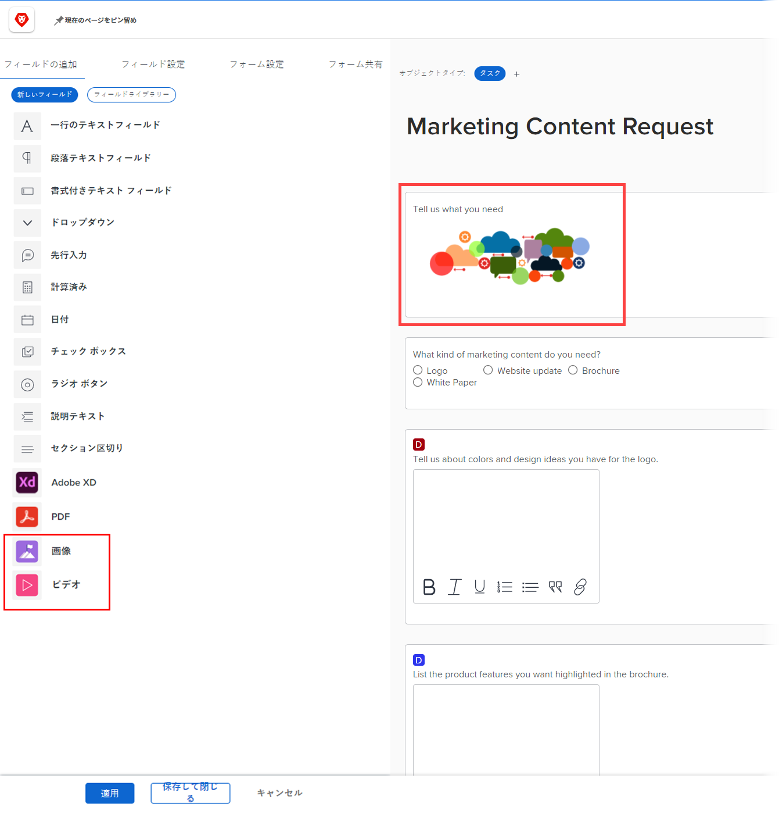
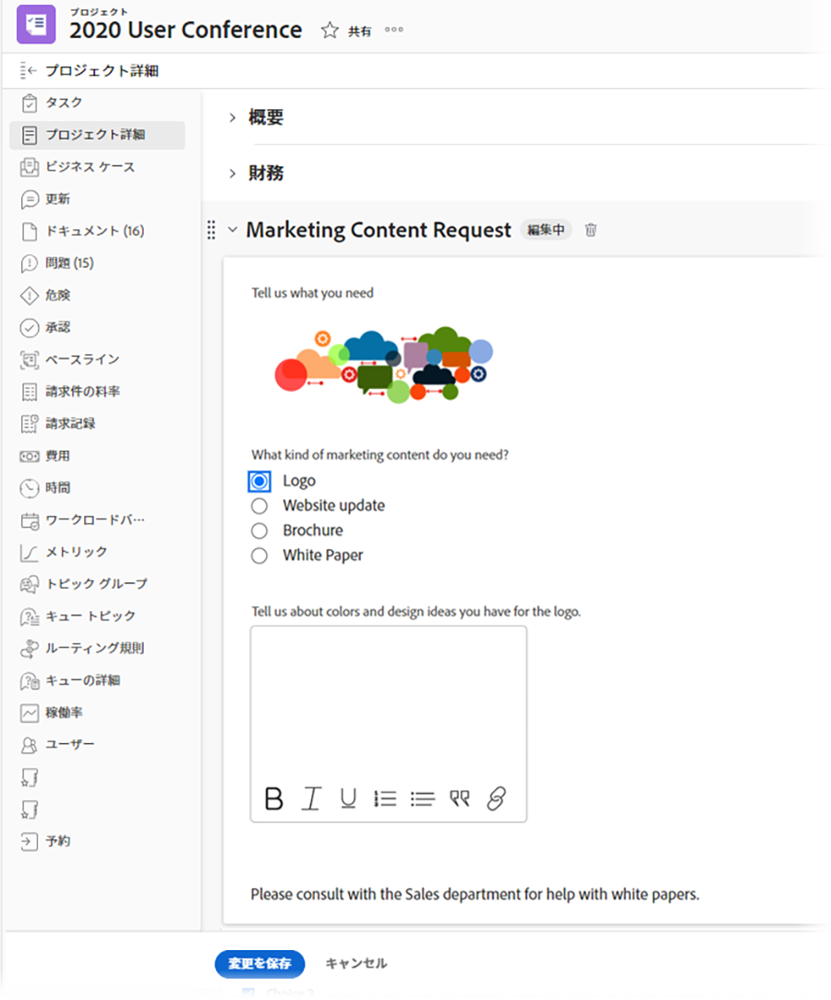
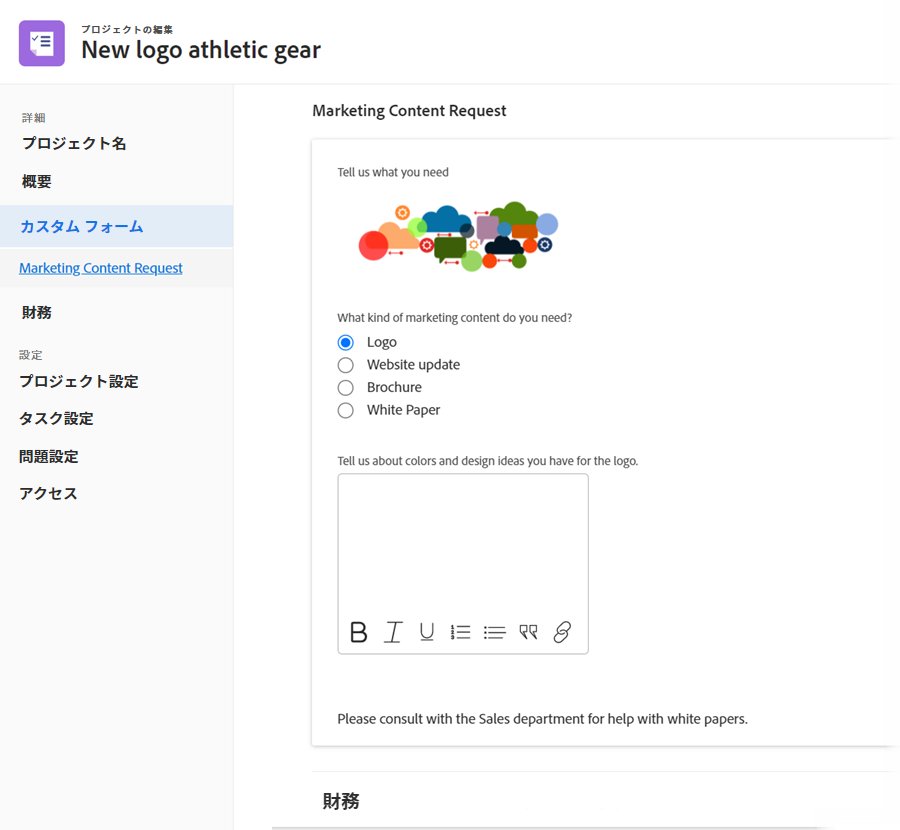
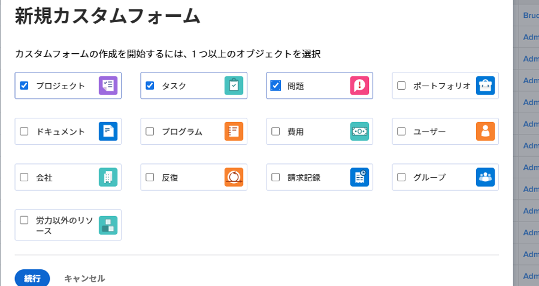
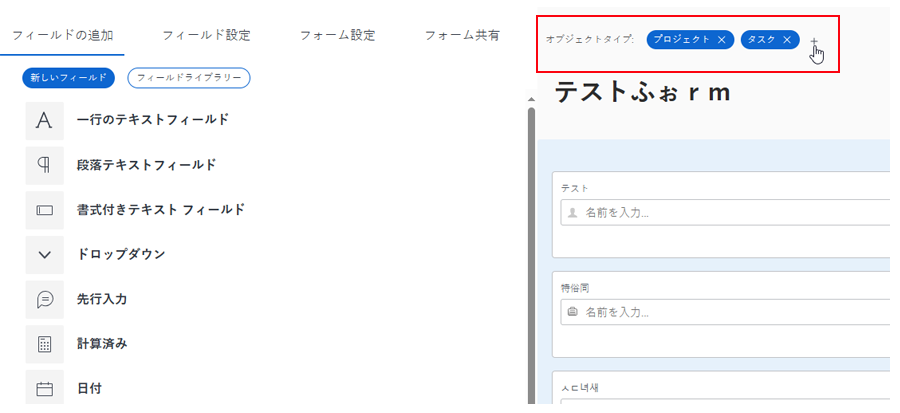
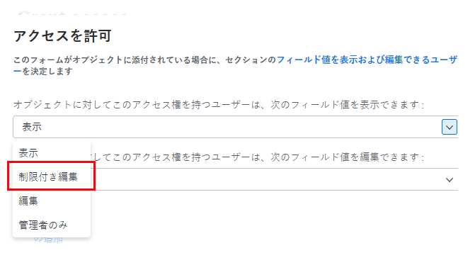
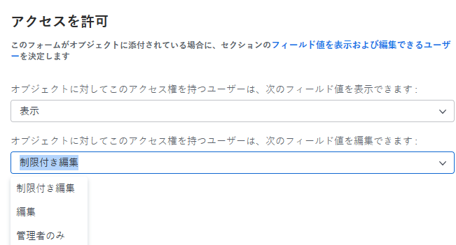

# カスタムフォームの機能強化

22.2 リリースで、カスタムフォームの管理に関する次の大幅な機能強化が行われました。

## アセットウィジェットを追加

カスタムフォームに画像を埋め込むことができます。これにより、さらにインタラクティブかつ視覚的な方法でカスタムフォームのユーザーとコミュニケーションを取ることが可能になります。追加のウィジェットタイプは近日中に提供されます。



ウィジェットを含むカスタムフォームがオブジェクトに添付されている場合、そのオブジェクトを操作するユーザーは、次の領域でそのウィジェットを確認できます。

* そのオブジェクトの「詳細」エリア（例えば、プロジェクトの場合は「プロジェクト詳細」エリア）

  

* 新しい Adobe Workfront エクスペリエンスのルックアンドフィールがある場合は、そのオブジェクトの編集ボックス（プロジェクトの編集ボックスやタスクの編集ボックスなど）。

  

現在、ユーザーは次のエリアでウィジェットを確認できません。

* リストとレポート
* ホームと概要
* 新しい Adobe Workfront エクスペリエンスのルックアンドフィール（「費用の編集」など）がない場合は、そのオブジェクトの「編集」ボックス。
* Workfront Mobile アプリ

カスタムフォームへのウィジェットの追加について詳しくは、[カスタムフォームでの画像や他のアセットウィジェットの追加と編集](/help/quicksilver/administration-and-setup/customize-workfront/create-manage-custom-forms/add-widget-or-edit-its-properties-in-a-custom-form.md)を参照してください。

## カスタムフォームの複数のオブジェクトタイプへの関連付け

複数のオブジェクトタイプをあらゆる新しいカスタムフォームに関連付けることができます。



または、既存のカスタムフォームにも関連付けられます。



これにより、プロジェクト、タスク、イシュー、およびカスタムフォームでサポートされるあらゆるタイプのオブジェクトで使用する、単一のカスタムフォームを作成できます。

イシューやタスクを変換する場合は、カスタムフォームとそのデータを変換後のオブジェクトに引き継ぐことができるので特に便利です。様々なオブジェクトタイプ用に同一のカスタムフォームの正確なコピーをいくつも作成して管理する必要がなくなり、カスタムフォームを手動でプロジェクトに追加する必要がなくなりました。

>[!INFO]
>
>**例：**
>
>誰かが内部 IT リクエスト（イシュー）を送信し、求めていることの詳細を添付のカスタムフォームで提供します。
>
>このイシューを、作業を行うユーザー向けのプロジェクトに変換します。
>
>送信者の詳細を含むカスタムフォームはイシューオブジェクトとプロジェクトオブジェクトの両方のタイプに関連付けられているので、変換時にカスタムフォームとその詳細のすべてがプロジェクトに引き継がれます。

>[!NOTE]
>
>変換処理が実行される場合、カスタムフォームは、変換先のオブジェクトタイプに既に関連付けられている必要があります。

カスタムフォームへのアセットウィジェットの追加について詳しくは、[カスタムフォームでの画像や他のアセットウィジェットの追加と編集](/help/quicksilver/administration-and-setup/customize-workfront/create-manage-custom-forms/add-widget-or-edit-its-properties-in-a-custom-form.md)を参照してください。

複数オブジェクトのカスタムフォームを作成または編集する際は、次の点に注意してください。

* [セクション区切りの権限オプション](#permission-options-for-section-breaks)
* [計算されたカスタムフィールドの互換性](#calculated-custom-field-compatibility)
* [カスタムフォームからオブジェクトタイプを削除する場合の注意事項](#caution-about-deleting-an-object-type-from-a-custom-form)

### セクション区切りの権限オプション

イシュー、タスク、プロジェクト、ユーザーの各オブジェクトタイプで使用できるセクション区切り権限オプションのセットには、それ以外のすべてのオブジェクトタイプで使用できる権限オプションのセットに加え、さらに「制限付き編集」という権限オプションが用意されています。



他のすべてのオブジェクトタイプ（ポートフォリオ、ドキュメント、プログラム、費用、会社、イテレーション、請求記録、グループ）で使用できるセクション区切り権限のセットには、制限付き編集は含まれません。



これらの両方のグループのオブジェクトタイプに関連付けられたカスタムフォームでは、すべてのオブジェクトタイプに対して機能する、共通のセクション区切り権限のセットが使用されます。特に、制限付き編集の権限オプションを使用する代わりに、この共通セットでは制限付き編集の権限オプションが編集の権限オプションに置き換えられます。編集オプションは、すべてのオブジェクトタイプと互換性があります。

カスタムフォームに既に存在する他のオブジェクトタイプとは異なる権限オプションを使用するオブジェクトタイプを関連付けると、メッセージが表示され、フォームで使用される共通の権限オプションのセットに切り替えることができます。この変更は、セクション区切りの下にない場合でも、すべてのフィールドに適用されます。

詳しくは、[カスタムフォームへのセクション区切りの追加](/help/quicksilver/administration-and-setup/customize-workfront/create-manage-custom-forms/add-a-section-break-to-a-custom-form.md)を参照してください。

### 計算されたカスタムフィールドの互換性

複数オブジェクトのカスタムフォームで、フォームのすべての関連付けられたオブジェクトタイプ（例えば、複数のオブジェクトタイプで使用可能な {name}、{description}、{entryDate}）に使用可能なフィールドを計算フィールドが参照する場合、データは、どのオブジェクトに添付しても正しく計算されます。

例えば、プロジェクトとイシューの複数オブジェクトフォームがあり、{name} 式を含む計算フィールドを追加した場合、プロジェクトにフォームを追加するとプロジェクト名が表示され、タスクにフォームを追加するとタスク名が表示されます。

ただし、フォーム内の計算フィールドが、フォームのオブジェクトタイプのすべてとは互換性がないフィールドを参照している場合は、調整を行うよう警告するメッセージが表示されます。

>[!INFO]
>
>**例：**&#x200B;タスクのオブジェクトタイプに関連付けられたカスタムフォームでは、ビルトインフィールドの「割り当て先：名前」を参照する計算カスタムフィールドを作成すると、フォームがタスクに添付されるたびに、プライマリ担当者の名前を表示できます。
>
>```
>Assigned To: Name{assignedTo}.{name}
>```
>
>その後で、カスタムフォームにプロジェクトのオブジェクトタイプを追加します。オブジェクトタイプ「プロジェクト」が計算カスタムフィールドと互換性がないことを示す警告メッセージが表示されます。これは、「割り当て先」フィールドがプロジェクトで使用できないためです。

この場合、以下のいずれかを行えます。

* カスタムフォームから、互換性のない 2 つの項目（オブジェクトタイプまたは参照先フィールド）のいずれかを削除します。
* 両方の項目を保持し、ワイルドカードフィルター変数 `$$OBJCODE` を IF 式の条件として使用して、「担当」フィールドの 2 つの異なるバージョンを作成します。これにより、フォームが添付されているオブジェクトのタイプに関係なく、フィールドが正常に機能します。

  前述の例では、プロジェクトには組み込みの「割り当て先 : 名前」フィールドはありませんが、組み込みの「所有者」フィールドがあります（誰かが手動で変更しない限り、プロジェクトの作成者の名前が自動的に入力されます）。したがって、カスタムの「担当」フィールドで、以下に示すように `$$OBJCODE` を使用して、カスタムフォームがプロジェクトに添付されている場合は「所有者」フィールドを参照でき、フォームがタスクに添付されている場合は「割り当て先 : 名前」フィールドを参照できます。

  ```
  IF($$OBJCODE="PROJ",{owner}.{name},{assignedTo}.{name})
  ```

>[!NOTE]
>
>  フィールド名の前にオブジェクトタイプを追加すると、そのオブジェクトの親オブジェクトが参照されるので、`{project}.{name}` はプロジェクトと共には使用できませんが、タスクと共に使用できます。

計算カスタムフィールドをカスタムフォームに追加する手順について詳しくは、[カスタムフォームへの計算データの追加](/help/quicksilver/administration-and-setup/customize-workfront/create-manage-custom-forms/add-calculated-data-to-custom-form.md)を参照してください。

次のような変数について詳しくは、 `$$OBJCODE`を参照してください。 [ワイルドカードフィルター変数の概要](/help/quicksilver/reports-and-dashboards/reports/reporting-elements/understand-wildcard-filter-variables.md).

### カスタムフォームからオブジェクトタイプを削除する場合の注意事項

カスタムフォーム上のオブジェクトタイプはいつでも削除できますが、削除する場合は注意が必要です。削除するタイプのオブジェクトにユーザーが既にカスタムフォームを添付しており、それにデータを追加している場合は、フォーム上のそのオブジェクトタイプを削除すると、そのデータは完全に削除されてしまいます。

また、そのカスタムフォームを使用しているユーザーに対して、削除されたことを警告する通知システムはありません。

詳しくは、[システムからのカスタムフィールドまたはウィジェットの削除](/help/quicksilver/administration-and-setup/customize-workfront/create-manage-custom-forms/delete-a-custom-field.md)を参照してください。
