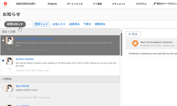
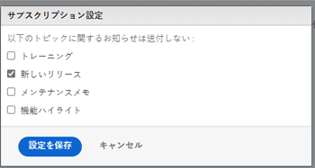

# アナウンスセンターのメッセージの配信停止

アナウンスセンターのメッセージは、Adobe WorkfrontからWorkfrontの顧客ベースに送信されるメッセージです。 次の種類のアナウンスセンターメッセージを配信停止にすることができます。

* これらのメジャーリリース以外で、機能ごとにリリースされる機能に関するお知らせ。

   Workfrontプラットフォームで導入されたほとんどの新機能は、毎年 4 つのメジャーリリースの 1 つと共にリリースされています。 ただし、一部の機能は、これらのメジャーリリース以外で、機能ごとにリリースされています。 メジャーリリース以外で機能がリリースされるたびに、アナウンスセンターからメッセージが届きます。 ( お知らせセンターの詳細については、 [お知らせの送信](../../administration-and-setup/get-started-wf-administration/view-send-announcements.md).)

* 今後のトレーニングのお知らせとイベント。

Announcement Center のメッセージの受信を停止するには：

1. 番号付きアイコンをクリックします。  をクリックして、Workfrontの右上隅に通知のリストを開きます。
1. クリック **すべてのお知らせ** をクリックします。

   この **お知らせ** ページが表示され、お知らせの一覧が表示されます。

   

1. クリック **設定** お知らせページの右上隅で、「 **新しいリリース** または **トレーニング**（今後受信しないお知らせのタイプに応じて）

   

1. クリック **設定を保存**.

   このタイプのお知らせに関する Announcement Center のメッセージは今後受け取られなくなります。
