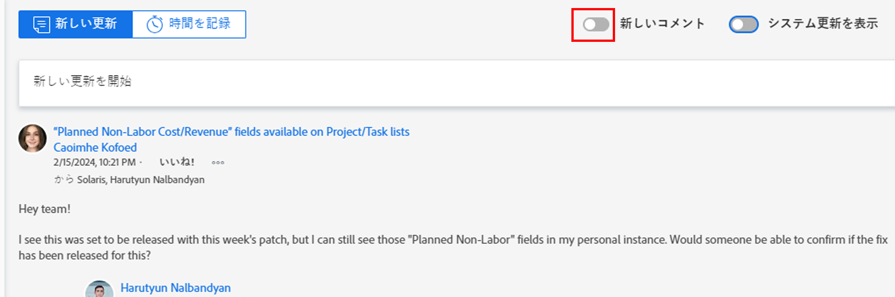

# 新しいコメントエクスペリエンス

このページで強調表示されている情報は、まだ一般に利用できない機能を示しています。 この機能は、すべての顧客のプレビュー環境でのみ使用できます。  

現在のリリーススケジュールについて詳しくは、 [2024 年第 1 四半期リリースの概要](../../product-releases/24-q1-release-activity/24-q1-release-overview.md).

<!--

After the monthly releases to Production, the same features are also available in the Production environment for customers who enabled fast releases.

For information about fast releases, see [Enable or disable fast releases for your organization](../../../administration-and-setup/set-up-workfront/configure-system-defaults/enable-fast-release-process.md)  -->

>[!IMPORTANT]
>
>この記事の情報は、新しいコメント作成機能にリリースされた機能を指します。
>
>新しいコメンティングエクスペリエンスのベータプログラムは 2023 年 4 月に開始され、2023 年 10 月に終了しました。 新しいコメント作成エクスペリエンスのベータ版プログラムは、2023 年 10 月のリリースで終了しました。
>
>2023 年 10 月から、新しいコメント作成機能の新機能がすべてのお客様にリリースされます。 詳しくは、各リリースの現在のリリースの概要ページを参照してください。

<!--An update to the commenting experience in Adobe Workfront is currently in development. This update includes a new interface, new features, and improved performance in the Updates section of select objects. 

The new commenting experience will slowly become available for all the objects with an Updates section in Workfront, and later it will expand to other Adobe Experience Cloud applications.-->

<!--For additional resources for the new commenting experience, also see the following articles:

* [New commenting experience release activity](../new-commenting-experience-beta/new-commenting-beta-experience-release-activity.md)
* [New commenting experience FAQs](../../betas/new-commenting-experience-beta/new-commenting-faq.md)
-->

## 機能

新しいコメントエクスペリエンスには、Adobe Workfrontオブジェクトの「更新」セクションの改善と変更が含まれています。

新しいコメント作成機能に含まれる改善点の一つは次のとおりです。

* パフォーマンスとユーザーエクスペリエンスの向上
* システムアクティビティの更新からのユーザーコメントの分離
* オブジェクトに新しいコメントが追加されたときのリアルタイムインジケーター
* 送信後のコメントの編集

次の機能が新しいエクスペリエンスから削除されました。

* システム更新に対するコメント
* コメント中にステータス、条件、コミット日を編集可能
* カスタムフォームを編集
* Workfrontまたはグループ管理者が別のユーザーとしてログインし、自分に代わってコメントを追加したときの「&lt; ユーザー名 > の代理」情報が最初に削除されました。 2023 年 10 月 19 日に復帰しました。
* ドキュメントにコメントを追加する際に担当者にタグを付ける際に「承認を求める」オプション。

<!--removed this note on November 28, 2023, when this limitation was removed: 

>[!NOTE]
>
>The objects listed below have only the comments and system updates starting with January 1, 2019 available in the new commenting experience.  
>
>You can view comments and system updates on these objects prior to January 1, 2019 when viewing the Updates section in the current experience:
>
>* Issues
>* Projects
>* Tasks
>* Documents

For more information, see the [New commenting experience FAQs](../../betas/new-commenting-experience-beta/new-commenting-faq.md). 
-->

次の表に、新しいコメントエクスペリエンスで使用できる機能と、それらがサポートされる領域でのその使用可能性を示します。

<table>
  <tr>
   <td><strong>機能 </strong>
   </td>
   <td><strong>以前のコメントエクスペリエンスに存在します </strong>
   </td>
   <td><strong>新しいコメントエクスペリエンスに存在します </strong>
   </td>
   <td><strong>新しいコメントエクスペリエンスで導入されます </strong>
   </td>
   <td><strong>新しいコメントエクスペリエンスで導入されるタイミング </strong>
   </td>
   <td><strong>調査中 </strong>
   </td>
  </tr>
  <tr>
   <td>コメントの作成/読み取り/返信/削除 
   </td>
   <td>✓ 
  </td>
   <td>✓ 
   </td>
   <td> 
   </td>
   <td> 
   </td>
   <td> 
   </td>
  </tr>
  <tr>
   <td>リッチテキスト（引用符と絵文字を除く）
   </td>
   <td>✓ 
   </td>
   <td>✓
   </td>
   <td> 
   </td>
   <td> 
   </td>
   <td> 
   </td>
  </tr>

<tr>
   <td>リッチテキスト（絵文字）
   </td>
   <td>✓ 
   </td>
   <td>✓
   </td>
   <td> 
   </td>
   <td> 
   </td>
   <td> 
   </td>
  </tr>

<tr>
   <td>リッチテキスト（ブロック引用符）
   </td>
   <td>✓ 
   </td>
   <td> ✓
   </td>
   <td> 
   </td>
   <td> 2023 年第 2 四半期
   </td>
   <td> 
   </td>
  </tr>
  <tr>
<tr>
   <td> 見積もりコメント
   </td>
   <td>✓ 
   </td>
   <td> ✓
   </td>
   <td> 
   </td>
   <td> 2023 年第 2 四半期
   </td>
   <td> 
   </td>
  </tr>
  <tr>
   <td>コメントに反応（「いいね！」） 
   </td>
   <td>✓ 
   </td>
   <td>✓ 
   </td>
   <td> 
   </td>
   <td> 
   </td>
   <td> 
   </td>
  </tr>
  <tr>
   <td>コメントに画像を添付 
   </td>
   <td>✓ 
   </td>
   <td>✓ 
   </td>
   <td> 
   </td>
   <td> 
   </td>
   <td> 
   </td>
  </tr>
  <tr>
   <td>コメント内の担当者のタグ付け 
   </td>
   <td>✓ 
   </td>
   <td>✓ 
   </td>
   <td> 
   </td>
   <td> 
   </td>
   <td> 
   </td>
  </tr>
  <tr>
   <td>スレッド参加者を削除
   </td>
   <td> 
   </td>
   <td>✓
   </td>
   <td> 
   </td>
   <td> 
   </td>
   <td> 
   </td>
  </tr>

<tr>
   <td>すべてのねじ参加者に自動的にタグを付ける
   </td>
   <td> 
   </td>
   <td>✓
   </td>
   <td> 
   </td>
   <td> 
   </td>
   <td> 
   </td>
  </tr>

<tr>
   <td>会社の非公開のコメント 
   </td>
   <td>✓ 
   </td>
   <td>✓ 
   </td>
   <td> 
   </td>
   <td> 
   </td>
   <td> 
   </td>
  </tr>
  <tr>
   <td>コメントの投稿を取り消します 
   </td>
   <td>✓ 
   </td>
   <td>編集コメントに置き換え 
   </td>
   <td> 
   </td>
   <td> 
   </td>
   <td> 
   </td>
  </tr>
  <tr>
   <td>システムの更新をオフにする 
   </td>
   <td>✓ 
   </td>
   <td>「アクティビティ」タブに置き換えられました 
   </td>
   <td> 
   </td>
   <td> 
   </td>
   <td> 
   </td>
  </tr>
  <tr>
   <td>コメントを編集 
   </td>
   <td> 
   </td>
   <td> ✓
   </td>
   <td> 
   </td>
   <td> 
   </td>
   <td> 
   </td>
  </tr>
  <tr>
   <td>ページから移動する際のコメントのドラフトの保存 
   </td>
   <td>✓ 
   </td>
   <td>✓ 
   </td>
   <td> 
   </td>
   <td> 
   </td>
   <td> 
   </td>
  </tr>
  <tr>
   <td>新しいコメントをリアルタイムで表示（コメントが削除された際の表示を含む）
   </td>
   <td> 
   </td>
   <td>✓
   </td>
   <td> 
   </td>
   <td> 
   </td>
   <td> 
   </td>
  </tr>
  <tr>
   <td>時間のログ記録 
   </td>
   <td>✓ 
   </td>
   <td>✓
   </td>
   <td> 
   </td>
   <td> 
   </td>
   <td> 
   </td>
  </tr>
    <tr>
   <td>スレッド リンクをコピー 
   </td>
   <td>✓ 
   </td>
   <td> コピーリンクで置き換え
   </td>
   <td> 
   </td>
   <td>2023 年第 2 四半期 
   </td>
   <td> 
   </td>
  </tr>
  <tr>
   <td>コメントリンクをコピー 
   </td>
   <td>✓ 
   </td>
   <td> コピーリンクで置き換え
   </td>
   <td> 
   </td>
   <td> 
   </td>
   <td> 
   </td>
  </tr>
  <tr>
   <td>コメントテキストを引用 
   </td>
   <td>✓ 
   </td>
   <td>✓
   </td>
   <td> 
   </td>
   <td>2023 年第 2 四半期 
   </td>
   <td> 
   </td>
  </tr>
  <tr>
   <td>本文をコピー 
   </td>
   <td>✓ 
   </td>
   <td> ✓
   </td>
   <td> 
   </td>
   <td>
   </td>
   <td> 
   </td>
  </tr>
    <tr>
   <td>コメント内の検索 
   </td>
   <td> 
   </td>
   <td> ✓
   </td>
   <td> 
   </td>
   <td>2024 年第 1 四半期 
   </td>
   <td> 
   </td>
  </tr>

<tr>
   <td>コメント内の画像をコピーして貼り付ける
   </td>
   <td> 
   </td>
   <td> ✓
   </td>
   <td> 
   </td>
   <td>2024 年第 1 四半期 
   </td>
   <td> 
   </td>
  </tr>

<tr>
   <td>コメント内の画像をドラッグ&amp;ドロップ
   </td>
   <td> ✓
   </td>
   <td> ✓
   </td>
   <td> 
   </td>
   <td>2024 年第 1 四半期 
   </td>
   <td> 
   </td>
  </tr>

<tr>
   <td>カスタムフォームを編集 
   </td>
   <td>✓ 
   </td>
   <td> 
   </td>
   <td> 
   </td>
   <td> 
   </td>
   <td> 
   </td>
  </tr>
  <tr>
   <td>コメント中にステータス、条件、コミット日を編集可能 
   </td>
   <td>✓ 
   </td>
   <td> 
   </td>
   <td> 
   </td>
   <td> 
   </td>
   <td>
   </td>
  </tr>
<tr>
   <td>システム更新に返信 
   </td>
   <td> ✓
   </td>
   <td> 
   </td>
   <td> 
   </td>
   <td>
   </td>
   <td> 
   </td>
  </tr>
<tr>
   <td>別のユーザーとしてログインしたコメントを追加する際に「代理」として表示する
   </td>
   <td> ✓
   </td>
   <td> ✓
   </td>
   <td> 
   </td>
   <td>
   </td>
   <td> 
   </td>
  </tr>
</table>

## リリースタイムライン

新しいコメント作成機能にリリースされた機能について詳しくは、 [新しいコメントベータ版エクスペリエンスリリースアクティビティ](../../betas/new-commenting-experience-beta/new-commenting-beta-experience-release-activity.md).

Workfrontオブジェクトの更新管理について詳しくは、 [作業を更新](../../../workfront-basics/updating-work-items-and-viewing-updates/update-work.md).

次に、実稼動環境への新しいコメント作成エクスペリエンスのリリースに関する主要なマイルストーンを示す、計画されたタイムラインを示します。 以下のマイルストーンに加えて、より小さな機能強化でコメント作成のエクスペリエンスも引き続き向上します。

ベータ版が終了した後に新しいコメント作成機能としてリリースされた機能について詳しくは、現在のリリースの概要ページを参照してください。

次に、新しいコメント作成エクスペリエンスのリリースに向けた計画的なタイムラインを示します。

* 23.2 リリース（2023 年 4 月 7 日）:
   * 問題については、Commenting Experience Beta を起動してください。
   * 目標に向けて新しいコメントエクスペリエンスをリリース（唯一のエクスペリエンスとして）
* 23.3 リリース（2023 年 7 月 21 日）:
   * プロジェクト、タスク、ドキュメントの Commenting Experience Beta を起動します。
   * （唯一のエクスペリエンスとして）ボード領域のカード用の新しいコメントエクスペリエンスをリリースします。
* 2023 年第 4 四半期リリース（限定リリース。高速リリースを選択したお客様のみが利用できます）:
   * テンプレート、テンプレートタスク、プログラム、ポートフォリオ、チーム、ユーザー、タイムシートに関する新しいコメント作成機能をリリースします（唯一のエクスペリエンスとして）。
   * プロジェクト、タスク、問題、ドキュメントに関するコメント作成エクスペリエンスベータ版を更新し、デフォルトのオプションにします。 「Beta」ラベルが削除されました。
* 2023 年第 4 四半期 (23.10) リリース（2023 年 10 月 27 日）
   * テンプレート、テンプレートタスク、プログラム、ポートフォリオ、チーム、ユーザー、タイムシートに関する新しいコメント作成機能を、すべての顧客に（唯一のエクスペリエンスとして）リリースします。
   * プロジェクト、タスク、イシュー、ドキュメントに対する新しいコメント作成機能をデフォルトのオプションにします。

  >[!IMPORTANT]
  >
  >    これにより、新しいコメント作成エクスペリエンスのベータ段階が終了します。

   * 新しいコメントエクスペリエンス用にリリースされたすべての機能は、現在の通常の月次および四半期リリースのこの日付の部分から始まります。
* 2023 年末：
   * プロジェクト、タスク、問題、ドキュメントの各オブジェクトのセカンダリオプションとして、従来のコメントエクスペリエンスを保持します。 新しいコメントエクスペリエンスは、これらのオブジェクトのすべてのユーザーのデフォルトオプションです。
   * 新しいコメントエクスペリエンスを他のすべてのオブジェクトの唯一のエクスペリエンスにします。

  >[!NOTE]
  >
  >    繰り返し処理では、従来のコメント操作が引き続きおこなわれます。 新しいコメントエクスペリエンスは、繰り返しでは使用できません。

* 2024 年第 2 四半期（2024 年 4 月）:

   * 「繰り返し」を除き、旧式のコメントストリームに切り替え、新しいコメントストリームをすべてのオブジェクトで唯一のエクスペリエンスにします。

## 新しいコメントエクスペリエンスを見つける

&lt;! — 重要：従来のエクスペリエンスを削除したら、このバージョンを「更新」作業記事または「更新」セクションの概要に移動します。繰り返し以外は、エクスペリエンスがすべて異なると言います —>

現在、すべてのお客様およびすべての環境で、新しいコメント作成機能を利用できます。

どのオブジェクトに対してコメント作成機能にアクセスするかに応じて、「更新」セクションに次の機能が表示されます。

* 次のオブジェクトの新しいコメントエクスペリエンスと従来のコメントエクスペリエンスの両方：

   * プロジェクト
   * タスク（ストーリーを含む）
   * 問題
   * ドキュメント

  >[!TIP]
  >
  >この節で説明するように、新しいコメントエクスペリエンス（有効にした場合）または従来のコメントエクスペリエンス（無効にした場合）を表示するには、「新しいコメント」オプションを使用します。 新しいコメントエクスペリエンスがデフォルトです。

   * 以下に示すオブジェクトの新しいコメントエクスペリエンスのみ。 これらのオブジェクトに対して従来のコメント作成機能を有効にするオプションはありません。

      * 目標

     >[!NOTE]
     >
     >Workfrontのこの領域にアクセスするには、Adobe Workfront Goals に対する追加のライセンスが必要です。 詳しくは、 [Workfront目標の使用要件](../../../workfront-goals/goal-management/access-needed-for-wf-goals.md).
      * ボード上のカード
      * チーム
      * テンプレート
      * テンプレート タスク
      * タイムシート
      * プログラム
      * ポートフォリオ
      * ユーザー

* 次のオブジェクトに対する従来のコメントエクスペリエンスのみ：

   * イテレーション

     繰り返しの新しいコメントエクスペリエンスを有効にするオプションはありません。 繰り返しに使用できるのは、従来のコメントエクスペリエンスのみです。

<!--before August 17: 

The new commenting experience is currently supported for the following objects:

* When enabling the Beta experience in the Updates section for 

    * Issues, projects, tasks, and documents

    For more information about managing updates for Workfront objects, see [Update work](../../../workfront-basics/updating-work-items-and-viewing-updates/update-work.md). 

* By default, as the only commenting experience for

    * Goals, cards on a board

    >[!NOTE]
    >
    >You must have an additional license to Adobe Workfront Goals to be able to access this area of Workfront. For more information, see [Requirements to use Workfront Goals](../../../workfront-goals/goal-management/access-needed-for-wf-goals.md).

-->

<!--Depending on the environment you access the commenting experience you can do one of the following: 

* Enable the commenting experience Beta in the Production environment
* Enable the legacy commenting experience in the Preview  environment 
-->

プロジェクト、タスク、問題およびドキュメントに対して Commenting Experience オプションを有効にするには：

1. 新しいコメントエクスペリエンスを有効にするオブジェクトに移動し、「 **更新** をクリックします。
1. （条件付き）無効になっている場合、 **新しいコメント** 」オプションを使用して、この機能を有効にします。 これは、デフォルトで有効になっている必要があります。

   

1. 更新の入力を開始するには、 **コメント** タブをクリックします。 「コメント」タブは、新しいエクスペリエンスを開いたときのデフォルトのタブです

   または

   次をクリック：  **システムアクティビティ** 」タブに移動して、Workfrontが生成したアクティビティの更新を表示します。

1. （オプション）新しいコメントエクスペリエンスを無効にして従来のコメントに戻るには、「 **新しいコメント** オプション。

