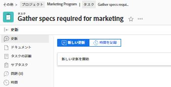

# 21.2 その他の機能強化

このページでは、プレビュー環境の 21.2 リリースでおこなわれたその他すべての機能強化について説明します。 これらの機能強化は、2021 年 5 月 10 日の週に実稼動環境で利用可能になる予定です。 21.2 リリースで使用可能なすべての変更点の一覧については、 [21.2 リリースの概要](../../../product-announcements/product-releases/21.2-release-activity/21-2-release-overview.md).

## 我々は今正式にAdobe Workfront

WorkfrontがAdobe Workfrontに商標変更されました。

Adobe Workfrontアプリケーションおよびお客様向け Web サイトで最も重要な領域が更新されました。 その他の領域は近日中に更新されます。

**更新された領域**

* ログイン画面、上部ナビゲーション、校正
* レイアウトテンプレート UI、メインメニュー、カスタムForms書き出し ( 新しいAdobe Workfrontエクスペリエンスでのみ使用可能 )
* Workfrontモバイルアプリ (iOSおよび Android)

近日中に地域が更新されます

* デスクトップおよびモバイル用アプリの校正
* PDFのリストおよびレポートのエクスポート
* ブラウザータブのお気に入りアイコン

**後で更新する領域**

* メール通知

## E メール許可リストの検証

>[!NOTE]
>
>新しいAdobe Workfrontエクスペリエンスでのみ使用できます。

E メールアドレスを使用する場合許可リスト、新規および更新されたユーザー E メールアドレスは、に対して検証さ許可リストれます。 新しいユーザーを追加したり、既存のユーザーを編集したりする際に、上にない E メールドメインを入力する許可リストと、E メールメッセージがユーザーに送信されないことを示すメッセージが表示されます。 ユーザープロファイルは保存できますが、ユーザーが E メールを受信するにはドメ許可リストインをドメインに追加する必要があります。

詳しくは、 [ユーザーのプロファイルの編集](../../../administration-and-setup/add-users/create-and-manage-users/edit-a-users-profile.md).

## オブジェクトヘッダーの新しいルックアンドフィール

>[!NOTE]
>
>この機能は、2020 年 3 月 10 日に実稼動環境にリリースされました。
>
>この機能は、新しいAdobe Workfrontエクスペリエンスでのみ使用できます。

情報の階層をさらに強化し、ユーザーがどのページにあるかをより明確に理解できるように、各オブジェクトヘッダーには次の機能が追加されました。

* 各オブジェクトタイプのカラフルで最新のアイコン
* オブジェクトの名前の上にリストされるオブジェクトタイプ
* 更新されたフォントスタイルとテキストサイズ
* その他の小規模なスタイルの変更

以前は、アイコンはなく、オブジェクトタイトルの右側にオブジェクト名のバッジが表示されていました。

新しいWorkfrontエクスペリエンス（拡張分析、リソース管理など）の領域のページヘッダーも、このルックアンドフィールが更新されました。

新しいWorkfrontエクスペリエンスの新しいオブジェクトヘッダーについて詳しくは、 [新しいオブジェクトヘッダー](../../../workfront-basics/the-new-workfront-experience/new-object-headers.md).

## オブジェクトステータスの検索応答の更新

Workfrontでは、オブジェクトのステータスが新しい方法で保存されるようになりました。

これらの変更は、ステータス検索リクエストの実行方法には影響しません。 ただし、オブジェクトのステータス検索を含む API リクエストでは、不完全なグループステータスのリストが返されます。

詳しくは、 [コア API の変更点は次のとおりです。ステータス検索の応答](../../../wf-api/api/api-changes-search.md) .

## ID で終わるすべてのフィールドが含まれるように更新されたイベント購読ペイロード

すべてのイベント購読ペイロードに、「ID」で終わるすべてのフィールドが含まれるようになりました。

各オブジェクトには、ID で終わる一意の関連フィールドのセットが含まれる、独自の関連フィールドのセットが存在することに注意する必要があります。 つまり、各ペイロードには、ID で終わる、そのオブジェクトに関連するすべてのフィールドが含まれますが、各オブジェクトには、ID で終わる異なるフィールドセットがあります。

## ブループリントベータ版をプレビューで利用できるようになりました

>[!NOTE]
>
>この機能は、今年後半の 21.3 リリースまで、実稼動環境では一般に使用できなくなります。 新しいAdobe Workfrontエクスペリエンスでのみ使用できます。

ブループリントは、成長する作業管理システムの作成に役立つ基本的な構成要素を提供します。 システム管理者は、ブループリントカタログを参照して、すぐに使用できるプロジェクトテンプレートをインストールできます。

詳しくは、 [ブループリント](../../../administration-and-setup/blueprints/blueprints.md).
