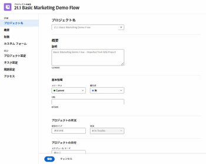

# 21.2 プロジェクトの機能強化

このページでは、21.2 リリースでプレビュー環境に対して行われた、プロジェクトのすべての機能強化について説明します。これらの機能強化は、2021年5月10日（PT）の週に実稼動環境で利用可能になる予定です。21.2 リリースで使用可能なすべての変更点の一覧については、[21.2 リリースの概要](../../../product-announcements/product-releases/21.2-release-activity/21-2-release-overview.md)を参照してください。

## 繰り返しタスクを作成および編集するための新しいインターフェイス

>[!NOTE]
>
>新しい Adobe Workfront エクスペリエンスでのみ使用できます。

「新規」ボックスと「タスクの編集」ボックスのデザイン変更の一環として、新規タスクを繰り返しタスクにする機能と、繰り返しタスクの親を編集する機能を追加しました。この機能は、以前にリリースした「新規」ボックスおよび「タスクの編集」ボックスのデザイン変更には含まれていませんでした。

詳しくは、[繰り返しタスクの作成](../../../manage-work/tasks/create-tasks/create-recurring-tasks.md)を参照してください。

この機能は、Workfront One の学習パス[新しい Workfront エクスペリエンスにおける計画担当者の基礎、パート 2：プロジェクトの計画](https://one.workfront.com/s/learningpath3/planner-fundamentals-for-the-new-workfront-experience-part-2-plan-a-project-MCDUWIMXC3JRAAFGHX7QYIN2BVDI)に含まれるようになりました。

## プロジェクトヘッダーで使用できる新しいボタン

>[!NOTE]
>
>この機能は、プレビューではまだ使用できません。プレビュー環境へのリリースは、2021年4月29日（PT）に予定されています。

プロジェクトページのプロジェクトのリストをすばやくフィルターできるように、ヘッダーに 2 つの新しいボタンが追加され、担当プロジェクトフィルターまたは所有プロジェクトフィルターをすばやく適用できます。

この機能は、Workfront One の学習パス[新しい Workfront エクスペリエンスにおける計画担当者の基礎、パート 1：プロジェクトの作成](https://one.workfront.com/s/learningpath5/planner-fundamentals-for-the-new-workfront-experience-MCTOONVRZDLRD3FAIX6SQYSUAHDE)に含まれるようになりました。

## スクラムボードからストーリーやイシューを移動または削除

>[!NOTE]
>
>新しい Adobe Workfront エクスペリエンスでのみ使用できます。

ストーリーまたはイシューカードのその他アイコンをクリックし、「指定の場所に移動」を選択して、スクラムボードからストーリーまたはイシューを移動できるようになりました。以降のイテレーションが定義されている場合は、項目を別のイテレーションに移動できます。また、項目をチームのバックログに移動することもできます。

また、カードのその他アイコンをクリックし、「削除」を選択して、ストーリーやイシューをスクラムボードから直接削除することもできます。ストーリーやイシューを削除すると、30 日間ごみ箱に移動され、システム管理者のみが復元できます。

詳しくは、[スクラムボードでストーリーとイシューを管理](../../../agile/use-scrum-in-an-agile-team/scrum-board/manage-scrum-board.md)を参照してください。

## 新しい「イシューを編集」ボックス

>[!NOTE]
>
>新しい Adobe Workfront エクスペリエンスでのみ使用できます。

新しい Workfront エクスペリエンスのルックアンドフィール更新の一環として、「イシューを編集」ボックスのデザインを変更しました。個々のイシューからまたはリストから個々のイシューを編集する際に、新しい「イシューを編集」ボックスにアクセスできます。

ルックアンドフィールの更新に加えて、「イシュータスク」ボックスでは次の変更も利用できます。

* レイアウトテンプレートを一度カスタマイズすると、それらのカスタマイズ内容が詳細ページと「イシューを編集」ボックスの両方に反映されます。
* 個々のカスタムフォーム名が「イシューを編集」ボックス内の左側のパネルで使用できるようになり、そこから各フォームにすばやくアクセスできます。
* リソースがイシューの解決に要する時間を簡単に更新できるように、「割り当て」セクションに「予定時間」フィールドを追加しました。
* 「更新」セクションとの冗長性をなくすために、「イシューを編集」画面からコメント機能を削除しました。

## 「編集」ボックスと「新規オブジェクト」ボックスの「保存」ボタンと「キャンセル」ボタンの位置を変更しました。

>[!NOTE]
>
>新しい Adobe Workfront エクスペリエンスでのみ使用できます。

ユーザーのフィードバックに基づいて、「保存」ボタンと「キャンセル」ボタンを、プロジェクトとタスクの「オブジェクトを編集」ボックスと「新しいオブジェクト」ボックスの左下隅に移動しました。

この機能強化の前は、これらのボタンはこれらのボックスの右上隅に配置されていました。

プロジェクトやタスクの編集について詳しくは、次の記事を参照してください。

* [プロジェクトの編集](../../../manage-work/projects/manage-projects/edit-projects.md)
* [タスクの編集](../../../manage-work/tasks/manage-tasks/edit-tasks.md)

## カスタムフォームの機能強化

>[!NOTE]
>
>この機能は、新しい Adobe Workfront エクスペリエンスでのみ使用できます。

カスタムフォームの入力時の操作性を向上させるために、長いカスタムフィールドラベルの表示方法を改善しました。全体を表示するのに十分な水平方向のスペースがある場合、これらのラベルは切り詰められなくなります。

カスタムフォームへの入力について詳しくは、[カスタムフォームフィールドでの情報の編集](../../../workfront-basics/work-with-custom-forms/edit-custom-forms.md)を参照してください。

## イシューのプライマリ連絡先がプロジェクトの詳細エリアに表示されるようになりました

>[!NOTE]
>
>この機能は、2020年3月10日（PT）に実稼動環境にリリースされました。

イシューをプロジェクトに変換すると、そのイシューのリクエスターがプロジェクトに転送され、変換済みイシューの発信元フィールドに表示されます。このフィールドは、プロジェクトの詳細エリア、およびプロジェクトのレポートとリストで表示できます。この情報は、レポートおよびリストでのみ、タスクに対しても表示されます。

プロジェクトの新しい Adobe Workfront エクスペリエンスでこのフィールドを表示するには、レイアウトテンプレートでこのフィールドを有効にする必要があります。

イシューの変換について詳しくは、[Adobe Workfront でのイシューの変換の概要](../../../manage-work/issues/convert-issues/convert-issues.md)を参照してください。

## ポートフォリオ、プログラムまたはチームに割り当てるグループに関する情報を表示

>[!NOTE]
>
>この機能は、新しい Adobe Workfront エクスペリエンスでのみ使用できます。

グループをポートフォリオ、プログラム、またはチームに割り当てるときに、適切なグループがあることをより簡単に確認できるようになりました。グループ名の横にある「情報」アイコンをクリックすると、その上位のグループの階層とそのグループの管理者を含むツールチップが表示されます。グループに設定された詳細に応じて、グループのビジネスリーダーと説明も表示されます。

これは、最近リリースされたものと同じ機能で、[プロジェクトの編集](../../../manage-work/projects/manage-projects/edit-projects.md)で説明されているように、プロジェクトに割り当てる必要のあるグループを特定するのに役立ちます。

詳しくは、次の記事を参照してください。

* [ポートフォリオの作成](../../../manage-work/portfolios/create-and-manage-portfolios/create-portfolios.md)
* [プログラムの作成](../../../manage-work/portfolios/create-and-manage-programs/create-program.md)
* [チームの作成](../../../people-teams-and-groups/create-and-manage-teams/create-a-team.md)

## カスタムフィールドのテキスト書式が、すべての Workfront Classic リストとレポートに表示されるようになりました

>[!NOTE]
>
>この機能は、Adobe Workfront Classic でのみ使用できます。

ユーザーがリストやレポートを表示する際に、カスタムフィールド内に太字、箇条書き、ハイパーリンクなどのテキスト書式を表示できるようになりました。

Workfront Classic で以前は、テキストの書式設定はプロジェクト、タスク、時間数の各リストにのみ表示されていました。

カスタムフィールドでのテキストの書式設定について詳しくは、[カスタムフォームの作成](https://one.workfront.com/s/document-item?bundleId=workfront-classic&amp;topicId=Content%2FAdministration_and_Setup%2FCustomize_Workfront%2FCreate_manage_Custom_Forms%2Fcreate-a-custom-form.html)を参照してください。

リストでの情報の表示について詳しくは、[リストの概要](https://one.workfront.com/s/document-item?bundleId=workfront-classic&amp;topicId=Content%2FWorkfront_basics%2FNavigate_Workfront%2FWorkfront_Navigation%2Fview-items-in-a-list.html&amp;_LANG=en)を参照してください。

## 新しい「タスクを編集」ボックス

>[!NOTE]
>
>新しい Adobe Workfront エクスペリエンスでのみ使用できます。

新しいバージョンの Workfront のルックアンドフィールをアップデートする際に、イシューを編集ボックスのデザインを変更しました。個々のタスクから、またはリストから 1 つのタスクを編集する際に、新しい「タスクを編集」ボックスにアクセスできます。

>[!NOTE]
>
>このアップデートの一環として、リソース範囲フィールドが、新しい Adobe Workfront エクスペリエンスから削除される予定です。

アップデートされたルックアンドフィールに加えて、「タスクを編集」ボックスでは以下の変更も利用できます。

* 一度レイアウトテンプレートをカスタマイズすると、そのカスタマイズの内容が詳細ページおよび「テンプレートを編集」ボックスの両方に反映されます。
* 「タスクを編集」ボックス内の左側のパネルで個々のカスタムフォーム名を使用できるようになり、そこからそれぞれのフォームに素早くアクセスできます。
* 様々な期間タイプにわたる割り当てと、タスクに費やした時間または期間をアップデートする際に一貫性が保てるように、割り当てセクションに期間フィールド、期間タイプフィールド、計画時間フィールドを追加しました。
* アップデートセクションとの冗長性をなくすために、コメント機能を編集タスク画面から削除しました。

新しい「タスクの編集」ボックスの詳細については、[タスクの編集](../../../manage-work/tasks/manage-tasks/edit-tasks.md)を参照してください。

## 新しい「タスク」ボックス

>[!NOTE]
>
>新しい Adobe Workfront エクスペリエンスでのみ使用できます。

新しいバージョンの Workfront のルックアンドフィールをアップデートする際に、新しいタスクボックスのデザインを変更しました。プロジェクトにタスクを追加する場合は、タスクリストの上部にある「新規タスク」をクリックして、「新規タスク」ボックスにアクセスできます。

>[!NOTE]
>
>このアップデートの一環として、リソース範囲フィールドが、新しい Adobe Workfront エクスペリエンスから削除される予定です。

新しいタスクワークフローでは、ルックアンドフィールのアップデートに加えて、以下の変更も使用できます。

* プロジェクトリストで最初に「新規タスク」をクリックすると、新規タスクの画面が小さく表示され、アップデートするフィールドの数が制限されているため、プロジェクトにタスクをすばやく追加する場合に時間を節約できます。「タスクを作成」で名前を変更した、すべてのタスクフィールドを含む完全な新規タスクフォームにアクセスできます。
* 一度レイアウトテンプレートをカスタマイズすると、そのカスタマイズの内容が詳細ページおよび「新しいタスク」ボックスの両方に反映されます。
* 割り当てと、タスクに費やした時間または期間をアップデートする際に一貫性が保てるように、割り当てセクションに期間フィールド、期間タイプフィールド、計画時間フィールドを追加しました。

新規「新しいタスク」ボックスについて詳しくは、[プロジェクトでのタスクの作成](../../../manage-work/tasks/create-tasks/create-tasks-in-project.md)を参照してください。

## 使用されなくなったチームをディアクティベート

>[!NOTE]
>
>この機能は、21.2 リリースに先立ち、2021年4月15日（PT）に実稼動環境にリリースされます。

使用しなくなったチームを非アクティブ化できるようになりました。チームを非アクティブ化すると、Workfront 内のほとんどの typeahead、検索フィールドまたは共通メニューにそのチームが表示されなくなります。ただし、チームに関連付けられた履歴データは保持されます。

詳しくは、[チームを非アクティブ化](../../../people-teams-and-groups/create-and-manage-teams/deactivate-a-team.md)を参照してください。

## ログ時間のあるタスクやイシューをユーザーが削除できる設定に更新

>[!NOTE]
>
>新しい Adobe Workfront エクスペリエンスでのみ使用できます。

すべてのオブジェクトにわたって一体感のあるエクスペリエンスを提供するために、Workfront での「ユーザーにログ時間のあるタスクと問題の削除を許可する」設定の動作方法を変更しました。現在は、Workfront 管理者またはグループ管理者がタスクおよびイシュー設定を無効にした場合、ログに記録された時間に関するタスクやイシューを含むプロジェクトを削除できなくなりました。

この変更以前は、設定を無効にすると、ユーザーは、プロジェクトではなく、タスクやイシューを削除できなくなっていました。

詳しくは、[システム全体のタスクやイシューの環境設定の指定](../../../administration-and-setup/set-up-workfront/configure-system-defaults/set-task-issue-preferences.md)を参照してください。

