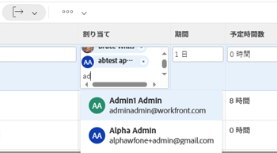
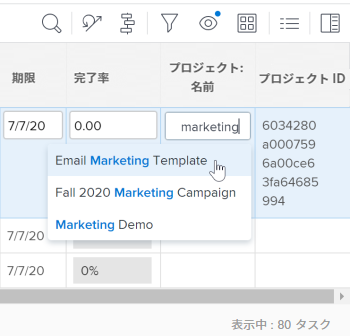

# 21. 2 レポートの機能強化

このページでは、プレビュー環境の 21.2 リリースでおこなわれたレポート機能のすべての強化について説明します。 これらの機能強化は、2021 年 5 月 10 日の週に実稼動環境で利用可能になる予定です。 21.2 リリースで使用可能なすべての変更点の一覧については、 [21.2 リリースの概要](../../../product-announcements/product-releases/21.2-release-activity/21-2-release-overview.md).

## プロジェクトとレポートでの時間の編集を制限する

プロジェクトおよび時間レポートの「時間」タブで時間の編集をより細かく制御できるように、Workfront管理者が時間の編集を時間の所有者およびシステム管理者に制限できる設定を追加しました。

以前は、タイムシートと時間がアクセスレベルで有効になっているユーザーが時間を編集する場合がありました。

詳しくは、 [タイムシートと時間の基本設定を構成する](../../../administration-and-setup/set-up-workfront/configure-timesheets-schedules/timesheet-and-hour-preferences.md).

## 更新されたリストおよびレポートの「割り当て」フィールドの新しいルックアンドフィール

>[!NOTE]
>
>この機能は、新しいAdobe Workfrontエクスペリエンスでのみ使用できます。

新しいWorkfrontエクスペリエンスの他の領域の最新の外観に合わせて、更新されたリストとレポートの「割り当て」フィールドのスタイル設定が変更されました。 この再設計には、以下が含まれます。

* ユーザープロファイルの画像、職務の役割、チームの丸められたアバター
* プロフィール画像を持たないユーザーに対してイニシャルが表示されます
* 新しいジョブの役割アイコン
* 高度な割り当て用の新しい担当者アイコン
* 新しい制限付きアクセスアイコン
* その他の小規模な設計変更

リスト内の割り当ての詳細については、 [タスクを割り当て](../../../manage-work/tasks/assign-tasks/assign-tasks.md) または [問題の割り当て](../../../manage-work/issues/manage-issues/assign-issues.md).

## 更新されたリストおよびレポートの先読みフィールドの新しいルックアンドフィール

>[!NOTE]
>
>2021 年 5 月 20 日に実稼動環境から一時的に削除されました。

>[!NOTE]
>
>この機能は、新しいAdobe Workfrontエクスペリエンスでのみ使用できます。

新しいWorkfrontエクスペリエンスの他の領域の最新の外観に合わせて、更新されたリストとレポートの typeahead フィールドのスタイル設定が変更されました。 次のような変更があります。

* Typeahead アイコンがフィールドから削除されました。
* 先読みタイプフィールドをクリックすると、テキストを入力する前に候補メニューが表示されるようになりました。
* 候補メニューは値の長さに応答しやすくなり、値の途中ではなく文字制限を満たした場合に、値の末尾が切り捨てられるようになりました。

更新されたリストについて詳しくは、 [更新済みリストと従来のリストの違い](../../../workfront-basics/navigate-workfront/use-lists/view-items-in-a-list.md#updated) 記事のセクション [Adobe Workfrontでのリストの概要](../../../workfront-basics/navigate-workfront/use-lists/view-items-in-a-list.md).

## システムの更新に関するレポート

新しいジャーナルエントリレポートでは、次のようなシステム更新を詳細に調べることで、監査性を高めることができます。

* プロジェクト、タスクまたはイシューのステータス変更
* 削除されたタスクまたは問題
* カスタムフィールドの値
* 計画完了日
* プロジェクト所有者の変更

例えば、このレポートを設定して、特定のカスタムフィールドに関するアクティビティを表示できます。例えば、カスタムフィールドのプロジェクト、値を入力した日時、値を更新した日時、以前の値、新しく入力した値などです。

以前は、Workfront API を使用してのみ、システムの更新をレポートできました。

このレポートとその使用方法について詳しくは、 [更新領域に関するレポート](../../../reports-and-dashboards/reports/creating-and-managing-reports/create-journal-entry-report.md).

