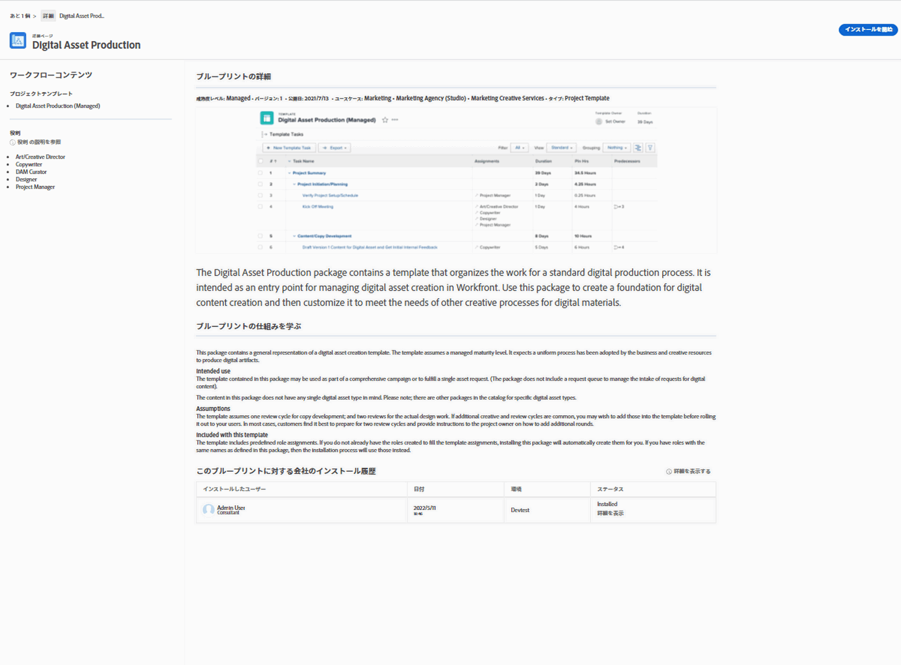

# 21.4 管理者機能の強化

このページでは、プレビュー環境の 21.4 リリースで行われた、すべての管理者向けの機能強化について説明します。これらの機能強化は、2021年10月4日（PT）の週に実稼動環境で利用可能になる予定です。

21.4 リリースで利用可能なすべての変更点の一覧については、[21.4 リリースの概要](../../../product-announcements/product-releases/21.4-release-activity/21-4-release-overview.md)を参照してください。

## 管理者の場合：承認プロセスに関連付けられているグループを表示

システム内の承認プロセスに関連付けられているグループを見つけるのに役立つように、設定の承認ページの標準ビューにグループ名列を追加しました。カスタムビューを作成しなくても、この情報を表示できるようになりました。

承認プロセスについて詳しくは、[承認プロセスの概要](../../../review-and-approve-work/manage-approvals/approval-process-in-workfront.md)を参照してください。

グループ承認プロセスの管理について詳しくは、[グループレベルの承認プロセス](../../../administration-and-setup/manage-groups/work-with-group-objects/create-and-modify-groups-approval-processes.md)を参照してください。

## 管理者向けの新機能：グループが、独自のタイムシートを設定し、時間の環境設定を指定できます

>[!NOTE]
>
>初めは、この機能は実稼動環境で、クラスター 4 の顧客のみを対象とした段階的ロールアウトの一環として利用可能になります。このメモは、この機能が他のクラスターで使用可能になると更新されます。

大規模な組織の一部のグループでは、管理者がシステムレベルで構成した環境設定を継承するのではなく、タイムシートと時間環境設定を固有のワークフローに合わせて個別に指定しなければならない場合があります。Workfront 管理者が、システム内のすべてのグループのタイムシートと時間環境設定のロックを解除して、独自に設定できるようになりました。

この機能は最近、プロジェクトの環境設定や、タスクおよびイシューの環境設定に追加されました。

Workfront 管理者がタイムシートおよび時間環境設定のロックを解除する方法については、[タイムシートおよび時間環境設定の指定](../../../administration-and-setup/set-up-workfront/configure-timesheets-schedules/timesheet-and-hour-preferences.md)の記事の[グループのタイムシートおよび時間環境設定のロック解除](../../../administration-and-setup/set-up-workfront/configure-timesheets-schedules/timesheet-and-hour-preferences.md#lock)の節を参照してください。

グループ管理者がグループのロック解除されたタスクとイシューの環境設定を指定する方法について詳しくは、[グループのタイムシートと時間環境設定の指定](../../../administration-and-setup/manage-groups/create-and-manage-groups/configure-timesheet-hour-preferences-group.md)を参照してください。

## Workfront 管理者向けの新機能：新しい Workfront エクスペリエンスで自動プロビジョニングされたユーザー向けのレイアウトテンプレートを設定

新しい Workfront エクスペリエンスで、自動プロビジョニングされたユーザー向けにレイアウトテンプレートを設定できるようになりました。ユーザー属性をマッピングする Workfront ユーザー属性ドロップダウンメニュー（設定／システム／シングルサインオン）で、この設定を行うための新しい「NWE レイアウトテンプレート」メニュー項目が使用できるようになりました。以前は、Workfront Classic でのみ、自動プロビジョニングされたユーザー用のレイアウトテンプレートを設定できました。

ユーザー属性のマッピング手順について詳しくは、[ユーザー属性のマッピングと新しいユーザーの自動プロビジョニング](../../../administration-and-setup/add-users/create-and-manage-users/map-user-attributes.md)を参照してください。

## 新しいフィールドにユーザーが属するグループを表示

ユーザーが属するグループを簡単に見つけることができるようになりました。ユーザーを一覧表示するレポートやビューで、新しい「その他のグループ」フィールドを使用して列を作成できます。このフィールドには、各ユーザーがメンバーであるグループが一覧表示されます。

レポートとビューの使用について詳しくは、[カスタムレポートの作成](../../../reports-and-dashboards/reports/creating-and-managing-reports/create-custom-report.md)および[Adobe Workfront のビューの概要](../../../reports-and-dashboards/reports/reporting-elements/views-overview.md)を参照してください。

## ブループリントの詳細ページに画像を表示

各ブループリントの詳細ページに、ブループリントと併せてインストールされるプロジェクトテンプレートの画像が表示されるようになりました。この画像は、インストールする内容を把握できるよう、ブループリントコンテンツのプレビューを提供します。（オプション）ブラウザーで画像全体をプレビューしたり、画像をダウンロードしたりできます。

詳しくは、[ブループリントの概要](../../../administration-and-setup/blueprints/blueprints-overview.md)を参照してください。

## 新しいイシューに対するブループリント環境設定

一部のブループリントで新しいイシューの環境設定を使用できるようになりました。これらはデフォルトでインストールされますが、インストールの詳細を設定する際に、環境設定のインストールをオプトアウトできます。

環境設定には、キュートピックグループ、キュートピックおよびルーティングルールが含まれ、イシューまたはリクエストが送信される際に正しい情報を収集し、イシューまたはリクエストを正しい担当業務やチームに送信します。環境設定を使用すると、プロジェクト上で新しいイシューまたはリクエストを取り込む方法に一貫性を持たせることができます。

これらの環境設定を使用しても、テンプレートから作成されたプロジェクトがリクエストキューに入るわけではないことに注意してください。

詳しくは、[ブループリントの設定](../../../administration-and-setup/blueprints/configure-template-package.md)を参照してください。

## グループ管理者向けの新機能：グループの最近削除された項目および復元された項目を表示および管理

>[!NOTE]
>
>この機能は、新しい Adobe Workfront エクスペリエンスでのみ使用できます。

アドビでは、グループとその関連オブジェクトを 1 か所で容易に管理できるように引き続き取り組んでいます。グループエリアで、グループの最近削除された項目および復元された項目を表示し、操作できるようになりました。これにより、設定にある最近削除した項目のエリアや最近復元した項目のエリアに移動して、項目を管理する必要がなくなります。また、作業中のグループ項目のリストが、システム内の他の削除済みおよび復元済みの項目とは別に保持されます。

詳しくは、[グループの最近削除された項目を表示および管理](../../../administration-and-setup/manage-groups/work-with-group-objects/view-manage-groups-recently-deleted-objects.md)と、[グループの最近復元された項目を表示および管理](../../../administration-and-setup/manage-groups/work-with-group-objects/view-manage-groups-recently-restored-objects.md)を参照してください。

## グループ管理者向けの新機能：グループ環境設定がグループテンプレートに影響するようになりました

グループのプロジェクトテンプレートがグループのニーズを満たしているかどうかをより簡単に確認できるようになりました。作成時に新しいプロジェクトテンプレートをグループに割り当てると、そのテンプレートは、グループのプロジェクトとタスクの環境設定から次の設定を継承します。

* パフォーマンスインデックスメソッド
* 状況タイプ
* スケジュールの基点
* ユーザーの休暇
* 更新タイプ
* 「アクセス」セクション設定

グループに関連付けられたプロジェクトテンプレート内に新しいテンプレートタスクを作成する場合、テンプレートタスクはグループのタスク環境設定から次の設定を継承します。

* 期間タイプ
* 収益タイプ
* コストタイプ

以前は、プロジェクトテンプレートとプロジェクトテンプレートタスクは、システムレベルで設定されたプロジェクトとタスクの環境設定からこれらの設定を継承していました。

グループを持たないテンプレートまたはテンプレートタスクを作成する場合（例えば、メインのテンプレートページから）、上記の設定は、システムレベルのプロジェクトおよびタスクの環境設定から継承されます。ただし、後でグループをテンプレートまたはテンプレートタスクに割り当てた場合、グループの環境設定は影響を与えません。

詳しくは、[グループのプロジェクトテンプレートの作成と変更](../../../administration-and-setup/manage-groups/work-with-group-objects/create-and-modify-a-groups-templates.md)の記事内の「環境設定がテンプレートとテンプレートのタスクに適用される方法」の節を参照してください。

## 管理者向けの新機能：カスタムフィールドを使用しているカスタムフォームを確認

カスタムフォーム内のカスタムフィールドを簡単に変更できます。カスタムフォーム内で 1 回クリックすると、フィールドも使用している他のカスタムフォームについて調べることができます。変更後も正常に機能し続けるために、それらのフォームに調整が必要かどうかを評価することが重要です。

詳しくは、[特定のカスタムフィールドまたはウィジェットを使用するすべてのカスタムフォームを表示](../../../administration-and-setup/customize-workfront/create-manage-custom-forms/view-all-custom-forms-that-use-a-particular-custom-field.md)を参照してください。

## グループ管理者向けの新機能：グループのプロジェクト、タスク、イシューの環境設定のロックおよびロック解除

グループの下のサブグループ内の全員が同じ環境設定を使用していることを確認できます。また、固有のワークフローの環境設定を設定することも可能です。

* Workfront 管理者がシステムレベルで環境設定のロックを解除した後、グループの下にあるすべてのサブグループに対して、環境設定を指定し、ロックできます。ロックされた環境設定は再設定できますが、下位のサブグループの管理者はグループに対して再設定できません。

  逆に、グループの環境設定のロックを解除できます。これにより、サブグループ管理者は、ユーザーの固有のプロジェクト、タスク、イシューのワークフローのニーズに合わせてサブグループを設定できます。

  詳しくは、[サブグループのプロジェクト、タスク、イシューの環境設定をロックまたはロック解除](../../../administration-and-setup/manage-groups/create-and-manage-groups/lock-or-unlock-a-group-preference.md)を参照してください。

* Workfront の管理者である場合は、グループエリアに移動して、サブグループの環境設定を行う必要はありません。メインのプロジェクトの環境設定、タスクとイシューの環境設定、タイムシートと時間の環境設定エリアで、ページ上部の検索ボックスを使用してサブグループを検索し、その環境設定を指定できます。

  詳しくは、[グループのプロジェクト環境設定を指定](../../../administration-and-setup/manage-groups/create-and-manage-groups/configure-project-preferences-group.md)および[グループのタスクとイシューの環境設定を指定](../../../administration-and-setup/manage-groups/create-and-manage-groups/configure-task-issue-preferences-group.md)を参照してください。

## グループ管理者向けの新機能：グループエリアでのテンプレートの作成および編集

>[!NOTE]
>
>この機能は、新しい Workfront エクスペリエンスでのみ使用できます。

継続的にグループとその関連オブジェクトを 1 か所で簡単に管理できるようにしています。設定のグループエリアで、グループのテンプレートを表示して操作できるようになりました。これにより、グループのテンプレートを管理するためにテンプレートエリアに移動する必要がなくなります。作業中のグループテンプレートのリストが、システム全体で他のテンプレートとは別に保持されます。

詳しくは、[グループのプロジェクトテンプレートの作成と変更](../../../administration-and-setup/manage-groups/work-with-group-objects/create-and-modify-a-groups-templates.md)を参照してください。

## 添付された 1 つのカスタムフォームに情報を一度に入力して保存

>[!NOTE]
>
>この機能は、新しい Adobe Workfront エクスペリエンスでのみ使用できます。

オブジェクトの「詳細」セクションで情報を簡単に供給できるようになりました。オブジェクト上の他のカスタムフォームの必須フィールドにまだ入力されていなくても、単一のカスタムフィールドまたは拡大可能エリア（概要や財務など）に情報を入力して保存できます。

以前は、1 つのカスタムフォームまたはオブジェクトの拡大可能エリアに情報を入力すると、そのオブジェクトに添付されたすべてのカスタムフォームが編集モードに入り、変更を保存する前に、すべての必須フィールドに入力する必要がありました。これは別のユーザーを対象としているので、必須フィールドを完了できなかった場合に問題でした。

オブジェクトの「詳細」セクションで、すべてのカスタムフォームと拡大可能なエリアを編集する場合は、編集アイコンに追加した新しい編集メニューの「すべて編集」をクリックできます。または、同じメニューで名前をクリックして、変更を加えるカスタムフォームまたはセクションまでスクロールできます。

>[!NOTE]
>
>この機能は、当初 21.3 リリースでプレビューにリリースされました。

組織のすべてのレベルでワークフローを個別に管理および制御しやすくするために、サブグループのステータスを作成および管理する機能が導入されました。これで、設定の「グループ」セクションから、任意のレベルで管理するグループに対して、次の操作を実行できます。

* グループのステータスを作成、編集、削除、非表示
* 下位のすべてのサブグループが同じ方法で使用できるように、任意のグループのステータスをロック
* 下位のサブグループの管理者が独自のニーズに合わせてカスタマイズできるようにするために任意のグループのステータスのロックを解除
* グループのステータスをデフォルトのステータスとして設定する
* オブジェクト上のグループステータスの表示を並べ替えたり、非表示にしたりする

Workfront 管理者は、（すべてのグループに）これらの操作も実行できます。

以前は、この機能は最上位のグループにのみ使用できました。

詳しくは、[グループステータスを管理](../../../administration-and-setup/manage-groups/manage-group-statuses/manage-group-statuses.md)を参照してください。

## Workfront 管理者向けの新機能：レイアウトテンプレートを Workfront Classic から新しい Workfront エクスペリエンスに独自に移行する

>[!NOTE]
>
>この機能は、2021年7月1日（PT）にプレビュー環境にリリースされました。実稼動環境へのリリースは、2021年7月15日（PT）に予定されています。

ユーザーが新しい Workfront エクスペリエンスに切り替える際に、レイアウトテンプレートを管理しやすくするため、Workfront カスタマーサポートに依存せずに、レイアウトテンプレートを Workfront Classic から新しいエクスペリエンスに移行するために使用できるボタンが作成されました。

以前は、Workfront カスタマーサポートのみがレイアウトテンプレートを Workfront Classic から新しい Workfront エクスペリエンスに移行できました。

## テンプレートをグループに関連付ける場合は、「キューの詳細」および「キューのトピック」でグループ承認プロセスを選択します。

テンプレートをグループに関連付けるプロセスに、新しいオプションが追加されました。これで、テンプレートの「キューの詳細」またはいずれかの「キューのトピック」のイシューに対して、グループ固有の承認プロセスを選択できるようになりました。

21.3 で、グループテンプレートをグループに関連付ける機能を追加した場合、テンプレートでグループ固有の承認プロセスを選択できましたが、テンプレートの「キューの詳細」または「キューのトピック」では選択できませんでした。

詳しくは、[新規または既存の承認プロセスを作業に関連付ける](../../../review-and-approve-work/manage-approvals/associate-approval-with-work.md)を参照してください。
