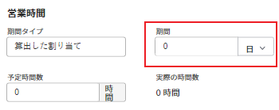

# 21.4 プロジェクトの機能強化

このページでは、プレビュー環境の 21.4 リリースでおこなわれたプロジェクトのすべての機能強化について説明します。 これらの機能強化は、2021 年 10 月 4 日の週に実稼動環境で利用可能になる予定です。

21.4 リリースで利用可能なすべての変更点の一覧については、 [21.4 リリースの概要](../../../product-announcements/product-releases/21.4-release-activity/21.4-release-overview.md).

## 更新に画像を含める

オブジェクトの「更新」タブで、ツールバーの画像アイコンをクリックして画像を追加できるようになりました。 また、画像を更新領域にドラッグ&amp;ドロップすることもできます。 画像アイコンを表示するには、Workfront管理者が画像の追加を有効にする必要があります。

更新内容と返信内容の両方に画像を追加できます。 更新の画像サムネールは、受信者がブラウザーで画像をプレビューまたはダウンロードできることを示し、電子メールおよびアプリ内通知では、更新に画像が添付されていることを示します。

以前は、画像をWorkfrontで共有するには、画像をドキュメントとしてオブジェクトに添付するしかありませんでした。 「更新」タブに追加された画像は、そのタブでのみ使用でき、「ドキュメント」タブでは使用できません。

詳しくは、 [作業を更新](../../../workfront-basics/updating-work-items-and-viewing-updates/update-work.md).

Workfrontのユーザーが更新に画像を含めるには、まずAdobe Workfront管理者がこの機能を有効にする必要があります。詳しくは、 [ユーザーの更新の環境設定を構成する](../../../administration-and-setup/set-up-workfront/system-tracked-update-feeds/configure-preferences-user-updates.md).

## スマート割り当てのアルゴリズムを更新しました

スマート割り当てを行う際に使用するアルゴリズムを改善しました。 新しい改善点により、Workfrontでは、ログインしたユーザーがタスクや問題を割り当てた際に、最近おこなった 30 件の割り当てに対して提案を行います。 候補のリストには、最大 50 人のユーザーを含めることができます。

この機能強化の前は、Workfrontは、ユーザーを提案する際に、親タスクおよびこれらの割り当てに関連する他のユーザー属性に対する割り当てを検討していました。

スマート割り当ての詳細については、 [スマート割り当ての概要](../../../manage-work/tasks/assign-tasks/smart-assignments.md).

## テンプレートからプロジェクトを作成する際の新しいエクスペリエンス

Workfrontを新しいWorkfrontエクスペリエンスと一貫して使用できるように、テンプレートからプロジェクトを作成するためのインターフェイスを再設計しました。 テンプレートを使用してプロジェクトを作成する機能は変更されていません。 ただし、この新しく再設計されたインターフェイスには、次のような改善点があります。

* 添付する前にテンプレート情報をプレビュー
* プロジェクト作成プロセス中に、お気に入りのリストにテンプレートを追加する

プロジェクトをプロジェクトから作成するとき、および「テンプレート」領域から作成するときに、プロジェクトを作成するためのインターフェイスが更新されました。

詳しくは、 [テンプレートを使用したプロジェクトの作成](../../../manage-work/projects/create-projects/create-project-from-template.md).

## テンプレートをプロジェクトに添付する際の新しいエクスペリエンス

>[!NOTE]
>
>この機能は、新しいAdobe Workfrontエクスペリエンスでのみ使用できます。

Workfrontの使用を新しいWorkfrontエクスペリエンスと一致させるために、テンプレートをプロジェクトに添付するためのインターフェイスのデザインを変更しました。 テンプレートを添付する機能は変更されていません。 ただし、この新しく再設計されたインターフェイスには、次のような改善点がいくつかあります。

* 添付する前にテンプレート情報をプレビュー
* 添付プロセス中にテンプレートをお気に入りのリストに追加する
* 1 つの連続したページでテンプレートとプロジェクトの設定を管理するためのすべてのオプションを表示

詳しくは、 [プロジェクトにテンプレートを添付する](../../../manage-work/projects/create-and-manage-templates/attach-template-to-project.md).

## タスクの期間と期間の単位値を統合しました

より簡潔で効率的なユーザーエクスペリエンスを実現するために、「期間」フィールドの値と期間の単位を結合しました。 この強化がおこなわれる前は、「期間」フィールドの後に別のドロップダウンフィールドに表示される時間の単位でした。

このエクスペリエンスに合わせて、「タスクの詳細」、「タスクの編集」、「新しいタスク」の各ボックスの「期間」フィールドに加えて、次のフィールドも更新します。

* 高度な割り当てを行う際の「期間」フィールド
* タスクを作成または編集する際の [ 平準化遅延 ] フィールド
* 繰り返しタスクを作成する際の頻度フィールド（近日公開）
* 先行タスクを追加する際の Lag フィールド（近日公開）

詳しくは、 [タスクを編集](../../../manage-work/tasks/manage-tasks/edit-tasks.md).

## プロジェクトのインラインでの問題の追加を無効にする

イシューフォームに入力してプロジェクトにイシューを追加する際に、正確な情報を提供できるように、新しい設定を導入しました。この設定では、イシューをプロジェクトにイシューを追加するか、タスクをインラインで追加するかを管理できます。 この設定は、「プロジェクトを編集」ボックスの新しい「問題の設定」領域で、デフォルトで有効になっています。 この機能を無効にすると、プロジェクトの「問題」セクションの「他の問題を追加」オプションが薄くなり、ユーザーはリストにこれ以上問題を追加できなくなります。 ユーザーは、引き続き「問題」セクションの「新しい問題」オプションを使用するか、プロジェクトに対して設定されている場合はリクエストキューを使用して、プロジェクトに問題を追加できます。

>[!NOTE]
>
>この設定は、新しいWorkfrontエクスペリエンスでのみ使用できます。 Workfront Classic で作業するユーザーは、新しいWorkfrontエクスペリエンスで作業するユーザーがプロジェクトでこの設定を無効にしている場合でも、プロジェクトまたはそのタスクにイシューをインラインで追加できます。

詳しくは、 [プロジェクトを編集](../../../manage-work/projects/manage-projects/edit-projects.md).

## チェックボックスとラジオボタンのカスタムフィールドの表示の改善

カスタムフォームでのチェックボックスおよびラジオボタンの表示と選択が簡単になりました。多数のチェックボックスまたはラジオボタンオプションを含むカスタムフィールドが、ページ全体の複数の列に表示されるようになりました。 以前は、1 つの列に表示されていたので、ユーザーがフォームに入力する際に余分なスクロールが必要でした。

これは、カスタムフォームでのフィールドの配置方法によって異なります。チェックボックスやラジオボタンのフィールドを使用して同じ行に別のフィールドを配置した場合、1 つの列に表示するのに十分な水平スペースのみが表示されます。

カスタムフォームへの入力について詳しくは、 [カスタムフォームフィールドの情報を編集する](../../../workfront-basics/work-with-custom-forms/edit-custom-forms.md).

カスタムフォームでのチェックボックスまたはラジオボタンフィールドの作成について詳しくは、 [カスタムフォームの作成または編集](../../../administration-and-setup/customize-workfront/create-manage-custom-forms/create-or-edit-a-custom-form.md#create) および [カスタムフォームの作成または編集](../../../administration-and-setup/customize-workfront/create-manage-custom-forms/create-or-edit-a-custom-form.md#configur) 記事内 [カスタムフォームの作成または編集](../../../administration-and-setup/customize-workfront/create-manage-custom-forms/create-or-edit-a-custom-form.md).

