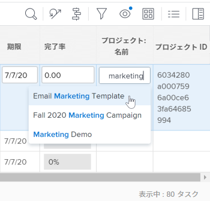

# 21.4 レポートの機能強化

このページでは、21.4 リリースでプレビュー環境に行われたレポート機能強化について説明します。これらの機能強化は、2021年10月4日（PT）の週に実稼動環境で利用可能になる予定です。

21.4 リリースで利用可能なすべての変更点の一覧については、[21.4 リリースの概要](../../../product-announcements/product-releases/21.4-release-activity/21-4-release-overview.md)を参照してください。

## アップデートされたリストおよびレポートの「割り当て」フィールドの新しいルックアンドフィール

>[!NOTE]
>
>以前は、21.2 リリースでの実稼動環境で使用でき、2021年5月20日（PT）に実稼動環境から一時的に削除されていました。

>[!NOTE]
>
>この機能は、新しい Adobe Workfront エクスペリエンスでのみ使用できます。

新しい Workfront エクスペリエンスの他のエリアの最新のルックに合わせて、更新されたリストとレポートの「割り当て」フィールドのスタイル設定が変更されました。この再設計には、以下が含まれます。

* ユーザープロファイルの画像、担当業務、チーム用の円形アバター
* プロファイル画像を持たないユーザーにはイニシャルが表示されます
* 新しい担当業務アイコン
* 詳細な割り当て用の新しい担当者アイコン
* 新しい制限付きアクセスアイコン
* その他の設計のマイナーチェンジ

リスト内の割り当てについて詳しくは、[タスクの割り当て](../../../manage-work/tasks/assign-tasks/assign-tasks.md)または[イシューの割り当て](../../../manage-work/issues/manage-issues/assign-issues.md)を参照してください。

## アップデートされたリストおよびレポートの先行入力フィールドの新しいルックアンドフィール

>[!NOTE]
>
>以前は、21.2 リリースでの実稼動環境で使用でき、2021年5月20日（PT）に実稼動環境から一時的に削除されていました。

>[!NOTE]
>
>この機能は、新しい Adobe Workfront エクスペリエンスでのみ使用できます。

新しい Workfront エクスペリエンスの他のエリアの最新のルックに合わせて、更新されたリストとレポートの先行入力フィールドのスタイル設定が変更されました。以下の変更が含まれます。

* 先行入力アイコンがフィールドから削除されました。
* 先行入力フィールドをクリックすると、テキストを入力する前におすすめメニューが表示されるようになりました。
* おすすめメニューは値の長さによりよく反応し、文字制限に達した場合、これらの値は値の途中ではなく、末尾で切り捨てられるようになりました。

更新されたリストについて詳しくは、[Adobe Workfront でのリストの概要](../../../workfront-basics/navigate-workfront/use-lists/view-items-in-a-list.md)の記事の[更新されたリストと従来のリストの違い](../../../workfront-basics/navigate-workfront/use-lists/view-items-in-a-list.md#updated)の節を参照してください。

