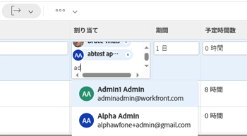

# 21.4 レポートの機能強化

このページでは、プレビュー環境の 21.4 リリースでおこなわれたレポート機能のすべての強化について説明します。 これらの機能強化は、2021 年 10 月 4 日の週に実稼動環境で利用可能になる予定です。

21.4 リリースで利用可能なすべての変更点の一覧については、 [21.4 リリースの概要](../../../product-announcements/product-releases/21.4-release-activity/21.4-release-overview.md).

## 更新されたリストおよびレポートの「割り当て」フィールドの新しいルックアンドフィール

>[!NOTE]
>
>以前は、21.2 リリースの実稼動環境で使用でき、2021 年 5 月 20 日に実稼動環境から一時的に削除されていました。

>[!NOTE]
>
>この機能は、新しいAdobe Workfrontエクスペリエンスでのみ使用できます。

新しいWorkfrontエクスペリエンスの他の領域の最新の外観に合わせて、更新されたリストとレポートの「割り当て」フィールドのスタイル設定が変更されました。 この再設計には、以下が含まれます。

* ユーザープロファイル画像、職務ロール、チームの丸められたアバター
* プロフィール画像を持たないユーザーに対してイニシャルが表示されます
* 新しいジョブの役割アイコン
* 高度な割り当て用の新しい担当者アイコン
* 新しい制限付きアクセスアイコン
* その他の小規模な設計変更

リスト内の割り当ての詳細については、 [タスクを割り当て](../../../manage-work/tasks/assign-tasks/assign-tasks.md) または [問題の割り当て](../../../manage-work/issues/manage-issues/assign-issues.md).

## 更新されたリストおよびレポートの先読みフィールドの新しいルックアンドフィール

>[!NOTE]
>
>以前は、21.2 リリースの実稼動環境で使用でき、2021 年 5 月 20 日に実稼動環境から一時的に削除されていました。

>[!NOTE]
>
>この機能は、新しいAdobe Workfrontエクスペリエンスでのみ使用できます。

新しいWorkfrontエクスペリエンスの他の領域の最新の外観に合わせて、更新されたリストとレポートの typeahead フィールドのスタイル設定が変更されました。 次のような変更があります。

* Typeahead アイコンがフィールドから削除されました。
* 先読みタイプフィールドをクリックすると、テキストを入力する前に候補メニューが表示されるようになりました。
* 候補メニューは値の長さに応答しやすくなり、値の途中ではなく文字制限を満たした場合に、値の末尾が切り捨てられるようになりました。

更新されたリストについて詳しくは、 [更新済みリストと従来のリストの違い](../../../workfront-basics/navigate-workfront/use-lists/view-items-in-a-list.md#updated) 記事のセクション [Adobe Workfrontのリストの概要](../../../workfront-basics/navigate-workfront/use-lists/view-items-in-a-list.md).

