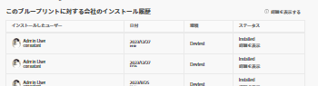

# 22.2 管理者の機能強化

このページでは、プレビュー環境の 22.2 リリースでおこなわれた管理者向けの機能強化について説明します。 これらの機能強化は、実稼動環境で利用できるようになります

<!--
<MadCap:conditionalText data-mc-conditions="QuicksilverOrClassic.Draft mode">
in January 2022
</MadCap:conditionalText>
-->

2022 年 4 月 4 日の週。 22.2 リリースで使用可能なすべての変更点の一覧については、 [22.2 リリースの概要](../../../product-announcements/product-releases/22.2-release-activity/22-2-release-overview.md).

## 複数のオブジェクトタイプで動作するカスタムフォームの設定

新規または既存のカスタムフォームを複数のオブジェクトタイプと連携するように設定し、フォームをより広く使用できるようにしました。 ユーザーは、設定したすべての種類のオブジェクトに対して、フォームを添付し、入力することができます。

以前は、1 つのオブジェクトタイプでのみ機能するカスタムフォームを設定していました。

この機能は、Workfrontシステムで以前に作成されたすべてのカスタムフォームで機能します。 例えば、Task オブジェクトタイプ用に既にカスタムフォームを作成している場合、プロジェクトやイシューなど他のオブジェクトタイプとも連携するようにフォームを設定できます。

詳しくは、 [カスタムフォームの作成を開始](../../../administration-and-setup/customize-workfront/create-manage-custom-forms/create-or-edit-a-custom-form.md#start) 記事内 [カスタムフォームの作成または編集](../../../administration-and-setup/customize-workfront/create-manage-custom-forms/create-or-edit-a-custom-form.md).

>[!NOTE]
>
>* この機能の最初のプレビューリリースでは、複数オブジェクトのカスタムフォームをコピーする機能を一時的に無効にしました。 この機能は 3 月 24 日に有効になりました。 カスタムフォームのコピーについて詳しくは、 [カスタムフォームをコピーして新しいフォームを作成する](../../../administration-and-setup/customize-workfront/create-manage-custom-forms/copy-custom-form-to-create-a-new-one.md).
>* 計算カスタムフィールドでは、参照する一部のフィールドは、フォーム用に設定されたオブジェクトタイプと互換性がない場合があります。 解決策はワイルドカードで、フォームが添付されているオブジェクトに応じて異なる値を計算で出力できるようにします。 3 月 24 日にワイルドカードを追加しました。 使用方法について詳しくは、「 [複数オブジェクトカスタムフォームの計算済みカスタムフィールド](../../../administration-and-setup/customize-workfront/create-manage-custom-forms/add-calculated-data-to-custom-form.md#calculat) 記事内 [計算データをカスタムフォームに追加する](../../../administration-and-setup/customize-workfront/create-manage-custom-forms/add-calculated-data-to-custom-form.md).
>* カスタムフォームのセクション区切りの場合、フォームに設定できるすべてのオブジェクトタイプに対して機能する、共通の表示および編集権限のセットを作成しました。 あるシナリオでは、これらの権限の 1 つである制限付き編集が、フォームでエラーを引き起こす可能性があることがわかりました。 これは 3 月 24 日に修正されました。 断面の区切りの詳細については、 [カスタムフォームにセクション区切りを追加する](../../../administration-and-setup/customize-workfront/create-manage-custom-forms/add-a-section-break-to-a-custom-form.md).
>

## ブループリントカタログはすべてのユーザーが使用でき、管理者はリクエストを許可できます

すべてのAdobe Workfrontユーザーが、使用可能なブループリントのカタログを参照できるようになりました。 詳しくは、 [ブループリントカタログを参照し、ブループリントのインストールをリクエストします](../../../administration-and-setup/blueprints/browse-catalog.md).

また、システム管理者は、ユーザーがブループリントのインストールを要求するアクセスを有効にできます。 リクエストキューを割り当ててリクエストを保存すると、ユーザーはブループリントカタログからリクエストを実行できます。 詳しくは、 [ブループリントへのアクセスを設定](../../../administration-and-setup/blueprints/configure-access-to-blueprints.md).

## カスタムフォームに画像を追加する

作成または編集したカスタムフォームで、画像を追加し、ユーザーが画像の上にマウスポインターを置いたときに読み取れる情報または説明的なツールチップを含めることができるようになりました。

これは、例えば、新しい製品のブランディングを表示したり、フォームの入力時に必要な視覚的情報を提供したりする場合に役立ちます。

以前は、カスタムフォームは完全にテキストベースでした。

>[!NOTE]
>
>項目を一括編集する際に表示されるボックスなど、まだ最新化されていない新しいAdobe Workfrontエクスペリエンス領域では、カスタムフォームの画像は表示されません。 これらの領域を更新し続けると、それらは表示されます。

詳しくは、 [カスタムフォームでのアセットウィジェットの追加または編集](../../../administration-and-setup/customize-workfront/create-manage-custom-forms/add-widget-or-edit-its-properties-in-a-custom-form.md).

## 新しいデフォルトのアクセスレベル設定

新しいアクセスレベルを作成するほとんどの管理者のニーズに合わせて、以下に示す「設定を微調整」オプションのデフォルト設定を変更しました。 これらは、歯車アイコン  をクリックします。

これらの変更はすべて、以前にデフォルトで有効になっていたオプションを無効にします。 組織のニーズに合わない場合は、新しいアクセスレベルの設定時に有効にしたり、後でいつでも有効にしたりできます。

>[!IMPORTANT]
>
>このデフォルトの設定変更は、以降に作成したアクセスレベルにのみ影響し、以前に作成したアクセスレベルには影響しません。

* プランライセンスタイプの新しいアクセスレベルで、次の操作を行います。

   * プロジェクト、タスク、問題、ポートフォリオ、プログラム、レポート、フィルター、ドキュメント、テンプレートに対して、システム全体の共有が無効になりました。
   * 組み込みレポートの表示とレポートの共有も、レポートでは無効になっています。
   * ドキュメントの共有ドキュメントの公開も無効です。

* ワークライセンスタイプの新しいアクセスレベルで、次の操作を行います。

   * フィルターとドキュメントのシステム全体の共有が無効になりました。
   * ドキュメントの共有ドキュメントの公開も無効です。

* 新しいアクセスレベルで、「リクエスト」または「レビュー」ライセンスタイプを使用して、次の操作を実行します。

   * システム全体の共有がフィルターで無効になりました。

## グループの非アクティブ化

内部組織が変更されると、場合によっては、Workfrontでの特定のグループの使用を停止し、新しいグループを作成する必要があります。 これに役立つように、グループの履歴データを失うことなく、グループを非アクティブ化する機能を追加しました。 表示する必要がない通常のユーザーの場合、非アクティブなグループはグループタイプ先行フィールドから消去されます。

管理する非アクティブなグループのオプション、環境設定、オブジェクトの関連付けを検索して設定することもできます。 グループを非アクティブ化しても、グループがアタッチされているオブジェクトに関する変更は一切おこなわれません。

以前は、グループを非アクティブ化することはできませんでした。

詳しくは、 [グループの非アクティブ化または再アクティブ化](../../../administration-and-setup/manage-groups/create-and-manage-groups/deactivate-or-reactivate-a-group.md).

## ブループリントのインストール履歴の強化

ブループリントをインストールすると、ブループリントと共に正常にインストールされた特定のオブジェクト（役割、チーム、グループなど）と、インストールに失敗したオブジェクトがメッセージに表示されるようになりました。 インストール履歴テーブルで、特定のインストールの横にある「詳細を表示」をクリックして、ブループリントの詳細ページにインストールされたオブジェクトのリストを表示することもできます。

詳しくは、 [ブループリントのインストール](../../../administration-and-setup/blueprints/blueprints-install.md).

## 実稼動環境にプレビューのみのブループリントをインストールする際に警告が表示されるようになりました

特定のブループリントは、テスト目的でプレビュー環境にのみインストールできます。

実稼動環境、サンドボックス 1、またはサンドボックス 2 のプレビューのみのコンテンツにアクセスする場合、「インストール」ボタンがアクティブにならず、警告メッセージが表示されることがあります。

詳しくは、 [ブループリントのインストール](../../../administration-and-setup/blueprints/blueprints-install.md).
