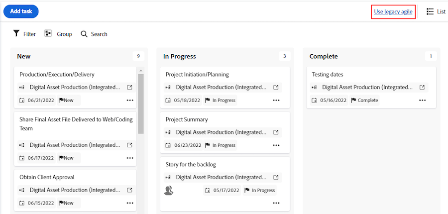

# 2025年第 2 四半期リリースの概要

このページでは、2025年第 2 四半期リリースに含まれる機能について説明します。これらの機能強化は、その四半期を通じて本番動環境で利用できるようになる予定です。

オフサイクル機能（2025年第 2 四半期のリリース日より前に実稼動にリリースされるもの）は、黄色でハイライト表示されています。

## リリーススケジュール

Workfrontのリリース数は、月次および四半期次のリリーストラックの両方を考慮して番号が付けられます。 最初の数字は年を表し、2番目の数字はリリースの月を表します。 例：2025年4月のリリースの番号は25.4です。

毎月および四半期ごとのリリースは、特に指定がない限り、月の第2週の木曜日に入手可能になる予定です。

| 毎月のリリース | 四半期リリース |
| ----------------- | ----------------- |
| <ul><li>25.2（2025年2月13日（PT））</li><li>25.3（2025年3月13日（PT））</li><li>25.4 （2025年4月10日（PT））</li></ul> | <ul><li>25.4 （2025年4月10日（PT））</li></ul> |

>[!NOTE]
>
>各四半期の最終リリース（今四半期25.4）の場合、迅速リリーススケジュールのユーザーは1日早くリリースを受け取ります。
>
>迅速リリースプロセスについて詳しくは、[迅速リリースプロセスを有効化または無効化](/help/quicksilver/administration-and-setup/set-up-workfront/configure-system-defaults/enable-fast-release-process.md)を参照してください。

## Adobe Workfront の機能強化

* [管理者機能の強化](#administrator-enhancements)
* [ドキュメント管理の機能強化](#document-management-enhancements)
* [モバイルの機能強化](#mobile-enhancements)
* [プロジェクトの強化](#project-enhancements)
* [レポートの機能強化](#reporting-enhacements)
* [その他の機能強化](#other-enhancements)

### 管理者機能の強化

<table>
<col style="width: 50%;" />
<col style="width: 50%;" />
<tbody>
<tbody>
    <tr>
        <td>
            
<a href="/help/quicksilver/product-announcements/product-releases/25-q2-release-activity/25-q2-administrator-enhancements.md" class="MCXref xref" xrefformat="{para}">
            カスタムフォームロジックの機能強化</a>

[!BADGE In production ]{type=Informative}

            
カスタムフォームロジックビルダーのインターフェイスが更新され、ロジックルールを作成する余裕が増えました。 この新しい設計は、将来的に追加される可能性のある追加のロジックタイプに、より簡単に対応できます。

現在の表示およびスキップロジックのオプションに加えて、検証ロジックも使用できます。

        </td>
        <td>
            
<b>公開日：</b>

            <ul>
                <li>プレビューリリース：2025年3月13日（PT）</li>
                <li>すべてのユーザー向けの実稼動リリース：25.4 リリース（2025年4月）</li>
            </ul>
        </td>
    </tr>                          
    <tr>
        <td>
            
<a href="/help/quicksilver/product-announcements/product-releases/25-q2-release-activity/25-q2-administrator-enhancements.md" class="MCXref xref" xrefformat="{para}">
            計算カスタムフィールドに式が追加されました</a>

            [!BADGE In production ]{type=Informative}
            
Workfrontの計算カスタムフィールドで、ARRAY、FORMAT、SWITCH、SORTASCARRAY、SORTDESCARRAY、ARRAYLENGTH、ARRAYELEMENT、ADDHOURの式が使用できるようになりました。 各式の定義と例は、計算エディターおよびExperience Leagueで使用できます。

        </td>
        <td>
            
<b>公開日：</b>

            <ul>
                <li>プレビューリリース：2025年1月31日（PT）</li>
                <li>すべてのお客様向けの本番リリース： 2025年1月31日（PT）</li>
            </ul>
        </td>
    </tr>                          
</tbody>
</table>

### ドキュメント管理の機能強化

<table>
<col style="width: 50%;" />
<col style="width: 50%;" />
<tbody>
<!--
    <tr>
        <td>
            
<a href="/help/quicksilver/product-announcements/product-releases/25-q2-release-activity/25-q2-document-mgmt-enhancements.md" class="MCXref xref" xrefformat="{para}">
            New document approval decision buttons available in proofing viewer</a>

            
The new document approval decision buttons now appear in the proofing viewer. Now, when you create a simple proof and then add approvers and reviewers from the Document summary, they can make their decision directly inside the proofing viewer.

        </td>
        <td>
            
<b>Available on these dates:</b>

            <ul>
                <li>Preview release: April 9, 2025</li>
                <li>Production release for a limited set of customers: With the 25.4 release (April 2025)</li>
            </ul>
        </td>
    </tr>
    -->
    <tr>
        <td>
            
<a href="/help/quicksilver/product-announcements/product-releases/25-q2-release-activity/25-q2-document-mgmt-enhancements.md" class="MCXref xref" xrefformat="{para}">
            デスクトッププルーフビューアーのアップデート </a>
[!BADGE In production ]{type=Informative}
            
デスクトップ校正ビューアがバージョン 2.1.45に更新されました。この更新により、ビューアーは
            <ul><li>Electron バージョン 35</li><li>Chromium バージョン 134</li><ul>

        </td>
        <td>
            
<b>公開日：</b>

            <ul>
                <li>プレビューリリース：2025年3月20日（PT）</li>
                <li>すべてのお客様向けの本番リリース： 2025年3月20日（PT）</li>
            </ul>
        </td>
    </tr>                          
    <tr>
        <td>
            
<a href="/help/quicksilver/product-announcements/product-releases/25-q2-release-activity/25-q2-document-mgmt-enhancements.md" class="MCXref xref" xrefformat="{para}">
            ドキュメントレポートで複数のドキュメントを一度に編集する </a>
[!BADGE In production ]{type=Informative}
            
ドキュメント レポートで一度に複数のドキュメントを編集できるようになりました。 説明を編集したり、カスタムフォームを更新したりできます。

        </td>
        <td>
            
<b>公開日：</b>

            <ul>
                <li>プレビューリリース：2025年2月6日</li>
                <li>すべてのお客様向けの本番リリース： 2025年3月13日（PT）</li>
            </ul>
        </td>
    </tr>                          
</tbody>
</table>

### モバイルの機能強化

<table>
<col style="width: 50%;" />
<col style="width: 50%;" />
<tbody>
    <tr>
        <td>
            
<a href="/help/quicksilver/product-announcements/product-releases/25-q2-release-activity/25-q2-mobile-enhancements.md" class="MCXref xref" xrefformat="{para}">
            モバイルアプリでのプルーフの機能強化（iOSのみ）</a>
[!BADGE In production ]{type=Informative}

            
Adobe Workfront モバイルアプリのプルーフ機能に関して、いくつかの機能強化が利用できます。
            <ul>
            <li>モバイルメールアプリケーションから、共有されたリンクからプルーフファイルを開くことができるようになりました。 以前は、電子メールのリンクはサポートされておらず、Workfront モバイルアプリからプルーフにアクセスする必要がありました。</li>
            <li>モバイルアプリでマルチメディアプルーフファイルがサポートされるようになりました。</li>
            </ul>
            

        </td>
        <td>
            
<b>公開日：</b>

            <ul>
                <li>プレビューリリース：該当なし</li>
                <li>すべてのお客様向けの本番リリース： 2025年3月12日（PT）</li> 
            </ul>
            
<b>次の環境で使用できます。</b>

            <ul>
                <li>iOS モバイルアプリ</li>
            </ul>
        </td>
    </tr>                          
</tbody>
</table>

### プロジェクトの強化

<table>
<col style="width: 50%;" />
<col style="width: 50%;" />
<tbody>
    <tr>
        <td>
            
<a href="/help/quicksilver/product-announcements/product-releases/25-q2-release-activity/25-q2-project-enhancements.md" class="MCXref xref" xrefformat="{para}">
            プロジェクトを編集ボックスでプロジェクトを編集する際に、プロジェクトにコメントを追加する</a>
[!BADGE In production ]{type=Informative}

            
プロジェクトを編集ボックスで編集するときに、プロジェクトにコメントを追加できるようになりました。 複数のプロジェクトを一括編集する場合は、一度に複数のプロジェクトにコメントを追加することもできます。 このアップデート以前は、プロジェクトの編集時にこの機能は存在していませんでした。

        </td>
        <td>
            
<b>公開日：</b>

            <ul>
                <li>プレビューリリース：2025年2月13日</li>
                <li>高速リリースの実稼動：25.3 リリース（2025年3月）</li>
                <li>すべてのユーザー向けの実稼動リリース：25.4 リリース（2025年4月）</li>
            </ul>
        </td>
    </tr>                          
</tbody>
</table>

### レポート機能の強化

<table>
<col style="width: 50%;" />
<col style="width: 50%;" />
<tbody>
    <tr>
        <td>
            
<a href="/help/quicksilver/product-announcements/product-releases/25-q2-release-activity/25-q2-reporting-enhancements.md" class="MCXref xref" xrefformat="{para}">
            ドキュメントの承認および決定データをData Connectで使用できるようになりました</a>
[!BADGE In production ]{type=Informative}

            
Data Connectでドキュメントの承認と決定のためのデータにアクセスできるようになりました。 このデータセットは、Workfrontのプルーフ機能からのドキュメント承認と、Workfrontドキュメントで発生しているFrame.ioの承認を橋渡しします。 これで、BI ビジュアライゼーションを使用して、サイクル時間、サイクル数、後期承認のタイムラインへの影響を説明できるようになります。

        </td>
        <td>
            
<b>公開日：</b>

            <ul>
                <li>プレビューリリース：2025年3月25日（PT）</li>
                <li>すべてのお客様向けの本番リリース： 2025年3月25日（PT）</li>
            </ul>
        </td>
    </tr>                          
    <tr>
        <td>
            
<a href="/help/quicksilver/product-announcements/product-releases/25-q2-release-activity/25-q2-reporting-enhancements.md" class="MCXref xref" xrefformat="{para}">Workfront カレンダーの更新</a>

[!BADGE In production ]{type=Informative}

            
Workfront カレンダーの外観を、Workfrontの他の領域と一致するモダンなデザインに更新しました。 現在のWorkfront カレンダーには、次のような機能の違いがあります。
            <ul>
            <li>カレンダーにアドホックアイテムを追加する方法</li>
            <li>カレンダーの作成と名前の変更方法</li>
            <li>カレンダーアクションは、カレンダー名の横にある「その他」メニューに移動しました</li>
            <li>カレンダー情報を表示するための新しいサイドパネル</li>
            <li>その他</li>
            <ul>        </td>
        <td>
            
<b>公開日：</b>

            <ul>
                <li>プレビューリリース：2025年2月27日</li>
                <li>この機能は、25.4 リリース（2025年4月10日（PT））から2024年4月17日（PT）までの3段階で実稼動環境にリリースされます</li>
            </ul>
        </td>
    </tr>                          
</tbody>
</table>

### その他の機能強化

<table>
<col style="width: 50%;" />
<col style="width: 50%;" />
<tbody>
    <tr>
        <td>
            
<a href="/help/quicksilver/product-announcements/product-releases/25-q2-release-activity/25-q2-other-enhancements.md" class="MCXref xref" xrefformat="{para}">
            バージョンアップグレードエンドポイントを使用して、新しいイベントサブスクリプションバージョンにアップグレードする</a>

            [!BADGE In production ]{type=Informative}
            
Workfrontには、イベントサブスクリプションのバージョンが追加されました。 新しいバージョンは Workfront API に対する変更ではなく、イベント登録機能に対する変更です。イベントのサブスクリプションにギャップを生じることなく、イベントのサブスクリプションを新しいバージョンに切り替えることができます

        </td>
        <td>
            
<b>公開日：</b>

            <ul>
                <li>すべてのお客様向けの本番リリース： 2025年3月6日（PT）</li>
            </ul>
        </td>
    </tr>
    <tr>
        <td>
            
<a href="/help/quicksilver/product-announcements/product-releases/25-q2-release-activity/25-q2-other-enhancements.md" class="MCXref xref" xrefformat="{para}">
            Workfrontの更新フィードでAdobe Admin Console ユーザーの変更を「システム」として表す</a>

[!BADGE In production ]{type=Informative}

現在、Adobe Admin Consoleの管理者がWorkfront ユーザーのユーザー情報に変更を加えた場合、Workfrontは、ユーザーの更新領域の「システム」アクティビティ タブに、この変更を「システム」に属するものとして記録します。 これは、Adobe Admin Console管理者を指します。

        </td>
        <td>
            
<b>公開日：</b>

            <ul>
                <li>プレビューリリース：2025年1月23日（PT）</li>
                <li>実稼動版（迅速リリース用）：25.2 リリース（2025年2月13日（PT））</li>
                <li>すべてのユーザー向けの実稼動リリース：25.4 リリース（2025年4月）</li>
            </ul>
        </td>
    </tr>
    <tr>
        <td>
            
<a href="/help/quicksilver/product-announcements/product-releases/25-q2-release-activity/25-q2-look-and-feel-updates.md" class="MCXref xref" xrefformat="{para}">
            2025年第2四半期中のルックアンドフィールの更新</a>

            
Adobe Workfront アプリケーションの様々なエリアのルックアンドフィールに対する小規模なアップデートが、2025年第 2 四半期の期間内に行われます。特定のリリース日については、個々のリリースノートを確認してください。

        </td>
        <td>
            
<b>公開日：</b>

            <ul>
                <li>プレビューリリース：2025年第 2 四半期のリリース期間中</li>
                <li>実稼動版リリース：リリースノートで日付を確認してください。</li>
            </ul>
        </td>
    </tr>
</tbody>
</table>

### Workfront から近日中に削除される機能

次の機能は、近日中に Workfront から削除されます。

#### API バージョン 2-15の非推奨化

Workfrontの基盤を強化し続ける中で、APIを最新の状態に保つことは非常に重要です。 これにより、最適なパフォーマンスとセキュリティが確保され、新しい機能をサポートできます。 したがって、Workfront API バージョン 2～15は非推奨（廃止予定）です。

* **2025年9月**：現在サポートされていないAPI バージョン 2 ～ 14は非推奨（廃止予定）になります。 この日付以降、これらのバージョンにはアクセスできなくなります。
* **2025年12月**: API バージョン 15は非推奨（廃止予定）になります。

#### プロジェクト内の従来のアジャイルビューを削除し

プロジェクトの従来のアジャイルビューは、2025年3月13日（PT）に25.3 リリースでWorkfrontから削除されます。 引き続き、ボードアイコンをクリックすることで、プロジェクトのアジャイルビューでタスクを表示できます。 既存のレガシーアジャイルツールは、引き続きTeams領域で使用できます。

次の画像は、削除される従来のアジャイルオプションを示しています。

#### 拡張版Analyticsの非推奨化

使用状況が少なく減少しているため、2025年5月25日の週にEnhanced Analytics製品の非推奨化を決定しました。
Data Connect製品を代替品として検討することをお勧めします。 Adobe Experience Platform Data Connectでは、任意のビジネスインテリジェンスツールを使用して、同様のカスタマイズ可能なビジュアライゼーションを構築できます。
この非推奨（廃止予定）について詳しくは、[Enhanced Analytics非推奨（廃止予定）ガイド ](/help/quicksilver/product-announcements/announcements/enhanced-analytics-deprecation.md)を参照してください。

## お知らせ

### インターフェイスの最新化

ユーザーエクスペリエンスを向上させ、他の Adobe Workfront アプリケーションと統合できるよう、Adobe Workfront 全体でインターフェイスをアップデートしています。これらの変更は、標準のリリーススケジュールの範囲外でリリースされます。これらの変更点のリストについて詳しくは、[インターフェイスの最新化](/help/quicksilver/product-announcements/product-releases/interface-modernization/interface-modernization.md)を参照してください。

### Workfront Fusion の機能強化

>[!IMPORTANT]
>
>Workfront Fusionのドキュメントが新しい場所に移動しました。 Fusionの詳細、手順、リリースについては、[Workfront Fusion ドキュメント ](https://experienceleague.adobe.com/en/docs/workfront-fusion/using/home)を参照してください。
>
>現在のFusion ドキュメントの各記事には、新しい場所にある対応する記事へのリンクが含まれています。 ブックマークを更新してください。
>
>現在のFusion ドキュメントセットは更新されなくなり、近い将来に削除される予定です。

Workfront Fusion の新機能は、実稼動環境の標準リリーススケジュール以外のサイクルで使用できます。最新の機能について詳しくは、[Adobe Workfront Fusion リリースアクティビティ](https://experienceleague.adobe.com/ja/docs/workfront-fusion/using/fusion-release-activity/fusion-release-activity)を参照してください。

### Workfront Planning の機能強化

Workfront Planning の新機能は、実稼動環境で使用できます。最新の機能について詳しくは、[Adobe Workfront計画2025年第2四半期リリースアクティビティ ](/help/quicksilver/product-announcements/product-releases/planning-release-activity/planning-release-activity-25-q2.md)を参照してください。

### Workfront シナリオプランナーの機能強化

リリースの現時点では、シナリオプランナーの更新はありません。このエリアは、アップデートが利用可能になると更新されます。

### Workfront Proof の機能強化

リリースの現時点では、Workfront Proof の更新はありません。このエリアは、アップデートが利用可能になると更新されます。

### Workfront Goals の強化

リリースの現時点では、Workfront Goals の更新はありません。このエリアは、アップデートが利用可能になると更新されます。

### API バージョン 19

API バージョン 19 では、いくつかのリソースとエンドポイントが変更されました。変更の中には、新しい機能をサポートするものもあれば、API を通じて利用可能な情報をより簡単に使用できるようにするものもあります。

新機能と更新内容については、[API バージョン 19 の新機能](/help/quicksilver/wf-api/api/new-api-version-19.md)を参照してください。

現在サポートされているAPI バージョンについて詳しくは、[API バージョン管理とサポートスケジュール ](/help/quicksilver/wf-api/api/api-version-support-schedule.md)を参照してください。

### Workfront のメンテナンス更新

2025年第 2 四半期リリースで行われたメンテナンス更新については、[Workfront のメンテナンスアップデート](https://experienceleague.adobe.com/ja/docs/workfront-known-issues/releases/current-updates)を参照してください。

### トレーニングの更新

各 Adobe Workfront 製品リリースの学習プログラム、学習パス、ビデオ、ガイドに加えられた最新の更新を確認します。詳しくは、[Workfront チュートリアルページ](https://experienceleague.adobe.com/ja/docs/workfront-learn/tutorials-workfront/home)の「新機能」の節を参照してください。
