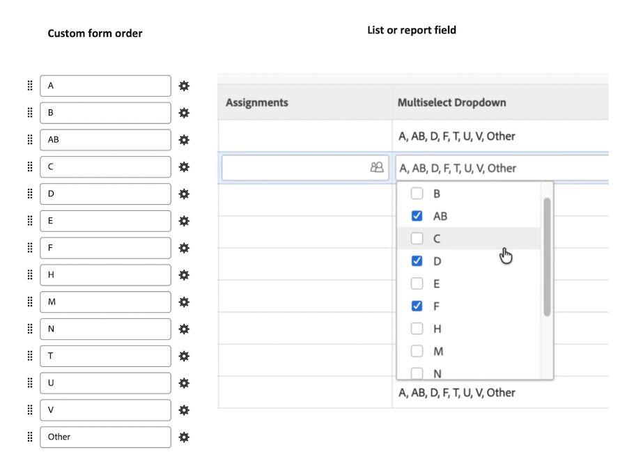

# 2026年第4四半期レポートの強化

このページでは、2026年第4四半期リリースで行われたレポートの機能強化について、プレビュー環境に対して説明します。 これらの機能強化は、前述のように本番環境で利用できるようになります。

2026年第4四半期リリースサイクルのこの時点で利用可能なすべての変更のリストについては、[2026年第4四半期リリースの概要](/help/quicksilver/product-announcements/product-releases/26-q4-release-activity/26-q4-release-overview.md)を参照してください。

## Google Cloud PlatformおよびMicrosoft AzureでCanvas ダッシュボードを使用できるようになりました

>[!NOTE]
>
>プレビュー：該当なし
>プロダクション高速リリース：2026年10月14日（PT）
>すべての人のための制作：2026年10月15日

Google Cloud Platform （GCP）およびAzure上のWorkfront インスタンスは、Canvas ダッシュボードのオープンベータ版にオプトインできるようになりました。 詳しくは、[ キャンバスダッシュボードの使用](/help/quicksilver/reports-and-dashboards/canvas-dashboards/use-canvas-dashboards.md)を参照してください。

## Workfront Data Connect用のSnowflake プライベートリストの登録

>[!NOTE]
>
>プレビュー：該当なし
>プロダクション高速リリース：2026年10月14日（PT）
>すべての人のための制作：2026年10月15日

プライベートリストを登録することで、Workfront Data Connect データを組織のSnowflake アカウントと直接共有できるようになりました。 この連携方法は、Snowflakeのプライベートリスト機能を使用して、データを公開することなく、組織間で安全にデータを共有し、地域やホスティングプラットフォームをまたいで機能します。

プライベートリストは、Workfront データをエンタープライズデータウェアハウス内の他のデータと結合する場合に便利です。 データは独自のSnowflakeアカウントに格納されるため、他のデータと組み合わせてクエリすることができます。

詳しくは、[Workfront Data Connectの非公開リストの登録](/help/quicksilver/reports-and-dashboards/data-lake/register-a-private-listing.md)を参照してください。

## レポート MCP ツールがCanvas ダッシュボードで使用できるようになりました

>[!NOTE]
>
>プレビュー：2026年10月1日（PT）
>プロダクション高速リリース：2026年10月14日（PT）
>すべての人のための制作：2026年10月15日

Canvas ダッシュボードを簡単に使用できるように、Workfront MCPにツールを追加しました。 チャットを通じてCanvas ダッシュボードを作成および管理できるようになり、Workfront データを使用してダッシュボードとウィジェットが作成されるようになりました。 これは、ClaudeやCursorなどのMCP クライアントから機能します。

例えば、次のことができます。

* 質問によるレポート作成。 ダッシュボードやグラフを手作業で作成するのではなく、自然言語で説明します。
* 同じ場所で編集する： ウィジェットの名前の変更、フィルターの変更、グラフの種類の入れ替え、サイズ変更を要求すると、変更内容がライブダッシュボードに適用されます。
* 既存のものを再利用。 既存のダッシュボードやウィジェットを、ゼロから再構築するのではなく、出発点として複製します。

### サポート機能

**ダッシュボード**

* 新しいダッシュボードの作成
* ダッシュボード（自分、自分と共有、すべて、お気に入り）を一覧表示し、タイトルで検索します
* ダッシュボードの構造を開く/表示する
* タイトル、説明、通貨、フィルター、プロンプトを更新
* ダッシュボードの複製（ウィジェット、プロンプト、フィルターの有無にかかわらず）
* ダッシュボードの削除

**ウィジェット**

* KPI：単一の集計数値（合計、平均、カウント、最小、最大など）
* グラフ：棒グラフ、棒グラフ、棒グラフ、折れ線グラフおよび円グラフです。単純グラフ、複数系列グラフ、積み重ねグラフをサポートしています
* 表：行のグループ化を含む複数列テーブル
* ウィジェットの設定を表示し、更新、コピー、サイズ変更または再配置、または削除します

**レポートオプション**

* 条件およびAND/OR グループを使用したデータのフィルタリング
* 任意のフィールドでグループ化および集計
* KPIやチャートから、基礎となるレコードをドリルダウンします
* カスタム列ラベル、番号、日付、通貨の書式設定、条件付きセルのスタイル設定
* ダッシュボードレベルのプロンプトとフィルター

詳しくは、[ キャンバスダッシュボードの使用](/help/quicksilver/reports-and-dashboards/canvas-dashboards/use-canvas-dashboards.md)を参照してください。

## カンバスダッシュボード間でのウィジェットのコピーまたは移動

>[!NOTE]
>
>プレビュー：2026年10月1日（PT）
>プロダクション高速リリース：2026年10月14日（PT）
>すべての人のための制作：2026年10月15日

ウィジェットを同じダッシュボード、編集アクセス権のある別のダッシュボード、または新しいダッシュボードにコピーできるようになりました。 編集アクセス権のある別のダッシュボードまたは新しいダッシュボードにウィジェットを移動することもできます。

ウィジェットをコピーすると、コピー先ダッシュボードを選択するダイアログボックスが開き、ウィジェットをコピーするか移動するかを選択できるようになりました。 以前は、レポートビルダーがすぐに開いていました。

## Canvas ダッシュボードのコレクション関係に関するフィルター

>[!NOTE]
>
>プレビュー：2026年10月1日（PT）
>プロダクション高速リリース：2026年10月14日（PT）
>すべての人のための制作：2026年10月15日

カンバスダッシュボードでフィルターを作成する際に、1つのレコードではなく関連するレコードのグループにリンクするフィールドであるコレクション関係でフィルターできるようになりました。 例えば、プロジェクトに属するタスクのステータスをフィルタリングして、「新規」ステータスのタスクを持つプロジェクトのリストを表示できます。

以前は、コレクション関係のフィルタリングにはテキストモードが必要でした。

詳しくは、「[Canvas ダッシュボードのレポートフィルターの参照](/help/quicksilver/reports-and-dashboards/canvas-dashboards/manage-reports/filter-reference.md)」を参照してください。

## Canvas ダッシュボードでのダッシュボードのコピー

>[!NOTE]
>
>プレビュー：2026年9月3日（PT）
>プロダクション高速リリース：2026年9月17日（PT）
>すべての人のための制作：2026年10月15日

新しい&#x200B;**ダッシュボードをコピー** アクションを使用して、キャンバスダッシュボードをコピーできるようになりました。 このアクションは、アクセス レベルがダッシュボードに編集権限または作成権限を付与しているユーザーは、コピーする特定のダッシュボードへの表示アクセス権しか持っていない場合でも、使用できます。 ダッシュボードの編集権限または作成権限を持たないユーザーには、このアクションは表示されません。

ダッシュボードをコピーする場合は、名前を変更し、説明と通貨を更新して、コピーに引き継ぐウィジェット、ダッシュボードフィルター、ダッシュボードプロンプトを選択できます。

ウィジェットのユーザー設定として実行は、指定ユーザーまたはシステム管理者の場合にのみ保持されます。 共有の環境設定は新しいダッシュボードにコピーされず、コピーが完了すると、新しいダッシュボードへのリンクを含む確認メッセージが表示されます。

以前は、ダッシュボードをコピーする方法がありませんでした。ユーザーは、オーディエンス固有のバリエーションを作成するために、ダッシュボードをゼロから再構築する必要がありました。

## カンバスダッシュボードの「承認タイプ」フィールド

>[!NOTE]
>
>すべての人のための制作：2026年8月28日
>[!BADGE スケジュール外]{type=Neutral}

承認エンティティに&#x200B;**承認タイプ** フィールドが含まれるようになりました。このフィールドを使用すると、プルーフの承認、ドキュメントバージョンの承認、取り込み承認およびその他の承認の種類を区別できます。

## Canvas ダッシュボードでの承認用語の更新

>[!NOTE]
>
>すべての人のための制作：2026年8月28日
>[!BADGE スケジュール外]{type=Neutral}

ドキュメントと作業の承認に使用されるCanvas ダッシュボードで使用される次のフィールド名は、わかりやすいように変更されました。

| 前の名前 | 新しい名前 |
| --- | --- |
| ドキュメントの承認 | 承認 |
| ドキュメントの承認ステージ | 承認ステージ |
| ドキュメントの承認ステージ参加者 | 承認ステージ参加者 |
| 承認プロセス | 作業承認プロセス |
| 承認ステージ | 作業承認ステージ |
| 上書きされている | 作業承認者のステータス |
| 承認待ち | 作業の承認待ち |

この変更は、現在のレポートの機能には影響しません。

## Canvas ダッシュボードのピボットテーブルレポート

>[!NOTE]
>
>プレビュー：2026年8月27日（PT）
>プロダクション高速リリース：2026年9月17日（PT）
>すべての人のための制作：2026年10月15日

Canvas ダッシュボードの新しいピボットテーブルレポートタイプでは、正確で完全なロールアップを使用してデータを集約します。 カウント、合計、平均などの指標をダッシュボードで直接作成し、その合計の背後にあるレコードをドリルダウンできます。

詳しくは、「[ キャンバスダッシュボードでピボットテーブルレポートを作成する](/help/quicksilver/reports-and-dashboards/canvas-dashboards/add-reports/build-pivot-table-report.md)」を参照してください。

## スケジュールレポートの終了日の適用

>[!NOTE]
>
>プレビュー：2026年8月13日（PT）
>プロダクション高速リリース：2026年9月17日（PT）
>すべての人のための制作：2026年10月15日

スケジュールされたレポートは、無期限の配信を防ぐために終了日が必要になりました。 終了日を通過するスケジュールは、自動的に非アクティブ化されます。

既存のスケジュールは、信頼性を向上させ、不要なシステム使用を減らすために、終了日を更新しました。 また、Workfrontでは、レポートのスケジュールのライフサイクルが終了日に近づいたときに、レポートのスケジュールを管理するのに役立つ可視性と警告も提供されます。

詳しくは、[自動レポート配信のスケジュール ](/help/quicksilver/reports-and-dashboards/reports/creating-and-managing-reports/set-up-automatic-report-delivery.md)を参照してください。

## ネイティブ参照フィールドは、リストとレポートで使用できます

>[!NOTE]
>
>プレビュー：2026年7月30日（PT）
>プロダクション高速リリース：2026年8月13日（PT）
>すべての人のための制作：2026年10月15日

Workfrontのリストとレポートにネイティブ参照フィールドを追加できるようになりました。

ネイティブ参照フィールドはカスタムフィールドです。 フィールドがオブジェクトに添付されたカスタムフォーム上にある場合、フィールドはオブジェクトデータから入力されます。 例えば、フィールドが「説明」フィールドを参照し、それがプロジェクトに添付されたカスタムフォーム上にある場合、フィールドはプロジェクトの説明を取り込みます。 （データが利用できない場合、フィールドには「該当なし」と表示される場合があります）。

サポートされているネイティブフィールドのリストを含むネイティブ参照フィールドの作成について詳しくは、[ カスタムフォームの作成](/help/quicksilver/administration-and-setup/customize-workfront/create-manage-custom-forms/form-designer/design-a-form/design-a-form.md)を参照してください。
レポートへのフィールドの追加について詳しくは、[ カスタムレポートの作成](/help/quicksilver/reports-and-dashboards/reports/creating-and-managing-reports/create-custom-report.md)を参照してください。

## 従来のリストやレポートにおける複数選択フィールド値の一貫性のある順序付け

>[!NOTE]
>
>プレビュー：2026年7月30日（PT）
>プロダクション高速リリース：2026年8月13日（PT）
>すべての人のための制作：2026年10月15日

複数を選択したカスタムフィールドのオプションが、従来のリストとレポートで一貫した予測可能な順序で表示されるようになりました。 フィールドの順序は、カスタムフォームでのフィールドの配置方法によって決まります。

以前は、選択したオプションが選択した順序で表示されていたり、一貫性のない順序で表示されていたため、行のスキャンと比較が困難になっていました。

注意：フィールドがテキストモードを使用している場合、新しい並べ替えは適用されません。
