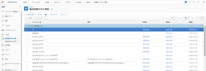

# Workfront R1 リリース

## 全員の関与と効率性の維持

Workfront では、すべての製品ラインに対して年に 3 回（リリース 1、リリース 2、リリース 3）、新しい製品機能を発表しています。2017年の最初のリリース（R1）では、Workfront、ProofHQ、Workfront DAM のコア機能がいくつか強化され、ナレッジワーカーの生産性の向上、作業管理に費やす時間の短縮、作業の効率化が可能になりました。

## 最新リリースにおけるの新機能

* [Workfront の機能強化](#workfront-enhancements)
* [ProofHQ の機能強化](#proofhq-enhancements)
* [Workfront DAM の機能強化](#workfront-dam-enhancements)

## Workfront の機能強化 {#workfront-enhancements}

\
**メールでの作業の管理**
Outlook 365 に統合すると、Outlook 365 から直接 Workfront を更新する際の作業の重複を排除できます。Outlook の終了をせずに、メールをタスクに変換したり、メールのやり取りや添付ファイルを更新として送信したり、コメントに返信したりできます。

詳しくは、[2016 年のプレビューで発表された機能](../../../../product-announcements/product-releases/quarterly-release-archive/r1-release-activity/available-in-preview-in-2016.md)を参照してください。

\
**プロジェクトの進捗と予算の維持**
新しい稼働率レポートを使用して、リソースとその稼働率を管理し、プロジェクトの進捗と予算を維持します。ここでは、プロジェクトおよび役割ごとの予定時間数と実際の時間数を表示し、リソースと部門を定期的に比較することができます。

詳しくは、[R1 プレビュー 3](../../../../product-announcements/product-releases/quarterly-release-archive/r1-release-activity/r1-preview-3.md) を参照してください。

\
**用語と通知のカスタマイズ**
カスタムの用語機能を活用して、Workfrontをより関連性の高いものにします。業界に関係なく、「Portfolio」や「プロジェクト」などの用語を好みの言葉に合わせて変更できます。 さらに、各ユーザーはダイジェストの頻度を調整することで、受信する通知のタイプをカスタマイズすることも可能です。

詳しくは、[R1 プレビュー 3](../../../../product-announcements/product-releases/quarterly-release-archive/r1-release-activity/r1-preview-3.md) を参照してください。

**マイルストーンビュー**
新しい進捗ステータスアイコンにより、マイルストーンレポートをさらに活用できるようになりました。ここから直接、完了率を編集することも可能です。

詳しくは、[R1 プレビュー 5](../../../../product-announcements/product-releases/quarterly-release-archive/r1-release-activity/r1-preview-5.md) を参照してください。

**Workfront のごみ箱**
新しい Workfront のごみ箱では、削除から 30 日以内のプロジェクト、タスク、イシュー、およびすべての関連ドキュメント、フォーム、更新を復元できます。

詳しくは、[R1 プレビュー 1 および 2](../../../../product-announcements/product-releases/quarterly-release-archive/r1-release-activity/r1-peview-1-and-2.md) を参照してください。

### ProofHQ の機能強化 {#proofhq-enhancements}

\
**プルーフの検索**
ProofHQ の新しい検索機能を使用すると、レビューの際にプルーフ内で直接、すべての単語やフレーズをすばやく簡単に検索できます。この機能は、PDF や Microsoft Word のファイルなど、すべてのテキストベースのドキュメントで使用できます。

詳しくは、[R1 最終版](../../../../product-announcements/product-releases/quarterly-release-archive/r1-release-activity/r1-final.md)を参照してください。

\
**視覚レポートと強化されたカスタムビュー**
ProofHQ の新しいレポート指標では、ターンアラウンド時間、遅延の割合、コメントの数および最初のアクティビティまでの時間を追跡できます。新しいカスタムビューでは高度なフィルターロジックが作成されるため、必要に応じて適切なデータを取得できます。

詳しくは、[R1 最終版](../../../../product-announcements/product-releases/quarterly-release-archive/r1-release-activity/r1-final.md)を参照してください。

**ProofHQ プレビュー**
ProofHQ では、すべてのユーザーにで新しい機能をリリースする前に、プレビュー環境テストできるようになりました。

## Workfront DAM の機能強化 {#workfront-dam-enhancements}

\
**DAM 埋め込みリンク**
外部プラットフォームへのデジタルアセットの管理、公開、使用状況の追跡をより効率的に行う必要があるマーケティングチームのためのこの埋め込みリンク機能では、適切なコンテンツを適切なタイミングで共有するプロセスを管理できます。

**DAM 必須メタデータフィールド**
このフィールドによってデジタルアセットの分類が改善され、アセットの共有をさらに制御できるようになりました。

**全員が Workfront で効率的に作業できます。**
Workfront は、現代のナレッジワーカーやエグゼクティブが以下を実現するためのエンタープライズ作業管理ソリューションです。

* 個人と組織の希望に合わせて作業を調整し、採用を促進
* どこからでもより効率的に作業
* リソース、予算、担当者を適切かつ有意義に可視化
* より迅速かつ適切な作業の実施

**詳細情報**

* R1 で提供されている改善機能の完全なリストについては、[R1 リリースアクティビティの概要](../../../../product-announcements/product-releases/quarterly-release-archive/r1-release-activity/r1-release-activity-overview.md)を参照してください

Workfront。作業が重要だからです。
