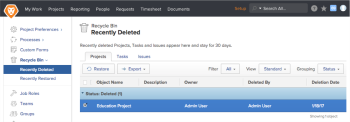

# Workfront R1 リリース

## 全員の関与と効率性の維持

Workfrontは、年3回、すべての製品ラインに対して新しい製品機能をリリースします（リリース 1、リリース 2、リリース 3）。 2017年の最初のリリース（R1）では、Workfront、ProofHQ、Workfront DAMのコア機能のいくつかの機能強化により、ナレッジワーカーがより生産的になり、作業を管理する時間が減り、作業をより多く遂行できるようになりました。

## 最新リリースにおけるの新機能

* [Workfront の機能強化](#workfront-enhancements)
* [ProofHQ の機能強化](#proofhq-enhancements)
* [Workfront DAM の機能強化](#workfront-dam-enhancements)

## Workfront の機能強化 {#workfront-enhancements}

\
**電子メールから作業を直接管理**
Outlook 365に直接統合すると、Outlook 365からWorkfrontを直接更新する際に、重複する作業を排除できます。 Outlook の終了をせずに、メールをタスクに変換したり、メールのやり取りや添付ファイルを更新として送信したり、コメントに返信したりできます。

詳しくは、[2016 年のプレビューで発表された機能](../../../../product-announcements/product-releases/quarterly-release-archive/r1-release-activity/available-in-preview-in-2016.md)を参照してください。

\
**プロジェクトを順調かつ予算内に収める**
新しい利用状況レポートを使用して、リソースとその利用状況を管理し、プロジェクトを順調に進め、予算を厳守しましょう。 ここでは、プロジェクトおよび役割ごとの予定時間数と実際の時間数を表示し、リソースと部門を定期的に比較することができます。

詳しくは、[R1 プレビュー 3](../../../../product-announcements/product-releases/quarterly-release-archive/r1-release-activity/r1-preview-3.md) を参照してください。

\
**用語と通知のカスタマイズ**
カスタム用語の機能を活用して、「Portfolio」や「プロジェクト」などの用語を、業界に関係なく任意の言語に合わせて変更することで、Workfrontをチームにより適切なものにします。 さらに、各ユーザーはダイジェストの頻度を調整することで、受信する通知のタイプをカスタマイズすることも可能です。

詳しくは、[R1 プレビュー 3](../../../../product-announcements/product-releases/quarterly-release-archive/r1-release-activity/r1-preview-3.md) を参照してください。

**マイルストーンビュー**
新しい進捗状況アイコンにより、マイルストーンレポートをより効果的に活用できます。 ここから直接、完了率を編集することも可能です。

詳しくは、[R1 プレビュー 5](../../../../product-announcements/product-releases/quarterly-release-archive/r1-release-activity/r1-preview-5.md) を参照してください。

**Workfrontのごみ箱**
新しいWorkfrontのごみ箱を使用すると、プロジェクト、タスク、イシュー、および関連するすべてのドキュメント、フォーム、更新を削除後30日以内に復元できます。

詳しくは、[R1 プレビュー 1 および 2](../../../../product-announcements/product-releases/quarterly-release-archive/r1-release-activity/r1-peview-1-and-2.md) を参照してください。

### ProofHQ の機能強化 {#proofhq-enhancements}

\
**プルーフ検索と検索**
ProofHQの新しい検索機能により、レビュー中に単語またはフレーズのすべてのインスタンスをプルーフで直接検索して簡単に見つけることができます。 この機能は、PDF や Microsoft Word のファイルなど、すべてのテキストベースのドキュメントで使用できます。

詳しくは、[R1 最終版](../../../../product-announcements/product-releases/quarterly-release-archive/r1-release-activity/r1-final.md)を参照してください。

\
**ビジュアルレポートと拡張カスタムビュー**
ProofHQの新しいレポート指標を使用すると、ターンアラウンドタイム、レイトパーセンテージ、コメント数、最初のアクティビティまでの時間を追跡できます。 新しいカスタムビューでは高度なフィルターロジックが作成されるため、必要に応じて適切なデータを取得できます。

詳しくは、[R1 最終版](../../../../product-announcements/product-releases/quarterly-release-archive/r1-release-activity/r1-final.md)を参照してください。

**ProofHQ プレビュー**
ProofHQでは、すべてのユーザーにリリースする前に、プレビュー環境で新機能をテストできるようになりました。

## Workfront DAM の機能強化 {#workfront-dam-enhancements}

\
**DAM埋め込みリンク**
デジタルアセットを管理、公開し、外部プラットフォームへの利用を追跡するためのより優れた方法を必要とするマーケティング部門にとって、組み込みのリンク機能は、適切なコンテンツを適切なタイミングで共有するプロセスを管理するために必要なコントロールを提供します。

**DAMの必須メタデータフィールド**
必須のメタデータフィールドを使用してデジタルアセットのカテゴリー化を強化し、アセット共有の管理を強化できます。

**全員が Workfront で効率的に作業できます。**
Workfrontは、最新のナレッジワーカーや経営陣が、次のことを実現できるエンタープライズ作業管理ソリューションです。

* 個人と組織の希望に合わせて作業を調整し、採用を促進
* どこからでもより効率的に作業
* リソース、予算、担当者を適切かつ有意義に可視化
* より迅速かつ適切な作業の実施

**詳細情報**

* R1 で提供されている改善機能の完全なリストについては、[R1 リリースアクティビティの概要](../../../../product-announcements/product-releases/quarterly-release-archive/r1-release-activity/r1-release-activity-overview.md)を参照してください

Workfront。 作業が重要だからです。
